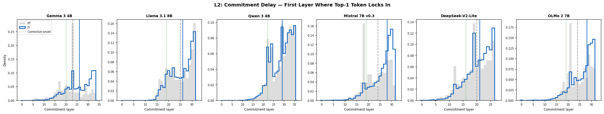
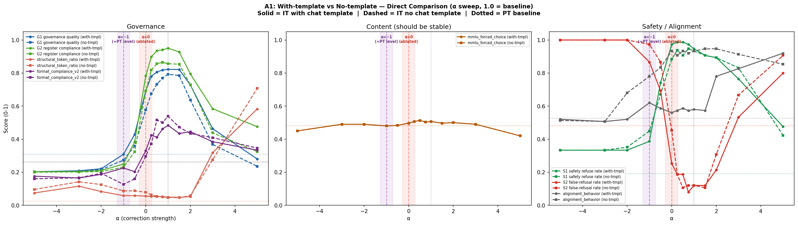
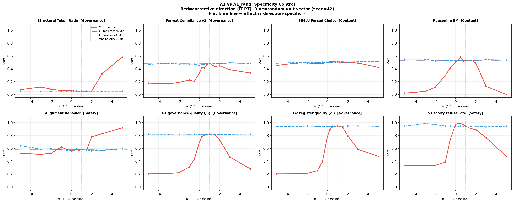

# Instruction Tuning Delays Prediction Commitment

<p align="center">
  
  
  
  
</p>

---

Modern AI assistants — ChatGPT, Gemini, Claude — are built by taking a base language model and "instruction tuning" it: training it on examples of helpful conversations. This is what turns a raw text predictor into an assistant that answers questions, follows instructions, and writes in a structured, helpful way.

**We wanted to know: what exactly does instruction tuning change inside the model?**

The answer turned out to be surprisingly specific.

---

## The Short Version

A language model generates text one token at a time. At each step, it runs your input through dozens of layers of computation before picking the next word.

We can watch this process in slow motion using a technique called the **logit lens** — it lets us ask, at every layer, "what word would the model predict *right now* if it stopped here?"

Here's what we found:

> **Base models** commit to a prediction early — by around layer 15 of 34, they've already locked in the next token and just refine it.
>
> **Instruction-tuned models** keep their options open for ~6 extra layers. Then, in a concentrated burst of late-layer computation, they commit — often redirecting toward more structured, formatted, assistant-style output.

We call this burst the **corrective stage**. It shows up in every model we tested.

---

## Finding 1 — Instruction-tuned models decide later

<p align="center">
  
</p>

Each point in this chart is the layer where a model "locks in" its prediction. Blue = instruction-tuned (IT). Gray = base pretrained (PT).

**IT consistently locks in later** — about 6 layers on average. And the harder the prediction, the bigger the delay: for tokens the model is uncertain about, the delay can be 6+ layers. For easy, high-confidence tokens, it's only ~2.

---

## Finding 2 — Those extra layers keep more possibilities open

<p align="center">
  
</p>

We measured how many independent dimensions the model's internal representations actually use at each layer (a metric called **intrinsic dimensionality**). More dimensions = more possibilities still being weighed.

IT expands this in late layers, across all 6 models we tested. The model isn't narrowing down — it's actively holding options open while it figures out *how* to say the answer, not just *what* to say.

---

## Finding 3 — The corrective stage controls *style*, not *knowledge*

This is the most striking result.

We extracted the "corrective direction" — the dominant difference between IT and base model activations in those late layers — and ran an experiment where we slowly dialed it out.

<p align="center">
  
</p>

- **Left panel**: As we remove the corrective direction (α → 0), the model loses its structured, assistant-like format. Responses get more casual, less organized, less aligned.
- **Middle panel**: MMLU accuracy and reasoning scores? Completely flat. The model's *knowledge* is untouched.
- The dissociation is clean: format and register fall monotonically. Facts don't budge.

**Instruction tuning learned to separate *what to say* from *how to say it* — and installed that separation in a specific, localized part of the network.**

---

## It's Not Just the Chat Template

A natural objection: maybe the model just reads the `<start_of_turn>model` token at the beginning of its response and that's what drives the structured output — not any deeper weight-level change.

We ran the same experiment without the chat template:

<p align="center">
  
</p>

**Solid = with template. Dashed = without template. Same dose-response shape either way.**

The template and the corrective stage are two separate mechanisms. The template is an input-level "be an assistant" nudge. The corrective stage is a weight-level transformation baked into the model's computation. Both matter; neither alone is the full story.

---

## It's Localized to Specific Layers

Same intervention, different layer ranges:

<p align="center">
  
</p>

Only the corrective layers (20–33, red) produce any governance effect. Early layers (blue) and mid layers (green) produce nothing — even though mid layers are closer to the output than early ones. The localization is discrete, not a proximity effect.

---

## It's the Direction That Matters, Not Just Noise

Same layers, same α range — but a random direction instead of the corrective one:

<p align="center">
  
</p>

Random direction → completely flat. Corrective direction → full dose-response. The effect requires the specific learned direction, not just any perturbation.

---

## What the Late Layers Are Actually Doing

At those corrective layers, the MLPs are actively *pushing back* against the accumulated computation — opposing the momentum that's built up toward a given token, redirecting toward a better one.

<p align="center">
  
</p>

IT (solid lines) shows more "opposition" at terminal layers than PT (dashed) across all model families. This is geometrically necessary: if the model needs to redirect from token X to token Y, something has to counteract the X-momentum.

---

## Reproduce

```bash
git clone <repo> && cd structral-semantic-features
uv sync

# Run primary causal steering experiment (8 GPUs)
bash scripts/run_exp6_A_v4.sh

# Generate all plots
PYTHONPATH=. uv run python scripts/plot_cross_model.py
PYTHONPATH=. uv run python scripts/plot_exp6_dose_response.py \
    --experiment A1 \
    --a1-dir results/exp6/merged_A1_it_v4 \
    --a2-dir results/exp6/merged_A2_pt_v4
```

**Models:** Gemma 3 4B · Llama 3.1 8B · Qwen 3 4B · Mistral 7B · DeepSeek-V2-Lite · OLMo 2 7B (all PT + IT variants)

---

## Citation

```bibtex
@inproceedings{anonymous2026commitment,
  title     = {Instruction Tuning Delays Prediction Commitment:
               Late-Layer Corrective Computation Across Transformer Families},
  author    = {Anonymous},
  booktitle = {Advances in Neural Information Processing Systems (NeurIPS)},
  year      = {2026}
}
```

---

<details>
<summary>Technical details & full experiment index</summary>

### Experiment Index

| ID | What it tests | Key result |
|---|---|---|
| **A1** | α-sweep on corrective layers (20–33) | Governance ↓, MMLU flat |
| **A1_rand** | Random direction control | Zero effect — direction specificity confirmed |
| **A1v5** | Early / mid / corrective layer ranges | Only layers 20–33 produce governance effects |
| **A1_notmpl** | No chat template on IT | Dose-response preserved — weight-level effect |
| **A2** | Inject corrective direction into PT | Noisy — PT lacks downstream circuitry |
| **A5a** | Progressive layer skipping | Final 3 layers: format; earlier: coherence |
| **L2** | Commitment delay cross-model | Replicates 4/5 families |
| **L8** | Intrinsic dimensionality cross-model | Replicates all 6 (+1.3 to +4.7 Δ) |
| **L9** | Attention entropy cross-model | Non-zero IT−PT divergence in all families |

### Project Structure

```
src/poc/
├── exp3/           # Logit lens, features, mind-change (Gemma 3 4B)
├── exp6/           # Full causal steering suite
│   ├── run.py      # Main inference runner (8 GPU workers)
│   └── runtime.py  # nnsight-based generation with interventions
└── cross_model/    # 6-architecture replication

scripts/
├── plot_exp6_dose_response.py  # All dose-response plots
└── plot_cross_model.py         # Cross-model figures + CSV export

results/cross_model/plots/data/  # Underlying CSVs for all cross-model figures
```

</details>
