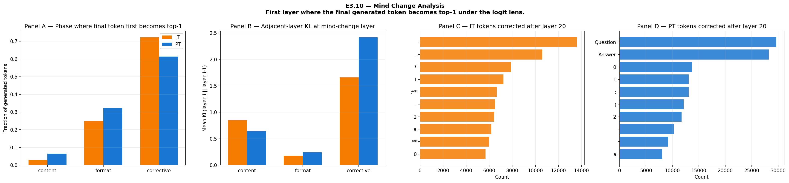
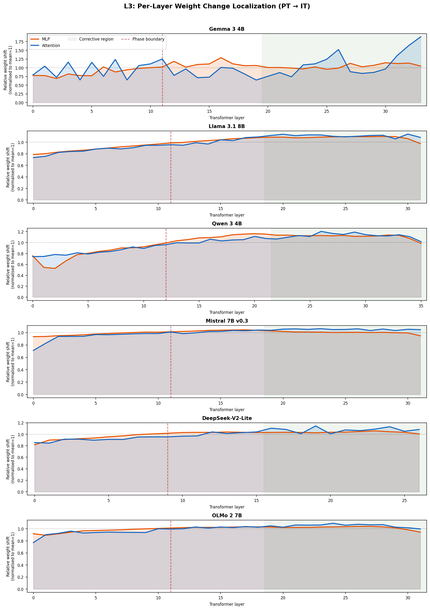
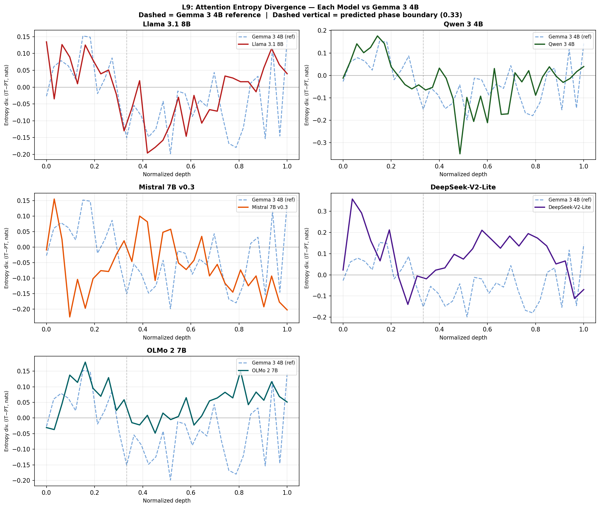

# 🔬 Instruction Tuning Delays Prediction Commitment

<p align="center">
  
  
  
  
  
</p>

<p align="center">
  <b>What does instruction tuning actually change inside a transformer's forward pass?</b><br><br>
  We compare pretrained (PT) and instruction-tuned (IT) variants layer by layer across six architectures<br>
  and find a consistent answer: <i>IT delays when the model commits to its prediction —<br>
  and installs a late-layer corrective stage to do it.</i>
</p>

---

## 🧠 The Core Idea in Plain English

When a pretrained language model generates text, it "makes up its mind" about the next token relatively early — by around layer 15 of 34, it's already locked onto a prediction and just refines it from there.

An instruction-tuned model does something strikingly different: it **keeps its options open for ~6 more layers**, then commits. Those extra layers do real work — reshaping the prediction toward structured, formatted, assistant-appropriate output.

We call this the **corrective stage**. We found it across every model we tested.

> **TL;DR:** Instruction tuning doesn't rewrite the whole network. It installs a concentrated late-layer computation that handles *how* to say things (format, register, structure) while leaving *what* to say (factual content, reasoning) largely untouched.

---

## ✨ Three Findings

---

### 🕐 Finding 1 — IT commits to predictions later *(4/5 model families)*

We define the **commitment layer** as the first layer where the model's running logit-lens prediction stops changing and stays stable all the way to the output. Think of it as "when the model makes up its mind."

IT models lock in ~6 layers later than their pretrained counterparts. This replicates across architectures with different attention patterns, training recipes, and model sizes.

<p align="center">
  
  <br><sub><b>IT (blue) commits later than PT (gray) in 4/5 tested families.</b> Two families show delays >4 layers larger than Gemma's. DeepSeek pending.</sub>
</p>

**The delay scales with difficulty.** High-confidence tokens (>90% final probability) → only +2.2 layers of delay. Low-confidence tokens (<50%) → +6.6 layers. The corrective stage works *harder* on uncertain predictions — exactly what you'd expect from an evidence-accumulation mechanism.

---

### 📐 Finding 2 — IT expands late-layer representational complexity *(6/6 families)*

Using **TwoNN intrinsic dimensionality** (Facco et al., 2017), we measure how many independent dimensions the model's layer representations actually span at each depth. More dimensions = more representational options being held open. IT consistently expands this in late layers across all six architectures tested.

<p align="center">
  
  <br><sub><b>Red = IT, blue dashed = PT.</b> IT expands late-layer dimensionality in every family (+1.3 to +4.7 dimensions at the final layer). This contradicts compression theories — IT keeps representations high-dimensional during its deliberation window.</sub>
</p>

| Model | PT ID (last layer) | IT ID (last layer) | **Δ** |
|---|:---:|:---:|:---:|
| Gemma 3 4B | 17.9 | 19.2 | **+1.3** |
| Llama 3.1 8B | 16.4 | 17.8 | **+1.5** |
| Qwen 3 4B | 16.4 | 17.7 | **+1.3** |
| Mistral 7B v0.3 | 20.0 | 21.6 | **+1.6** |
| DeepSeek-V2-Lite | 17.8 | 21.9 | **+4.1** |
| OLMo 2 7B | 20.9 | 25.5 | **+4.7** |

Higher dimensionality + later commitment = two signatures of the same thing: the model is holding representational options open while resolving multi-objective decisions (format, register, content, confidence).

---

### 🎛️ Finding 3 — The corrective stage causally controls format & register, not content *(Gemma 3 4B)*

We extract the dominant IT−PT activation difference direction at layers 20–33 and sweep an intervention strength α:

| α value | Effect |
|---|---|
| **1.0** | Unmodified baseline |
| **0** | Corrective direction fully removed |
| **< 0** | Corrective direction reversed |
| **> 1** | Corrective direction amplified |

<p align="center">
  
  <br><sub><b>Left:</b> governance metrics (G1/G2 judge scores, format compliance, structural token ratio) show clean dose-response as α decreases. <b>Middle:</b> MMLU and reasoning remain completely flat. <b>Right:</b> safety/alignment metrics.</sub>
</p>

**The dissociation is sharp and clean.** Format, register, and structural metrics fall monotonically. MMLU accuracy and reasoning scores are statistically unchanged across the full α ∈ [−5, +5] range. The corrective direction is functionally orthogonal to factual knowledge — instruction tuning has learned a separation between *what to say* and *how to say it*.

The shaded bands in each panel mark **α = 0** (full ablation, red) and **α = −1** (direction reversal, purple) — both regions where metrics converge toward PT-level quality.

---

## 📍 Where in the Network? — Layer Specificity

The corrective computation is **discretely localized**. The same intervention at early or mid layers produces nothing:

<p align="center">
  
  <br><sub><b>Red = corrective (layers 20–33), blue = early (1–11), green = mid (12–19).</b> Only corrective layers produce governance effects. MMLU is flat across all layer ranges — ruling out a simple "proximity to output" explanation.</sub>
</p>

The mid-layer null is especially informative. Mid layers are closer to the output than early layers, yet show comparably zero governance effect. The localization is discrete, not a gradient.

---

## 🎲 Is It the Direction or Just Any Perturbation?

Same formula, same layers, same α range — but a random unit vector instead of the corrective direction:

<p align="center">
  
  <br><sub><b>Red = corrective IT−PT direction → full dose-response. Blue = random unit vector at same layers → completely flat.</b> The governance effect requires the specific direction, not just any perturbation of the residual stream.</sub>
</p>

---

## 🔄 What the Late-Layer MLPs Are Physically Doing

IT's late-layer MLPs actively **oppose** the accumulated residual stream — rather than reinforcing the leading prediction, they redirect it. The δ-cosine metric captures this (cos between each MLP's update and the current residual stream direction):

<p align="center">
  
  <br><sub><b>IT (solid) shows more negative δ-cosine than PT (dashed) at terminal layers across all families.</b> Gemma shows the strongest effect. Llama shows the smallest because its PT already performs mild opposition — IT has less corrective work to add.</sub>
</p>

**Why opposition?** If early layers have built up momentum toward token X, but the model needs token Y, the late-layer MLP must contain a component opposing the direction toward X. This is geometrically necessary for prediction redirection. The opposition is the mechanical signature of the corrective stage doing its job.

---

## 🔤 What Gets Corrected? — Structural Tokens

We track "mind-changes" in the logit lens — moments where a layer switches the top-1 predicted token. In IT's corrective layers, **75% of mind-changes redirect toward structural tokens** (list markers, discourse connectors, punctuation). PT's late layers show 45%:

<p align="center">
  
  <br><sub>IT's corrective computation rewrites <b>how</b> the model formats its output, not <b>what</b> it says. Panel A: mind-changes concentrate in the corrective phase. Panel B: large KL jump at corrective layers confirms substantial prediction change. Panels C/D: corrected tokens in IT → structural tokens; in PT → content words.</sub>
</p>

---

## 🌐 Weight Changes: Training Varies, Corrective Computation Converges

<p align="center">
  
  <br><sub>Gemma (knowledge distillation) concentrates weight changes in late layers. All other families show uniform changes across depth. Yet commitment delay and ID expansion replicate regardless — the corrective computation is a <b>convergent functional property</b>, not a consequence of where weights changed.</sub>
</p>

---

## 🎭 Is It the Chat Template or the Weights?

A natural concern: maybe IT just reads the `<start_of_turn>model` token and produces structured output from that input signal alone — not from any weight-level change.

We run the same steering experiments with and without the chat template:

<p align="center">
  
  <br><sub><b>Solid = IT with chat template, dashed = IT without template.</b> The dose-response shape is preserved without template. Same color = same metric; solid vs dashed = template vs no-template. The corrective stage's weight-level computation operates independently of the template.</sub>
</p>

**Template and corrective stage are additive.** The template provides an input-level "be an assistant" signal. The corrective stage provides a weight-level governance transformation. Neither alone fully accounts for the governance effect.

---

## 👀 Attention Entropy: Another View

How diffuse vs. focused are attention heads, and how does IT differ from PT at each layer?

<p align="center">
  
  <br><sub>IT−PT attention entropy divergence per layer for each model (solid) vs Gemma 3 4B reference (dashed blue). Positive = IT attends more diffusely; negative = IT focuses more sharply. Each architecture shows a distinct signature at corrective depths.</sub>
</p>

---

## 🗂️ Project Map

```
src/poc/
├── exp3/           # Primary Gemma 3 4B analysis (logit lens, features, mind-change)
├── exp4/           # Step-level feature tracking & intrinsic dimensionality
├── exp5/           # Phase ablations & directional α-sweep (exploratory)
├── exp6/           # Full causal steering suite (A1/A2/A5a/A5b + controls)
│   ├── run.py      # Main inference runner (8 GPU workers, 1400 prompts)
│   ├── runtime.py  # nnsight-based generation with directional interventions
│   └── benchmarks/ # Governance + content eval (LLM judge + programmatic)
└── cross_model/    # 6-architecture replication (L1–L9 experiments)
    ├── collect_L8.py   # Intrinsic dimensionality via TwoNN
    ├── collect_L9.py   # Attention entropy (eager attention, all heads)
    └── config.py       # Model registry & architectural specs

scripts/
├── plot_exp6_dose_response.py  # All A1/A2/A5a/A5b/notmpl dose-response plots
├── plot_cross_model.py         # Cross-model figures + data CSV export
└── completion_pipeline.sh      # LLM judge pipeline (Gemini 2.5 Flash)

results/
├── cross_model/plots/          # Cross-model figures
│   └── data/                   # Underlying CSVs (L1/L3/L8/L9 + summary stats)
├── exp6/merged_A1_it_v4/       # Primary causal steering results
├── exp6/merged_A1_notmpl_it_v1/ # Template ablation results
└── exp6/merged_A5a_it_v1/      # Progressive skip results
```

---

## 🧪 Experiment Index

| ID | What it tests | Key result |
|---|---|---|
| **A1** | α-sweep on corrective layers (20–33) | Governance ↓, MMLU flat — clean dissociation |
| **A1_rand** | Random direction control at same layers | Zero effect — direction specificity confirmed |
| **A1v5** | Same sweep at early / mid / corrective | Only layers 20–33 produce governance effects |
| **A1_notmpl** | No chat template on IT | Dose-response preserved — effect is weight-level |
| **A2** | Inject corrective direction into PT | Noisy — PT lacks downstream circuitry to use it |
| **A5a** | Progressive layer skipping | Final 3 layers: format; earlier corrective: coherence |
| **A5b** | α-sweep replication (v2 eval pipeline) | Replicates A1 |
| **L2** | Commitment delay cross-model | Replicates 4/5 families |
| **L8** | Intrinsic dimensionality cross-model | Replicates all 6 families (+1.3 to +4.7 Δ) |
| **L9** | Attention entropy cross-model | Non-zero IT−PT divergence in all families |

---

## ⚙️ Reproduce

```bash
# Setup
git clone <repo> && cd structral-semantic-features
uv sync

# Run primary causal steering experiment (8 GPUs, ~4h)
bash scripts/run_exp6_A_v4.sh

# Generate all exp6 dose-response plots
PYTHONPATH=. uv run python scripts/plot_exp6_dose_response.py \
    --experiment A1 \
    --a1-dir results/exp6/merged_A1_it_v4 \
    --a2-dir results/exp6/merged_A2_pt_v4

# Cross-model figures + export underlying data to CSV
PYTHONPATH=. uv run python scripts/plot_cross_model.py
# → results/cross_model/plots/data/  (L1/L3/L8/L9 CSVs + summary_stats.csv)

# Run tests
uv run pytest
```

**Models used:** `google/gemma-3-4b-pt` · `google/gemma-3-4b-it` · `meta-llama/Llama-3.1-8B` · `meta-llama/Llama-3.1-8B-Instruct` · `Qwen/Qwen3-4B-Base` · `Qwen/Qwen3-4B` · `mistralai/Mistral-7B-v0.3` · `mistralai/Mistral-7B-Instruct-v0.3` · `deepseek-ai/DeepSeek-V2-Lite` · `deepseek-ai/DeepSeek-V2-Lite-Chat` · `allenai/OLMo-2-7B` · `allenai/OLMo-2-7B-Instruct`

---

## 📄 Citation

```bibtex
@inproceedings{anonymous2026commitment,
  title     = {Instruction Tuning Delays Prediction Commitment:
               Late-Layer Corrective Computation Across Transformer Families},
  author    = {Anonymous},
  booktitle = {Advances in Neural Information Processing Systems (NeurIPS)},
  year      = {2026}
}
```

---

## 📁 Further Reading

| Doc | What it covers |
|---|---|
| [`docs/phase_transition_hypothesis_and_experiments.md`](docs/phase_transition_hypothesis_and_experiments.md) | Full research context and hypothesis development |
| [`docs/exp6-steering-design.md`](docs/exp6-steering-design.md) | Causal steering experiment design |
| [`docs/model_ablation.md`](docs/model_ablation.md) | Cross-model replication design |
| [`docs/EVAL_REDESIGN_v1.md`](docs/EVAL_REDESIGN_v1.md) | Evaluation pipeline (v2 benchmarks, LLM judge) |
| [`results/cross_model/plots/data/summary_stats.csv`](results/cross_model/plots/data/summary_stats.csv) | Key scalar stats per model (ID, commitment, entropy) |
