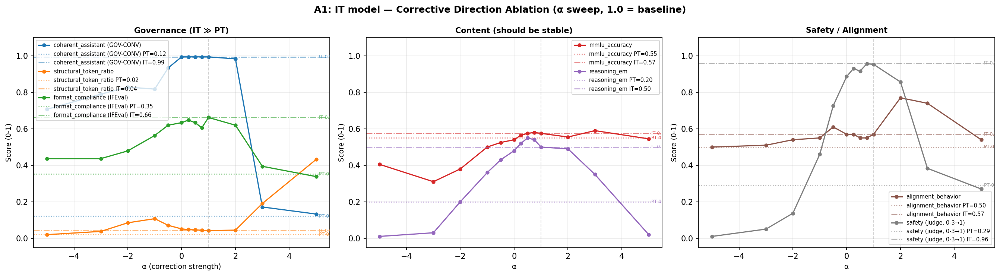
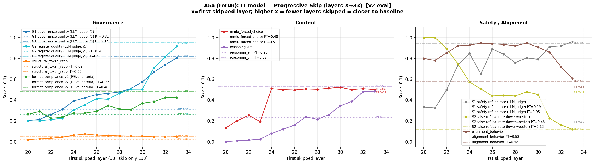

# PT–IT Transformer Differences

<p align="center">
  
  
  
  
</p>

Research code for understanding what **instruction tuning changes inside a transformer**.

The main case study is **Gemma 3 4B PT vs IT**. That is where the repo does the deepest tracing, feature analysis, and causal steering work. The repo also includes **cross-model experiments** to test whether the same PT→IT signatures appear in other model families.

At a high level, the project argues that instruction tuning does not simply rewrite the whole network. Instead, it seems to:

- preserve much of the early and mid-layer computation
- sharpen a transition around the first third of the network
- install a late **corrective / output-governance stage**

That late stage appears to shape:

- structure
- formatting
- conversational register
- other output-governance behavior

## The Idea In One Figure

### PT→IT introduces a sharp late-stage change


This is the cleanest observational figure in the repo. Adjacent-layer continuity drops around the dip instead of changing smoothly across the whole network. That is the main reason the project treats the PT→IT difference as a **phase transition plus late corrective stage**, not just general drift.

## The Main Causal Result

### Remove the corrective direction from IT



This is the current headline experiment. Instead of deleting whole layers, it removes a late corrective direction from the IT model and asks what breaks first. The core question is whether governance-like behavior degrades before core content capability collapses.

### Skip progressively through the corrective stage



This is the complementary causal view: how much of the late stage is actually needed? It helps distinguish a narrow bottleneck from a broader late-stage computation.

## Cross-Model Results

The repo is no longer only about Gemma 3 4B. Gemma is still the main mechanistic focus, but the project now also asks whether the same PT→IT story shows up in other model families.

### Cross-model summary


### Cross-model commitment depth


These figures are the generalization layer of the project. The goal is not to do equally deep mechanistic analysis for every model, but to test whether the same broad structure recurs:

- a meaningful PT→IT transition
- comparable fractional-depth behavior
- evidence for a late-stage behavioral / corrective shift

## What’s In The Repo

| Area | What it does | Why it matters |
| --- | --- | --- |
| `exp3` | detailed PT vs IT generation-trace analysis | shows where the models diverge during generation |
| `exp4` | cross-layer transition analysis | strongest observational evidence for the dip / phase boundary |
| `exp5` | broad phase-ablation experiments | shows why coarse whole-phase ablation was not the right final causal tool |
| `exp6` | steering and targeted interventions | strongest causal evidence for the corrective stage |
| `cross_model` | replication across model families | tests whether the story generalizes beyond Gemma |

If you only remember one summary:

- `exp3` and `exp4` show **what changes**
- `exp5` shows **why broad ablation was too coarse**
- `exp6` shows **what the late stage does causally**
- `cross_model` shows **the story is not only about Gemma**

## How To Read This Project

There are really two layers here.

### 1. Gemma 3 4B is the main mechanistic case study

This is where the repo is deepest:

- detailed PT vs IT trace comparison
- feature-level analysis
- corrective-direction steering
- late-stage intervention experiments

If you want the strongest, most complete story in the repo, start here.

### 2. Cross-model is the generalization layer

This part is broader and lighter-weight. It asks whether the same PT→IT signatures appear outside Gemma.

So the intended reading is:

- use **Gemma 3 4B** to understand the mechanism
- use **cross-model results** to argue the phenomenon is not Gemma-specific

## Quick Start

### Setup

```bash
uv sync
```

Typical requirements:

- Python `>=3.13`
- GPUs for collection and intervention runs
- Hugging Face access for gated checkpoints
- optional GCS credentials for result sync

### Main commands

Run experiment families:

```bash
uv run python -m src.poc.exp3.run
uv run python -m src.poc.exp4.run
uv run python -m src.poc.exp5.run
uv run python -m src.poc.exp6.run --help
```

Regenerate the main figures:

```bash
uv run python -m src.poc.exp3.run_plots --variant it
uv run python -m src.poc.exp4.run_plots
uv run python scripts/plot_exp6_dose_response.py
uv run python scripts/plot_exp6_B.py
```

Browse the main tracked figure folders:

```bash
ls results/exp4/plots
ls results/exp6/merged_A1_it/plots
ls results/exp6/merged_A5a_it_v1/plots
ls results/cross_model/plots
```

Run tests:

```bash
uv run pytest
uv run python tools/test_audit.py
```

## Suggested Reading Order

If you want the shortest useful path:

1. look at `results/exp4/plots`
2. look at `results/exp6/merged_A1_it/plots`
3. look at `results/cross_model/plots`
4. then read the docs for details

If you want the full paper-facing path:

1. [docs/phase_transition_hypothesis_and_experiments.md](docs/phase_transition_hypothesis_and_experiments.md)
2. [docs/exp6-steering-design.md](docs/exp6-steering-design.md)
3. [docs/model_ablation.md](docs/model_ablation.md)
4. [src/poc/exp4](src/poc/exp4)
5. [src/poc/exp3](src/poc/exp3)
6. [src/poc/exp5](src/poc/exp5)
7. [src/poc/exp6](src/poc/exp6)

## Repo Layout

```text
.
├── data/         # datasets and prompt collections
├── docs/         # paper notes, plans, and design docs
├── logs/         # local run logs
├── results/      # merged runs, tracked figures, intermediate outputs
├── scripts/      # plotting, merging, orchestration, utilities
├── tools/        # local helpers and audits
├── src/          # experiment code and shared runtime
└── README.md
```

## Important Paths

| Path | What it contains |
| --- | --- |
| `src/poc/shared` | shared model loading, collection, and utility code |
| `src/poc/exp3` | PT vs IT generation-trace analysis |
| `src/poc/exp4` | cross-layer transition / dip analysis |
| `src/poc/exp5` | broad phase-ablation experiments |
| `src/poc/exp6` | corrective-stage steering and targeted interventions |
| `results/cross_model` | cross-model replication figures and summaries |

## Stable Figure Folders

Tracked result plots are intentionally selective. The most useful git-tracked figure folders right now are:

- `results/exp4/plots`
- `results/exp5/merged_progressive_it/plots`
- `results/exp6/merged_A1_it/plots`
- `results/exp6/merged_A5a_it_v1/plots`
- `results/exp6/plots_B`
- `results/cross_model/plots`

Most large intermediate artifacts stay ignored so the repo remains readable.

## Documentation

If you want the full research context, design history, and implementation notes, start in [docs](docs/README.md):

- [phase_transition_hypothesis_and_experiments.md](docs/phase_transition_hypothesis_and_experiments.md)
- [exp6-steering-design.md](docs/exp6-steering-design.md)
- [model_ablation.md](docs/model_ablation.md)
- [exp3_plan.md](docs/exp3_plan.md)
- [EVAL_REDESIGN_v1.md](docs/EVAL_REDESIGN_v1.md)
- [poc-pipeline-notes.md](docs/poc-pipeline-notes.md)
- [research-notes-v2.md](docs/research-notes-v2.md)
- [circuit-tracer-nnsight-issue.md](docs/circuit-tracer-nnsight-issue.md)

## License

Released under the [MIT License](LICENSE).
