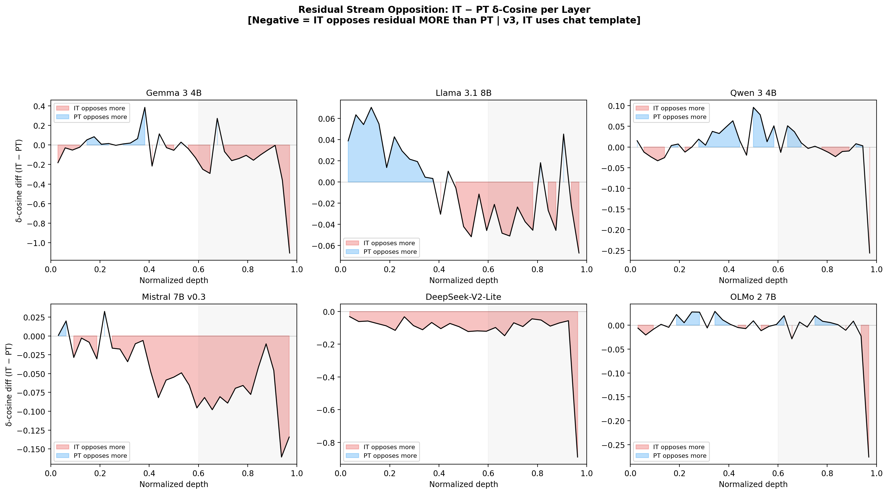

# Instruction Tuning Slows Prediction Convergence

### Late-Layer Corrective Computation Across Transformer Families

<p align="center">
  
  
  
  
</p>

> **TL;DR** &mdash; We compare pretrained and instruction-tuned variants of six transformer families and find that instruction tuning universally introduces a **late-layer corrective stage**: IT's MLPs oppose the residual stream, slowing prediction convergence by 1&ndash;6 layers. This corrective stage selectively controls **format and register** while leaving content knowledge intact.

<p align="center">
  
  <br>
  <sub><b>Figure 1.</b> &delta;-cosine profiles &mdash; cos(MLP update, residual stream) &mdash; across six model families. IT (red) opposes the residual stream more strongly than PT (blue dashed) in late layers. The effect is sustained in Gemma, DeepSeek, Mistral, and Llama; concentrated in the final layers of OLMo and Qwen.</sub>
</p>

---

## Overview

What does instruction tuning change inside a transformer's forward pass? We answer this through systematic **model diffing**: layer-by-layer comparison of pretrained (PT) and instruction-tuned (IT) variants across six architectures spanning different pretraining corpora (5.7T&ndash;36T tokens), attention patterns (hybrid local/global, sliding window, MLA/MoE, all-global MHA), and post-training recipes (KD, iterative DPO, SFT-only, GRPO, RLVR).

We find three universal phenomena and demonstrate their causal relationship to format control:

| # | Finding | Universality | Section |
|---|---------|:------------:|---------|
| 1 | IT's late-layer MLPs **oppose the residual stream** more than PT's | 6/6 | [&sect;3.1](#1-late-layer-mlp-opposition) |
| 2 | IT's intermediate predictions **converge to the final output more slowly** | 6/6 | [&sect;3.2](#2-delayed-prediction-commitment) |
| 3 | IT representations occupy **higher intrinsic dimensionality** in late layers | 6/6 | [&sect;3.3](#3-intrinsic-dimensionality-expansion) |
| 4 | The corrective stage **selectively encodes format/register**, not content | Gemma (extending) | [&sect;3.4](#4-causal-evidence-format-control) |

---

## Key Findings

### 1. Late-layer MLP opposition

In all six families, IT's late-layer MLP outputs have more negative cosine similarity with the accumulated residual stream than PT's. The effect forms a **continuum of magnitude**:

| Model | Final 20% &delta;-cosine shift | Pattern |
|-------|:-----:|---------|
| Gemma 3 4B | **&minus;0.269** | Sustained across late layers |
| DeepSeek-V2-Lite | **&minus;0.201** | Sustained across late layers |
| Mistral 7B v0.3 | **&minus;0.077** | Evenly distributed |
| OLMo 2 7B | **&minus;0.041** | Concentrated in final layers |
| Qwen 3 4B | **&minus;0.038** | Concentrated in final layer |
| Llama 3.1 8B | **&minus;0.021** | Weak but consistent |

No family shows a net positive shift. The direction is universal; the magnitude varies by over an order of magnitude.

<p align="center">
  
  <br>
  <sub><b>Figure 2.</b> IT&minus;PT &delta;-cosine difference per layer. Red = IT opposes more than PT. Four families show sustained opposition; two show opposition concentrated in the final layers.</sub>
</p>

### 2. Delayed prediction commitment

Using both **tuned logit-lens probes** (Belrose et al., 2023) and the **raw logit lens**, we measure when IT vs PT predictions reach their final form. IT commits later in **all six families** across five independent metrics:

<p align="center">
  
  <br>
  <sub><b>Figure 3.</b> Mean KL(layer &ell; &Vert; final) per layer under the tuned logit lens. In all six families, IT's curve (red) sits above PT's (blue dashed) &mdash; IT's intermediate predictions are further from the final output at every late layer.</sub>
</p>

The convergence gap is positive in all six families under both lenses (tuned: +0.30 to +0.65 nats; raw: +0.42 to +1.05 nats in the late half). The delay scales with **prediction difficulty**: in Gemma, high-confidence tokens show +2.2 layers of delay while low-confidence tokens show +6.6 layers.

<p align="center">
  
  <br>
  <sub><b>Figure 4.</b> Per-token commitment layer distributions (tuned lens, KL < 0.1 nats). In all six families, IT's distribution (red) is shifted right &mdash; predictions reach their final form at greater depth.</sub>
</p>

The finding is robust across KL thresholds spanning two orders of magnitude, under both lenses, and under all five metric definitions (top-1, no-flip-back, KL threshold, majority vote, continuous CG):

<p align="center">
  
  <br>
  <sub><b>Figure 5.</b> Threshold sensitivity. The direction of the IT&minus;PT gap is invariant across KL thresholds from 0.05 to 1.0 nats and across both raw and tuned lenses.</sub>
</p>

### 3. Intrinsic dimensionality expansion

<p align="center">
  
  <br>
  <sub><b>Figure 6.</b> TwoNN intrinsic dimensionality profiles. IT (red) shows higher ID than PT (blue dashed) in late layers across all 6 families (+1.3 to +4.7 dimensions).</sub>
</p>

IT representations in late layers occupy more independent dimensions than PT. Geometrically, the representations have not yet collapsed to a single prediction direction &mdash; they maintain a **higher-dimensional uncommitted state** through the corrective stage before final prediction collapse.

### 4. Causal evidence: format control

We extract the dominant IT&ndash;PT MLP activation difference at corrective layers and modulate it with a scalar &alpha;. Removing the direction (&alpha;&rarr;0) degrades formatting while content metrics stay flat:

<p align="center">
  
  <br>
  <sub><b>Figure 7.</b> Dose-response for Gemma 3 4B. Format metrics (top) degrade monotonically as the corrective direction is removed/reversed. Content metrics (bottom: MMLU, GSM8K, reasoning) remain flat in the moderate range. Shaded bands = 95% BCa bootstrap CIs.</sub>
</p>

The dissociation is validated by multiple controls:

| Control | What it rules out | Result |
|---------|-------------------|--------|
| Random direction (0C) | Generic perturbation | 3&times; less governance modulation than corrective direction |
| Layer specificity (0F) | Proximity-to-output | Only layers 20&ndash;33 produce effects; early/mid produce nothing |
| Template ablation | Chat template artifact | Same dose-response without chat template &mdash; weight-encoded |
| MLP vs attention (0I) | Non-specific signal | MLP outputs carry the signal; attention carries none |
| Calibration split (0H) | Prompt selection artifact | Three disjoint prompt sets produce identical dose-response |

<p align="center">
  
  <br>
  <sub><b>Figure 8.</b> Layer specificity. Only the corrective layers (20&ndash;33, red) produce governance effects. Early (blue) and mid (green) layers produce nothing.</sub>
</p>

---

## Models

| Model | Layers | d_model | Architecture | Post-training |
|-------|--------|---------|-------------|---------------|
| **Gemma 3 4B** (primary) | 34 | 2560 | GQA, hybrid local/global (5:1) | KD + SFT + RLHF + RLMF + RLEF |
| **Llama 3.1 8B** | 32 | 4096 | GQA, all global | SFT + RS + DPO (iterative) |
| **Qwen 3 4B** | 36 | 2560 | GQA, all global | 4-stage: SFT &rarr; reasoning RL &rarr; thinking fusion &rarr; general RL |
| **Mistral 7B v0.3** | 32 | 4096 | GQA, sliding window (4096) | SFT |
| **DeepSeek-V2-Lite** | 27 | 2048 | MLA, MoE (2 shared + 64 routed, top-6) | SFT + GRPO |
| **OLMo 2 7B** | 32 | 4096 | MHA, all global | SFT + DPO + RLVR (T&uuml;lu 3) |

All observational analyses (exp9) use **chat template for IT models** (their native trained distribution) and raw text for PT. Causal steering experiments are validated both with and without chat template.

---

## Cross-model summary

| Finding | Gemma | Llama | Qwen | Mistral | DeepSeek | OLMo |
|---------|:-----:|:-----:|:----:|:-------:|:--------:|:----:|
| ID expansion (late-layer dims) | +1.3 | +1.5 | +1.3 | +1.6 | +4.1 | +4.7 |
| &delta;-cosine shift (final 20%) | &minus;0.269 | &minus;0.021 | &minus;0.038 | &minus;0.077 | &minus;0.201 | &minus;0.041 |
| Opposition pattern | sustained | weak | final-layer | even | sustained | final-layer |
| Convergence gap &mdash; tuned (nats) | +0.35 | +0.43 | +0.65 | +0.32 | +0.34 | +0.30 |
| Convergence gap &mdash; raw (nats) | +1.01 | +0.63 | +0.75 | +1.05 | +0.52 | +0.42 |
| Causal steering | validated | planned | planned | planned | planned | planned |

All three observational findings are **universal (6/6)**. The magnitude of opposition correlates with the magnitude of convergence delay across families. Causal steering is validated on Gemma; the architecture-agnostic pipeline requires only compute (not methodology changes) to extend.

---

## Reproduce

### Setup

```bash
git clone <repo> && cd structral-semantic-features
uv sync
```

### Core experiments

```bash
# Cross-model observational analyses (1 GPU per model)
uv run python -m src.poc.cross_model.collect_L1L2 --model gemma3_4b --device cuda:0  # delta-cosine + commitment
uv run python -m src.poc.cross_model.collect_L8 --model gemma3_4b --device cuda:0    # intrinsic dimensionality
uv run python -m src.poc.cross_model.collect_L9 --model gemma3_4b --device cuda:0    # attention entropy

# Tuned-lens probe training (per model x variant)
uv run python -m src.poc.cross_model.tuned_lens --model gemma3_4b --variant it --device cuda:0

# Causal steering (Gemma, multi-GPU)
bash scripts/run_exp6_A_v4.sh

# Multi-model steering (6 models)
bash scripts/run_phase0_multimodel.sh --step precompute
bash scripts/run_phase0_multimodel.sh --step steer
bash scripts/run_phase0_multimodel.sh --step judge
```

### Generate plots

```bash
# Cross-model observational figures (Fig 1-6)
uv run python -m src.poc.exp9.plot_replication

# Gemma dose-response figures (Fig 7-8)
uv run python scripts/plot_exp6_dose_response.py \
    --experiment A1 \
    --a1-dir results/exp6/merged_A1_it_v4

# Methodology validation (Tier 0)
uv run python scripts/plot_exp7_tier0.py
```

---

## Project structure

```
src/poc/
  cross_model/                 # Multi-model infrastructure
    config.py                  #   MODEL_REGISTRY (6 models)
    adapters/                  #   Per-architecture adapters (Gemma, Llama, Qwen, Mistral, DeepSeek, OLMo)
    tuned_lens.py              #   Tuned-lens training + eval (Belrose et al. 2023 recipe)
    collect_L1L2.py            #   Delta-cosine + raw commitment collection
    collect_L8.py              #   TwoNN intrinsic dimensionality
    collect_L9.py              #   Attention entropy

  exp6/                        # Core causal steering framework
    run.py                     #   Main intervention runner (--model-name for multi-model)
    config.py                  #   Experiment configuration
    interventions.py           #   Hook registration + direction loading
    runtime.py                 #   Generation with interventions
    model_adapter.py           #   SteeringAdapter for multi-model hooks

  exp7/                        # Methodology validation (Tier 0: 0A-0J)
  exp8/                        # Multi-model causal steering (Phase 0)
  exp9/                        # Cross-model observational replication
  exp10/                       # Contrastive activation patching (WIP)

scripts/
  run_phase0_multimodel.sh     # Multi-model orchestration
  precompute_directions_multimodel.py  # Direction extraction for all 6 models
  plot_exp6_dose_response.py   # Gemma dose-response figures
  plot_exp7_tier0.py           # Methodology validation figures
  merge_exp6_workers.py        # Merge multi-worker results

results/
  cross_model/{model}/         # Per-model observational data + directions
  exp6/merged_A1_it_v4/        # Canonical Gemma steering results
  exp7/plots/                  # Methodology validation figures
  exp9/plots/                  # Cross-model replication figures (main paper)
```

---

## Experiment index

### Observational (cross-model, 6/6)

| ID | Analysis | Key result |
|----|----------|------------|
| **L1** | &delta;-cosine profiles | IT opposes residual stream more in late layers (6/6, &minus;0.021 to &minus;0.269) |
| **L2** | Commitment delay (5 metrics &times; 2 lenses) | IT commits 1&ndash;6 layers later (6/6) |
| **L3** | Weight change localization | Gemma: concentrated at corrective layers; others: uniform |
| **L8** | Intrinsic dimensionality (TwoNN) | IT +1.3 to +4.7 dimensions in late layers (6/6) |
| **L9** | Attention entropy divergence | Architecture-dependent |

### Causal steering (Gemma, extending to all 6)

| ID | Experiment | Key result |
|----|-----------|------------|
| **A1** | &alpha;-sweep on corrective layers | Governance dose-response, content flat |
| **A1_rand** | Random direction control | 3&times; less governance effect &mdash; direction specificity |
| **A1_notmpl** | No chat template | Dose-response preserved &mdash; weight-encoded |
| **A2** | Inject into PT | Noisy &mdash; PT lacks downstream circuitry |
| **A5a** | Progressive layer skipping | Final 3 layers: format; earlier: coherence |

### Methodology validation (Tier 0)

| ID | Test | Result |
|----|------|--------|
| **0A** | Direction bootstrap stability | cos > 0.993 by n=300 |
| **0B** | Matched-token direction | cos = 0.82 (primarily weight-driven) |
| **0C** | Projection-matched random | 3&times; less governance, identical content degradation |
| **0D** | Bootstrap 95% CIs | BCa intervals on all metrics |
| **0E** | Classifier robustness | Robust to all boundary perturbations |
| **0F** | Layer range sensitivity | Stable across 4 overlapping ranges |
| **0G** | Tuned-lens commitment | Primary commitment measurement (6 models &times; 2 variants) |
| **0H** | Calibration split | Three disjoint prompt sets &rarr; same dose-response |
| **0I** | Formula comparison | MLP projection only; attention/residual fail |
| **0J** | Onset threshold sensitivity | Robust across &sigma;-based and absolute thresholds |

### Contrastive activation patching (Exp10, in progress)

| Phase | Description | Status |
|-------|-------------|--------|
| 1 | Forced-decoding paired data collection | Prototype complete |
| 2 | Ridge probes &rarr; convergence direction (d_conv) | Prototype complete |
| 3 | Causal activation patching (5 conditions) | Prototype complete |
| 4 | Steering with d_conv vs d_mean | Prototype: d_mean steers (11&ndash;19&times;), d_conv does not |

---

## Pipeline design

The steering pipeline is **architecture-agnostic**. It operates on raw MLP activations via a model-agnostic adapter system &mdash; no transcoders, SAEs, or model-specific decompositions required.

```
Direction Extraction          Steering                Evaluation
--------------------    --------------------    --------------------
IT model --+            IT model + hooks        LLM judge (G1/G2)
           |-- d_mean   h += (alpha-1)(d'h)d    Programmatic (STR)
PT model --+            per corrective layer    IFEval compliance
                                                MMLU / GSM8K / reasoning
```

The adapter system provides a uniform interface across all six architectures, including DeepSeek's MoE routing and Gemma's hybrid attention. Extending to a new model requires only registering its architecture in the adapter config.

---

## Citation

```bibtex
@inproceedings{anonymous2026corrective,
  title={Instruction Tuning Slows Prediction Convergence: Late-Layer Corrective Computation Across Transformer Families},
  author={Anonymous},
  booktitle={NeurIPS},
  year={2026}
}
```

## License

See [LICENSE](LICENSE).
