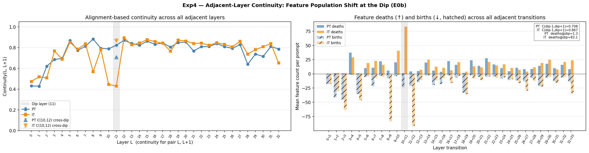
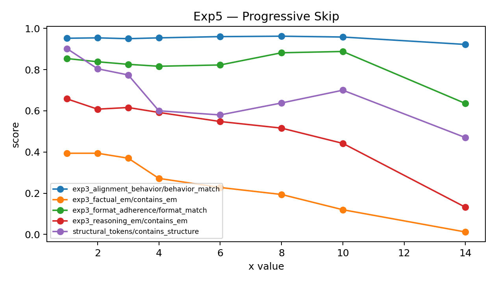
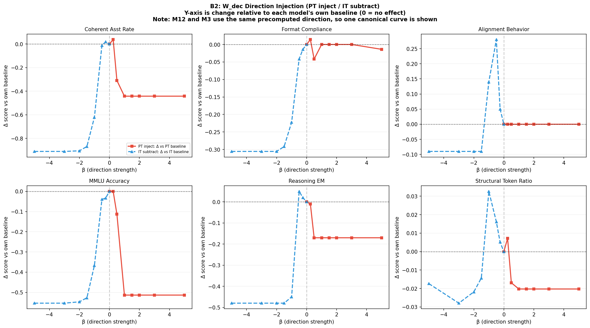

# Structural Semantic Features

Mechanistic interpretability research code for studying how instruction tuning restructures the computational pipeline of Gemma 3.

This repo centers on a concrete claim:

> pretrained and instruction-tuned models share much of the same early and mid-layer computation, but instruction tuning installs a late corrective/output-governance stage and sharpens a representational phase transition around the first third of the network.

The codebase is organized around a sequence of experiments that test that claim from several angles: observational tracing, cross-layer feature turnover, causal ablation, and steering.

## Research Focus

The current paper-facing story has two linked threads:

1. **Phase transition / pipeline restructuring**
   - PT and IT appear to differ less by wholesale rewriting of the whole model and more by a sharp computational boundary plus late corrective processing.
   - The main empirical signatures are layerwise feature-population shifts, adjacent-layer continuity breaks, altered attention/entropy trajectories, and a distinct late-stage output-shaping regime.

2. **Output governance as a corrective stage**
   - Late IT layers appear to regulate structure, formatting, discourse style, and conversational output form.
   - Exp5 and Exp6 test this causally through ablation and steering.

The most relevant design notes for the current direction are:

- [Phase-transition hypothesis and experiment plan](docs/phase_transition_hypothesis_and_experiments.md)
- [Exp6 steering design](docs/exp6-steering-design.md)
- [Research notes v2](docs/research-notes-v2.md)

## At A Glance

| Experiment | Question | Main Output |
| --- | --- | --- |
| `exp3` | Where do PT and IT differ during generation? | layerwise trace metrics, feature populations, mind-change / KL plots |
| `exp4` | Is there a sharp cross-layer population transition? | adjacent-layer continuity, attention entropy, ID profiles |
| `exp5` | Can content / format / corrective phases be causally separated? | ablation sweeps, progressive skip, benchmark heatmaps |
| `exp6` | Can the corrective stage be steered directly? | direction steering, feature clamping, governance control plots |

## Key Figures

### Exp4: Adjacent-layer continuity around the dip



This figure is the cleanest high-level view of the cross-layer population shift hypothesis: adjacent-layer continuity drops around the dip, and the dip region is treated as a real computational boundary rather than a smooth drift.

### Exp5: progressive corrective-stage ablation



This is the main causal Exp5 plot currently kept in git. It shows how benchmark behavior changes as more of the corrective stage is removed.

### Exp6: governance-direction steering



Exp6 asks whether the late corrective stage can be steered directly. The B-series plots test direction injection, control feature sets, and layer specificity for governance-related behavior.

## Repository Layout

```text
.
├── data/     # datasets and prompt collections used by the experiments
├── docs/     # paper notes, experiment plans, and issue writeups
├── logs/     # local run logs
├── results/  # generated outputs, merged runs, and tracked figures
├── scripts/  # orchestration, merging, plotting, and utility scripts
├── tools/    # local audit and one-off helper scripts
├── src/      # experiment code and shared runtime components
└── README.md
```

## Repo Guide

### `src/poc/shared`

Reusable loading, collection, and plotting helpers used across experiments. If you want to understand how model execution or tracing is wired, start here.

### `src/poc/exp3`

Generation-trace analysis for PT vs IT:

- emergence / KL / logit-lens behavior
- word-level token stratification
- feature-population analysis
- mind-change and candidate-reshuffling analyses

### `src/poc/exp4`

Cross-layer transition analysis:

- adjacent-layer continuity
- attention entropy
- intrinsic-dimension profiling
- feature-label distribution around the dip

### `src/poc/exp5`

Three-phase ablation experiments:

- content, format, and corrective phase interventions
- progressive skip / directional sweeps
- benchmark evaluation and checkpoint metric summaries

### `src/poc/exp6`

Steering experiments:

- corrective direction addition/removal
- feature clamping
- control feature comparisons
- layer-specific governance interventions

## Quick Start

### Environment

The repo uses `uv` with Python `>=3.13`.

```bash
uv sync
```

Most collection runs also need:

- Hugging Face access for gated Gemma checkpoints
- GPU execution
- local credentials if you use the GCS upload/download utilities

### Common entrypoints

Run core experiments:

```bash
uv run python -m src.poc.exp3.run
uv run python -m src.poc.exp4.run
uv run python -m src.poc.exp5.run
uv run python -m src.poc.exp6.run --help
```

Regenerate plots:

```bash
uv run python -m src.poc.exp3.run_plots --variant it
uv run python -m src.poc.exp4.run_plots
uv run python scripts/plot_exp6_B.py
```

Run tests:

```bash
uv run pytest
uv run python tools/test_audit.py
```

## How To Use The Code

### If you want to reproduce the paper-style analyses

1. Generate or load the PT/IT trace artifacts in `results/exp3`.
2. Regenerate exp3 plots.
3. Use exp4 to quantify the transition around the dip.
4. Use exp5 for causal ablation.
5. Use exp6 for steering after ablation has identified the likely corrective stage.

### If you are new to the repo

Best reading order:

1. [docs/phase_transition_hypothesis_and_experiments.md](docs/phase_transition_hypothesis_and_experiments.md)
2. [docs/exp6-steering-design.md](docs/exp6-steering-design.md)
3. [src/poc/exp3](src/poc/exp3)
4. [src/poc/exp4](src/poc/exp4)
5. [src/poc/exp5](src/poc/exp5)
6. [src/poc/exp6](src/poc/exp6)

### If you only need the current finalized figure folders

Tracked result plots are intentionally selective. At the moment, the most stable git-tracked figure folders are:

- `results/exp4/plots`
- `results/exp5/merged_progressive_it/plots`
- `results/exp6/plots_B`

Most large intermediate result artifacts remain ignored.

## Documentation

Project notes and design documents live in [docs](docs/README.md):

- [phase_transition_hypothesis_and_experiments.md](docs/phase_transition_hypothesis_and_experiments.md)
- [exp6-steering-design.md](docs/exp6-steering-design.md)
- [exp3_plan.md](docs/exp3_plan.md)
- [EVAL_REDESIGN_v1.md](docs/EVAL_REDESIGN_v1.md)
- [poc-pipeline-notes.md](docs/poc-pipeline-notes.md)
- [research-notes-v2.md](docs/research-notes-v2.md)
- [circuit-tracer-nnsight-issue.md](docs/circuit-tracer-nnsight-issue.md)

## Working Conventions

- `src/` is the source of truth for experiment code.
- `scripts/` is for orchestration and postprocessing, not core model logic.
- `results/` reflects local experiment state and is only partially tracked.
- `docs/` contains the evolving research narrative and experiment plans.

## License

Released under the [MIT License](LICENSE).
