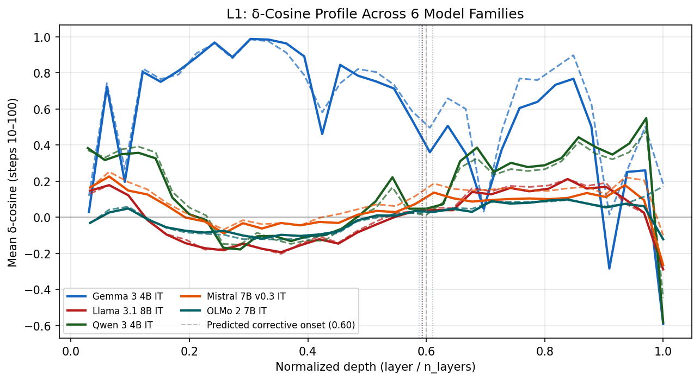
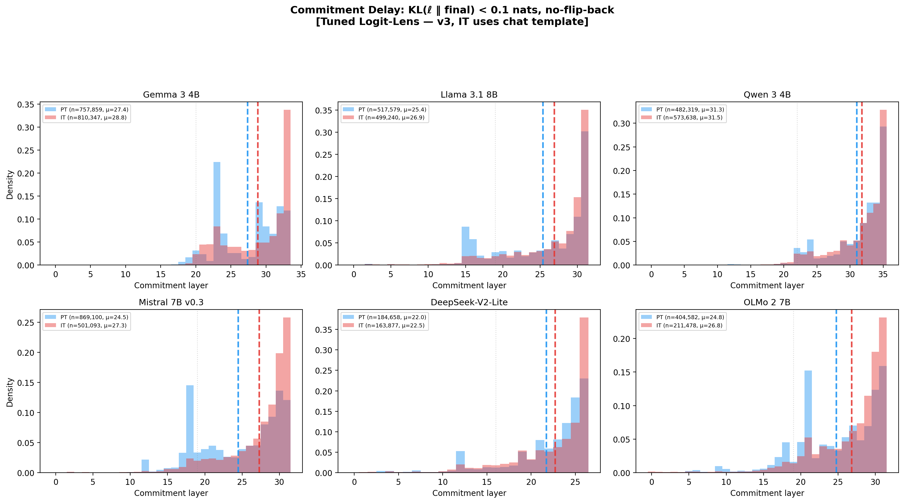
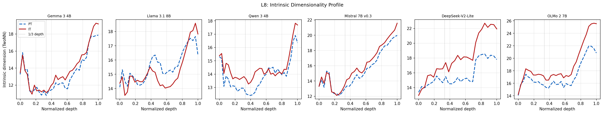
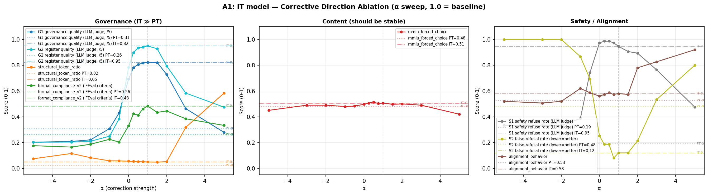
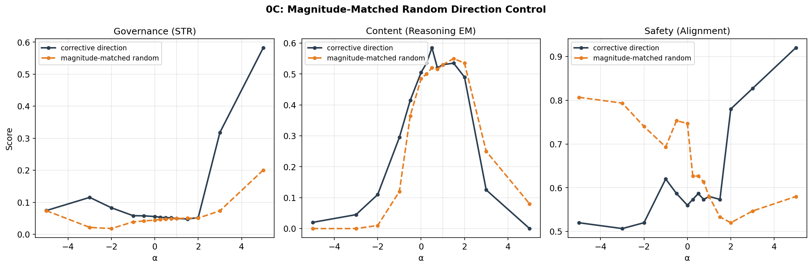
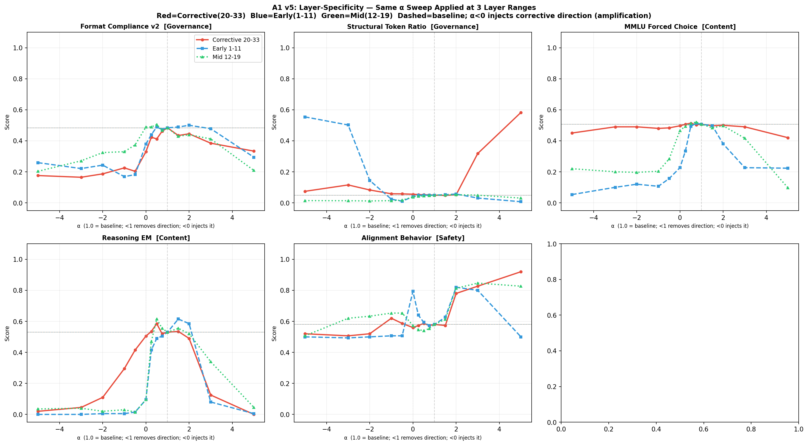

# Instruction Tuning Delays Prediction Commitment

### Late-Layer Corrective Computation Across Transformer Families

<p align="center">
  
  
  
  
</p>

---

We compare pretrained (PT) and instruction-tuned (IT) model variants across **six architectures** and identify a **late-layer corrective stage** that instruction tuning introduces. In 5/6 families, IT's late-layer MLPs oppose the accumulated residual stream, and this opposition co-occurs with **delayed prediction commitment**: IT models' intermediate predictions first approximate their final output 1-6 layers later than PT's. The corrective stage selectively encodes **format and register control** -- removing it degrades formatting while content metrics stay flat.

<p align="center">
  
  <br>
  <sub><b>Figure 1.</b> Delta-cosine profiles (cos between each layer's MLP update and the residual stream) across six model families. IT (solid) opposes the residual stream more strongly than PT (dashed) in late layers -- the corrective stage signature.</sub>
</p>

---

## Key Findings

### 1. IT models commit to predictions later

Using both **tuned logit-lens probes** (Belrose et al., 2023) and the **raw logit lens**, we measure the earliest layer where KL(intermediate || final) drops below 0.1 nats. IT commits 1-6 layers later than PT across five families. The delay scales with prediction difficulty: high-confidence tokens show +2.2 layers of delay, low-confidence tokens show +6.6 layers.

<p align="center">
  
  <br>
  <sub><b>Figure 2.</b> Tuned-lens commitment delay. Per-token commitment layer distributions for PT (blue) and IT (red). Five families show IT shifted right (later commitment). Qwen shows near-identical distributions -- the one informative exception.</sub>
</p>

One family -- **Qwen** -- shows neither opposition nor measurable delay. This co-occurrence pattern across all six families constitutes evidence that the two phenomena are causally linked.

### 2. IT representations occupy higher intrinsic dimensionality

<p align="center">
  
  <br>
  <sub><b>Figure 3.</b> TwoNN intrinsic dimensionality profiles. IT (red) consistently shows higher ID than PT (blue dashed) in late layers across all 6 architectures (+1.3 to +4.7 dimensions).</sub>
</p>

More dimensions = more possibilities still being weighed. IT models maintain a higher-dimensional uncommitted state through the corrective stage before final prediction collapse. This is our most universal finding (6/6 families, including Qwen).

### 3. The corrective stage controls *format*, not *knowledge*

We extract the dominant IT-PT MLP activation difference at corrective layers and modulate it with a scalar alpha:

<p align="center">
  
  <br>
  <sub><b>Figure 4.</b> Dose-response for Gemma 3 4B. Format metrics (top) degrade monotonically as the corrective direction is removed. Content metrics (bottom: MMLU, GSM8K, reasoning) stay flat in the moderate range. Shaded bands = 95% bootstrap CIs.</sub>
</p>

The dissociation is precise and validated by multiple controls:

| Control | What it rules out | Result |
|---------|-------------------|--------|
| **Random direction** (0C) | Generic perturbation | Zero format effect; 3x less governance modulation than corrective direction |
| **Layer specificity** (0F) | Proximity-to-output | Only layers 20-33 produce governance effects; early/mid layers produce nothing |
| **Template ablation** | Chat template artifact | Same dose-response shape with and without chat template |
| **MLP vs attention** (0I) | Non-specific signal | Corrective signal is in MLP outputs; attention carries none; residual-stream intervention is catastrophic |
| **Calibration split** (0H) | Prompt selection artifact | Three disjoint prompt sets produce nearly identical dose-response |

<p align="center">
  
  <br>
  <sub><b>Figure 5.</b> Projection-magnitude-matched random control. Left: corrective direction (black) produces 3x stronger governance modulation than matched random (orange). Center: both produce identical content degradation at extremes -- content loss is direction-agnostic. Right: safety follows governance.</sub>
</p>

### 4. Format and commitment timing are co-modulated

Modulating the corrective direction by a single scalar simultaneously modulates both formatting quality and commitment timing. This establishes them as co-dependent readouts of the same late-layer computation.

<p align="center">
  
  <br>
  <sub><b>Figure 6.</b> Layer specificity. Only the corrective layers (20-33, red) produce governance effects. Early (blue) and mid (green) layers produce nothing, even though mid layers are closer to the output.</sub>
</p>

---

## Models

Cross-model validation spans six architectures with fundamentally different pretraining corpora (5.7T-36T tokens), architectures, and post-training recipes:

| Model | Layers | d_model | Architecture | Post-training |
|-------|--------|---------|-------------|---------------|
| **Gemma 3 4B** (primary) | 34 | 2560 | GQA, hybrid local/global (5:1) | KD + SFT + RLHF |
| **Llama 3.1 8B** | 32 | 4096 | GQA, all global | SFT + DPO (iterative) |
| **Qwen 3 4B** | 36 | 2560 | GQA, all global | 4-stage: SFT + reasoning RL + thinking fusion + general RL |
| **Mistral 7B v0.3** | 32 | 4096 | GQA, sliding window (4096) | SFT |
| **DeepSeek-V2-Lite** | 27 | 2048 | MLA, MoE (2+64, top-6) | SFT + GRPO |
| **OLMo 2 7B** | 32 | 4096 | MHA, all global | SFT + DPO + RLVR |

All experiments use **template-free evaluation**: both PT and IT receive identical raw text with no chat template wrapping, ensuring observed differences reflect weight-level changes, not input formatting artifacts.

---

## What replicates and what doesn't

| Finding | Gemma | Llama | Qwen | Mistral | DeepSeek | OLMo |
|---------|:-----:|:-----:|:----:|:-------:|:--------:|:----:|
| ID expansion | +1.3 | +1.5 | +1.3 | +1.6 | +4.1 | +4.7 |
| Commitment delay (tuned lens) | +5* | +1 | 0 | +6 | ~0 | +5 |
| Late-layer MLP opposition | strong | weak | absent | moderate | strong | moderate |
| Causal steering (format-content dissociation) | validated | -- | -- | -- | -- | -- |

<sub>*Gemma uses raw logit lens (tuned lens probes did not converge for this architecture).</sub>

**Qwen** is the sole informative exception: no opposition, no delay, but still shows ID expansion -- suggesting ID expansion is universal while the corrective stage is one of at least two ways instruction tuning can reorganize the forward pass.

---

## Reproduce

### Setup

```bash
git clone <repo> && cd structral-semantic-features
uv sync
```

### Core experiments

```bash
# Observational analyses (cross-model, requires 1 GPU per model)
uv run python -m src.poc.cross_model.collect_L1L2 --model gemma3_4b --device cuda:0  # delta-cosine + commitment
uv run python -m src.poc.cross_model.collect_L8 --model gemma3_4b --device cuda:0    # intrinsic dimensionality
uv run python -m src.poc.cross_model.collect_L9 --model gemma3_4b --device cuda:0    # attention entropy

# Tuned-lens probe training (per model, per variant)
uv run python -m src.poc.cross_model.tuned_lens --model gemma3_4b --variant it --device cuda:0

# Causal steering (Gemma, 8 GPU workers)
bash scripts/run_exp6_A_v4.sh

# Multi-model steering (6 models, Modal cloud or local GPUs)
modal run --detach scripts/modal_phase0.py
# -- or locally --
bash scripts/run_phase0_multimodel.sh --step precompute
bash scripts/run_phase0_multimodel.sh --step steer
bash scripts/run_phase0_multimodel.sh --step judge
```

### Generate plots

```bash
# Cross-model observational figures
uv run python -m src.poc.exp9.plot_replication

# Multi-model steering figures
uv run python -m src.poc.exp8.plot_phase0

# Gemma dose-response figures
uv run python scripts/plot_exp6_dose_response.py \
    --experiment A1 \
    --a1-dir results/exp6/merged_A1_it_v4 \
    --a2-dir results/exp6/merged_A2_pt_v4

# Methodology validation (Tier 0) figures
uv run python scripts/plot_exp7_tier0.py
```

---

## Project Structure

```
src/poc/
├── cross_model/               # Shared multi-model infrastructure
│   ├── config.py              #   MODEL_REGISTRY (6 models)
│   ├── adapters/              #   Per-architecture adapters
│   ├── tuned_lens.py          #   Tuned-lens probe training + eval
│   ├── collect_L1L2.py        #   Delta-cosine + raw commitment
│   ├── collect_L8.py          #   Intrinsic dimensionality (TwoNN)
│   └── collect_L9.py          #   Attention entropy
│
├── exp6/                      # Core causal steering framework
│   ├── run.py                 #   Main intervention runner
│   ├── config.py              #   Experiment configuration
│   ├── interventions.py       #   Hook registration + direction loading
│   ├── runtime.py             #   Generation with interventions
│   └── model_adapter.py       #   Multi-model steering adapter
│
├── exp7/                      # Methodology validation (Tier 0: 0A-0J)
│   └── bootstrap_ci.py        #   Bootstrap CIs + effect sizes
│
├── exp8/                      # Multi-model causal steering (Phase 0)
│   ├── plot_phase0.py         #   Cross-model steering figures
│   ├── pca_rank1.py           #   1A: PCA of corrective direction
│   ├── commitment_vs_alpha.py #   1B: Commitment delay vs alpha
│   ├── id_under_steering.py   #   1C: ID under steering
│   ├── direction_bootstrap.py #   Bootstrap stability of directions
│   └── direction_stability.py #   Split-half direction stability
│
├── exp9/                      # Cross-model observational replication
│   ├── plot_replication.py    #   Delta-cosine, commitment, weight diff, ID, entropy
│   ├── plot_commitment.py     #   All commitment methods x lens types
│   └── plot_fixes.py          #   Improved plots with lens labels
│
├── exp10/                     # Contrastive activation patching (WIP)
│   ├── collect_paired.py      #   Forced-decoding paired data collection
│   ├── train_probes.py        #   Ridge probes + direction comparison
│   ├── patching.py            #   Causal activation patching
│   └── modal_exp10.py         #   Modal cloud orchestration
│
└── exp3/                      # Logit lens + feature analysis (Gemma)

scripts/
├── modal_phase0.py            # Modal orchestration for multi-model steering
├── modal_train_0G.py          # Modal tuned-lens probe training
├── plot_exp6_dose_response.py # Gemma dose-response figures
├── plot_exp7_tier0.py         # Methodology validation figures
├── plot_cross_model.py        # Cross-model summary figures
├── plot_exp10.py              # Contrastive patching figures
├── run_phase0_multimodel.sh   # Local multi-model orchestration
├── run_exp6_A_v4.sh           # Gemma steering (8-GPU)
├── merge_exp6_workers.py      # Merge multi-worker results
└── precompute_directions_multimodel.py  # Multi-model direction extraction

results/
├── cross_model/{model}/       # Per-model observational data
│   ├── directions/            #   Corrective directions (.npz)
│   ├── tuned_lens/            #   Probe weights + commitment
│   └── exp6/                  #   Steering results
├── exp6/merged_A1_it_v4/      # Canonical Gemma steering results
├── exp7/plots/                # Methodology validation figures
├── exp8/plots/                # Multi-model steering figures
└── exp9/plots/                # Cross-model replication figures
```

---

## Experiment Index

### Observational (cross-model)

| ID | Analysis | Key result |
|----|----------|------------|
| **L1** | Delta-cosine profiles | IT opposes residual stream more in late layers (5/6) |
| **L2** | Commitment delay (tuned + raw lens) | IT commits 1-6 layers later (5/6) |
| **L3** | Weight change localization | Gemma: concentrated at corrective layers; others: uniform |
| **L8** | Intrinsic dimensionality (TwoNN) | IT +1.3 to +4.7 dimensions in late layers (6/6) |
| **L9** | Attention entropy divergence | Architecture-dependent (MoE/open expand, dense contract) |

### Causal steering (Gemma, extending to all 6)

| ID | Experiment | Key result |
|----|-----------|------------|
| **A1** | Alpha-sweep on corrective layers | Governance dose-response, content flat |
| **A1_rand** | Random direction control | Zero governance effect -- direction specificity |
| **A1_notmpl** | No chat template | Dose-response preserved -- weight-level effect |
| **A2** | Inject into PT | Noisy -- PT lacks downstream circuitry |
| **A5a** | Progressive layer skipping | Final 3 layers: format; earlier: coherence |

### Methodology validation (Tier 0)

| ID | Validation | Key result |
|----|-----------|------------|
| **0A** | Direction bootstrap stability | Cosine > 0.993 by n=300 |
| **0B** | Matched-token direction | Cosine 0.82 (primarily weight-driven) |
| **0C** | Projection-matched random | 3x less governance, identical content degradation |
| **0D** | Bootstrap 95% CIs | BCa intervals on all metrics |
| **0E** | Classifier robustness | Robust to all boundary perturbations |
| **0F** | Layer range sensitivity | Stable across 4 overlapping ranges |
| **0G** | Tuned-lens commitment | Primary commitment measurement |
| **0H** | Calibration split | Three disjoint sets produce same dose-response |
| **0I** | Formula comparison | MLP projection only; attention/residual fail |
| **0J** | Onset threshold sensitivity | Robust across thresholds |

### Multi-model steering (Phase 0 / Exp8)

| ID | Experiment | Key result |
|----|-----------|------------|
| **1A** | PCA of corrective direction | Rank-1 dominance across models |
| **1B** | Commitment vs alpha | Commitment tracks steering strength |
| **1C** | ID under steering | Dimensionality responds to intervention |

---

## Pipeline Design

All core experiments are **architecture-agnostic**. The pipeline operates on raw MLP activations via a model-agnostic adapter system -- no transcoders, SAEs, or model-specific decompositions required.

```
Direction Extraction          Steering              Evaluation
─────────────────────    ──────────────────    ─────────────────
IT model ─┐              IT model + hooks      LLM judge (G1/G2)
           ├─ Δ MLP ──→  h += (α-1)(d·h)d ──→ Programmatic (STR)
PT model ─┘              per corrective layer   IFEval compliance
                                                MMLU / GSM8K / reasoning
```

The adapter system provides a uniform interface (`model.layers`, `residual_from_output()`, MLP hooks) across all six architectures, including DeepSeek's MoE and Gemma's hybrid attention. Extending to a new model requires only registering its architecture in the adapter.

---

## Citation

```bibtex
@inproceedings{anonymous2026commitment,
  title={Instruction Tuning Delays Prediction Commitment: Late-Layer Corrective Computation Across Transformer Families},
  author={Anonymous},
  booktitle={NeurIPS},
  year={2026}
}
```

---

## License

See [LICENSE](LICENSE).
