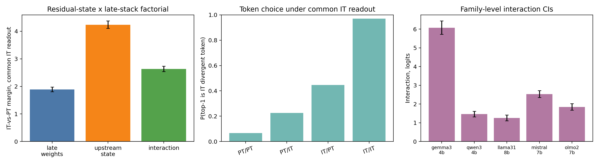
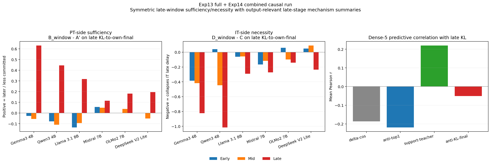

# First-Divergence Factorial Diffing for Post-Trained Language Models

### Measuring upstream-late interaction at the first PT/IT next-token disagreement

<p align="center">
  
  
  

</p>

> **TL;DR** &mdash; The current paper centers on **first-divergence factorial diffing**. At the first shared-history token where a pretrained checkpoint and its post-trained descendant prefer different next tokens, we cross upstream residual state with downstream late stack and measure the divergent-token margin. Across five dense PT/IT families, the same IT late stack has a much larger effect from IT-shaped upstream state than from PT-shaped upstream state. Convergence-gap curves, matched-prefix graft/swap, MLP write-out, and behavior are supporting context rather than the headline.



*Figure 1. Current paper headline: residual-state x late-stack factorial at first-divergence prefixes. The inference target is the upstream-late interaction on the IT-vs-PT divergent-token margin, conditional on the five released dense PT/IT checkpoint pairs.*

---

## Start Here

If you are new to the repo, these are the most useful entrypoints:

- [docs/EXPERIMENT_REGISTRY.md](docs/EXPERIMENT_REGISTRY.md): canonical experiment map and path conventions
- [scripts/README.md](scripts/README.md): grouped script layout and common commands
- `uv run python scripts/infra/repo_doctor.py`: lightweight repo health check
- [paper_draft/PAPER_DRAFT_v23.md](paper_draft/PAPER_DRAFT_v23.md): current paper framing, including the reproducibility and artifact map

The repo has been reorganized into descriptive canonical paths:

- experiment code: `src/poc/exp##_descriptive_name/`
- results: `results/exp##_descriptive_name/`
- scripts: `scripts/run/`, `scripts/plot/`, `scripts/analysis/`, `scripts/infra/`, etc.

A few flat script aliases are still kept where practical, but results now live only under the descriptive canonical paths.

### Reproducibility artifacts

For double-blind review, the manuscript should point to the anonymized artifact archive rather than this development checkout. Paper-facing summaries and plots are committed under `results/`, including JSON/CSV/MD tables, bootstrap intervals, human-evaluation summaries, and final figures for the main claims. Reviewers can mechanically check the headline numbers with `bash scripts/reproduce/reproduce_claims_from_summaries.sh`; raw or cached shard validation is routed through `bash scripts/reproduce/reproduce_minimal.sh`. Large regenerated intermediates such as raw activation arrays, model/probe tensors, tuned-lens checkpoints, and multi-gigabyte raw per-token traces stay out of git, with scripts, prompt datasets, archive pointers, and the reproducibility guide in [REPRODUCIBILITY.md](REPRODUCIBILITY.md).

---

## Current Status

The current paper-facing story is best understood in three layers:

| Layer | Best current claim | Main evidence |
|---|---|---|
| Primary estimand | Late-stack effects are non-additive with upstream residual state at first PT/IT disagreement | `exp23` residual-state x late-stack factorial + label-swap null |
| Supporting decomposition | Middle-positioned substitutions transfer token identity more often; late-positioned substitutions affect margin/readout more | `exp20` first-divergence identity/margin + `exp21` MLP write-out |
| Layerwise context | IT checkpoints show delayed stabilization, motivating late-window interventions | `exp09`, `exp11`, `exp14`, `exp16`, `exp19`, `exp22` |

What is strongest right now:

- first-divergence 2x2 interaction: common-IT interaction `+2.64` logits over five dense families, positive in every family and `+1.77` without Gemma
- label-swap null and prompt/position/domain stratifications showing that the interaction is PT/IT-label aligned and not only an immediate-token artifact
- content/reasoning extension where the interaction remains positive while the PT-upstream late-only term flips negative, strengthening the "conditional, not portable" interpretation
- non-pooled external checks: Qwen2.5-32B preserves the interaction at larger scale, and an OLMo-2 Base/SFT/DPO/Instruct case study shows positive local transition interactions with the strongest adjacent signal at Base→SFT
- identity/margin decomposition: middle-positioned windows transfer token identity more often, while late-positioned windows supply stronger margin/readout pressure
- delayed-stabilization and matched random late-MLP controls as supporting layerwise context

What remains intentionally careful:

- the main paper pools five dense 4B-8B families; DeepSeek-V2-Lite is an MoE side case only
- first-divergence prefixes are selected natural disagreement events, strongest in early response formation, not random token positions
- causal language refers to measured effects in constructed hybrid forward passes, not complete natural-model circuit recovery
- `KL(layer || own final)` is useful layerwise context but endpoint-relative and no longer the headline causal claim



*Figure 2. Supporting matched-prefix graft/swap context. These older paper-facing plots localize late-window leverage on delayed stabilization; the current headline result is the first-divergence factorial above.*

---

## Quickstart

### Setup

```bash
git clone <repo> && cd structral-semantic-features
uv sync
```

### Sanity-check the repo

```bash
uv run python scripts/infra/repo_doctor.py
```

Optional:

```bash
uv run python scripts/infra/repo_doctor.py --pytest
```

### Explore the main runnable entrypoints

```bash
# Canonical exp14 matched-prefix causal runner
uv run python -m src.poc.exp14_symmetric_matched_prefix_causality --help

# Canonical exp16 matched-prefix native-JS replay runner
uv run python -m src.poc.exp16_matched_prefix_js_gap --help

# Canonical exp15 free-running behavioral runner
uv run python -m src.poc.exp15_symmetric_behavioral_causality --help

# Local smoke for the exp13+14 causal stack
bash scripts/run/run_exp13_exp14_local.sh --mode smoke --model gemma3_4b --smoke-prompts 8
```

### Common analysis / plotting commands

```bash
# Current cross-model observational figures
uv run python -m src.poc.exp09_cross_model_observational_replication.plot_replication

# Late-stage support diagnostics
uv run python scripts/analysis/analyze_exp13a_lite.py --help
uv run python scripts/plot/plot_exp13a_lite.py --help

# Matched-prefix late-window localization plots
uv run python scripts/analysis/analyze_exp13_full.py --help
uv run python scripts/plot/plot_exp13_full.py --help

# Exp16 native-JS replay analysis + plots
uv run python scripts/analysis/analyze_exp16.py --help
uv run python scripts/plot/plot_exp16.py --help
```

### Canonical run scripts

```bash
# Multi-model steering / phase 0
bash scripts/run/run_phase0_multimodel.sh --step precompute
bash scripts/run/run_phase0_multimodel.sh --step steer

# Matched-prefix local causal campaign
bash scripts/run/run_exp13_exp14_local.sh --mode full

# Exp16 local JS replay over the frozen exp14 teacher stream
bash scripts/run/run_exp16_js_replay_local.sh --mode smoke
```

---

## Models

| Model | Layers | d_model | Architecture | Pretraining / Post-training |
|-------|--------|---------|-------------|-----------------------------|
| **Gemma 3 4B** (primary) | 34 | 2560 | GQA, hybrid local/global (5:1) | Undisclosed pretraining / KD + supervised + preference + rule-based stages |
| **Llama 3.1 8B** | 32 | 4096 | GQA, all global | 15T-token pretraining / iterative supervised + preference optimization |
| **Qwen 3 4B** | 36 | 2560 | GQA, all global | 36T-token multilingual pretraining / multi-stage SFT + RL post-training |
| **Mistral 7B v0.3** | 32 | 4096 | GQA, sliding window (4096) | Undisclosed pretraining / instruct checkpoint |
| **DeepSeek-V2-Lite** | 27 | 2048 | MLA, MoE (2 shared + 64 routed, top-6) | 5.7T-token pretraining / **SFT-only** chat checkpoint |
| **OLMo 2 7B** | 32 | 4096 | MHA, all global | `OLMo-mix-1124` pretraining / T&uuml;lu 3-style SFT + DPO + RLVR |

OLMo 2 uses a staged base-model recipe with a late `Dolmino-mix-1124` curriculum, so the earlier single-dataset shorthand is inaccurate for this checkpoint. DeepSeek-V2-Lite-Chat is both the only MoE family here and an SFT-only chat checkpoint, so we treat it as a post-training outlier rather than as evidence for the dense-family main claim.

All main observational analyses use each IT model's native chat template and raw prompting for PT. Template-free conditions are treated as ablations rather than replacement primaries.

---

## Project structure

```
src/poc/
  cross_model/                                   # Shared multi-model infrastructure
  exp01_hierarchical_distributional_narrowing/
  exp02_ic_ooc_reasoning_mechanistic_comparison/
  exp03_corrective_stage_characterization/
  exp04_phase_transition_characterization/
  exp05_corrective_direction_ablation_cartography/
  exp06_corrective_direction_steering/
  exp07_methodology_validation_tier0/
  exp08_multimodel_steering_phase0/
  exp09_cross_model_observational_replication/
  exp10_contrastive_activation_patching/
  exp11_matched_prefix_mlp_graft/
  exp12_free_running_abc_graft/
  exp13_late_stage_token_support_analysis/
  exp14_symmetric_matched_prefix_causality/
  exp15_symmetric_behavioral_causality/
  exp16_matched_prefix_js_gap/

scripts/
  analysis/                                      # Post-hoc summaries, cross-checks, paper stats
  data/                                          # Dataset builders / data prep
  eval/                                          # Judge and evaluation entrypoints
  infra/                                         # Modal/Lambda/cloud helpers
  merge/                                         # Worker/shard merge utilities
  plot/                                          # Figure generation
  precompute/                                    # Direction extraction and preprocessing
  run/                                           # Main experiment launchers
  scoring/                                       # Rescoring utilities

results/
  cross_model/{model}/
  exp01_hierarchical_distributional_narrowing/
  ...
  exp15_symmetric_behavioral_causality/
```

Canonical experiment/result paths now use descriptive names. Source code now lives only in the canonical named experiment folders. Some legacy result and flat script aliases are still kept during the results/scripts migration so older commands keep working.

For a full index, see [docs/EXPERIMENT_REGISTRY.md](docs/EXPERIMENT_REGISTRY.md).

---

## Broader Experiment Index

This index includes historical and supporting experiments. The current paper's main pooled claims use the five dense families; DeepSeek-V2-Lite remains a MoE side case where artifacts exist.

### Observational / Layerwise Context

| ID | Analysis | Key result |
|----|----------|------------|
| **L1** | &delta;-cosine profiles | IT adds more late residual opposition than PT in the dense-family pool, with heterogeneous magnitude and a separate MoE side case |
| **L2** | Convergence gap + delayed commitment (5 metrics &times; 2 lenses) | IT stays farther from its own final distribution through much of the stack; used as layerwise context |
| **L3** | Weight change localization | Gemma: concentrated at corrective layers; others: uniform |
| **L8** | Geometry follow-up | Exploratory dimensionality / covariance diagnostics are mixed and not part of the core evidence chain |
| **L9** | Attention entropy divergence | Architecture-dependent |

### Causal steering (Gemma, extending to all 6)

| ID | Experiment | Key result |
|----|-----------|------------|
| **A1** | &alpha;-sweep on corrective layers | Governance dose-response, content flat |
| **A1_rand** | Random direction control | 3&times; less governance effect &mdash; direction specificity |
| **A1_notmpl** | No chat template | Dose-response preserved &mdash; weight-encoded |
| **A2** | Inject into PT | Noisy &mdash; PT lacks downstream circuitry |
| **A5a** | Progressive layer skipping | Final 3 layers: format; earlier: coherence |

### Matched-prefix Internal Causality

| ID | Experiment | Key result |
|----|-----------|------------|
| **exp11** | Matched-prefix late IT MLP graft | Late IT MLPs increase late KL-to-own-final and move PT internal predictions toward the IT teacher under shared token history |
| **exp13A-lite** | Descriptive token-support analysis | Late grafts broadly suppress raw-continuation-like `FUNCTION/OTHER` candidates and increase support for the eventual teacher token |
| **exp16** | Matched-prefix native-JS replay | Direct same-layer JS under frozen exp14 teacher histories removes unmatched-history and own-final-endpoint dependence from the main internal divergence readout |
| **exp14** | Symmetric sufficiency / necessity | Late IT→PT graft is the strongest sufficiency window and late PT→IT swap is the strongest necessity window in the dense-family pool on the primary late-region KL metric |
| **exp20** | First-divergence identity/margin decomposition | Middle-positioned substitutions transfer token identity more often; late-positioned substitutions affect margin more |
| **exp21** | MLP write-out at first divergence | Late IT MLPs provide strong native IT-token support, but the MLP-only late effect is weak from PT upstream state |
| **exp23** | Residual-state x late-stack factorial | Current headline: upstream-late interaction on the divergent-token margin, with label-swap, position, subgroup, and content/reasoning checks |

### Free-running Behavioral Causality

| ID | Experiment | Key result |
|----|-----------|------------|
| **exp12** | A/B/C free-running graft comparison | Legacy behavior run: late graft reduces benign false refusals broadly and improves assistant register in several families, but remains far from the full IT endpoint on polished structure |
| **exp15** | Symmetric behavioral causality | Current canonical behavioral estimate of the same late intervention family, with the clearest effects on the IT-side necessity test and weaker but real PT-side recovery |

### Methodology validation (Tier 0)

| ID | Test | Result |
|----|------|--------|
| **0A** | Direction bootstrap stability | cos > 0.993 by n=300 |
| **0B** | Matched-token direction | cos = 0.82 (primarily weight-driven) |
| **0C** | Projection-matched random | 3&times; less governance, identical content degradation |
| **0D** | Bootstrap 95% CIs | BCa intervals on all metrics |
| **0E** | Classifier robustness | Robust to all boundary perturbations |
| **0F** | Layer range sensitivity | Stable across 4 overlapping ranges |
| **0G** | Tuned-lens commitment | Primary commitment measurement (6 models &times; 2 variants) |
| **0H** | Calibration split | Three disjoint prompt sets &rarr; same dose-response |
| **0I** | Formula comparison | MLP projection only; attention/residual fail |
| **0J** | Onset threshold sensitivity | Robust across &sigma;-based and absolute thresholds |

### Contrastive activation patching (Exp10, in progress)

| Phase | Description | Status |
|-------|-------------|--------|
| 1 | Forced-decoding paired data collection | Prototype complete |
| 2 | Ridge probes &rarr; convergence direction (d_conv) | Prototype complete |
| 3 | Causal activation patching (5 conditions) | Prototype complete |
| 4 | Steering with d_conv vs d_mean | Prototype: d_mean steers (11&ndash;19&times;), d_conv does not |

---

## Pipeline design

The steering pipeline is **architecture-agnostic**. It operates on raw MLP activations via a model-agnostic adapter system &mdash; no transcoders, SAEs, or model-specific decompositions required.

```
Direction Extraction          Steering                Evaluation
--------------------    --------------------    --------------------
IT model --+            IT model + hooks        LLM judge (G1/G2)
           |-- d_mean   h += (alpha-1)(d'h)d    Programmatic (STR)
PT model --+            per corrective layer    IFEval compliance
                                                MMLU / GSM8K / reasoning
```

The adapter system provides a uniform interface across the dense architectures plus the DeepSeek MoE side case and Gemma's hybrid attention. Extending to a new model requires only registering its architecture in the adapter config.

---

## Citation

```bibtex
@article{anonymous2026corrective,
  title={First-Divergence Factorial Diffing for Post-Trained Language Models},
  author={Anonymous},
  year={2026}
}
```

## License

See [LICENSE](LICENSE).
