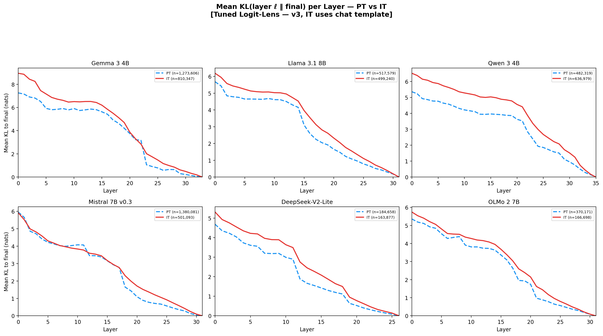

# Instruction Tuning Slows Prediction Convergence

### Late-Layer Corrective Computation Across Transformer Families

<p align="center">
  
  
  

</p>

> **TL;DR** &mdash; The current repo centers a broader story than the original Gemma-only steering result: across six transformer families, instruction tuning produces a **broad convergence gap** and delayed commitment, with the strongest mechanistic leverage concentrated in a **late MLP-centered corrective bottleneck**. The cleanest cross-model causal evidence comes from matched-prefix graft/swap experiments; free-running behavioral experiments test how much of assistant behavior those late interventions actually move.

<p align="center">
  
  <br>
  <sub><b>Figure 1.</b> &delta;-cosine profiles &mdash; cos(MLP update, residual stream) &mdash; across six model families. IT (red) opposes the residual stream more strongly than PT (blue dashed) in late layers. The effect is sustained in Gemma, DeepSeek, Mistral, and Llama; concentrated in the final layers of OLMo and Qwen.</sub>
</p>

---

## Start Here

If you are new to the repo, these are the most useful entrypoints:

- [docs/EXPERIMENT_REGISTRY.md](docs/EXPERIMENT_REGISTRY.md): canonical experiment map and path conventions
- [scripts/README.md](scripts/README.md): grouped script layout and common commands
- `uv run python scripts/infra/repo_doctor.py`: lightweight repo health check
- [paper_draft/PAPER_DRAFT_v12.md](paper_draft/PAPER_DRAFT_v12.md): current paper framing

The repo has been reorganized into descriptive canonical paths:

- experiment code: `src/poc/exp##_descriptive_name/`
- results: `results/exp##_descriptive_name/`
- scripts: `scripts/run/`, `scripts/plot/`, `scripts/analysis/`, `scripts/infra/`, etc.

Legacy flat aliases are still kept where practical so older one-liners and notes do not break.

---

## Current Status

The current paper-facing story is best understood in three layers:

| Layer | Best current claim | Main evidence |
|---|---|---|
| Observational | Instruction tuning creates a broad convergence-gap signature under native decoding | `exp09` cross-model PT/IT analyses |
| Internal causal | The strongest cross-model mechanistic leverage is late-centered and MLP-heavy | `exp11` matched-prefix grafts + `exp14` symmetric sufficiency/necessity |
| Behavioral | The same late intervention family moves a real but partial slice of assistant behavior | `exp12` free-running A/B/C, with `exp15` as the next symmetric behavioral phase |

What is strongest right now:

- broad IT-vs-PT convergence gap and delayed commitment across 6 families
- late-layer added correction / opposition as a geometric companion, with architecture-dependent magnitude
- Gemma steering as the cleanest single-direction causal case
- matched-prefix graft/swap as the cleanest cross-model internal causal case
- `exp13A-lite` as a descriptive clarification that the late stage is broader than a formatting-token story

What remains intentionally careful:

- the free-running six-family observational curves are descriptive, not matched-history estimates
- `KL(layer || own final)` is useful but endpoint-sensitive
- late IT MLPs are a **bottleneck inside a broader circuit**, not a full assistantness module

<p align="center">
  
  <br>
  <sub><b>Figure 2.</b> Tuned-lens KL-to-own-final curves from the main cross-family observational suite. IT (red) remains farther from its own final distribution than PT (blue dashed) through much of the stack.</sub>
</p>

---

## Quickstart

### Setup

```bash
git clone <repo> && cd structral-semantic-features
uv sync
```

### Sanity-check the repo

```bash
uv run python scripts/infra/repo_doctor.py
```

Optional:

```bash
uv run python scripts/infra/repo_doctor.py --pytest
```

### Explore the main runnable entrypoints

```bash
# Canonical exp14 matched-prefix causal runner
uv run python -m src.poc.exp14_symmetric_matched_prefix_causality --help

# Canonical exp15 free-running behavioral runner
uv run python -m src.poc.exp15_symmetric_behavioral_causality --help

# Local smoke for the exp13+14 causal stack
bash scripts/run/run_exp13_exp14_local.sh --mode smoke --model gemma3_4b --smoke-prompts 8
```

### Common analysis / plotting commands

```bash
# Current cross-model observational figures
uv run python -m src.poc.exp09_cross_model_observational_replication.plot_replication

# Exp13A-lite analysis + plots
uv run python scripts/analysis/analyze_exp13a_lite.py --help
uv run python scripts/plot/plot_exp13a_lite.py --help

# Exp13 full + Exp14 causal summary plots
uv run python scripts/analysis/analyze_exp13_full.py --help
uv run python scripts/plot/plot_exp13_full.py --help
```

### Canonical run scripts

```bash
# Multi-model steering / phase 0
bash scripts/run/run_phase0_multimodel.sh --step precompute
bash scripts/run/run_phase0_multimodel.sh --step steer

# Exp13 + Exp14 local causal campaign
bash scripts/run/run_exp13_exp14_local.sh --mode full
```

---

## Models

| Model | Layers | d_model | Architecture | Post-training |
|-------|--------|---------|-------------|---------------|
| **Gemma 3 4B** (primary) | 34 | 2560 | GQA, hybrid local/global (5:1) | KD + supervised / preference / rule-based stages |
| **Llama 3.1 8B** | 32 | 4096 | GQA, all global | Iterative supervised + preference optimization |
| **Qwen 3 4B** | 36 | 2560 | GQA, all global | Multi-stage SFT / RL post-training |
| **Mistral 7B v0.3** | 32 | 4096 | GQA, sliding window (4096) | Instruct checkpoint |
| **DeepSeek-V2-Lite** | 27 | 2048 | MLA, MoE (2 shared + 64 routed, top-6) | Chat checkpoint / GRPO-style post-training |
| **OLMo 2 7B** | 32 | 4096 | MHA, all global | SFT + DPO + RLVR (T&uuml;lu 3) |

All main observational analyses use each IT model's native chat template and raw prompting for PT. Template-free conditions are treated as ablations rather than replacement primaries.

---

## Project structure

```
src/poc/
  cross_model/                                   # Shared multi-model infrastructure
  exp01_hierarchical_distributional_narrowing/
  exp02_ic_ooc_reasoning_mechanistic_comparison/
  exp03_corrective_stage_characterization/
  exp04_phase_transition_characterization/
  exp05_corrective_direction_ablation_cartography/
  exp06_corrective_direction_steering/
  exp07_methodology_validation_tier0/
  exp08_multimodel_steering_phase0/
  exp09_cross_model_observational_replication/
  exp10_contrastive_activation_patching/
  exp11_matched_prefix_mlp_graft/
  exp12_free_running_abc_graft/
  exp13_late_stage_token_support_analysis/
  exp14_symmetric_matched_prefix_causality/
  exp15_symmetric_behavioral_causality/

scripts/
  analysis/                                      # Post-hoc summaries, cross-checks, paper stats
  data/                                          # Dataset builders / data prep
  eval/                                          # Judge and evaluation entrypoints
  infra/                                         # Modal/Lambda/cloud helpers
  merge/                                         # Worker/shard merge utilities
  plot/                                          # Figure generation
  precompute/                                    # Direction extraction and preprocessing
  run/                                           # Main experiment launchers
  scoring/                                       # Rescoring utilities

results/
  cross_model/{model}/
  exp01_hierarchical_distributional_narrowing/
  ...
  exp15_symmetric_behavioral_causality/
```

Canonical experiment/result paths now use descriptive names. Source code now lives only in the canonical named experiment folders. Some legacy result and flat script aliases are still kept during the results/scripts migration so older commands keep working.

For a full index, see [docs/EXPERIMENT_REGISTRY.md](docs/EXPERIMENT_REGISTRY.md).

---

## Experiment index

### Observational (cross-model, 6/6)

| ID | Analysis | Key result |
|----|----------|------------|
| **L1** | &delta;-cosine profiles | IT opposes residual stream more in late layers (6/6, &minus;0.021 to &minus;0.269) |
| **L2** | Commitment delay (5 metrics &times; 2 lenses) | IT commits 1&ndash;6 layers later (6/6) |
| **L3** | Weight change localization | Gemma: concentrated at corrective layers; others: uniform |
| **L8** | Intrinsic dimensionality (TwoNN) | IT +1.3 to +4.7 dimensions in late layers (6/6) |
| **L9** | Attention entropy divergence | Architecture-dependent |

### Causal steering (Gemma, extending to all 6)

| ID | Experiment | Key result |
|----|-----------|------------|
| **A1** | &alpha;-sweep on corrective layers | Governance dose-response, content flat |
| **A1_rand** | Random direction control | 3&times; less governance effect &mdash; direction specificity |
| **A1_notmpl** | No chat template | Dose-response preserved &mdash; weight-encoded |
| **A2** | Inject into PT | Noisy &mdash; PT lacks downstream circuitry |
| **A5a** | Progressive layer skipping | Final 3 layers: format; earlier: coherence |

### Methodology validation (Tier 0)

| ID | Test | Result |
|----|------|--------|
| **0A** | Direction bootstrap stability | cos > 0.993 by n=300 |
| **0B** | Matched-token direction | cos = 0.82 (primarily weight-driven) |
| **0C** | Projection-matched random | 3&times; less governance, identical content degradation |
| **0D** | Bootstrap 95% CIs | BCa intervals on all metrics |
| **0E** | Classifier robustness | Robust to all boundary perturbations |
| **0F** | Layer range sensitivity | Stable across 4 overlapping ranges |
| **0G** | Tuned-lens commitment | Primary commitment measurement (6 models &times; 2 variants) |
| **0H** | Calibration split | Three disjoint prompt sets &rarr; same dose-response |
| **0I** | Formula comparison | MLP projection only; attention/residual fail |
| **0J** | Onset threshold sensitivity | Robust across &sigma;-based and absolute thresholds |

### Contrastive activation patching (Exp10, in progress)

| Phase | Description | Status |
|-------|-------------|--------|
| 1 | Forced-decoding paired data collection | Prototype complete |
| 2 | Ridge probes &rarr; convergence direction (d_conv) | Prototype complete |
| 3 | Causal activation patching (5 conditions) | Prototype complete |
| 4 | Steering with d_conv vs d_mean | Prototype: d_mean steers (11&ndash;19&times;), d_conv does not |

---

## Pipeline design

The steering pipeline is **architecture-agnostic**. It operates on raw MLP activations via a model-agnostic adapter system &mdash; no transcoders, SAEs, or model-specific decompositions required.

```
Direction Extraction          Steering                Evaluation
--------------------    --------------------    --------------------
IT model --+            IT model + hooks        LLM judge (G1/G2)
           |-- d_mean   h += (alpha-1)(d'h)d    Programmatic (STR)
PT model --+            per corrective layer    IFEval compliance
                                                MMLU / GSM8K / reasoning
```

The adapter system provides a uniform interface across all six architectures, including DeepSeek's MoE routing and Gemma's hybrid attention. Extending to a new model requires only registering its architecture in the adapter config.

---

## Citation

```bibtex
@article{anonymous2026corrective,
  title={Instruction Tuning Slows Prediction Convergence: Late-Layer Corrective Computation Across Transformer Families},
  author={Anonymous},
  year={2026}
}
```

## License

See [LICENSE](LICENSE).
