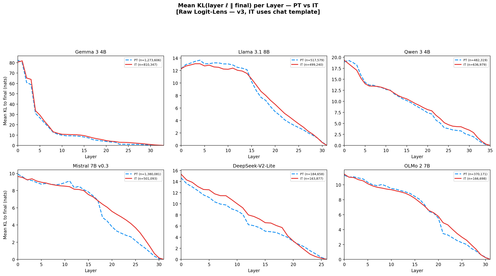
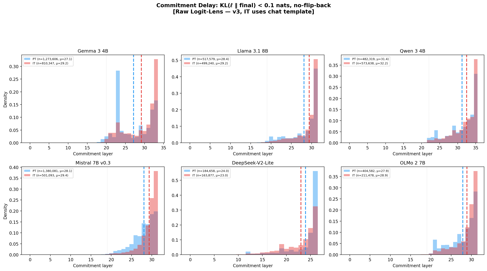
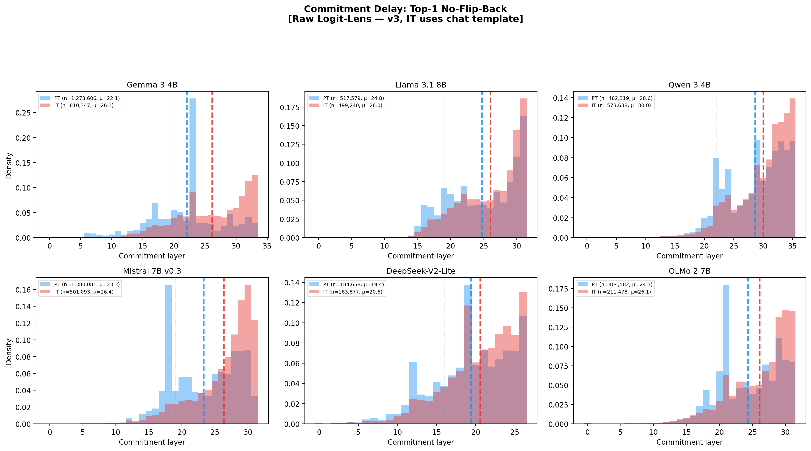
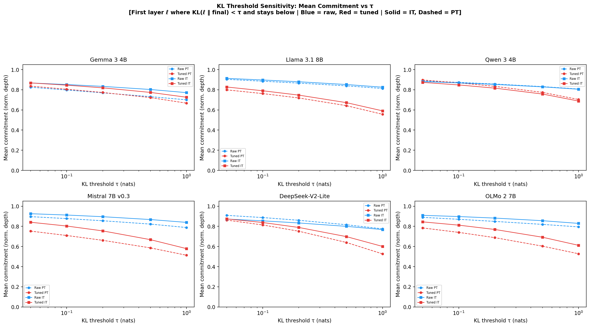
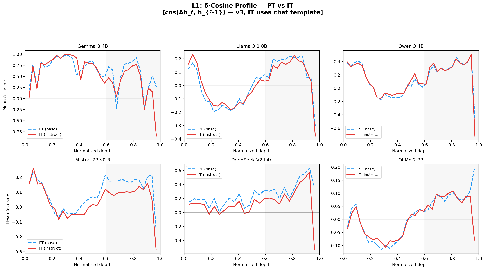

# Instruction Tuning Creates a Broad Convergence Gap: A Late-Centered Corrective Computation Across Transformer Families

**Anonymous authors** | NeurIPS 2026 Submission

---

## Abstract

What does instruction tuning change inside a transformer's forward pass? We compare pretrained (PT) and instruction-tuned (IT) model variants across six architectures — Gemma 3 4B, Llama 3.1 8B, Qwen 3 4B, Mistral 7B, DeepSeek-V2-Lite, and OLMo 2 7B — and identify a robust cross-family observational signature under native decoding: **instruction tuning creates a broad convergence gap and delayed commitment in intermediate-layer predictions**. In all six families, IT models remain farther from their own final output distribution than PT models do for much of the forward pass, measured via both tuned and raw logit lenses. Under the tuned lens, mean KL-to-final excess is positive in all six families in the early, middle, and late thirds of the network on pooled average (+0.62, +0.56, and +0.30 nats), and IT stays above PT in 13–17 of 14–18 late-half layers per family; under the raw lens, the same qualitative pattern holds in five families and on late-half average in all six, with DeepSeek showing a final-layer crossover. The later threshold crossing of that broader trajectory appears as commitment delay, which is robust across five independent convergence metrics — threshold-free top-1 commitment, KL-threshold commitment, no-flip-back stability, majority-vote commitment, and continuous convergence gap — with no family showing IT committing earlier than PT under any metric or lens. The gap scales with prediction difficulty: high-confidence tokens show minimal excess KL while low-confidence tokens show the largest delay (+6.6 layers in Gemma under the supporting thresholded metric). We then show that this broad gap has a consistent but more localized *geometric companion*: stronger late-layer MLP opposition to the accumulated residual stream. Negative δ-cosine is already present in late PT layers (consistent with residual sharpening), but IT makes those late updates more counter-aligned with the accumulated residual in all six families across the final 20% of layers (δ-cosine shift −0.021 to −0.269). This geometric shift is much more late-concentrated than the KL gap itself: pooled IT−PT δ-cosine shift is near zero early (−0.007), modest in the middle (−0.023), and strongest late (−0.086; final 20%: −0.108). The size and spatial extent of this mechanism vary substantially — strong and sustained in Gemma/DeepSeek/Mistral, weak or terminal-layer-concentrated in OLMo/Qwen/Llama — so we treat the IT-vs-PT *increase* in late opposition, not negative δ-cosine by itself, as the geometric signature. The convergence gap is universal as a model-in-use observational pattern; its geometric implementation is architecture-dependent and late-centered rather than late-exclusive. Using an adapter-based extraction pipeline that can be instantiated across architectures, we establish the strongest single-direction causal bridge between the convergence gap and behavior in Gemma 3 4B: removing the dominant IT–PT MLP activation difference at late layers simultaneously speeds prediction convergence (IT's convergence profile moves toward PT's) and produces clean dose-response degradation of four formatting metrics, while content benchmarks remain at baseline levels within a bounded intervention range. The effect is layer-specific, direction-specific (a projection-magnitude-matched random vector produces 3× less governance modulation while producing identical content degradation), MLP-specific (attention carries no signal; residual-stream intervention is catastrophically destructive), and weight-encoded (persisting even without chat template). A complementary matched-prefix graft/swap program then provides the cleaner cross-model internal-mechanism test for late MLPs. Late IT MLP grafting under matched token history increases late KL-to-own-final in all five dense families (+0.12 to +0.58 nats in the final 20% of layers) and in a separate concordant DeepSeek-V2-Lite MoE case (+0.20), while a mirrored PT-into-IT late swap most strongly collapses the same late-region delay in all six families. Equal-width depth ablations show that this is not just an endpoint artifact: early and middle interventions can perturb local dynamics and often move predictions toward the teacher, yet they do not recreate the delayed-convergence signature, whereas the late window is strongest on the primary late-region KL metric and the auxiliary late-geometry readouts on dense-family average. A separate free-running A/B/C comparison shows that the same late-MLP graft changes outputs in a governance-relevant direction: it reduces false refusals on benign prompts in 6/6 families and improves assistant-register judgments in 4/6, while remaining far from the full IT endpoint on polished structure — a *precision finding* rather than a weakness, showing that late MLPs mediate a specific component (anti-raw-continuation / anti-false-refusal) of assistant behavior rather than the full assistant phenotype. Finally, no-new-compute descriptive analyses of the matched-prefix runs show that this late stage is not a narrow formatting-token injector: across the dense-family pool it mainly suppresses raw-continuation-like `FUNCTION/OTHER` candidates and broadly increases support for the eventual teacher token, with a real but secondary formatting/discourse component. A fuller output-relevant mechanism analysis then refines the geometric story: summaries tied to teacher-token support and the current top candidate modestly outperform δ-cosine alone as predictors of late KL shifts, suggesting that the late computation is better described as broad teacher support plus anti-premature-commitment than as residual opposition alone. Taken together, these results document a broad convergence-gap signature as a universal consequence of instruction tuning under native decoding, localize the strongest mechanistic leverage to a late-layer MLP-centered corrective computation under matched prefix, and show that this computation is a core bottleneck within a broader assistant-behavior circuit rather than a fully self-contained module.

---

## 1. Introduction

Large language models acquire broad capabilities during pretraining but require instruction tuning — supervised fine-tuning (SFT) and reinforcement learning from human feedback (RLHF), including direct preference optimization (DPO; Rafailov et al., 2023) — to become useful assistants. The resulting models produce well-formatted, helpful, and safer responses. But *how* does instruction tuning accomplish this inside the model's forward pass?

Several fragments of the answer exist. On the prediction-dynamics side, the logit lens (nostalgebraist, 2020) and its learned refinement, the tuned lens (Belrose et al., 2023), revealed that transformers converge progressively toward their final prediction across layers, with later layers providing monotonic refinement. Lad et al. (2024) characterized inference as four computational stages — detokenization, feature engineering, prediction ensembling, and residual sharpening — and showed remarkable robustness to middle-layer deletion. Most directly relevant to us, Joshi et al. (2025) showed that LLMs undergo a distinct *confidence correction phase* in upper layers — adjusting certainty *after* accuracy has stabilized — suggesting late-layer computation serves a calibration function independent of content processing. These results characterize convergence dynamics in pretrained models but do not ask whether instruction tuning systematically alters those dynamics. On the behavioral side, Arditi et al. (2024) showed that refusal behavior concentrates into a single direction in activation space. Li et al. (2025) identified contiguous "safety layers" whose preservation during fine-tuning is critical for maintaining alignment. Lu et al. (2026) identified an "Assistant Axis" — the leading principal component of persona variation — that generalizes across model families. Lin et al. (2024) demonstrated that much of alignment is stylistic, reproducible through in-context learning alone. Wu et al. (2024) showed that instruction tuning systematically reshapes internal attention and FFN representations. Chaudhury (2025) found alignment effects concentrate in a narrow band of mid-stack layers.

These findings locate individual phenomena, but they do not tell us whether instruction tuning systematically changes *when and how* the forward pass commits to its final prediction, or whether that reshaping is architecturally universal. We address this gap through systematic *model diffing*: layer-by-layer comparison of pretrained and instruction-tuned variants across six model families, using logit-lens and tuned-lens prediction convergence trajectories as our primary probe, residual-stream geometry (δ-cosine) as the mechanistic companion, and matched-prefix MLP grafting plus single-direction steering as our causal interventions. The central phenomenon we report — a broad IT-vs-PT convergence gap whose later threshold crossing appears as commitment delay — sits downstream of Joshi et al.'s confidence-correction observation and extends it: instruction tuning does not merely recalibrate confidence at the final layer; it keeps intermediate predictions farther from their eventual output for longer, and does so in a way that is causally connected to governance-relevant behavior.

One interpretation we will return to is *endpoint-sensitive* rather than backward-causal. Our main observational metric compares each layer to the model's own final distribution. If post-training installs a stronger late output-governing or anti-premature-commitment computation, then the IT endpoint itself is more strongly reshaped near the end of the stack. Earlier IT layers can therefore appear farther from their own final output than PT layers do, even without claiming that late layers literally cause the earlier hidden states. This view predicts a broad whole-trajectory gap together with privileged late-layer leverage, while still leaving room for distributed upstream changes that prepare the incoming state for the late correction.

We report three findings that build on each other. Throughout, we use *late corrective stage* operationally rather than definitionally: the late-layer regime in which the broad convergence gap remains behaviorally consequential, late MLP updates more strongly redirect the residual stream, and interventions on those late updates measurably change governance-relevant behavior.

**Finding 1 (the cross-family observational signature): Under native free-running decoding, instruction tuning creates a broad convergence gap at intermediate layers across all six architectures.** In all six model families — spanning hybrid local/global attention (Gemma), uniform global attention (Llama, Qwen, OLMo), sliding window (Mistral), and MoE with multi-latent attention (DeepSeek) — IT's intermediate predictions remain further from their final output distribution than PT's for much of the stack. We measure this gap through five complementary metrics — threshold-free top-1 commitment, KL-threshold commitment, no-flip-back stability, majority-vote convergence, and continuous convergence gap — each computed under both the tuned logit lens (Belrose et al., 2023) and the raw logit lens. Under the tuned lens, mean KL-to-final is higher for IT in 13–17 of 14–18 late-half layers per family, and the pooled tuned-lens IT−PT gap remains positive in the early, middle, and late thirds of the network (+0.62, +0.56, and +0.30 nats respectively). Under the raw lens, the same pattern holds in five families and on late-half average in all six. No family under any metric or lens shows IT committing *earlier* than PT. Commitment delay is the sharpest discrete summary of that broader trajectory difference, and it scales with prediction difficulty: in Gemma, high-confidence tokens show +2.2 layers of commitment delay while low-confidence tokens show +6.6 layers (§3.1). Because these six-family PT/IT comparisons are aggregated over free-running continuations, we interpret them as descriptive model-in-use evidence rather than as fully history-matched causal identification.

**Finding 2 (the geometric mechanism): The broad convergence gap is accompanied by stronger late-layer MLP opposition to the accumulated residual, with directionally consistent but architecturally heterogeneous magnitude.** In all six families, IT's late-layer MLP updates have more negative cosine similarity with the accumulated residual stream than PT's (δ-cosine shift −0.021 to −0.269 in the final 20% of layers). This geometric shift is more localized than the KL gap itself: pooled IT−PT δ-cosine shift is near zero in the early third (−0.007), modest in the middle third (−0.023), and strongest late (−0.086). Negative δ-cosine itself is not unique to IT — late PT layers also show it, consistent with residual sharpening — so our claim is about the additional IT-vs-PT shift, not about the mere existence of negative δ-cosine. Unlike the convergence gap, the size and spatial support of this shift vary substantially across families: in Gemma, DeepSeek, and Mistral the shift is sustained across the late-layer range; in Llama it is small; in OLMo and Qwen it concentrates in the final 1–2 layers. The broad convergence gap is therefore the universal functional signature; the late-MLP opposition is its strongest geometric implementation, whose intensity and spatial extent differ by architecture (§3.2). Exploratory dimensionality diagnostics remain secondary: a covariance-spectrum follow-up on the same L8 residual matrices is mixed rather than uniformly larger in IT (§4.1), so we do not use dimensionality as part of the main evidence chain.

**Finding 3 (the causal bridge): Modulating the late-layer computation simultaneously modulates convergence speed and governance-relevant behavior; the bridge is depth-specific, late-centered, and only partially behaviorally sufficient.** We demonstrate the bridge in four layers. *In Gemma 3 4B*, we extract the dominant IT–PT MLP activation difference at corrective layers and show that modulating this single direction simultaneously (i) shifts IT's convergence profile continuously toward PT's (α = 0 approximately matches PT's KL-to-final curve) and (ii) produces clean dose-response on four formatting metrics while content benchmarks remain flat. The effect is layer-specific, direction-specific (a magnitude-matched random vector produces 3× less governance modulation while producing identical content degradation), MLP-specific (attention carries no corrective signal; residual-stream intervention is catastrophically destructive), and weight-encoded (persists without the chat template). This establishes convergence speed and governance behavior as *co-modulated readouts of the same computation* (§3.3.1–§3.3.8). *Across five dense families plus a concordant DeepSeek MoE case*, a matched-prefix MLP graft ablation transplants late IT MLP weights into a PT backbone under teacher-forced token histories: it increases late KL-to-own-final in 5/5 dense families and reduces cross-KL to the IT teacher in 5/5, while an equal-width depth ablation shows something stronger than a simple endpoint effect — early and middle grafts can still perturb local dynamics and often move PT toward the IT teacher, but only the late graft consistently recreates the late delayed-convergence signature (§3.3.9). *A final symmetric matched-prefix follow-up strengthens this into a necessity-and-sufficiency result:* the late IT→PT graft is the strongest sufficiency window and the mirrored late PT→IT swap is the strongest necessity window in all six models on the primary late-region KL metric, while output-relevant late-stage summaries tied to teacher-token support and the current top candidate modestly outperform δ-cosine alone as predictors of the late KL shift (§3.3.12). *Behaviorally, across all six families*, a free-running A/B/C evaluation shows the same late graft changes actual outputs in the IT direction: it reduces benign false refusals in 6/6 families (closing ~50% of the A→C gap) and improves assistant-register judgments in 4/6, while closing only 3.8% of the polished-structure gap. We interpret this as a *precision finding*: late IT MLPs specifically mediate anti-raw-continuation and anti-false-refusal behavior, but polished assistant structure depends on upstream circuit components not captured by the late-MLP graft (§3.3.10). A descriptive token-type analysis reinforces this: the late stage mainly suppresses raw-continuation-like `FUNCTION/OTHER` candidates and broadly increases support for the eventual teacher token, with a real but secondary formatting/discourse component (§3.3.11). Preliminary multi-model directional steering pilots are heterogeneous, so we do not use them as the main cross-model causal argument. Our extraction pipeline remains implementation-level architecture-agnostic — it operates on raw MLP activations via a model-agnostic adapter system and does not require interpretability dictionaries (transcoders, SAEs) or model-specific decompositions.

The cross-model evidence spans fundamentally different pretraining corpora (5.7T to 36T tokens), architectures (hybrid local/global, sliding window, MLA/MoE, all-global MHA), post-training recipes (KD, iterative DPO, SFT-only, GRPO, RLVR), and sizes (4B–8B). The broad convergence gap is universal across all six families under five metrics and two lenses in our native free-running evaluation. Its geometric implementation via stronger late MLP opposition is directionally consistent across all six families, but its magnitude and spatial extent vary substantially — from strong sustained shifts in Gemma and DeepSeek to weak, final-layer-concentrated shifts in Qwen and OLMo. This asymmetry — universal functional signature, heterogeneous geometric implementation — is itself informative: it argues for the convergence gap as the primary invariant and for the late-MLP opposition as one dominant mechanism by which it is realized in practice, rather than as the defining feature of the phenomenon.

Our findings provide a candidate architectural locus for several previously disconnected observations: refusal directions (Arditi et al., 2024), safety layers (Li et al., 2025), the alignment tax (Ouyang et al., 2022), the Assistant Axis (Lu et al., 2026), DoLA's contrastive decoding gains (Chuang et al., 2024), and the late-layer confidence correction identified by Joshi et al. (2025). We discuss these connections and their implications — including whether the convergence gap could be explicitly optimized during training — in §4–5.

---

## 2. Setup

### 2.1 Models

 For cross-model validation, we compare PT/IT pairs across five additional families:

| Model | Layers | d_model | Attention | Pre-training data | Post-training |
|---|---|---|---|---|---|
| Gemma 3 4B (primary) | 34 | 2560 | GQA, hybrid local/global (5:1) | Undisclosed | Publicly described multi-stage post-training (KD + supervised / preference / rule-based stages) |
| Llama 3.1 8B | 32 | 4096 | GQA, all global | 15T tokens | Iterative supervised + preference optimization |
| Qwen 3 4B | 36 | 2560 | GQA, all global | 36T tokens, 119 langs | Publicly documented multi-stage post-training |
| Mistral 7B v0.3 | 32 | 4096 | GQA, sliding window (4096) | Undisclosed | Instruct checkpoint; detailed recipe undisclosed |
| DeepSeek-V2-Lite | 27 | 2048 | MLA, MoE (2 shared + 64 routed, top-6) | 5.7T tokens | Chat checkpoint; exact released recipe only partially documented |
| OLMo 2 7B | 32 | 4096 | MHA, all global | Dolma v1.7, open | SFT + DPO + RLVR (Tülu 3) |

This set spans fundamentally different pretraining regimes — from 5.7T tokens (DeepSeek) to 36T tokens (Qwen), open data (OLMo/Dolma) to proprietary corpora (Gemma, Mistral), monolingual-heavy (DeepSeek: English + Chinese) to massively multilingual (Qwen: 119 languages). Architecturally, it spans hybrid local/global attention (Gemma), uniform global attention (Llama, Qwen, OLMo), sliding window (Mistral), and mixture-of-experts with multi-latent attention and compressed KV (DeepSeek). Their post-training pipelines are also diverse, but not equally well documented. We therefore use these recipe labels as high-level provenance, not as precise causal descriptors of the phenomena we measure.

**What the cross-model evidence shows — and what it does not.** We claim that a broad convergence gap is universal in our six-family suite. The IT-vs-PT increase in late-layer corrective opposition is directionally consistent across all six families, but highly heterogeneous in magnitude and spatial extent — from strong sustained shifts and large commitment delays in Gemma and DeepSeek to weaker, terminal-layer-concentrated effects in Qwen and OLMo. Dimensionality diagnostics are more tentative: earlier local-ID estimates suggested less-collapsed late IT states, but a covariance-spectrum follow-up on the same L8 residual matrices is mixed rather than uniformly larger in IT. We therefore do *not* use dimensionality expansion as a core claim. More broadly, we do *not* claim to have controlled for every confound. The training-recipe descriptions above are necessarily incomplete — Gemma and Mistral have not published full post-training details, and even published recipes omit implementation choices that could matter. Just as importantly, the headline six-family PT/IT curves are free-running model-in-use comparisons: once PT and IT continuations diverge, later token positions are no longer matched histories. What the cross-model evidence therefore establishes on its own is a recurrent observational signature with informative variation in strength that constrains mechanistic hypotheses, not a fully history-controlled causal estimate. Later matched-prefix graft results on five dense families, plus a concordant but separately reported DeepSeek MoE case, are the cleaner cross-model test that late IT MLP weights are sufficient to recreate part of this convergence signature under controlled token history (§3.3.9).

**OLMo checkpoint compatibility.** AllenAI disclosed that the initial OLMo 2 post-trained releases (preview versions) did not share the pre-tokenization logic of the base model. They subsequently retrained the post-trained models to fix this mismatch. We use the non-preview, retrained checkpoints (`allenai/OLMo-2-1124-7B` and `allenai/OLMo-2-1124-7B-Instruct`), which share compatible tokenization. We verified that the tokenizer vocabulary and special token IDs are identical between PT and IT variants.

**Chat-template evaluation.** All cross-model experiments apply each model family's native chat template to IT variants, while PT variants receive raw text (since PT models have no chat template). This reflects each model's trained distribution: IT models were fine-tuned with chat-template-wrapped inputs, so evaluating them with their template is the natural choice. We agree, however, that native PT/IT prompting does not by itself eliminate input-format asymmetry. We therefore treat the headline PT/IT observational comparison as an in-distribution "model-in-use" comparison rather than as a fully isolated causal design. We validate template robustness through a comprehensive template ablation on Gemma (§3.3.6), showing that the corrective stage signature persists even when the chat template is removed — the corrective computation is weight-encoded and does not depend on input formatting. This template-free condition is an informative ablation confirming that the phenomena we measure are properties of the model weights, not artifacts of input wrapping.

**Chat template as primary evaluation condition.** All results reported in §3.1–§3.2 use v3 of our cross-model pipeline: tuned lens probes retrained with the Belrose et al. (2023) recipe on chat-template-wrapped text for IT variants (§2.3), and all observational data (δ-cosine, convergence metrics, entropy) collected with IT models receiving their native chat template. We additionally test template robustness in two ways. First, Gemma shows qualitative persistence of both the late-stage signature and the steering dose-response without template (§3.3.6). Second, the matched-prefix graft in §3.3.9 yields near-identical raw-prompt and chat-templated branches across families. These controls do not replace a six-family matched-input observational comparison, but they do argue that the core signal is not reducible to input wrapping alone. For this reason, we do not view "remove the chat template everywhere" as an automatically cleaner primary evaluation setting. It answers a different question: whether the signature is weight-encoded and survives off-distribution prompting. We therefore report template-free results as an ablation confirming weight-encoding (§3.3.6) rather than as the primary condition.

**Identification ladder.** The paper's causal argument does not rely on a single comparison. Native PT/IT comparisons establish the observational signature under each model's trained usage condition, but once the two continuations diverge they are no longer like-for-like matched-position comparisons. Template-free ablations test whether that signature is weight-encoded rather than prompt-format-driven, but they are intentionally off-distribution for IT and therefore function as stress tests, not replacement primaries. Matched-prefix grafting removes autoregressive divergence while isolating late IT MLP weights, and its raw-prompt and chat-template branches yield near-identical internal effects (§3.3.9). Free-running A/B/C then asks whether the same weight changes alter actual outputs. We treat these controls as complementary: each addresses a different confound, and none is asked to prove the whole story alone.

### 2.2 Architecture-agnostic pipeline and supplementary transcoders

**All core experiments are architecture-agnostic at the implementation level.** Our direction extraction (`precompute_directions_v2.py`), steering interventions (A1/A2 α-sweeps), and all cross-model analyses (δ-cosine, convergence gap, matched-prefix grafting) operate on raw MLP activations and residual stream states via a model-agnostic adapter system. No interpretability dictionaries, transcoders, or model-specific decompositions are required. The adapter system provides a uniform interface to `model.layers`, `residual_from_output()`, and MLP hooks across all six architectures — including DeepSeek's MoE and Gemma's hybrid attention. In practice, this means the same extraction and intervention codepath can be instantiated across our suite with only architecture registration, even though the strongest direction-level causal evidence remains Gemma-centric.

**Supplementary: Gemma transcoders.** For feature-level analysis only (§4.3), we use Gemma Scope 2 transcoders (`width_16k_l0_big_affine`; Dunefsky et al., 2024) with **variant-matched** dictionaries (PT-trained for PT, IT-trained for IT). Feature overlap metrics (Jaccard index) conflate genuine divergence with dictionary misalignment, so we treat these as supplementary. No core finding depends on transcoders. Crosscoder-based analysis (Lindsey et al., 2024) is a priority for future work.

### 2.3 Metrics and measurement methodology

Following Elhage et al. (2021), we treat the residual stream as a shared communication channel. We operationalize our analyses with the following metrics:

**δ-cosine**: cos(h_ℓ − h_{ℓ−1}, h_{ℓ−1}). Measures whether layer ℓ's MLP update reinforces (+) or opposes (−) the accumulated residual direction. Because late negative δ-cosine is already present in PT models, our substantive claim uses the IT–PT shift in late δ-cosine, not the sign alone.

**Prediction convergence.** We quantify how quickly intermediate-layer predictions converge toward the model's final output, using KL(p_ℓ ‖ p_L) at each layer ℓ — the KL divergence between the logit-lens prediction at layer ℓ and the final-layer prediction p_L. The KL-to-final curve traces a convergence trajectory from high divergence at early layers toward zero at the final layer.

Our primary metric is threshold-free:

- *Convergence Gap (CG)*: The mean excess KL-to-final that IT exhibits over PT across the final portion of the network:

  CG = (1/|T|) × Σ_{ℓ ∈ T} [ KL_IT(ℓ ‖ final) − KL_PT(ℓ ‖ final) ]

  where T is the set of layers in the final 50% of depth. CG > 0 means IT's intermediate predictions converge toward the final output *more slowly* than PT's — at any given late layer, IT is further from its eventual prediction. This captures the full shape of the convergence difference without threshold dependence: a model where IT is 0.3 nats above PT across 10 layers and a model where IT is 3.0 nats above PT for 1 layer are both faithfully represented. Units are nats; interpretation is "mean excess KL per layer." We compute CG per token and report population statistics with BCa bootstrap 95% confidence intervals. In §3.1 we pair this late-half summary with the full per-layer curves and third-wise averages, because the empirical phenomenon is broader than any single threshold crossing.

We also define discrete commitment metrics that convert the continuous KL trajectory into a "commitment layer" — the depth at which the model's prediction first reaches its final form:

- *Top-1 commitment layer*: Earliest ℓ where argmax(W_U · h_ℓ) = argmax(W_U · h_L). Threshold-free: depends only on the argmax, not on any KL threshold.

- *No-flip-back top-1 commitment*: Earliest ℓ where the top-1 prediction matches the final output and remains stable for ≥3 consecutive layers. Eliminates transient agreements.

- *KL-commitment layer*: Earliest ℓ where KL(p_ℓ ‖ p_L) < τ (default 0.1 nats), using a first-crossing definition.

- *Majority-vote commitment*: Earliest ℓ where ≥90% of subsequent layers satisfy KL < τ. Robust to transient fluctuations.

These five metrics — CG plus four discrete commitment definitions — provide converging evidence. They capture different aspects of convergence (distributional distance vs argmax agreement, single-crossing vs stability, threshold-dependent vs threshold-free) yet yield the same qualitative result: IT commits later than PT in all six families (§3.1, Appendix D).

**Measuring commitment: tuned lens (primary) and raw logit lens (supporting).** The raw logit lens (nostalgebraist, 2020) applies the unembedding matrix W_U directly to intermediate hidden states, but Belrose et al. (2023) showed this systematically underestimates intermediate-layer prediction quality because W_U was trained against the final layer's representation distribution. The tuned lens addresses this by training per-layer affine probes T_ℓ that map each layer's representations into the final layer's distribution before unembedding.

We train tuned-lens probes for all 12 model variants (6 models × PT/IT) following the Belrose et al. recipe: SGD with Nesterov momentum (lr=1.0, momentum=0.9), 250 steps of 262,144 tokens each (65.5M total token-activations), linear LR decay to zero, identity initialization, KL divergence loss, gradient clipping to norm 1.0, and joint all-layer training. **We use the tuned lens as our primary convergence measurement.** It provides smoother, more faithful KL-to-final curves at intermediate layers, yielding more stable convergence gap estimates and more robust threshold-based commitment layers.

Tuned-lens quality varies by architecture. For five of six models (all except Gemma), the tuned lens substantially improves prediction quality over the raw logit lens: Mistral and OLMo achieve near-zero final-layer residual KL (< 0.01 nats), Llama and Qwen achieve acceptable quality (< 0.5 nats), and DeepSeek achieves moderate quality. For per-model lr tuning, we apply a per-model learning rate scale to address architecture-specific optimization landscapes: Gemma (0.25×, due to extreme raw KL range ~85 nats at layer 0), Qwen and DeepSeek (0.5×, minor drift), and all others at 1.0×. For Gemma, the tuned lens improves only modestly relative to raw — likely because Gemma's hybrid local/global attention pattern (every 6th layer uses global attention) is harder for per-layer linear probes to model cleanly. We therefore report both tuned and raw results throughout, and interpret Gemma's tuned-lens thresholded metrics more cautiously than the corresponding raw-lens readouts.

**The raw logit lens as corroborating evidence.** We report all convergence metrics under both the tuned and raw logit lens. Because the raw logit lens requires no training, it provides a probe-quality-independent check: PT and IT are measured with the identical W_U projection, and any systematic bias applies equally to both variants. All commitment delay findings replicate under the raw lens (§3.1), with the continuous CG positive in all six families under both lenses.

**Threshold and definition robustness.** The commitment delay finding is robust across KL thresholds spanning two orders of magnitude (0.05 to 1.0 nats), under both tuned and raw lenses, and under all five metric definitions (Figure S35, Appendix D). The threshold-free top-1 metric and the continuous CG provide independent confirmation that does not depend on any KL threshold choice.

### 2.4 Prompt datasets

**Cross-model observational dataset (§3.1–3.2).** All δ-cosine and convergence-gap analyses use a shared dataset of 2,936 prompts drawn from 18 diverse sources spanning six task domains: factual QA (TriviaQA 225, NQ-Open 200, WebQuestions 200), commonsense and reasoning (CommonsenseQA 125, HellaSwag 125, WinoGrande 85, BoolQ 110, StrategyQA 100, GSM8K 150), knowledge (MMLU-Pro 325, ARC-Challenge 130), code generation (HumanEval 100, MBPP 75), safety and alignment (AdvBench 100, XSTest 72), format compliance (IFEval 117), general knowledge (Wikipedia 93), and custom multi-format prompts (604 items requiring diverse formatting: lists, tables, code blocks, step-by-step reasoning, conversational register). Each prompt generates up to 512 tokens under greedy decoding, yielding 137K–1.5M generated tokens per model variant. This diversity is deliberate: because the convergence gap is computed as an aggregate across all prompt types, the finding that IT converges more slowly than PT reflects a broad model-in-use property of PT-vs-IT decoding, not a domain-specific artifact. At the same time, these statistics are still free-running aggregates: once PT and IT continuations diverge, later token positions are not matched histories. We therefore use this dataset to establish the descriptive cross-family signature, and rely on later matched-prefix experiments for the cleaner internal-mechanism localization. The diversity also ensures that the δ-cosine opposition is not driven by any single task type. We note that per-category convergence gap breakdowns — which would reveal whether the delay is uniform across domains or concentrated in format-heavy prompts — are a natural extension that would further strengthen the generalizability claim; we flag this as planned analysis.

**Steering evaluation dataset (§3.3).** We use a separate evaluation dataset of 2,300 prompts across 7 categories: CONTENT-FACT (300 items from MMLU, forced-choice log-probability scoring), CONTENT-REASON (200 items from GSM8K + multi-step reasoning, exact match), GOV-FORMAT (250 items from IFEval, per-instruction compliance criteria), GOV-CONV (300 custom items requiring assistant-like conversational format), GOV-REGISTER (100 items from MT-Bench-style prompts measuring register quality), SAFETY (150 items: 75 harmful prompts from AdvBench/XSTest for refusal evaluation, 75 benign prompts for over-refusal measurement), and BASELINE-EASY (100 simple factual prompts). The category structure enables fine-grained assessment of which capabilities the corrective direction modulates: governance categories (GOV-*) test format control, content categories (CONTENT-*) test knowledge preservation, and safety tests whether refusal behavior is co-encoded.

---

## 3. The Corrective Stage: Observation, Mechanism, and Causal Evidence

This section presents our core findings as a unified narrative organized around the central phenomenon: **instruction tuning creates a broad convergence gap, whose later threshold crossing appears as commitment delay**. We first document this trajectory difference as a cross-family observational signature under native decoding conditions (§3.1), then show that its clearest geometric implementation is stronger late-layer MLP opposition to the accumulated residual (§3.2), and finally demonstrate via causal steering and matched-prefix grafting that modulating the late-layer computation co-modulates convergence speed and governance-relevant behavior (§3.3). Each claim is immediately followed by the controls that validate it.

### 3.1 Broad convergence gap and delayed commitment across six families

The central empirical finding of this paper is that instruction-tuned models remain farther from their own final output distribution than pretrained models do for much of the forward pass, and that this convergence-gap trajectory is universal across all six architectures in our suite under five independent convergence metrics and two lenses. The later threshold crossing of that broader trajectory appears as commitment delay. Because these six-family curves are computed on native free-running continuations, we interpret them as the paper's descriptive discovery layer rather than as like-for-like matched-history proof. We establish that observational signature first, then turn to its geometric implementation in §3.2 and to cleaner matched-prefix causal tests in §3.3.

**Per-layer KL trajectories.** Figure 1 shows mean KL-to-final at each layer for PT and IT under both the tuned logit lens and raw logit lens. Under the tuned lens, IT's KL-to-final curve lies above PT's across most late layers in all six families (13–17 of 14–18 late-half layers), but the visual impression is broader than that: in most families the IT curve is elevated over PT through much of the stack and only collapses near the end. Quantitatively, the pooled tuned-lens IT−PT KL gap is positive in the early, middle, and late thirds of the network (+0.62, +0.56, and +0.30 nats respectively). Under the raw lens, the same qualitative pattern holds in five families and on late-half average in all six, with DeepSeek showing a final-layer crossover that we discuss below. The mean late-half KL excess ranges from +0.30 nats (OLMo, tuned) to +1.05 nats (Mistral, raw). The tuned logit lens is our primary measurement instrument for these profiles because it is trained to approximate each layer's contribution to the final prediction (Belrose et al., 2023), yielding smoother and more interpretable convergence trajectories than the raw logit lens, which suffers from representation–logit misalignment in early layers (Gemma's raw KL exceeds 80 nats at layer 0). We report both lenses throughout; raw logit-lens results corroborate the tuned-lens findings and serve as a probe-quality-independent check (Appendix D, Figure S35).

An important interpretive point is that `KL(layer || own final)` is endpoint-sensitive. A stronger late IT computation can widen the apparent gap across much of the stack because earlier layers are being compared against an endpoint that has itself been more strongly corrected by late post-training circuitry. In that sense, a late bottleneck can help generate a broad trajectory-level separation without implying that late layers alone explain every early- and middle-layer IT/PT difference. The cleaner matched-prefix graft and swap experiments in §3.3 are designed precisely to test how much leverage that late bottleneck actually has once token history is controlled.

**Commitment delay: five convergent metrics.** The full curves suggest that the more general phenomenon is a broad convergence-gap trajectory. The commitment metrics now sharpen that picture into discrete layer summaries: when does the IT curve finally collapse to its own endpoint, and how much later is that than PT? Across five complementary metrics, the result is the same: IT commits later than PT in all six families. No metric shows IT committing *earlier* than PT in any family. The metrics and their cross-model results are:

*(i) Top-1 commitment (tuned lens, threshold-free).* The first layer where the logit-lens top-1 prediction matches the final output — a threshold-free metric that depends only on the argmax. IT commits later than PT in all six families: DeepSeek +3 layers, OLMo +3, Gemma +2, Llama +1, Mistral +1, Qwen +1. *(ii) Top-1 commitment (raw logit lens).* Same metric without learned probes. IT commits later in all six families: Mistral +4, Gemma +3, OLMo +3, Llama +1, DeepSeek +1, Qwen +1. *(iii) No-flip-back top-1 (tuned lens).* A stricter variant requiring the top-1 prediction to remain stable for at least three consecutive layers — eliminating transient agreements. IT commits later in all six families: OLMo +3, Llama +2, DeepSeek +2, Qwen +1, Mistral +1; Gemma +0 (saturated — both PT and IT already at the final layer). *(iv) KL-threshold commitment (tuned lens, KL < 0.1 nats).* The first layer where the predicted distribution is within 0.1 nats of the final output. The strongest delays appear in Mistral (+6 layers) and OLMo (+5), with Qwen at +2 and Llama at +1. Gemma saturates (both PT and IT at layer 33 of 34) due to tuned-lens probe quality limitations for its hybrid attention architecture; under the raw logit lens, Gemma shows the strongest delay of any family (+5 layers). *(v) Majority-vote commitment (tuned lens, KL < 0.1 nats).* The first layer where ≥90% of subsequent layers remain below threshold. The same families show the largest delays: Mistral +7, OLMo +6, Qwen +3, Llama +2.

**Family-by-family notes on the universal delay.** Two families warrant specific discussion. DeepSeek, despite showing strong internal δ-cosine opposition (see §3.2), exhibits a crossover in its raw-lens KL-to-final: in the final 6 layers, PT's raw KL exceeds IT's, reversing the delay pattern seen earlier. This crossover is absent under the tuned lens (IT above PT in 13/14 late layers) and absent in all other families, suggesting it reflects DeepSeek's MoE architecture interacting with the raw logit projection rather than a genuine reversal of the convergence delay. Qwen shows the smallest commitment delays. Despite its body-of-network δ-cosine being near-noise level (§3.2), its KL-to-final trajectories clearly separate (IT above PT by +0.24 to +0.60 nats in the final 8 tuned-lens layers), demonstrating that even weak, concentrated geometric implementation is sufficient to produce measurable convergence delay — a point we return to in §3.2 when discussing the functional signature / geometric implementation asymmetry.

**Robustness: threshold, definition, and lens invariance.** The commitment delay finding is robust to every methodological choice we have tested. Figure 3 shows that the *direction* of the IT–PT gap is stable across KL thresholds spanning two orders of magnitude (0.05 to 1.0 nats); only the magnitude varies. The finding holds under both tuned and raw logit lenses, under first-crossing and stays-below definitions, under argmax-based (top-1) and distributional (KL) metrics, and under both simple and qualified (no-flip-back) commitment definitions. Appendix D provides the full threshold sensitivity analysis (Figure S35) and lens comparison (Figure S36). The convergence fraction CDFs (Figure 3b) provide a fully nonparametric view: the rightward IT shift is clearest and most uniform under the KL-based metrics, confirming that the delay is not an artifact of any particular threshold choice and is stronger distributionally than under argmax alone.

**Continuous convergence gap.** Complementing the discrete commitment delay, the continuous convergence gap (CG) — the mean per-layer excess KL-to-final that IT exhibits over PT across the final 50% of depth (§2.3) — is positive in all six families under both lenses. Under the raw logit lens: Mistral +1.054, Gemma +1.008, Qwen +0.751, Llama +0.627, DeepSeek +0.519, OLMo +0.417 nats. Under the tuned logit lens: Qwen +0.645, Llama +0.435, Gemma +0.351, DeepSeek +0.339, Mistral +0.321, OLMo +0.298 nats. The universality of the positive CG under both lenses is the primary result. The magnitudes reflect that IT's KL-to-final curve is systematically elevated above PT's across the late stage on average. Read together with the third-wise pooled summaries above, the picture is: a broad stack-wide convergence gap, with commitment delay as its sharpest discrete summary and the late half as the cleanest common aggregation window.

**Convergence gap scales with prediction difficulty in Gemma.** The aggregate convergence gap masks a revealing structure (Figure 4). First, partitioning by prediction agreement: matched tokens (2.8% of generated tokens, where PT and IT ultimately agree on the top-1 prediction) show a small convergence gap, while divergent tokens (97.2%) show a substantially larger gap. Second, partitioning by final-layer confidence (Figure 4D): high-confidence tokens (>90% probability) show minimal convergence gap while low-confidence tokens (<50%) show the largest gap. Using the supporting threshold-based metric: high-confidence tokens show Δ = +2.2 layers of commitment delay; low-confidence tokens show Δ = +6.6 layers. The corrective computation scales with prediction difficulty — uncertain tokens receive more corrective processing, manifesting as a larger per-layer KL excess.

**Difficulty scaling is threshold-robust.** We verify that the confidence-stratified finding is not an artifact of the 0.1 nat threshold by repeating at thresholds of 0.01, 0.02, 0.05, and 0.10 nats (Figure S9). The qualitative pattern — larger convergence gap for lower-confidence tokens — replicates at all thresholds, confirming the difficulty-scaling finding is robust.

**Caveat on divergent-token statistics.** Under free-running autoregressive generation, once continuations diverge at any position, nearly every subsequent position will differ due to cascading token-history effects. The 97.2% figure reflects primarily that IT and PT generate different text, not that 97.2% of positions undergo independent correction. Even restricting to early generation steps (positions 1–5), IT remains farther from its eventual output than PT, and the gap is largest at positions that will eventually diverge. The convergence gap is also stable across the full generation window: a layer × generation-step heatmap (Appendix A, Figure S17) shows that the corrective-stage δ-cosine band is equally strong at generation step 1 and step 120, and a per-step mean plot with SEM bands (Figure S17, Panel C) confirms a flat trajectory with no detectable trend. This confirms the broad gap is an ongoing property of IT's forward pass rather than a startup transient.

**In Gemma, late mind-changes preferentially target structural tokens.** In Gemma 3 4B, we track the top-1 prediction at each layer via logit lens. When a late layer overrides the previous layer's prediction — a "mind-change" (argmax(W_U · h_ℓ) ≠ argmax(W_U · h_{ℓ-1})) — we classify the target token using a deterministic rule-based classifier into five categories: CONTENT (open-class nouns, verbs, adjectives — the default), STRUCTURAL (list markers, headers, code delimiters — regex-matched), DISCOURSE (conversational connectors drawn from Hyland's (2005) metadiscourse taxonomy, 247 items), PUNCTUATION (sentence-final punctuation, commas, colons), and FUNCTION (closed-class determiners, prepositions, auxiliaries — standard ~180-item list). Full classifier specification is in Appendix C.

**Classifier robustness (0E).** To verify the mind-change finding does not depend on specific category boundaries, we test four perturbation scenarios: reclassifying DISCOURSE as STRUCTURAL (Δ STR = 14.5 pp — expected, since both capture formatting), reclassifying DISCOURSE as CONTENT (Δ = 0.4 pp — negligible), and two FUNCTION↔CONTENT reclassifications (Δ < 0.001 pp — effectively zero). The structural-token targeting finding is robust to all boundary perturbations except the STRUCTURAL/DISCOURSE merge, which is expected by design since both categories capture formatting-related tokens. No core finding depends on the precise STRUCTURAL/DISCOURSE boundary (Appendix C, Figure S19).

Full perturbation sensitivity analysis is in Figure S19 (Appendix A).

75% of mind-changes in IT's corrective layers redirect toward structural tokens (STRUCTURAL + DISCOURSE + PUNCTUATION), compared to 45% in PT's late layers (Figure S27, Appendix A). In Gemma, the corrective computation therefore redirects predictions toward formatting and discourse structure. This asymmetry provides the observational motivation for the causal experiments in §3.3.

**Prediction revision is concentrated in three discrete phases.** Adjacent-layer KL divergence — measuring how much each layer changes the prediction distribution relative to its predecessor — reveals that prediction revision in IT concentrates at three distinct layer ranges rather than accumulating smoothly (Figure S28, Appendix A): an early content-resolution phase (layers 5–6, KL ≈ 3.5), a mid-network refinement phase (layers 15–17, KL ≈ 1.5), and a late corrective enforcement phase (layers 27–28, KL ≈ 1.5). PT shows substantially lower and more uniform adjacent-layer KL throughout.

**Candidate reshuffling at corrective layers.** Tracking the cumulative set of unique top-1 predictions across layers (Figure S29, Appendix A) reveals that IT rapidly expands its candidate set at corrective layers — the model actively reshuffles its predictions, considering and discarding multiple candidates before settling on a final choice. PT stabilizes earlier.

**Three results work together.** The mind-change analysis (Figure S27), adjacent-layer KL (Figure S28), and candidate reshuffling (Figure S29) paint a convergent picture of the corrective stage. It is not a gradual refinement but a **discrete computational phase** where: (i) prediction distributions are actively destabilized (high adjacent-layer KL), (ii) the top-1 prediction is overridden toward structural tokens (elevated mind-change rates), and (iii) multiple candidate predictions are considered and discarded (expanding candidate sets). Together, these establish that the corrective stage performs genuine deliberation over format and structural token selection, not merely post-hoc adjustment of an already-committed prediction.

**Scope.** The mind-change targeting, three-phase prediction revision, and confidence-stratified convergence analyses above remain Gemma-specific. Below, we add a cross-family descriptive extension using the saved matched-prefix runs (§3.3.11). That extension broadens the picture, but it also qualifies it: across families, the late stage looks broader than a purely structural-token selector.

### 3.2 A geometric mechanism: a late-concentrated shift toward stronger MLP opposition

Having established that the broad convergence gap is universal across all six families (§3.1), we now ask *how* that gap is implemented in the forward pass. We are not introducing a second phenomenon alongside the delay — δ-cosine is a geometric description of the late-MLP updates that accompany the elevated KL-to-final curves of §3.1. The question in this section is therefore narrower: what does the MLP update at those layers *look like*, and does its shape explain why KL-to-final remains elevated? We find a consistent — though architecturally heterogeneous — answer: IT's MLP updates become more counter-aligned with the accumulated residual stream than PT's, and this shift is much more late-concentrated than the KL gap itself.

**The mechanism is geometric and direct.** The logit lens decodes each layer's residual stream via W_U · h_ℓ. PT models already exhibit some late-layer negative δ-cosine (consistent with residual sharpening), but when IT makes those late updates more opposing than PT's, it partially cancels more of the accumulated prediction signal, reducing the magnitude of the dominant logit and flattening the predicted distribution. A flatter distribution means higher KL-to-final at that layer — the model's intermediate prediction is further from its eventual output. That is not a separate causal step sitting between the weight change and the delay; it is the delay itself, expressed geometrically. More concretely: (i) before the late corrective layers, h points toward a preliminary prediction with moderately high top-1 logit; (ii) at corrective layers, the IT model adds Δ with more negative cos(Δ, h) than PT does, which reduces the top-1 logit and can change the argmax entirely; (iii) convergence is achieved only after later layers rebuild the residual stream toward the final prediction. The model must "recover" from this extra opposition before it can converge — and this recovery takes layers. At a more descriptive level, one can also say that IT is converging toward a richer, more constrained assistant-style target than PT, so its intermediate predictions remain unsettled for longer. We do not treat that as a competing explanation: it is the behavioral-level description of the same late computation, whose geometric implementation we quantify below and whose causal manipulability we demonstrate in §3.3.

**Why additional opposition is an efficient strategy.** If early and middle layers have accumulated a residual direction pointing toward token X, and the model needs to produce token Y instead, adding more opposition to the current residual direction is an efficient strategy: a unit-norm update with negative cosine produces the maximal reduction in the current top-1 logit per unit perturbation magnitude, freeing probability mass for redistribution toward alternative predictions. The mechanistic claim is thus comparative: IT appears to perform more of this late cancellation than PT does.

Figure 5 shows the δ-cosine profile — cosine similarity between each layer's MLP update and the accumulated residual stream — across all six families. Crucially, negative δ-cosine is not unique to IT: late PT layers also show it. The claim in this section is therefore about the additional IT-vs-PT increase in late-layer negativity and its heterogeneity across families, not about negative δ-cosine per se.

**Gemma 3 4B.** Gemma shows the strongest late IT-vs-PT shift in our suite. The shift is already visible by 50–70% depth (−0.12), remains present through 70–90% depth (−0.07), and becomes sharply stronger in the final 10% of layers (−0.38), culminating in a terminal-layer difference of −1.11. Its final-20% mean shift is −0.269. The late-stage pattern also persists when the chat template is removed (§3.3.6), confirming that the effect is not reducible to input wrapping.

**Cross-model variation.** The δ-cosine IT–PT difference varies substantially in magnitude and spatial distribution:

| Model | Depth 0.5–0.7 | Depth 0.7–0.9 | Depth 0.9–1.0 | Last layer | Final 20% mean |
|---|---|---|---|---|---|
| Gemma 3 4B | −0.12 | −0.07 | −0.38 | −1.11 | −0.269 |
| DeepSeek-V2-Lite | −0.11 | −0.08 | −0.34 | −0.89 | −0.201 |
| Mistral 7B v0.3 | −0.07 | −0.07 | −0.09 | −0.13 | −0.077 |
| OLMo 2 7B | −0.00 | +0.01 | −0.08 | −0.28 | −0.041 |
| Qwen 3 4B | +0.04 | −0.01 | −0.06 | −0.26 | −0.038 |
| Llama 3.1 8B | −0.04 | −0.03 | −0.02 | −0.07 | −0.021 |

The six families form a natural continuum. Gemma and DeepSeek show strong, sustained opposition across the full late-layer range (−0.07 to −0.12 at mid-depth, strengthening to −0.89 to −1.11 at the terminal layer). Mistral shows moderate, evenly-distributed opposition (−0.07 throughout). Llama shows weak but consistent opposition (−0.02 to −0.04 at all depth bins). OLMo and Qwen show a qualitatively different pattern: near-zero or slightly positive differences through most of the late layers, with opposition concentrating sharply in the final 1–2 layers (−0.28 and −0.26 at the terminal layer, respectively). In Qwen, the body-of-network opposition is genuinely at noise level (±0.01 across layers 24–34), with the signal driven almost entirely by a large negative spike at the final layer (L35: IT = −0.72, PT = −0.46, diff = −0.26).

**Directional consistency across all six families, heterogeneous magnitude.** Computing the mean δ-cosine shift in the final 20% of layers reveals that IT is more negative than PT in all six families: Gemma −0.269, DeepSeek −0.201, Mistral −0.077, OLMo −0.041, Qwen −0.038, Llama −0.021. No family shows a net positive shift. Pooled across families, the IT−PT shift is near zero in the early third of the network (−0.007), modest in the middle third (−0.023), and strongest in the late third (−0.086), reaching −0.108 in the final 20% of layers. This signed shift is the robust finding; its magnitude varies by over an order of magnitude across architectures. The picture is therefore a continuum: the *functional signature* (the broad convergence gap, §3.1) is universal, while the *geometric implementation* (how much extra late opposition IT adds, and where) is architecture-dependent. Families with sustained shifts (Gemma, DeepSeek, Mistral) implement correction as a distributed late-layer computation; families with concentrated shifts (OLMo, Qwen) implement it as a sharp final-layer adjustment. This asymmetry — broad functional signature, more localized geometric implementation — is itself informative. It argues for treating the convergence gap as the primary invariant of instruction tuning in the forward pass, and for treating stronger late-MLP opposition as one dominant way that gap is realized rather than as its defining feature.

**Magnitude correlation with delay is imperfect.** Ranking families by mean δ-cosine shift in the final 20% of layers against the commitment-delay summaries reveals a broadly positive but imperfect relationship: Gemma (−0.269) and DeepSeek (−0.201) show the strongest shifts and clear commitment delays (+2 to +3 layers, top-1); Mistral (−0.077) shows moderate, evenly-distributed opposition and the largest KL-threshold delays (+6 layers); OLMo (−0.041) and Qwen (−0.038) show shifts concentrated in the final layers, with moderate delays (+3 and +1–2 layers); Llama (−0.021) shows a weak but consistent shift and small delays (+1 layer). The signed co-occurrence is consistent across families, but Mistral's moderate opposition produces the largest KL-threshold delay — suggesting that the spatial distribution of opposition (sustained vs. concentrated) matters as much as its aggregate magnitude. This fits a picture in which the universal phenomenon is the broader convergence gap, and the late-MLP opposition is one mechanism by which its later commitment effects are achieved, with other circuit components (attention, layernorm statistics, downstream MLPs) contributing to varying degrees by family.

**Where does the corrective computation begin?** Full layer × generation-step δ-cosine heatmaps for all six families (Appendix A, Figure S21) reveal the spatial distribution of MLP opposition. The corrective onset — the layer at which IT's δ-cosine first diverges from PT's — falls broadly in the final third of the network for the families where it is robustly detected: Gemma (47–62% depth), Mistral (47–59%), and OLMo (59–63%), across a systematic sweep of σ-based and absolute thresholds (Appendix D, Figure S12). DeepSeek shows onset at moderate thresholds, consistent with its strong late-layer opposition. Llama shows onset only at lenient thresholds, consistent with its small but consistent δ-cosine shift. Qwen shows no detectable sustained onset except at the terminal layer, consistent with its concentrated-opposition profile. This gradient in onset detectability mirrors the gradient in opposition magnitude.

**Weight changes: methodology varies, the convergence phenomenon remains universal.** In Gemma 3 4B, weight difference Frobenius norms peak at layers 25–33, coinciding with the late corrective region — consistent with knowledge distillation concentrating gradients at the output level. All five other families show relatively uniform weight changes across layers, yet all five still exhibit the universal convergence-gap pattern of §3.1 and directionally consistent late-MLP opposition in the final 20% of layers. This dissociation reinforces the claim that the convergence gap is the primary, universal property: it emerges regardless of how weight changes are distributed, while the geometric mechanism's exact shape varies with how those weight changes are placed.

**The delay is logit-space specific.** Cosine similarity between h_ℓ and h_final — a representation-space convergence metric that does not involve the logit lens — shows nearly identical IT and PT profiles across all six families (Appendix D, Figure S36). Slower convergence is exclusively a *logit-space* phenomenon: IT changes the output distribution trajectory more than the representation geometry. This is precisely what the geometric mechanism predicts: opposition partially cancels the *projection* of h onto the prediction direction (via W_U), flattening the output distribution, without substantially altering the residual stream's position in representation space. The distinction rules out the alternative hypothesis that IT simply processes information more slowly in general; IT's hidden states converge at the same rate as PT's — only their decoded distributions do not. (Note: this "logit-space specificity" applies equally to §3.1's delay metrics and to §3.2's geometric account, which is why we introduce it here at the bridge between the two.)

### 3.3 Causal evidence: a late-centered MLP computation co-modulates convergence and assistant behavior

The observations in §3.1–3.2 are correlational. To test whether the late corrective stage *causally contributes* to the convergence gap and to downstream assistant behavior, we conduct directional steering experiments and matched-prefix MLP grafts. We present Gemma 3 4B as the first fully validated case; because the pipeline is architecture-agnostic (§2.2), extension to all six families requires only compute, not methodological changes. We emphasize that the observation that instruction tuning affects formatting is well-established (Lin et al., 2024). Our contribution is not that observation by itself but the mechanistic evidence: a late-centered MLP computation simultaneously affects convergence speed, anti-raw-continuation behavior, and some format/register outputs, while remaining separable from core content knowledge over a bounded intervention range.

#### 3.3.1 Experimental design

**Direction extraction.** For each layer range (early: 1–11, mid: 12–19, corrective: 20–33), we compute per-layer mean MLP-output activation differences d̂_ℓ = normalize(E[mlp_ℓ^IT − mlp_ℓ^PT]) using generated tokens only (not prompt tokens), over 600 high-contrast calibration prompts selected from 1,400 records by a composite score combining structural token ratio, G1 judge score, and PT negative log-likelihood. IT generates with its native chat template applied, consistent with our primary evaluation condition (§2.1). Each direction is L2-normalized to unit length in d_model = 2560. Approximately 36,000 token positions per layer contribute to each direction estimate (600 records × ~60 tokens per record, capped at 80 tokens per record, symmetric across models). In Gemma, we additionally extracted the same directions without chat template and obtained a qualitatively identical dose-response (§3.3.6), consistent with the corrective direction being a property of model weights rather than input formatting.

**Direction stability (0A).** The corrective direction is stable under bootstrap resampling: mean pairwise cosine exceeds 0.993 by n = 300 records (well below our full 600), with per-layer cosine > 0.98 at every layer (Appendix B5, Figure S10). This confirms the direction is well-determined and not a small-sample artifact.

**Matched-token validation (0B).** IT and PT produce different token sequences during direction extraction. Force-decoding validation — where IT and PT are forced to decode the same token sequence — yields cosine 0.82 between the free-running and matched-token directions at corrective layers (Figure S11). The reversed condition (deliberately mismatched tokens) yields cosine −0.59, confirming sign consistency. The direction is primarily weight-driven, not token-driven, though some token-content contribution cannot be fully excluded. Per-layer analysis reveals variance (range 0.34–0.98), warranting further investigation with larger matched samples.

**Calibration-evaluation split validation (0H).** The 600 calibration prompts are selected from the same 1,400-record evaluation dataset. We address this concern comprehensively by extracting the corrective direction from three disjoint prompt sets — the canonical top-600 (format-selected), a random-600 (no selection), and the bottom-600 (least format-contrastive) — and running the complete α-sweep with each (Figure S16). All three directions produce nearly identical dose-response curves across all five metric panels, with overlapping 95% BCa bootstrap CIs. Even the bottom-600 direction produces comparable governance modulation. The corrective direction is a fundamental property of the IT–PT weight difference, not an artifact of format-aware prompt selection.

**Intervention formula.** During IT model generation, at each corrective layer, we modulate the corrective direction's contribution to the MLP output:

  h_ℓ ← h_ℓ + (α − 1) · (d̂_ℓ^T h_ℓ) · d̂_ℓ

At α = 1 the model is unmodified. At α = 0 the corrective direction is fully removed. At α < 0 the direction is reversed. At α > 1 it is amplified. This follows the directional ablation framework of Arditi et al. (2024).

**Evaluation metrics.** We evaluate on the 1,400-prompt steering dataset (§2.4) spanning 7 categories. Format-related metrics: structural token ratio (STR; programmatic, deterministic — measures the fraction of generated tokens classified as structural formatting tokens), format compliance (per-instruction IFEval criteria), G1 format quality (LLM judge, validated at Cohen's κ ≥ 0.70 against human annotations), G2 register quality (LLM judge — measures whether the model produces assistant-appropriate register vs. raw completion-style text). Content metrics: MMLU forced-choice accuracy (600 items, log-probability scoring — measures factual knowledge retrieval without requiring coherent generation), GSM8K exact match (400 items — measures multi-step mathematical reasoning requiring coherent generation), reasoning exact match (400 items, multi-step problems). Safety metrics: appropriate refusal rate S1 (75 harmful prompts — fraction correctly refused) and over-refusal rate S2 (75 benign prompts — fraction incorrectly refused). All metrics are evaluated with 10,000-sample BCa bootstrap 95% confidence intervals.

#### 3.3.2 Dose-response: format degrades, content is preserved

**Format metrics show clear dose-response (Figure 6, top).** As α decreases from 1 (baseline) toward 0 (removal) and into negative values (reversal), all format metrics degrade monotonically. G1 format quality drops from 0.82 (baseline) to 0.20 (α = −5), with 95% CI non-overlapping from baseline for all α ≤ 0 (Cohen's d = −3.73 at α = −5). G2 register quality shows even sharper decline: 0.95 → 0.20. Format compliance follows concordantly. At α = 0, format metrics degrade substantially but the model remains coherent, producing readable text without assistant-like formatting — it reverts toward PT's raw completion behavior. Metrics approach but do not fully reach PT baselines, consistent with the corrective direction capturing the dominant but not complete IT–PT difference. Over-amplification (α ≥ 3) also degrades format: G1 drops to 0.46 at α = 3 and 0.28 at α = 5 — the corrective computation has a calibrated operating range. (These steering numbers come from Gemma's template-free A1 run. Because the effect persists without the chat template, we interpret them as evidence for a weight-encoded corrective computation rather than an input-format artifact. Steering on IT's native distribution may be equal or stronger, but we do not rely on that extrapolation here.)

**Content metrics reveal an asymmetric safe zone (Figure 6, bottom).** MMLU forced-choice accuracy (baseline: 0.25 under template-free condition) is stable across a broad α range with all CIs overlapping baseline, but degrades at extreme negative values. We treat MMLU primarily as a *sensitivity test* (does the intervention degrade performance?) rather than a measure of absolute content quality. The key content evidence comes from GSM8K and reasoning, which have strong baselines (0.42 and 0.54 respectively) and require multi-step generation. Both show a bounded safe zone: performance remains at baseline levels for α ∈ [−0.5, 2] but collapses at extreme values (GSM8K: 0.42 → 0.03 at α = −2 → 0.00 at α = 5; reasoning: 0.54 → 0.12 → 0.00). As we show below (§3.3.4), this content degradation at extremes is a generic perturbation effect, not evidence that the corrective direction encodes content.

**Monotonicity is statistically confirmed.** Spearman rank correlation confirms significant monotonic trends for format metrics: format compliance ρ = 0.74 (p = 0.003), alignment behavior ρ = 0.62 (p = 0.019). Content metrics show non-significant monotonicity (reasoning EM p > 0.3, GSM8K p > 0.3), consistent with content preservation rather than monotonic degradation. MMLU shows significant *positive* monotonicity (ρ = 0.78, p = 0.001) — driven by forced-choice scoring being robust to formatting changes, with slight improvement at moderate removal where formatting tokens are replaced by content-relevant tokens.

**Effect size analysis.** The Cohen's d heatmap (Figure 6b) quantifies the dissociation precisely. At moderate interventions (α ∈ [0, 0.75]), format effect sizes reach d = −0.33 (format compliance at α = 0) and d = −0.29 (alignment behavior at α = 0) while content effects are negligible (|d| < 0.02 for MMLU, |d| < 0.07 for GSM8K). At extreme interventions (α ≤ −2), format effects become very large (alignment behavior d = −4.03 at α = −3) and content effects also become large (reasoning d = −1.25 at α = −3) — but format effects are still 3–4× larger, preserving the dissociation's direction even where its absolute magnitude breaks down.

**Safety metrics show correlated dose-response.** Appropriate refusal rate (S1) drops from 0.95 at baseline to 0.33 at α ≤ −2 — the model loses its refusal capability. Over-refusal rate (S2) rises from 0.12 at baseline to 1.00 at α ≤ −2 (the model refuses everything, including benign prompts). At extreme amplification (α = 5), S2 also rises to 0.80, indicating over-refusal from amplified safety vigilance. Safety is thus co-encoded in the corrective direction alongside formatting — consistent with the corrective stage implementing multiple post-training objectives in the same computational substrate.

**Category-level enrichment reveals what the corrective direction controls.** A token-category analysis provides a fine-grained view of the steering effect (Figure S20). At α = 3, STRUCTURAL tokens (list markers, headers, code delimiters) are 11.9× enriched relative to baseline, PUNCTUATION 5.9× enriched, while CONTENT tokens are depleted to 0.68× and FUNCTION to 0.50×. At α = 5, STRUCTURAL reaches 30.5× — the model generates almost exclusively structural tokens. Notably, DISCOURSE enrichment does *not* track STRUCTURAL: discourse connectors are depleted at extreme α (0.03× at α = 5), suggesting the corrective direction primarily controls hard formatting (list markers, headers) rather than soft discourse connectors (e.g., "however", "therefore"). This distinction — hard formatting vs. discourse markers — may correspond to different sub-components of the corrective stage, a hypothesis testable via PCA decomposition of the corrective direction (§5).

Full enrichment data is in Figure S20 (Appendix A).

**Over-amplification asymmetry.** Removal (α: 1 → 0) produces moderate, graceful format decline — the model reverts toward PT's coherent sharpening behavior, a natural attractor, with content metrics preserved (GSM8K drops only 0.04 points). Reversal (α: 0 → −5) causes steep decline across all metrics. Amplification (α: 1 → 5) degrades format quality and produces increased false-refusal rates, while destroying multi-step reasoning. This asymmetry is consistent with removal reverting to a calibrated operating point (PT) while reversal and amplification push beyond calibrated regions in opposite directions.

#### 3.3.3 Layer specificity

We repeat the α-sweep at early (1–11), mid (12–19), and corrective (20–33) layers, each using the IT–PT direction extracted from that range (Figure S30, Appendix A).

**Corrective layers dominate format effects.** Format compliance shows strong dose-response under corrective-layer intervention with near-zero response under early or mid intervention. Structural token ratio shows the same pattern. The separation is dramatic — early and mid layer interventions have essentially no effect on format metrics across the full α range.

**Content is preserved everywhere.** MMLU accuracy is flat across all three layer ranges at all α values. The IT–PT direction at any layer range does not disrupt content knowledge, ruling out the explanation that late layers are simply "more influential" — if proximity to output were the mechanism, MMLU should also show layer-dependent effects.

**The mid-layer null is informative.** Mid layers (12–19) are closer to the output than early layers (1–11), yet show comparably negligible format effects. This rules out a gradient explanation (corrective > mid > early) and establishes discrete localization.

**Layer range robustness (0F).** To test whether the corrective range choice (20–33) is a researcher degree of freedom, we repeat the α-sweep at four overlapping ranges: 18–33, 20–33 (canonical), 20–31, and 22–33 (Figure S15). All four produce comparable governance dose-response curves — the result is not sensitive to the exact layer boundaries. A per-layer importance analysis (removing one corrective layer at a time) reveals that governance signal concentrates at layers 23, 28, 21, 25, and 32 — clustering near the commitment boundary (~layers 20–25), consistent with the highest-importance layers being those where the model transitions from uncommitted to committed predictions.

#### 3.3.4 Direction specificity and the format-content dissociation

We construct random unit vectors d̂_rand at each corrective layer (sampled from N(0,1), normalized to unit norm) and apply the identical α-sweep. The random direction produces **zero detectable effect** on any format metric across the entire α range (Figure S31, Appendix A), while the corrective direction produces the full dose-response at the same layers with the same formula.

**Projection-magnitude-matched control (0C).** A raw random unit vector in d = 2560 has expected projection magnitude |h·d̂_rand| ≈ ‖h‖/√2560 ≈ ‖h‖/50.6, substantially smaller than the corrective direction's projection. To address this, we scale the random-direction perturbation to match the corrective direction's projection magnitude at each layer and position, and repeat the full α-sweep with 5 independent random seeds (Figure S13).

The projection-matched results reveal a striking dissociation (Figure 7). On **governance metrics** (STR), the corrective direction produces 3× stronger modulation than the magnitude-matched random at extreme α (STR reaches 0.58 vs. 0.20 for random at α = 5) — confirming that format control is direction-specific. On **content metrics** (reasoning EM), however, the corrective and magnitude-matched random directions produce **nearly identical degradation** at extreme α values — meaning the content degradation at extreme interventions is a generic perturbation effect, not attributable to the corrective direction specifically encoding content. The multiseed analysis (5 independent random vectors) confirms stability (STR std < 0.05, reasoning std < 0.06 across seeds).

![Figure 7: Projection-magnitude-matched random control (0C). Left: Governance (STR) — corrective direction (black solid) produces 3× stronger modulation than magnitude-matched random (orange dashed, ±1σ bands from 5 seeds). Center: Content (Reasoning EM) — both directions produce nearly identical degradation at extreme α. Right: Safety (Alignment) — corrective direction shows stronger modulation. The dissociation is precise: format control is direction-specific, content degradation is direction-agnostic.](../results/exp7/plots/0C_rand_matched_overlay.png)

This yields a precise characterization: the corrective direction is a **format-specific signal superposed in the residual stream** whose modulation selectively controls governance metrics while having no more impact on content than random noise of equal magnitude. The format-content dissociation is not merely "format degrades more than content" but the stronger claim that **format degradation is direction-specific while content degradation is direction-agnostic**.

#### 3.3.5 The corrective signal is MLP-encoded

We test four intervention formulas at the corrective layers to determine which computational substrate carries the corrective signal (Figure 8):

(i) **MLP projection removal** (our canonical method): modulates the corrective direction's contribution to MLP output only. Produces clean governance dose-response.

(ii) **MLP additive**: adds the corrective direction scaled by MLP activation norm. Produces identically zero effect on all metrics at all α values — the five data points for each metric are identical to 6+ decimal places. The corrective signal is directional, not magnitude-based.

(iii) **Attention projection removal**: modulates the corrective direction's contribution to attention output. Near-zero effect (all metrics within ±0.01 of baseline) — the corrective signal does not flow through attention.

(iv) **Residual stream projection removal**: removes the corrective direction from the full residual stream. **Catastrophically destructive**: at α = 0, MMLU crashes from 0.51 to 0.02, reasoning from 0.53 to 0.0. The model becomes essentially non-functional. At α = 2.0, all metrics collapse to 0.0.

This pattern reveals three things. First, the corrective signal is **stored in MLP outputs**, consistent with MLPs as key-value memory stores (Geva et al., 2022) — a finding supported by the matched-prefix MLP graft ablation (§3.3.9), which increases late KL-to-own-final and moves PT hidden-state predictions toward the IT teacher across five dense families, with a separate concordant DeepSeek MoE case. Second, the signal is **directional, not magnitude-based** — the additive intervention's complete failure (zero effect at every α value) confirms the linear representation hypothesis (Park et al., 2023): the corrective computation is implemented as a *direction* in activation space, and modulating it requires projection-based intervention, not magnitude scaling. Third, the residual stream catastrophe demonstrates **superposition** (Elhage et al., 2022): the corrective direction is superposed with many other features in the residual stream, and removing it from the full residual destroys co-encoded information that the MLP-specific intervention preserves. The surgical precision of MLP projection removal — modulating governance while preserving content — is only possible because it targets the component where the corrective signal is generated, before superposition with other signals in the residual stream.

#### 3.3.6 Template ablation: the corrective stage is weight-encoded

All primary experiments use each IT model's native chat template — the format it was trained with. To test whether the corrective stage depends on the template's input-level "be an assistant" signal or is encoded in the model weights themselves, we run a template-removal ablation on Gemma.

The δ-cosine profile is virtually identical between IT-with-template and IT-without-template across all 34 layers (Figure S32, Appendix A). The A1 α-sweep on template-free IT preserves its dose-response shape: format metrics decline as α → 0 and further as α becomes negative. The no-template baseline is lower for some format metrics — the template does contribute to format activation — but the corrective direction modulates format quality above and beyond the template's contribution. MMLU remains flat in both conditions. The template and the corrective stage are additive and separable: the template provides an input-level formatting signal, and the corrective stage provides a weight-level format transformation that operates independently.

This ablation confirms that the late corrective signal is encoded in the IT model's weights, not an artifact of input wrapping. Even when the IT model processes raw text outside its trained input distribution, the late-layer corrective computation persists — strong evidence that the phenomena documented in §3.1–§3.2 reflect genuine weight-level reorganization. At the same time, this does not make raw-prompt IT the preferred primary evaluation setting: removing the template changes the model's input distribution as well as the presence of explicit assistant-format cues. We therefore use the no-template condition as a weight-encoding test, not as a claim that native-template evaluation was misguided. Template ablation has been validated on Gemma; extending this ablation to all six families is planned.

#### 3.3.7 Co-modulation of format quality and convergence speed

At the level of framing, the relevant signal here is the broader convergence-gap trajectory, with commitment delay as its discrete summary.

The observations in §3.1–3.2 documented a broad convergence gap and format-token targeting as co-occurring phenomena. Here we show they are co-modulated by the corrective direction, establishing their shared mechanistic basis.

**Convergence speed tracks α continuously.** During the A1 experiments, we compute the convergence gap at each α value. As α decreases from 1 toward 0, the convergence gap shrinks — IT's KL-to-final curve moves toward PT's. At α = 0 (full removal), IT's convergence profile closely matches PT's. Amplification (α > 1) increases the gap. Under the supporting threshold-based metric, the median commitment layer shifts earlier as α → 0 and later as α increases. The relationship is approximately linear, paralleling the format dose-response.

This is a key result: modulating the corrective direction's strength by a single scalar α simultaneously modulates format quality and convergence speed in a correlated fashion. Both are downstream consequences of the same late-layer computation.

**Under progressive layer skip (Figure S4).** When corrective layers are progressively removed (removing N consecutive layers from the end of the corrective stage), convergence accelerates — with fewer corrective layers, the model has less computational budget for correction and must converge sooner. At 3 layers removed (skip layers 31–33), format compliance drops to 0.80 while coherence remains at 0.92 — a format-coherence dissociation that mirrors the format-content dissociation in the α-sweep. At 6+ layers removed, both degrade. At 14 layers removed (the entire corrective stage), output collapses into incoherent text. This progressive degradation pattern independently supports the layer-specificity finding: the corrective computation is not uniformly distributed but concentrated in specific layers.

Full progressive layer-skip results are in Figure S4 (Appendix A).

#### 3.3.8 Direction injection into PT

We also test the converse: injecting the corrective direction into PT (A2 experiment, h_ℓ ← h_ℓ + β · ‖h_ℓ‖ · d̂_ℓ, β ∈ [−5, +5]).

**Results are noisy (Figure S3, Appendix A).** Unlike A1's clean dose-response, A2 shows inconsistent format improvement under injection. Content metrics remain flat, confirming the direction does not encode factual knowledge even when injected into a different model.

**Interpretation.** The asymmetry between A1 (clean ablation) and A2 (noisy injection) is itself informative and constitutes a control. IT was trained to produce and *use* the corrective signal as part of a learned circuit — downstream layers know how to interpret it. PT's downstream weights do not. This is consistent with the corrective stage being a *learned computational mechanism* rather than merely a direction in activation space: the corrective signal only works within the circuit that was trained to use it. We base our causal claims on the A1 ablation evidence.

#### 3.3.9 MLP weight graft ablation: matched-prefix evidence across five dense families plus a DeepSeek MoE case

The steering experiments in §3.3.1–3.3.8 provide precise causal evidence for Gemma. To ask whether the same late computation is encoded in MLP weight changes across architectures, we conduct a complementary graft ablation that requires no direction extraction and no steering formula — only the raw IT MLP weights themselves.

**Methodology lineage.** Replacing a block of weights between base and fine-tuned variants of the same backbone and then asking what breaks or transfers is a recognizable family of mechanistic-interpretability intervention. It is closely related to factual-association editing on MLPs (Meng et al., 2022; Geva et al., 2022), to task-specific weight localization in fine-tuned LMs (Panigrahi et al., 2023), to the finding that fine-tuning rewires rather than creates new mechanisms (Prakash et al., 2024), and to layer-scoped preservation/ablation studies of alignment-relevant layers (Li et al., 2025; Chaudhury, 2025). Relative to activation patching (Wang et al., 2022; Heimersheim & Nanda, 2024; Conmy et al., 2023), our intervention operates at the weight level rather than on activations, which asks a complementary sufficiency question: are the *parameters* of late IT MLPs enough, when dropped into an otherwise PT network, to recreate the dynamical signature of §3.1? The matched-prefix teacher-forcing we use addresses a separate issue — autoregressive context drift between PT and IT continuations — and is standard in the patching line.

**Scope.** We report pooled counts for the five dense families (Gemma 3 4B, Llama 3.1 8B, Qwen 3 4B, Mistral 7B, OLMo 2 7B). We additionally ran the matched-prefix graft on DeepSeek-V2-Lite and found the same qualitative direction of effect, but we do not pool it with the dense-family count because its MoE graft replaces not only expert weights but also the router and expert-selection behavior, making the intervention qualitatively different from the dense-model swap.

**Exploratory free-running graft.** We first ran a free-running A/B graft on 2,936 prompts. Those runs suggested elevated KL-to-final in 5/5 and partial reproduction of negative δ-cosine, but rapid autoregressive divergence made the effect sizes hard to interpret. We therefore treat that early free-running graft only as pilot evidence and base our main internal-mechanism claim on the cleaner matched-prefix design below.

**Matched-prefix design.** For each prompt, pipeline **C** is the full IT model, run free with its native chat template. Pipeline **A'** is the PT backbone, teacher-forced to follow C's emitted continuation. Pipeline **B** uses the same PT backbone but replaces MLP blocks at layers >= onset (60% depth) with the corresponding IT MLP weights; it is teacher-forced to follow that same C continuation. We additionally run a template ablation branch: **A'_tmpl** and **B2** use the IT chat-templated prompt but the same PT backbone and the same teacher tokens. Because A' and B (and A'_tmpl and B2) process identical generated token histories, their internal differences isolate the effect of late MLP weight changes rather than context drift.

The stored free-argmax sequences also show that the graft changes PT next-token preferences rather than only hidden-state trajectories. Because A' and B share the same PT tokenizer, their free-argmax token IDs are directly comparable: across the five dense families, the mean first A'↔B free-argmax divergence occurs after 2.1–15.7 steps depending on model. We do not use B↔C tokenizer-ID divergence as quantitative evidence here because PT and IT token IDs are not directly comparable across all families with tokenizer mismatch; the stronger behavioral bridge remains a separate free-running A/B/C evaluation.

**Result 1: late KL-to-own-final increases in 5/5 dense families under matched prefix.** The cleanest signal is threshold-free. Averaging over the final 20% of layers, B exceeds A' by +0.58 nats in Gemma, +0.45 in Qwen, +0.34 in Llama, +0.19 in OLMo, and +0.12 in Mistral. The template branch is nearly identical (+0.58, +0.45, +0.34, +0.19, +0.12 respectively, up to rounding). Thus late IT MLP weights are sufficient to recreate the delayed-convergence signature under matched token history in all five dense families.

DeepSeek's separate MoE case is concordant: late KL-to-own-final increases by +0.18 nats in the raw branch and +0.18 in the template branch. Thresholded commitment layers tell the same story more weakly in the dense family pool. Mean KL-threshold commitment (tau = 0.1 nats) shifts later in 4/5 dense families under the graft (Llama +0.07 layers, Qwen +0.08, OLMo +0.15, Mistral +0.17), with Gemma as the lone negative case (−0.26). DeepSeek again follows the positive direction (+0.21 raw, +0.20 templated). We therefore treat the threshold-free late KL signal as the cleaner primary readout.

**Result 2: the grafted PT model moves closer to the IT teacher's internal distribution in 5/5 dense families, with DeepSeek again concordant.** Under the shared PT readout used for the apples-to-apples comparison, late cross-pipeline KL is lower for B than for A' in all five dense families: −0.28 nats (Gemma), −0.10 (Qwen), −0.09 (Llama), −0.12 (OLMo), and −0.06 (Mistral). The template branch yields nearly identical values. DeepSeek shows the same sign (−0.07 raw, −0.09 templated). Replacing only the late MLP blocks therefore moves the PT backbone partway toward the IT model's internal predictive geometry even when the token history is held fixed. We base the main claim on this shared-basis readout because it keeps the decoding basis fixed across pipelines.

**Result 3: depth matters. Equal-width early and middle grafts do not reproduce the late delayed-convergence signature.** The most direct reviewer concern is whether any IT weight change anywhere would have shifted convergence, and the subtler version of the same concern is that KL(layer || own final) may naturally favor late grafts because late grafts help determine the endpoint being compared against. We therefore ran a depth-specific matched-prefix ablation with equal-width contiguous grafts placed in early, middle, or late MLP blocks, always compared against the same PT teacher-forced control A'. The answer is clean on the primary metric. In the final 20% of layers, the late graft yields the largest Δ KL-to-own-final in all five dense families: Gemma (+0.61 late vs. −0.02 early / −0.06 mid), Qwen (+0.49 vs. −0.08 / −0.16), Llama (+0.31 vs. −0.13 / −0.10), Mistral (+0.12 vs. +0.06 / +0.05), and OLMo (+0.18 vs. +0.00 / +0.04). The dense-family mean is +0.34 nats for the late graft, compared with −0.03 for early and −0.05 for mid. DeepSeek is a concordant separate MoE case (+0.23 late vs. −0.01 early / −0.05 mid).

At the same time, early and middle grafts are not inert, which is exactly why the depth result is informative rather than tautological. In Mistral, for example, the early graft produces the largest *local* graft-window Δ KL-to-own-final even though it does not recreate the strongest *late-region* effect. On dense-family average, graft-window Δ KL-to-own-final is +0.71 for the late graft, but −0.23 for early and approximately 0.00 for mid. Early and middle grafts can also move PT toward the IT teacher in the late region — the dense-family mean final-20% cross-KL deltas are −0.10 (early), −0.19 (mid), and −0.13 (late) — yet they still do not recreate the delayed-convergence signature. Finally, only the late graft shifts final-20% δ-cosine in the IT-like direction on dense-family average (−0.009 vs. +0.003 early and +0.002 mid), and only the late graft moves the prompt-level KL-threshold commitment layer in the delayed direction on average (+0.04 vs. −0.01 early and −0.07 mid). The reviewer concern is not whether IT weight changes anywhere can change dynamics; of course they can. The relevant question is whether equal-width late grafting preferentially recreates the *late delayed-convergence signature*. On that stronger multi-readout comparison, it does.

**Result 4: reproduction of the negative δ-cosine pattern is partial, not universal.** In the final 20% of layers, B is more negative than A' in Gemma (−0.023), Mistral (−0.015), and OLMo (−0.023), but slightly more positive in Llama (+0.021) and Qwen (+0.004). The template branch is almost identical. DeepSeek is concordant with the more negative cases (−0.066 raw, −0.065 templated), but because it is an MoE swap we continue to describe the negative δ-cosine recovery as partial in the dense-model pool (3/5) rather than elevate it to a pooled 4/6 claim. The depth-ablation run sharpens the same point: late grafting is most negative on final-20% δ-cosine in 4/5 dense families, but this metric is visibly noisier than late KL-to-own-final. Thus the graft replicates delayed convergence robustly, but only partially recovers the late opposition geometry. This matters for interpretation: late IT MLP weights are sufficient for much of the convergence signature, but the full oppositional pattern may also depend on the surrounding circuit, including attention, layernorm statistics, or other IT-specific components.

**What this experiment does not show.** Because A', B, A'_tmpl, and B2 are teacher-forced to C's emitted continuation, whole-response behavioral outputs are identical by construction. We therefore do not treat whole-response paragraph/header/bullet counts from these teacher-forced outputs as evidence; at most they are implementation sanity checks. This experiment isolates an internal-mechanism question: does replacing late PT MLPs with IT MLPs recreate IT-like convergence dynamics under matched input? The answer is yes for delayed convergence (5/5) and only partial for late negative δ-cosine (3/5). We therefore pair it with a separate free-running A/B/C comparison in §3.3.10.

The matched-prefix design also clarifies a negative result. A BPE-level structural-token mass proxy under tuned-lens readout remains tiny and inconsistent in sign across models (late-layer B−A' differences on the order of 10^-4). We therefore do not treat this proxy as a reliable cross-model behavioral readout. Output-level governance must instead be evaluated in a separate free-running A/B/C comparison with judge-based metrics.

**Summary and interpretation.** The matched-prefix graft now answers two different causal questions. The original late-graft experiment shows that late IT MLP weights, transplanted into a PT backbone, are sufficient to (i) increase late KL-to-own-final in 5/5 dense families and (ii) move PT internal predictions closer to the IT teacher in 5/5, with near-identical effects in raw and chat-templated prompt branches. The new equal-width depth ablation answers the stronger depth-specificity objection: early and middle grafts can perturb dynamics, shift teacher similarity, and even produce local window effects, but only the late graft consistently recreates the delayed-convergence signature on the main late-region readout and on the auxiliary late-geometry readouts. A separate DeepSeek-V2-Lite MoE case is concordant on the primary KL readout and on late δ-cosine, but we keep it separate because the intervention changes routing as well as expert weights. The graft does not, however, establish full output-level governance on its own, and it does not universally reproduce the negative δ-cosine geometry in the dense-model pool. Together with the steering evidence (§3.3.1–§3.3.7) and the free-running A/B/C evaluation below, the most defensible interpretation is that instruction tuning consistently strengthens or repurposes a **late-centered bottleneck** within a broader convergence-gap phenomenon, while the full behavioral realization of that computation depends on more of the IT circuit than late MLP weights alone.

#### 3.3.10 Free-running A/B/C evaluation: a precision finding — late MLPs mediate a specific, not total, component of assistant behavior

The matched-prefix graft establishes internal-mechanism causality: late IT MLP weights recreate the delayed-convergence signature (§3.3.9). We next ask the behavioral version of the same question: if we run the grafted model freely, does it move its outputs toward the instruction-tuned model? The answer turns out to be a *precision finding*: the late graft moves benign false refusal and raw-continuation suppression consistently and substantially, but only partially recovers polished assistant structure. This is not a weakness of the causal bridge — it is evidence about *which component* of assistant behavior the late convergence-delaying computation mediates.

We evaluate three free-running pipelines on the 1,400-prompt `eval_dataset_v2` suite: **A** is the PT backbone with raw prompting, **B** is the same PT backbone with late IT MLP grafting and the same raw prompting, and **C** is the full IT model with its native chat template. The primary causal comparison is **B vs A**, because these two pipelines share the same backbone family, tokenizer, and raw prompt format; **C** provides the behavioral IT endpoint rather than a perfectly format-matched control.

**Strongest effect: benign-prompt false-refusal reduction.** On the safe-prompt refusal metric S2, the graft improves over PT in all six families. Averaged across models, B closes about half of the A→C gap (49.9%) on this metric. The effect is especially clear in Llama (+0.29 absolute reduction), DeepSeek (+0.29), Gemma (+0.12), Mistral (+0.17), Qwen (+0.17), and OLMo (+0.05). This is the cleanest behavioral signal in the free-running comparison: late IT MLP weights consistently reduce one important class of raw-PT failure mode even without changing the rest of the PT network.

**Assistant register improves in some models, but not universally.** On G2 assistant-register judgments, B improves over A in four families (Gemma, Llama, Mistral, DeepSeek) and worsens in two (Qwen, OLMo). Averaged across models, B closes only 7.0% of the A→C gap on G2. The strongest positive cases are Llama (+1.06 absolute) and DeepSeek (+1.03), followed by Mistral (+0.52) and Gemma (+0.25). Qwen is a genuine counterexample here: B moves away from C on G2 despite improving S2. This heterogeneity matters. It suggests that late IT MLP weights carry a substantial part of governance-relevant computation, but not the full assistant-register computation used by all families.

**Polished structure and refusal behavior remain only partially recovered.** The broader formatting metric G1 is mixed: B improves in four families but worsens in Gemma and Qwen, with only 3.8% mean A→C gap closure. Harmful-prompt refusal (S1) is also weaker than S2: B moves in the IT direction in four families, is flat in two, and closes only 8.7% of the A→C gap on average. Qualitatively, the judge labels make the same point. In many families, B remains dominated by `RAW_CONTINUATION` and `RAW_PT` labels even when it improves numerically. The graft changes behavior, but it usually does not make the model look fully assistant-native.

**Interpretation: a precision finding, not a weakness.** The free-running A/B/C result rules out a purely internal, behaviorless reading of the matched-prefix graft: late IT MLP weights do alter actual generative preferences. The partial recovery is informative rather than disappointing. The late graft closes roughly 50% of the A→C gap on benign false refusal (6/6) and meaningfully improves assistant register in 4/6 families, but closes only 3.8% of the polished-structure gap. Read against Finding 1 (universal convergence gap) and Finding 2 (late-MLP opposition as its geometric implementation), this transfer profile says something precise: the late-layer corrective computation whose removal speeds up convergence in §3.3 specifically mediates *anti-raw-continuation and anti-false-refusal behavior* — the component of "assistantness" that distinguishes an instruction-tuned model from a base model that just keeps completing text. Polished structure, consistent register, and calibrated harmful-prompt refusal depend on a broader circuit that includes upstream layers, attention pathways, and other IT-specific parameters that prepare the incoming state. The late MLP is a core bottleneck, not a complete assistant module; that is the claim the transfer profile actually supports. This fits the asymmetry documented across Findings 1 and 2: the convergence gap is universal, but only a specific and identifiable part of assistant behavior is mediated by the late-MLP computation that most directly implements it.

#### 3.3.11 What the late stage suppresses and supports: cross-family descriptive evidence from matched-prefix runs

The causal experiments above establish that late IT MLPs matter. A natural next question is what, descriptively, those late computations are correcting. We answer that question without running any new model compute by re-analyzing the saved matched-prefix traces from §3.3.9 and classifying both candidate tokens and teacher tokens with the same rule-based token taxonomy used in the Gemma analyses. This analysis is descriptive rather than interventional: it tells us what kinds of candidates are displaced or helped under identical token histories, not whether any single token class is itself the causal object.

![Figure 11: Descriptive cross-family view of what the late stage suppresses and supports. Left: token-type distribution of top-1 candidates displaced (`A'`) versus supported (`B_late`) in the final 20% of layers under matched prefix. Center: teacher-token rank gain by collapsed token type. Right: teacher-token rank gain under early, middle, and late grafts on the subset with recoverable raw depth traces. The late stage suppresses `FUNCTION/OTHER` raw-continuation-style candidates most clearly, broadly increases support for the eventual teacher token, and includes a real but secondary formatting/discourse component.](../results/exp13/exp13A_lite_20260415_live/exp13a_lite_paper_main.png)

**The late stage is broader than a formatting-token injector.** In the dense-family matched-prefix pool, the top-1 candidates supported by the late graft are mostly `CONTENT` tokens (59.2%), with smaller `FORMAT` (20.1%) and `FUNCTION_OTHER` (20.7%) fractions. The displaced `A'` top-1 candidates are much richer in `FUNCTION_OTHER` (32.2%). So the clearest shift is not a large mass transfer into formatting tokens; it is a reduction of raw-continuation-like function/other candidates and a broad increase in support for more content-bearing teacher-aligned alternatives.

**Teacher-token rank gain makes the same point more directly.** Using the emitted teacher token as the target under matched prefix, `B_late` improves its mean late-layer rank over `A'` most strongly for `CONTENT` targets (+47.3 pooled rank gain), positively but more modestly for `FORMAT` targets (+4.38), and negatively for `FUNCTION_OTHER` targets (−12.9). The late stage therefore looks like a broad teacher-token support mechanism rather than a narrow formatting-only head. The formatting/discourse component is still real, but it is not the dominant cross-family effect.

**Depth-specific token-type support is weaker and more nuanced than the main KL result.** The token-type version of the depth-ablation result does not replicate the clean late-only story seen in §3.3.9's primary KL metric. On the subset of dense families with recoverable raw per-step depth traces (Gemma, Llama, Qwen), both middle and late grafts improve `FORMAT` teacher-token rank over early grafts, and the middle graft is sometimes strongest on that narrow token-type view. By contrast, `CONTENT` teacher-token gain is strongest under the late graft in all three of those dense families, and in the pooled depth analysis the late graft is qualitatively different: `CONTENT` teacher-token rank gain is +71.4 under the late graft versus +12.2 mid and +6.3 early, while `FUNCTION_OTHER` rank gain flips negative only for the late graft (−12.6 vs. +4.2 mid and +5.1 early). DeepSeek is again mixed as a separate MoE case. We therefore do **not** claim that the late stage is uniquely specialized for formatting tokens. The cleaner and stronger claim is that late grafting is uniquely strongest for delayed convergence (§3.3.9), while the token-type view suggests a broader output-policy refinement mechanism with one formatting-facing component.

**Interpretation.** This broader pattern fits the rest of the paper better than the earlier, simpler story. Gemma steering still shows that one dominant late direction can selectively control format/register behavior. But the cross-family descriptive evidence says the late stage is doing something more general: it suppresses raw continuation-ish alternatives and supports the eventual teacher token under the same token history. That is consistent with Joshi et al.'s (2025) confidence-correction view and with evidence-accumulation accounts of late decision revision (Gold & Shadlen, 2007): by the time the late stage begins, the model is often deciding among several plausible completions rather than merely appending formatting symbols. In that sense, formatting and assistant register appear to be important downstream expressions of the late stage, not exhaustive definitions of it.

#### 3.3.12 Symmetric matched-prefix graft/swap: late sufficiency, late necessity, and output-relevant mechanism signals

The depth ablation in §3.3.9 already established late-centered sufficiency on the PT side, but it still left two legitimate weaknesses. First, the strongest necessity result had not yet been shown at the same weight-window level on the IT side. Second, the descriptive and geometric summaries still leaned heavily on `δ`-cosine, even though the paper's mechanistic story is ultimately about output refinement. We therefore ran a final matched-prefix follow-up that keeps the same teacher-forced design and the same equal-width early/mid/late windows, but adds the mirrored intervention and a richer set of late-stage scalar summaries.

The new run augments the PT-side pipelines `A'`, `B_early`, `B_mid`, and `B_late` with mirrored IT-side swaps `D_early`, `D_mid`, and `D_late`, where the same early/mid/late PT MLP windows are transplanted into the IT backbone under identical teacher-token histories. We score `B_window - A'` under a PT-shared tuned lens and `D_window - C` under an IT-shared tuned lens, so each side uses a fixed decoding basis. For the late pipelines (`A'`, `B_late`, `C`, `D_late`), we also compute output-relevant scalar summaries online from the local unembedding map: a current-top-candidate summary (`anti_top1`), a teacher-token summary (`support_teacher`), and a local KL-gradient summary (`anti_kl_final`).

![Figure 12: Symmetric matched-prefix sufficiency/necessity and output-relevant late-stage summaries. Left: PT-side final-20% KL-to-own-final deltas for early, middle, and late IT-MLP grafts relative to `A'`. Center: IT-side deltas for early, middle, and late PT-MLP swaps relative to `C`. Right: dense-family predictive correlation between late KL shifts and late-stage scalar summaries. The late window is strongest in both directions, and the best output-relevant summaries modestly outperform `δ`-cosine alone.](../results/exp13/exp13exp14_full_20260416/exp13_full_causal_main.png)

**Late is the strongest sufficiency and necessity window in all six models.** On the PT side, the late graft again produces the largest positive final-20% KL-to-own-final shift in 6/6 models. The dense-family mean is +0.34 nats for `B_late`, versus −0.04 early and −0.03 mid. On the IT side, the mirrored late PT swap produces the largest collapse of IT's late delay in 6/6 models: dense-family mean `D_late - C` is −0.51 nats, versus −0.10 early and −0.23 mid. Gemma and Qwen remain the strongest witnesses, but every family preserves the same ordering. The auxiliary late-geometry readout points the same way: on dense-family average, `B_late` is the only PT-side window that shifts final-20% `δ`-cosine in the IT-like direction, and `D_late` produces the largest reversal on the IT side. This does not make the endpoint confound disappear entirely — KL(layer || own final) still gives late substitutions natural leverage over the endpoint distribution — but the mirrored IT-side necessity result and the auxiliary late-geometry ordering make the late-centered interpretation substantially harder to dismiss as a generic endpoint effect.

**The best output-relevant summary is broader than `δ`-cosine alone.** Across the dense-family pool, the output-relevant scalar summaries tied to the teacher token and the current top candidate are the best predictors of the later KL shift: `support_teacher_proj` has Pearson `r = +0.220` and `anti_top1_proj` has `r = -0.219`, compared with `δ`-cosine at `r = -0.186`. By contrast, `anti_kl_final_proj` is weak (`r = -0.051`). These are descriptive prompt-level predictive correlations with later late-region KL, not mediation coefficients or proof of a single scalar cause. The pipeline means tell the same story. Relative to `A'`, `B_late` flips `support_teacher_proj` from −0.72 to +0.71 and `anti_top1_proj` from +0.96 to −0.54, moving partway toward the full IT values (`C`: +0.80 and −0.70). The reverse late swap partially undoes those shifts (`D_late`: +0.40 and −0.34). Mechanistically, the cleanest summary is therefore not a single anti-residual scalar but a paired output-policy movement: the IT-like late update gives more support to the eventual teacher token while moving away from the PT-like reinforcement pattern for the currently dominant alternative.

**Interpretation.** This symmetric result sharpens the causal claim without oversimplifying the mechanism. The strongest paper-safe statement is now that late IT MLPs form a privileged bottleneck for the broad convergence gap: they are the window whose installation most strongly recreates delayed convergence in PT, and the window whose removal most strongly collapses it in IT. Mechanistically, the late stage is better described as a broad teacher-support / anti-premature-commitment computation than as residual opposition alone. `δ`-cosine remains a useful late-concentrated geometric companion, but the fuller matched-prefix readout suggests that the most output-relevant late computation is the combination of supporting the eventual target token while weakening premature commitment to the current dominant alternative. The remaining heterogeneity across families — for example, Qwen still favoring `δ`-cosine more than the other output-relevant scalars — is exactly why we stop short of claiming a single universal scalar mechanism.

---

## 4. Deeper Characterization

Having established that instruction tuning creates a universal broad convergence gap (§3.1), that this gap has a late-concentrated geometric companion in stronger MLP opposition (§3.2), and that modulating the late-layer computation co-modulates convergence speed and governance-relevant behavior (§3.3) — with the strongest output-relevant summaries pointing to broad teacher support and reduced premature commitment rather than to a single universal scalar — we now characterize the phenomenon more deeply: whether the broad gap has a consistent *representation-geometric* counterpart beyond the logit-space delay itself (§4.1), how the corrective stage relates to previously identified directions in activation space (§4.2), and what the alignment tax looks like at the level of individual features (§4.3).

### 4.1 Dimensionality diagnostics are exploratory and mixed

The broad convergence gap documented in §3.1 plausibly has a representation-geometric counterpart beyond the late-MLP opposition of §3.2: if IT models' intermediate predictions remain further from their final output, their late-layer representations may also remain locally less collapsed than PT's. We therefore ran a final follow-up directly on the merged L8 residual matrices using multiple estimators on the same 1400-prompt set per family: canonical `skdim` TwoNN, `skdim` MLE, `skdim` lPCA, plus covariance-spectrum metrics (participation ratio, effective rank, PCA variance explained).

The result is estimator-sensitive rather than uniformly supportive. For late-layer mean deltas (IT − PT), canonical TwoNN is positive in only 2/6 families, MLE in 3/6, and lPCA in 5/6. The global covariance-spectrum estimators are also mixed: late participation ratio is higher in 3/6 families, late effective rank in 3/6, and late PC1 dominance is lower in 4/6. Put differently, some estimators suggest broader late IT neighborhoods, some suggest little change, and some move in opposite directions depending on architecture.

This substantially narrows the dimensionality interpretation. If there is a real geometric counterpart to the convergence gap, it is not a simple universal increase in late-layer rank. It is more likely to involve local neighborhood structure, anisotropy, or architecture-specific organization that different estimators capture differently. We therefore keep dimensionality outside the main evidence chain and treat it as an exploratory side analysis rather than as a pillar of the paper's argument.

**Relationship to the information bottleneck.** The information bottleneck (IB) theory (Shwartz-Ziv & Tishby, 2017) predicts late-layer compression. Our mixed follow-up suggests that the corrective stage should not be framed as simply "more dimensions later." A better working hypothesis is that IT alters *how* late-layer representations are organized — locally and anisotropically — while preserving architecture-specific global spectra. That is still compatible with work showing expansion-contraction phases (Cheng et al., 2024; Song et al., 2025), but it argues against using a single dimensionality estimator as a summary of the corrective stage.

**What might the geometric effect encode?** Our causal experiments (§3.3) still suggest that content and governance-relevant signals are at least partially separable, because late interventions move formatting and refusal behavior more than factual content. But the mixed local/global geometry follow-up means we cannot currently claim that this separation manifests as a universal increase in manifold rank or local dimensionality. The more precise open question is now *why* the estimators diverge, and which — if any — tracks the corrective computation itself.

### 4.2 Connections to known directions in activation space

The corrective stage we identify provides an architectural substrate that may unify several previously disconnected findings about directions in transformer activation space.

**Refusal direction (Arditi et al., 2024).** Arditi et al. showed that refusal behavior in language models is mediated by a single direction. Our steering experiments show that modulating the corrective direction degrades refusal capability (S1 drops from 0.95 to 0.33 at α ≤ −2), suggesting the refusal direction is one component of the broader corrective stage. A direct geometric test — computing cosine similarity between Arditi et al.'s refusal direction and our corrective direction at each layer — would determine the degree of overlap. We predict moderate cosine (0.3–0.6): partial overlap confirming that refusal is one component but not the entirety of the corrective stage. If cosine is high, the corrective direction may approximate the refusal direction; if low, they are independent signals co-localized in late layers.

**Assistant Axis (Lu et al., 2026).** Lu et al. identified the leading PC of persona variation as a direction that generalizes across model families and enables steering toward or away from the default helpful persona. Our corrective direction and the Assistant Axis are extracted through related but distinct procedures: we compute mean IT–PT MLP activation differences at corrective layers, while Lu et al. extract the leading PC across diverse character archetypes. A natural question is whether these directions overlap. A double-dissociation experiment — steering our corrective direction while measuring persona drift, and steering the Assistant Axis while measuring our format metrics (STR, G1, G2) — would determine whether format control and persona identity are the same signal or separable components. We predict moderate overlap (cosine 0.4–0.7): the corrective direction more strongly modulates format, the Assistant Axis more strongly modulates persona consistency, and both affect safety. If confirmed, this would decompose the corrective stage into at least two functional sub-components — format/register control and persona identity — co-localized in the same late-layer computational substrate.

**Safety layers (Li et al., 2025) and preference layers (Chaudhury, 2025).** Li et al. found contiguous safety layers whose preservation is critical during fine-tuning; Chaudhury localized alignment to mid-stack preference layers. Our corrective stage provides a mechanistic account: the "safety layers" and "preference layers" may correspond to layers where the corrective computation is strongest (layers 20–33 in Gemma), and their importance for fine-tuning preservation reflects the fragility of the corrective direction under weight perturbation.

**DoLA contrastive decoding (Chuang et al., 2024).** DoLA improves factual accuracy by contrasting early and final layer predictions. Our framework suggests DoLA succeeds by contrasting pre-corrective and post-corrective layers, which diverge more in IT models — the corrective stage creates a larger "gap" between intermediate and final predictions for DoLA to exploit.

### 4.3 Feature-level reorganization and the alignment tax

**Feature repertoire.** At corrective layers, IT uses a substantially different feature set than PT (Figure S7). IT's Gini coefficient is 0.53 vs. PT's 0.69, and IT requires 2,799 features (N50) to account for half the total activation mass vs. PT's 919 — a 3× broadening of the active feature repertoire. Despite this broadening, the total number of active features per layer is nearly identical (IT: 16,344 vs PT: 16,283), indicating that IT redistributes activation mass across more features rather than activating additional features. IT's median activation magnitude is higher (168.7 vs 137.5) with a heavier tail (p90: 315.2 vs 240.9), suggesting that IT's corrective features fire more strongly. Feature overlap between independently trained PT and IT transcoders is low (Jaccard at k=100: 0.149; at k=1000: 0.225), confirming that the two variants rely on substantially different computational strategies at corrective layers — though this metric conflates genuine divergence with dictionary misalignment. IT-amplified features preferentially boost structural tokens, while PT-amplified features boost content tokens.

**Alignment tax quantification.** The "alignment tax" (Ouyang et al., 2022) — performance degradation from post-training — has been discussed qualitatively but not localized architecturally. In Gemma 3 4B, we quantify the fraction of computation allocated to corrective features as a function of layer depth (Figure S33, Appendix A). Early layers (1–11) allocate less than 2% of activation mass to IT-specific features. This rises to 14–16% in the corrective stage (layers 28–33), providing the first layer-resolved measurement of where the alignment tax concentrates. The computational footprint is modest — but its functional impact (§3.3) is disproportionate.

**Feature-level steering.** Feature-level interventions (clamping format-classified features to zero) produced noisy results, which we attribute to polysemanticity, metric coarseness, and format computation being distributed across many features. Crosscoder-based decomposition (Lindsey et al., 2024) would provide a more principled basis for feature-level experiments.

### 4.4 Attention entropy divergence

A finer-grained view emerges from per-layer attention entropy. Computing the mean IT−PT entropy difference across all layers reveals a qualitative split: models with MoE or open-training regimes show entropy *expansion* (DeepSeek: +0.094, OLMo: +0.050), while dense models show entropy *contraction* (Mistral: −0.062, Gemma: −0.028, Qwen: −0.025, Llama: −0.010). Without a clean universal dimensionality result, we treat this as an architecture-sensitive side observation rather than as evidence for a general "more dimensions later" story. With only N=6 families and small absolute magnitudes (all |Δ| < 0.1 nats), it remains exploratory.

### 4.5 DeepSeek's opposition–delay paradox

DeepSeek-V2-Lite presents an interesting puzzle: it exhibits the second-strongest opposition pattern in our suite (δ-cosine difference of −0.79 at the terminal layer, −0.11 at 0.5–0.7 depth) yet a small convergence gap compared to models with similar opposition magnitude. One possibility is that MoE routing allows DeepSeek to implement correction more *efficiently* — routing correction to specialized experts rather than distributing it across many dense layers — achieving the same functional effect through expert specialization rather than requiring additional layers to recover from opposition.

---

## 5. Discussion

### The convergence gap as the central phenomenon

**The claim in one sentence.** Instruction tuning creates a broad convergence-gap trajectory at intermediate layers, and the later threshold crossing of that trajectory appears as commitment delay. This is universal across all six architectures we study, under five metrics and two lenses. Everything else in the paper is a description or a mechanism for that single phenomenon. The late-MLP opposition of §3.2 is the clearest geometric implementation of the gap: by making late MLP updates more counter-aligned with the accumulated residual, IT partially cancels the accumulated prediction signal and elevates KL-to-final at intermediate layers. Because negative δ-cosine also exists in late PT layers (as residual sharpening), the IT-specific signature is the *additional* shift — not the sign of δ-cosine itself. Descriptively, this is also consistent with IT converging toward a richer, more constrained assistant-style target than PT; we view that as a higher-level restatement of the same late corrective computation, not a rival account.

**Why the convergence gap, not δ-cosine, is the right headline.** The KL-gap story is robust in ways the geometric implementation is not. Under the tuned lens, mean KL-to-final is higher for IT in 13–17 of 14–18 late-half layers across every family, and the pooled tuned-lens IT−PT KL gap remains positive in the early, middle, and late thirds of the network (+0.62, +0.56, and +0.30 nats). The raw lens corroborates the same pattern on late-half average in all six. No metric, no lens, no family reverses the direction. The δ-cosine mechanism is directionally consistent (IT more negative than PT in the final 20% of layers in all six families) but its magnitude varies by over an order of magnitude (−0.021 in Llama to −0.269 in Gemma), and in Qwen and OLMo the body-of-network shift is near noise level with the signal driven by terminal-layer spikes. Treating the convergence gap as primary, with commitment delay as its discrete summary and late-MLP opposition as one dominant mechanism by which it is realized, resolves this tension cleanly. It accommodates the fact that the gap exists even in families where the δ-cosine story is weak or spatially atypical, while preserving the mechanistic account for the families (Gemma, DeepSeek, Mistral) where it is strongest.

The final matched-prefix mechanism analysis also suggests a more output-relevant description than `δ`-cosine alone. On dense-family average, summaries tied to teacher-token support and to the current top candidate modestly outperform `δ`-cosine as predictors of the later KL shift. We therefore treat residual opposition as the cleanest geometric companion, but broad teacher support plus reduced premature commitment as the better behavioral-level description of what the late computation is doing.

**Connecting to Joshi et al.'s confidence correction.** Our framing sits downstream of Joshi et al.'s (2025) observation that LLMs undergo a late-layer confidence correction phase. We extend it in two ways. First, confidence correction is not the whole story: the delay we measure operates on the full predictive distribution (KL-to-final) and on the argmax (top-1 commitment), not just on calibration. Second, instruction tuning *amplifies* the correction phase: IT's KL-to-final curve sits systematically above PT's across the late stage in every family, meaning the model's content prediction is largely set by the time the corrective stage begins, but output-policy refinement, formatting, register selection, and anti-raw-continuation behavior require additional computation. Our matched-prefix token-type analysis (§3.3.11) sharpens that point. Cross-family, the late stage is not well described as a pure formatting-token injector; it more often suppresses raw-continuation-style `FUNCTION/OTHER` candidates and increases support for the eventual teacher token overall, with formatting/discourse as one important downstream component.

### Why the convergence gap matters

**The convergence gap scales with difficulty.** High-confidence tokens show minimal excess KL while low-confidence tokens show the largest convergence gap (Figure 4D). This scaling, demonstrated in Gemma, is not predicted by a simple "formatting in late layers" account — formatting decisions should not depend on content confidence. It suggests the corrective stage performs a form of evidence accumulation, where low-confidence predictions trigger more extensive late-layer computation.

**Convergence speed as a potential training objective.** Current post-training losses optimize the final output without directly rewarding the internal process that sustains the broader IT-like convergence gap and delayed commitment. One could design auxiliary losses encouraging maintained uncertainty — e.g., a regularizer discouraging KL-to-final from dropping too fast, an entropy floor on intermediate-layer logit-lens predictions, or a convergence-gap target encouraging IT-like convergence profiles. Recent work provides converging evidence: Xu et al. (2025) showed that limiting confidence during training improves reasoning performance under test-time scaling, and Cui et al. (2025) identified policy-entropy collapse as a bottleneck when scaling RL for reasoning language models. Our framework provides a mechanistic interpretation: these interventions may work by encouraging models to maintain less-committed predictive states longer, whether or not that maps cleanly onto a single global rank statistic.

**Connection to reasoning and test-time compute.** Chain-of-thought reasoning extends deliberation *externally* by generating reasoning tokens. The corrective stage extends deliberation *internally* within the forward pass. These may be complementary mechanisms: the corrective stage handles short-range deliberation (formatting, register, confidence) while chain-of-thought handles long-range deliberation (multi-step reasoning).

### What replicates and what does not

**Universal (6/6) as an observational signature: a broad convergence gap, with delayed commitment as its sharp summary.** This is the paper's strongest descriptive claim. All six families show IT remaining further from its own final prediction than PT, confirmed by five independent convergence metrics under both tuned and raw logit lenses (§3.1). The mean KL-to-final is higher for IT in all six families under both lenses, and on pooled tuned-lens averages the IT−PT gap remains positive in the early, middle, and late thirds of the network. No metric, no lens, no family reverses this direction.

**Directionally consistent but heterogeneous (6/6, magnitude-variable): stronger late-layer MLP opposition.** Late-layer δ-cosine shifts are also directionally consistent across all six families, but their magnitude and spatial support vary substantially (§3.2). This variation forms a natural continuum. At one end, Gemma and DeepSeek show strong, sustained IT-vs-PT shifts toward more negative late updates (−0.20 to −0.27 mean shift) with large commitment delays. At the other end, Qwen and OLMo show weak shifts concentrated in the final 1–2 layers (about −0.04 mean shift) with smaller but still positive delays. This pattern is informative: it suggests the geometric mechanism admits degrees of implementation intensity, and that the universal phenomenon (the broad convergence gap) can be realized with distributed or concentrated late-MLP opposition depending on architecture. Qwen's body-of-network difference is genuinely at noise level (±0.01 across layers 24–34), with its signal driven by a terminal-layer spike — making it the weakest mechanistic case in our sample and a natural stress test for any universal account of the geometric implementation. Dimensionality diagnostics are exploratory rather than universal: our covariance-spectrum follow-up is mixed and therefore not part of the paper's core evidence chain.

**Causal evidence linking the gap to late MLPs: Gemma steering + matched-prefix sufficiency/necessity + partial free-running behavioral transfer.** The directional steering experiments (§3.3.1–§3.3.8) use Gemma 3 4B as the first fully validated case, demonstrating that modulating a single direction in late-layer MLPs simultaneously shifts IT's convergence profile toward PT's *and* produces precise format-content dissociation. Convergence speed and governance behavior are therefore co-modulated readouts of the same computation. The matched-prefix graft program then extends interventional evidence across families without requiring direction extraction: transplanting late IT MLP weights into a PT backbone increases late KL-to-own-final in 5/5 dense families and moves PT internal predictions closer to the IT teacher in 5/5 (§3.3.9), while the mirrored PT-into-IT swap shows the complementary necessity result — the late window is the strongest collapse condition in all six models on the same late-region KL readout (§3.3.12). DeepSeek's separate MoE case is directionally concordant but remains unpooled because its graft changes routing as well as expert weights. The free-running A/B/C comparison (§3.3.10) adds the missing behavioral bridge: the graft consistently reduces benign false refusals (6/6) and sometimes improves assistant register (4/6), while closing only 3.8% of the A→C gap on polished structure. We interpret that as a *precision finding* about which component of assistant behavior the convergence-delaying computation mediates, not as a weakness of the causal bridge. The experiments are complementary: steering shows the corrective signal is *directional* within MLP activations and is co-modulated with convergence speed; the matched-prefix graft/swap shows that late IT MLP weights are the strongest sufficiency and necessity window under controlled token history; the richer late-stage summaries show that teacher-token support and current-top-candidate adjustment are slightly more predictive than `δ`-cosine alone; and the free-running comparison localizes *which* components of assistant behavior the same late weights mediate (anti-raw-continuation and anti-false-refusal) and which depend on upstream circuit components (polished structure).

### Limitations

**Tuned-lens quality is architecture-dependent.** The tuned logit lens provides substantially more faithful intermediate predictions than the raw logit lens for 5/6 models, but probe quality varies: Mistral achieves near-perfect final-layer KL (0.00 nats), while Qwen and DeepSeek retain noticeable residual KL, and Gemma improves only modestly relative to raw. We therefore report both lenses throughout and treat Gemma's tuned-lens thresholded metrics more cautiously than its raw-lens counterparts. To guard against probe-quality artifacts, we use five complementary convergence metrics including the threshold-free top-1 commitment that depends only on the argmax. All five metrics agree on the 6/6 universal delay pattern under both lenses (§3.1).

**The main cross-family observational statistics are not matched-history estimates.** Our six-family PT/IT convergence and `δ`-cosine aggregates are measured on free-running continuations under native prompting. Once PT and IT emit different tokens, later positions are no longer like-for-like comparisons on the same history. This does not invalidate the observational result, but it does limit what those curves alone can identify: they show a robust model-in-use signature, not a fully isolated causal estimate of instruction-tuning-induced layer dynamics. The paper's cleaner cross-model mechanistic evidence therefore comes from the matched-prefix graft and swap experiments, which hold token history fixed while altering late MLP weights (§3.3.9, §3.3.12).

**The geometric mechanism varies in magnitude by over an order of magnitude, but the universal phenomenon does not.** While the direction of the δ-cosine shift is consistent in all six families, its magnitude ranges from −0.021 (Llama) to −0.269 (Gemma). In Qwen and OLMo, the body-of-network difference is near zero, with the signal driven by terminal-layer spikes. These spikes could partially reflect architectural boundary effects (the final layer's proximity to the unembedding matrix) rather than purely the corrective mechanism. Negative δ-cosine itself is therefore not diagnostic of a corrective stage, since PT models also exhibit late-layer sharpening; the substantive claim about the geometric implementation is the additional IT-vs-PT shift. The paper's *main* claim, however, is not about δ-cosine at all — it is about the broad convergence gap and its delayed-commitment summary, which are universal (6/6 under five metrics and two lenses) and do not rely on families showing equally strong added late-MLP opposition. That separation of universal phenomenon from heterogeneous mechanism is a feature of the reframing, not a hole in it.

**Late-graft localization must be interpreted against an own-final endpoint confound.** KL(layer || own final) naturally gives late substitutions leverage over the endpoint distribution, so we do not read late specificity from final-20% KL alone. The stronger point is multi-readout. In the depth ablation, late grafting remains unique in its own graft window on dense-family average (+0.71 ΔKL-to-own-final versus −0.23 early and approximately 0.00 mid). Early and middle grafts can still reduce late cross-KL to the IT teacher, showing that they are not inert, yet they do not reproduce the delayed-convergence signature. Only the late graft shifts final-20% δ-cosine in the IT-like direction on dense-family average, and only the late graft moves prompt-level KL-threshold commitment later on average. This makes the late-centered interpretation substantially more credible, but it does not prove late exclusivity.

**A late bottleneck can explain broad-gap amplification, but not the whole story by itself.** One plausible reading of the combined results is that instruction tuning adds a late output-governing computation that remains active near the end of the stack, so many earlier IT layers are measured against a more heavily corrected final endpoint than in PT. That can help explain why a late-centered mechanism coexists with a broad whole-depth `KL-to-own-final` gap. But this should not be overstated: the data do not imply that late layers literally generate all earlier IT/PT differences, and the partial efficacy of early/mid grafts and the incomplete behavioral transfer both suggest that upstream state preparation is also part of the phenomenon.

**The output-relevant mechanism summaries are better than `δ`-cosine, but not universal.** The symmetric matched-prefix follow-up improves the mechanistic picture by adding summaries tied directly to the emitted teacher token and the current top candidate. On dense-family average, `support_teacher_proj` and `anti_top1_proj` modestly outperform `δ`-cosine as predictors of late KL shifts, while `anti_kl_final_proj` is weak. But the family-level winners differ: Qwen still favors `δ`-cosine, Gemma and DeepSeek favor teacher-support, and some weaker cases are better summarized by the orthogonal remainder. We therefore treat the output-relevant summaries as a better descriptive refinement of the late computation, not as proof that a single universal scalar mediates the whole effect.

**Geometry beyond convergence is mixed.** We explored local-ID and covariance-spectrum diagnostics on the merged L8 residual matrices. Those follow-ups are estimator-sensitive rather than uniformly larger in IT, so we do not treat them as supporting evidence on par with the convergence metrics. At most, the current data suggest that any additional geometric effect is architecture-specific and more local or anisotropic than a simple global rank increase.

**Logit-space specificity.** The convergence delay is specific to logit-space measurements — representation-space metrics (cosine similarity to final-layer hidden state, entropy convergence) show minimal IT–PT difference (Appendix D, Figure S36). We view this as informative rather than limiting: it indicates the corrective stage operates on the model's output distribution trajectory rather than its internal representation geometry, consistent with the geometric mechanism described in §3.2.

**Steering limited to Gemma; graft extends interventional evidence but not dose-response.** The full directional steering pipeline (dose-response, format-content dissociation, direction specificity) has been validated only on Gemma, which is arguably the least representative model — it uses knowledge distillation (unique among six), shows uniquely concentrated weight changes, and has the strongest sustained δ-cosine opposition. The matched-prefix graft ablation (§3.3.9) extends interventional evidence to five dense models but demonstrates only that late IT MLP weights shift internal convergence metrics — not that the effect is direction-specific or format-selective. Whether the same precise format-content dissociation holds in OLMo or Llama remains an important open question addressable by running the full steering pipeline on those models.

**Preliminary multi-model directional steering is heterogeneous.** We also ran pilot cross-model steering analyses beyond Gemma (exp8/exp10). Those pilots are informative but not cleanly supportive of a universal single-direction story: some families move in the expected governance direction, others remain nearly flat until destructive α values, and the behavioral dose-response is much less uniform than in Gemma. We therefore do not use those pilots as primary causal evidence. Instead, our cross-model causal argument rests on matched-prefix grafting and free-running A/B/C, which ask a narrower but cleaner question: do late IT MLP weights matter?

**Matched-prefix graft isolates internals; the free-running A/B/C result only partially resolves behavioral sufficiency.** The teacher-forced graft resolves the largest methodological problem in our earlier free-running A/B experiment — autoregressive context drift — but the emitted tokens of A', B, A'_tmpl, and B2 are identical by construction. It therefore establishes internal-mechanism causality, not behavioral sufficiency. We partly close that gap with the free-running A/B/C evaluation (§3.3.10), which shows that the graft changes outputs in the IT direction on several metrics, especially benign false-refusal reduction. But even there the graft remains far from full IT behavior, and B vs C is not a perfectly prompt-matched comparison because C runs with the IT chat template while A and B remain raw-prompt PT variants. We therefore interpret B vs A as the primary causal contrast and B vs C as a target endpoint, not as a fully controlled equivalence test.

**Late MLPs are a bottleneck inside a broader circuit, not an isolated module.** Our interventions act on the late stage of a computation whose incoming state has already been prepared by earlier MLP and attention blocks. The noisy PT-injection result (§3.3.8), the partial recovery of negative δ-cosine under the matched-prefix graft (§3.3.9), and the partial behavioral transfer in free-running A/B/C (§3.3.10) all point in the same direction: late IT MLPs are a high-leverage execution site for the corrective stage, but their full effect depends on upstream context supplied by the rest of the IT network. This is why we frame the late stage as a *core component* or *bottleneck* of instruction tuning rather than as a fully self-sufficient assistant module.

**Token-type analysis is descriptive, not a substitute for necessity/sufficiency.** The new `exp13A-lite` analysis (§3.3.11) improves interpretability, but it does not by itself identify a minimal causal component. It tells us which teacher-token classes gain support and which candidate classes lose support under matched prefix. It does not prove that a formatting-specific or content-specific component is individually sufficient. The cleanest conclusion from that analysis is therefore descriptive: the late stage broadly supports the eventual teacher token and suppresses raw-continuation-like alternatives, with formatting/discourse as a real but secondary component.

**Structural token proxy.** The BPE-level structural token probability mass (tier-1 mask applied to tuned-lens readout) is weak and inconsistent under the matched-prefix graft, with late-layer differences on the order of 10^-4. The free-running A/B/C evaluation confirms that broader judge-based governance metrics are more informative: benign false refusal moves consistently, assistant register moves partially, and structural polish remains heterogeneous. We therefore treat the structural-token proxy as an auxiliary diagnostic rather than a decisive behavioral readout.

**Dense-model pooled claim.** Our matched-prefix graft results are pooled over five dense families. DeepSeek-V2-Lite is now directionally concordant as a separate MoE case, but because its graft replaces router behavior as well as expert weights, we do not pool it with the dense-model count. Whether the same clean matched-prefix story extends to MoE models more broadly remains open.

**Direction extraction confound.** IT and PT process different token sequences. Matched-token validation (0B) yields cosine 0.82, confirming the direction is primarily weight-driven, but per-layer variance is substantial.

**Content preservation is bounded, not absolute — and the bound is direction-agnostic.** Content preservation holds within α ∈ [−0.5, 2] but breaks at extreme interventions. The projection-matched random control (0C) shows this collapse is generic perturbation, not direction-specific content encoding.

**Alternative explanation: distributional shift.** The simplest alternative is that instruction tuning changes the output distribution and late layers manifest this most strongly. The sharp layer-specificity result (§3.3.3) partially addresses this — if distributional shift propagated backward, we would expect some mid-layer sensitivity, not the sharp cutoff at layer 20.

### Open questions

**Which component *inside* the late MLP update is causal?** The symmetric graft/swap now gives us the block-level sufficiency and necessity result. The sharper next question is finer-grained: what part of the IT-vs-PT late MLP difference actually carries the delay? Our current evidence points to a combination of teacher-token support and current-top-candidate adjustment, but the intervention still operates on entire late MLP blocks. A stronger next test would decompose the late IT−PT MLP update into a component aligned with the output-relevant summary (teacher support / anti-premature-commitment) and an orthogonal remainder, then ask whether the aligned component alone recovers most of the delay and whether removing it from IT collapses more of the delay than matched-norm orthogonal controls.

**Within-model per-token mediation of delay by output-relevant late signals.** The paper now argues for a broader late-stage mechanism than `δ`-cosine alone. With ~30 layers and thousands of tokens per model, a within-model mediation analysis could test this directly at the per-token level: do token-resolved `support_teacher`, `anti_top1`, and `δ`-cosine at late layers predict token-resolved commitment delay within the same model, and how much of the IT-vs-PT difference does each mediated path explain? Combined with the Gemma α-sweep, which continuously varies the late-MLP contribution, this would give a graded estimate of how much of the delay is carried by broad teacher support, by current-top-candidate suppression, and by residual opposition. If those fractions remain low, another implementation pathway (e.g., attention, layernorm, or upstream state preparation) must be invoked.

**Can the convergence gap be engineered?** Concrete candidates: (i) entropy floor on intermediate-layer predictions, (ii) convergence-rate penalty encouraging IT-like slow convergence profiles, and (iii) directly optimizing the convergence gap via differentiable logit-lens probes.

**How does the corrective stage emerge during training?** OLMo 2 7B's public checkpoints (SFT → DPO → RLVR) offer a unique opportunity to track when the convergence gap and corrective opposition first appear. Preliminary evidence suggests the corrective stage is present after SFT and strengthened by preference optimization, but a systematic study across training stages remains future work.

**What is the relationship between the corrective direction and the Assistant Axis?** A double-dissociation experiment would determine whether format control and persona identity are the same signal or separable components (§4.2).

**Which upstream components must cooperate with late IT MLPs?** The current graft and steering results imply that late MLPs are a high-leverage bottleneck but not a fully isolated module. Cleaner causal tests should therefore target circuit interactions: (i) onset sweeps that move the graft boundary earlier or later, (ii) late attention-only grafts and late attention+MLP grafts, (iii) teacher-forced activation patching of the pre-MLP residual state from IT into PT, and (iv) matched-prefix mediation tests that ask whether making the incoming state more IT-like increases the behavioral efficacy of the same late MLP graft. These experiments would directly test whether the weak cases arise because the late MLP weights themselves are weak, or because they are being fed the wrong upstream state.

**PCA decomposition of the corrective direction.** Is the corrective direction one thing or several? If PC1 dominates (>60% variance), the rank-1 direction is justified; if distributed, the corrective stage decomposes into functional sub-directions.

**Reconciling local and global geometry.** The multi-estimator follow-up is mixed: local-ID and covariance-spectrum estimators disagree enough that we cannot currently state a simple geometry claim beyond the convergence metrics themselves. If this line is pursued further, the more informative question is likely not "is rank higher?" but "which geometry statistic, if any, tracks the late predictive trajectory?"

**Within-model cross-metric correlations.** With ~30 layers per model, within-model analysis provides substantially more statistical power than our N=6 cross-model comparisons.

---

## 6. Related Work

**Layer-wise prediction dynamics.** The logit lens (nostalgebraist, 2020) revealed progressive prediction convergence; the tuned lens (Belrose et al., 2023) refined this with learned probes that substantially improve intermediate-layer faithfulness. We use the tuned lens as our primary convergence measurement, and our central finding — that instruction tuning systematically creates a broad IT-vs-PT convergence gap across six architectures — is most directly a contribution to this line of work (§3.1). DoLA (Chuang et al., 2024) exploits the gap between early and final layer predictions — our framework suggests DoLA succeeds by contrasting pre-corrective and post-corrective layers, which diverge more in IT models precisely because the convergence gap stays open for longer. Most directly relevant, Joshi et al. (2025) demonstrated a distinct upper-layer confidence correction phase in pretrained models. Our work extends that observation to instruction tuning: IT not only undergoes confidence correction but sustains it over more layers than PT, in a way that systematically elevates full-distribution KL-to-final and delays argmax commitment.

**Post-training effects on representations.** Jain et al. (2024) showed safety fine-tuning disrupts pretrained features. Chaudhury (2025) localized alignment to mid-stack layers. Ouyang et al. (2022) documented the alignment tax. Lin et al. (2024) showed much of alignment is stylistic and reproducible via in-context learning. Wu et al. (2024) showed that instruction tuning systematically reshapes attention and FFN representations. Our work differs in locating a *universal, dynamics-level* signature of instruction tuning — a broad convergence-gap trajectory — and linking it causally to a late-layer MLP-centered computation whose modulation co-modulates convergence speed and governance behavior.

**Activation steering and affine editing.** Representation Surgery (Singh et al., 2024) and later activation-steering work on instruction following (Stolfo et al., 2024) show that low-dimensional activation edits can substantially alter model behavior. Our use of related interventions is mechanistic rather than performance-oriented: we ask what computation is being edited, where it lives, and which internal readouts move with it.

**Refusal, safety, and persona directions.** Arditi et al. (2024) identified a refusal direction. Li et al. (2025) found safety layers. Lu et al. (2026) identified the Assistant Axis. Recent work also argues that refusal behavior is not exhausted by a single global direction (Joad et al., 2026). We therefore do not claim that our corrective direction or grafted late-MLP difference fully explains assistant behavior. Instead, we identify a late-layer substrate whose modulation changes convergence dynamics and, in Gemma, causal behavior; refusal, safety, and persona directions may be specific functional components implemented within that broader substrate.

**Geometry and dimensionality.** Ansuini et al. (2019) found ID first rises then falls in CNNs. Cheng et al. (2024) identified a high-dimensional abstraction phase. Song et al. (2025) showed expansion-contraction patterns. Aghajanyan et al. (2021) showed fine-tuned models operate in low intrinsic-dimensionality *parameter* subspaces. We considered whether our late corrective stage might have a simple dimensionality correlate, but our multi-estimator follow-up is mixed, so we treat geometry as an exploratory side analysis rather than as a main positive result.

**MLP computation and linear representations.** Geva et al. (2022) characterized MLPs as key-value memories. Meng et al. (2022) demonstrated factual editing through MLP updates. Our intervention formula comparison (§3.3.5) extends this: the corrective signal is stored in MLP outputs with attention carrying none. Park et al. (2023) provided evidence for the linear representation hypothesis; our finding that projection removal (but not additive scaling) modulates the corrective signal confirms this. The residual stream catastrophe (§3.3.5) is consistent with the superposition hypothesis (Elhage et al., 2022).

**Computational stages.** Elhage et al. (2021) established the residual stream framework. Lad et al. (2024) characterized four pretrained stages. Our finding extends this picture: instruction tuning appears to strengthen or repurpose late residual sharpening into a more active corrective regime.

**Delayed commitment in biological systems.** The delayed commitment we observe parallels evidence accumulation in biological decision-making. Gold & Shadlen (2007) showed neural decision circuits delay commitment proportionally to stimulus difficulty — closely paralleling our confidence-stratified commitment finding. Friston (2005) formalized this within predictive processing: biological systems maintain multiple competing hypotheses as long as prediction error remains high. Levelt (1989) described staged speech production where commitment timing scales with lexical competition. The functional convergence on difficulty-scaled delayed commitment across such different substrates is suggestive of a deeper computational principle.

---

## 7. Conclusion

**Instruction tuning creates a broad convergence gap and delayed commitment.** That is the central claim of this paper. Across six architectures — Gemma 3 4B, Llama 3.1 8B, Qwen 3 4B, Mistral 7B, DeepSeek-V2-Lite, and OLMo 2 7B — instruction-tuned models remain further from their final output distribution than their pretrained counterparts for much of the forward pass, measured by five independent convergence metrics under both the tuned and raw logit lens. No metric, no lens, and no family reverses this direction. Commitment delay is the sharp discrete summary of that broader trajectory gap. This six-family signature is established in free-running model-in-use comparisons; the matched-prefix teacher-forced experiments then show that late IT MLP interventions can recreate and collapse the late-region version of that signature under controlled token histories. The effect scales with prediction difficulty and is exclusively a logit-space phenomenon: IT's hidden states converge at the same rate as PT's — only their decoded distributions do not.

**Its geometric implementation is a late-concentrated shift toward stronger MLP opposition to the accumulated residual — directionally consistent but architecturally heterogeneous.** All six families show IT making late MLP updates more counter-aligned with the residual stream than PT does, but the magnitude of this shift varies by over an order of magnitude, from −0.021 in Llama to −0.269 in Gemma, and its spatial support ranges from sustained (Gemma, DeepSeek, Mistral) to concentrated in the final 1–2 layers (OLMo, Qwen). We treat this as the strongest geometric mechanism by which the universal convergence gap is realized in practice, rather than as the defining feature of the phenomenon. Because late PT layers already exhibit negative δ-cosine, the signature is the IT-vs-PT *increase*, not the sign alone. Exploratory dimensionality diagnostics beyond the logit-space delay are mixed, and we leave them outside the main evidence chain.

**Causal evidence links the gap to late-layer MLPs, and localizes which component of assistant behavior they mediate.** In Gemma 3 4B, modulating a single direction in late-layer MLPs simultaneously shifts IT's convergence profile toward PT's and produces clean dose-response on four formatting metrics while preserving content; the effect is layer-, direction-, MLP-, and weight-specific. A matched-prefix MLP graft ablation extends this across architectures: transplanting late IT MLP weights into a PT backbone increases late KL-to-own-final in all five dense families and moves PT internal predictions toward the IT teacher in all five, with a concordant DeepSeek MoE case. An equal-width depth ablation shows a late-centered localization rather than a late-only one — early and middle grafts can perturb dynamics and move PT toward the teacher, but they do not reproduce the late delayed-convergence signature, while the late graft is strongest on the primary late-region KL metric in all five dense families and is uniquely strongest on the auxiliary late-geometry readouts on dense-family average. A final symmetric matched-prefix follow-up strengthens that into a necessity-and-sufficiency result: the late IT→PT graft is the strongest sufficiency window and the mirrored late PT→IT swap is the strongest necessity window in all six models on the same late-region KL metric. Behaviorally, the same late graft reduces benign false refusals in 6/6 families and improves assistant register in 4/6, while closing only 3.8% of the polished-structure gap. We read this as a *precision finding*: late-layer MLPs mediate a specific component of assistant behavior — anti-raw-continuation and anti-false-refusal — whose causal bridge to the broad convergence gap is tight, while polished structure depends on broader upstream circuit components. A descriptive token-type analysis and a fuller matched-prefix mechanism analysis both reinforce this narrower-but-stronger story: the late stage broadly suppresses raw-continuation-like `FUNCTION/OTHER` candidates, increases support for the eventual teacher token, and is better summarized by broad teacher support plus anti-premature-commitment than by `δ`-cosine alone.

**The most defensible synthesis** is therefore that instruction tuning installs a universal shift in forward-pass dynamics — a broad convergence-gap trajectory — whose strongest mechanistic leverage lies in a late MLP-centered corrective computation whose strength and spatial extent vary by architecture but whose direction does not. One reason this late bottleneck can coexist with a broad whole-depth gap is that our main observational metric is endpoint-sensitive: if post-training reshapes the final output more strongly near the end of the stack, earlier IT layers will also appear farther from their own endpoint than PT layers do. Late IT MLPs are a core bottleneck for this computation, not a complete assistantness module; they are where the convergence gap is most directly manipulable, where the strongest matched-prefix sufficiency and necessity effects concentrate, and where an identifiable slice of governance-relevant behavior can be moved by manipulating them alone. The late-stage mechanism is real, but not one-dimensional: the best current read is a family-heterogeneous computation that broadly supports the eventual target token while reducing premature commitment to the current dominant alternative.

Whether the convergence gap can be directly optimized during training, and whether the late-stage support/suppression signals can be cleanly decomposed into a smaller causal component that predicts broader output-policy refinement across architectures, are immediate next questions.

---

## References

Aghajanyan, A., et al. (2021). Intrinsic Dimensionality Explains the Effectiveness of Language Model Fine-Tuning. *ACL 2021*. arXiv:2012.13255.

Ansuini, A., et al. (2019). Intrinsic Dimension of Data Representations in Deep Neural Networks. *NeurIPS 2019*. arXiv:1905.12784.

Arditi, A., et al. (2024). Refusal in Language Models Is Mediated by a Single Direction. *arXiv:2406.11717*.

Belrose, N., et al. (2023). Eliciting Latent Predictions from Transformers with the Tuned Lens. *COLM 2024*. arXiv:2303.08112.

Bricken, T., et al. (2023). Towards Monosemanticity: Decomposing Language Models with Dictionary Learning. *Anthropic*.

Chaudhury, A. (2025). Alignment is Localized: A Causal Probe into Preference Layers. *arXiv:2510.16167*.

Cheng, E., Doimo, D., Kervadec, C., Macocco, I., Yu, J., Laio, A., & Baroni, M. (2024). Emergence of a High-Dimensional Abstraction Phase in Language Transformers. *ICLR 2025*. arXiv:2405.15471.

Chuang, Y., et al. (2024). DoLA: Decoding by Contrasting Layers Improves Factuality. *ICLR 2024*. arXiv:2309.03883.

Conmy, A., Mavor-Parker, A. N., Lynch, A., Heimersheim, S., & Garriga-Alonso, A. (2023). Towards Automated Circuit Discovery for Mechanistic Interpretability. *NeurIPS 2023*. arXiv:2304.14997.

Cui, G., et al. (2025). The Entropy Mechanism of Reinforcement Learning for Reasoning Language Models. *arXiv:2505.22617*.

Dunefsky, J., et al. (2024). Transcoders Find Interpretable LLM Feature Circuits. *arXiv:2406.11944*.

Elhage, N., et al. (2021). A Mathematical Framework for Transformer Circuits. *Anthropic*.

Elhage, N., et al. (2022). Toy Models of Superposition. *Anthropic Transformer Circuits Thread*. arXiv:2209.10652.

Facco, E., et al. (2017). Estimating the Intrinsic Dimension of Datasets by a Minimal Neighborhood Information. *Scientific Reports*.

Friston, K. (2005). A Theory of Cortical Responses. *Philosophical Transactions of the Royal Society B*, 360(1456), 815–836.

Geva, M., Schuster, R., Berant, J., & Levy, O. (2022). Transformer Feed-Forward Layers Are Key-Value Memories. *EMNLP 2022*. arXiv:2012.14913.

Gold, J. I., & Shadlen, M. N. (2007). The Neural Basis of Decision Making. *Annual Review of Neuroscience*, 30, 535–574.

Hyland, K. (2005). *Metadiscourse: Exploring Interaction in Writing*. Continuum.

Heimersheim, S., & Nanda, N. (2024). How to Use and Interpret Activation Patching. *arXiv:2404.15255*.

Jain, S., Lubana, E. S., Oksuz, K., Joy, T., Torr, P. H. S., Sanyal, A., & Dokania, P. K. (2024). What Makes and Breaks Safety Fine-tuning? A Mechanistic Study. *NeurIPS 2024*. arXiv:2407.10264.

Joad, F., et al. (2026). There Is More to Refusal in Large Language Models than a Single Direction. *arXiv:2602.02132*.

Joshi, A., Ahmad, A., & Modi, A. (2025). Calibration Across Layers: Understanding Calibration Evolution in LLMs. *EMNLP 2025*. arXiv:2511.00280.

Lad, F., et al. (2024). The Remarkable Robustness of LLMs: Stages of Inference? *arXiv:2406.19384*.

Levelt, W. J. M. (1989). *Speaking: From Intention to Articulation*. MIT Press.

Li, S., Yao, L., Zhang, L., & Li, Y. (2025). Safety Layers in Aligned Large Language Models: The Key to LLM Security. *ICLR 2025*. arXiv:2408.17003.

Lin, B. Y., et al. (2024). The Unlocking Spell on Base LLMs: Rethinking Alignment via In-Context Learning. *ICLR 2024*. arXiv:2312.01552.

Lindsey, J., Templeton, A., Marcus, J., Conerly, T., Batson, J., & Olah, C. (2024). Sparse Crosscoders for Cross-Layer Features and Model Diffing. *Transformer Circuits Thread*.

Lu, C., Gallagher, J., Michala, J., Fish, K., & Lindsey, J. (2026). The Assistant Axis: Situating and Stabilizing the Default Persona of Language Models. *arXiv:2601.10387*.

Meng, K., Bau, D., Andonian, A., & Belinkov, Y. (2022). Locating and Editing Factual Associations in GPT. *NeurIPS 2022*. arXiv:2202.05262.

Nanda, N., & Lieberum, T. (2022). A Mechanistic Interpretability Analysis of Grokking. *ICLR MATH-AI Workshop 2023*.

nostalgebraist. (2020). interpreting GPT: the logit lens. *LessWrong*.

Ouyang, L., Wu, J., Jiang, X., Almeida, D., Wainwright, C. L., Mishkin, P., Zhang, C., Agarwal, S., Slama, K., Ray, A., et al. (2022). Training Language Models to Follow Instructions with Human Feedback. *NeurIPS 2022*. arXiv:2203.02155.

Panigrahi, A., Saunshi, N., Zhao, H., & Arora, S. (2023). Task-Specific Skill Localization in Fine-tuned Language Models. *ICML 2023*. arXiv:2302.06600.

Park, K., Choe, Y. J., & Veitch, V. (2023). The Linear Representation Hypothesis and the Geometry of Large Language Models. *arXiv:2311.03658*.

Prakash, N., Shaham, T. R., Haklay, T., Belinkov, Y., & Bau, D. (2024). Fine-Tuning Enhances Existing Mechanisms: A Case Study on Entity Tracking. *ICLR 2024*. arXiv:2402.14811.

Singh, A., et al. (2024). Representation Surgery: Theory and Practice of Affine Steering in Language Models. *arXiv:2402.09631*.

Rafailov, R., et al. (2023). Direct Preference Optimization: Your Language Model Is Secretly a Reward Model. *NeurIPS 2023*. arXiv:2305.18290.

Saxe, A. M., et al. (2018). On the Information Bottleneck Theory of Deep Learning. *ICLR 2018*.

Shwartz-Ziv, R., & Tishby, N. (2017). Opening the Black Box of Deep Neural Networks via Information. *arXiv:1703.00810*.

Song, Y., et al. (2025). Bridging the Dimensional Chasm: Uncover Layer-wise Dimensional Reduction in Transformers through Token Correlation. *arXiv:2503.22547*.

Templeton, A., et al. (2024). Scaling Monosemanticity: Extracting Interpretable Features from Claude 3 Sonnet. *Anthropic*.

Stolfo, A., et al. (2024). Improving Instruction-Following in Language Models through Activation Steering. *arXiv:2410.12877*.

Wang, K., Variengien, A., Conmy, A., Shlegeris, B., & Steinhardt, J. (2022). Interpretability in the Wild: A Circuit for Indirect Object Identification in GPT-2 Small. *ICLR 2023*. arXiv:2211.00593.

Wei, R., Du, R., Yu, H., Tiwari, D., Li, J., Xu, Z., & Wang, H. (2026). The Diminishing Returns of Early-Exit Decoding in Modern LLMs. *arXiv:2603.23701*.

Wu, Z., et al. (2024). From Language Modeling to Instruction Following: Understanding the Behavior Shift in LLMs after Instruction Tuning. *NAACL 2024*.

Xu, Z., et al. (2025). Rethinking Fine-Tuning when Scaling Test-Time Compute: Limiting Confidence Improves Mathematical Reasoning. *NeurIPS 2025*. arXiv:2502.07154.

---

## Appendix A: Supplementary Figures

[Figure S1: Logit-lens KL-to-final trajectories for Gemma 3 4B, all prompt categories]
[Figure S3: A2 — PT injection dose-response (noisy)]
[Figure S4: Progressive layer-skip results (A5a)]
[Figure S5: Cross-model δ-cosine heatmaps (all 6 families, PT and IT side by side)]
[Figure S6: Cross-model attention entropy profiles (L9)]
[Figure S7: Feature Gini coefficient and N50 distributions at corrective layers]
[Figure S8: Per-category mind-change breakdown (STRUCTURAL, DISCOURSE, PUNCTUATION, FUNCTION, CONTENT)]
[Figure S9: Confidence-stratified convergence gap at alternative thresholds (0.05, 0.1, 0.2 nats)]
[Figure S10: Direction calibration sensitivity (0A). Convergence curves and bootstrap pairwise stability.](figures/fig_0A_direction_stability.png)
[Figure S11: Matched-token direction validation (0B). Cosine similarity between free-running and forced-decoded directions.](figures/fig_0B_matched_token_cosine.png)
[Figure S12: Corrective onset threshold sensitivity (0J). Onset layer vs. thresholds; detection success matrix.](figures/fig_0J_onset_sensitivity.png)
[Figure S13: Projection-magnitude-matched random control (0C). Three panels with multiseed ±1σ bands.](figures/fig_0C_projection_matched.png)
[Figure S14: Intervention formula comparison (0I). Four methods tested at corrective layers.](figures/fig_0I_formula_comparison.png)
[Figure S15: Layer range sensitivity (0F). Four overlapping ranges tested.](figures/fig_0F_layer_range_sensitivity.png)
[Figure S16: Calibration-evaluation split validation (0H). Five metric panels, three direction variants.](figures/fig_0H_calibration_split.png)
[Figure S17: Generation-step × layer heatmap for Gemma 3 4B. Four panels showing δ-cosine stability across generation steps.](figures/it_plot10_generation_heatmap.png)
[Figure S18: Per-layer weight change localization (PT → IT) across six families. Gemma shows late-layer concentration; others show more diffuse changes.](../results/exp9/plots/L3_weight_diff_6panel.png)

[Figure S19: Classifier perturbation sensitivity (0E). Maximum STR impact under four boundary perturbation scenarios and baseline category distribution.](../results/exp7/plots/0E_classifier_robustness.png)

[Figure S20: Category enrichment under corrective direction amplification. STRUCTURAL tokens reach 30.5× enrichment at α = 5 while CONTENT is depleted to 0.68× at α = 3. DISCOURSE is depleted rather than enriched, distinguishing hard formatting from discourse control.](../results/exp7/plots/0E_enrichment.png)

[Figure S21: Cross-model δ-cosine heatmaps. Full layer × generation-step heatmaps for all six families (PT and IT side by side), showing the distribution of MLP opposition across the full forward pass.](../results/exp9/plots/L1_heatmaps_6x2.png)

[Figure S22: Matched-token analysis at multiple thresholds. Cosine similarity between free-running and matched-token directions at four commitment thresholds (0.01, 0.02, 0.05, 0.10 nats), confirming the direction's weight-driven nature is threshold-robust.](../results/exp3/plots/plot_e3_4_matched_token.png)

[Figure S23: Feature importance analysis. Per-feature contribution to the corrective computation at layers 20–33, showing the distribution of importance across transcoder features.](../results/exp3/plots/plot_e3_11_feature_importance.png)

[Figure S24: Feature population dynamics. Gini coefficient and N50 distributions for IT vs PT at corrective layers, quantifying the broadening of the active feature repertoire.](../results/exp3/plots/plot_feature_populations.png)

[Figure S25: Tuned-lens validation. KL(layer ℓ ‖ final) for all six models (PT variant). Red = tuned logit lens, blue = raw logit lens. The tuned lens substantially reduces KL at intermediate layers for five models (about 50–74% improvement at 60% depth for Llama, Qwen, Mistral, DeepSeek, and OLMo). Gemma improves only modestly at comparable depth (about 3%), indicating weaker probe quality for its hybrid local/global attention architecture rather than total probe failure. We therefore report both tuned and raw results throughout, and interpret Gemma's tuned-lens thresholded metrics with extra caution.](../results/exp9/plots/tuned_lens_validation_kl_to_final.png)

[Figure S33b: Raw vs tuned logit lens commitment scatter. Per-step top-1 commitment layer under raw (x-axis) vs tuned (y-axis) logit lens. Points below the diagonal indicate tuned lens commits earlier (i.e., the tuned lens reveals earlier convergence that the raw lens misses). For most models, the tuned lens detects commitment at earlier absolute layers — consistent with its more faithful intermediate predictions — while preserving the IT > PT ordering.](../results/exp9/plots/L2_raw_vs_tuned_scatter.png)

[Figure S34: Alternative commitment definitions. Commitment delay under majority-vote (≥90% subsequent layers KL < 0.1) for tuned and raw logit lens. The delay pattern replicates under this more conservative definition.](../results/exp9/plots/L2_commitment_tuned_majority_0.1.png)

[Figure S35: KL threshold sensitivity (full). Mean commitment vs KL threshold τ for both tuned (red) and raw (blue) lenses. The IT–PT gap is consistent across thresholds from 0.05 to 1.0 nats.](../results/exp9/plots/L2_pure_kl_threshold_sensitivity.png)

[Figure S36: Cosine and entropy commitment. Commitment defined via cosine similarity (cos(h_ℓ, h_final) > 0.95) and entropy convergence (|H_ℓ − H_final| < 0.2). These representation-space metrics show minimal IT–PT difference, establishing that the convergence gap is a logit-space phenomenon.](../results/exp9/plots/L2_commitment_cosine_0.95.png)

[Figure S37: Commitment CDF by normalized depth. Cumulative distribution of commitment layers for PT (dashed) and IT (solid), four methods. The rightward shift of IT CDFs is visible under KL-based metrics but absent under top-1 for some models — confirming the delay is distributional, not merely an argmax effect.](../results/exp9/plots/L2_commitment_cdf_4methods.png)

[Figure S41: Matched-prefix MLP graft trajectories across the five dense families plus a separate DeepSeek-V2-Lite MoE case. Pipeline C (IT) generates freely; PT control A' and grafted B are then forced to follow the same continuation. Solid lines show the raw-prompt branch and dashed lines the chat-template branch. The graft consistently reduces cross-KL to the IT teacher while reproducing the negative δ-cosine signature only partially in the dense-model pool.](../results/exp11/plots/exp11_exp3_400rand_v11_teacherforced/overview_trajectories.png)

[Figure S42: Depth-specific matched-prefix graft ablation. Equal-width early, middle, and late IT-MLP grafts are compared under identical teacher-forced token histories. Early and middle grafts can perturb their own local windows, but only the late graft consistently recreates the late delayed-convergence signature on the primary final-20% KL metric across the five dense families; DeepSeek is a separate concordant MoE case.](../results/exp11/plots/exp11_exp3_600rand_v11_depthablation_full/depth_ablation_paper_main.png)

[Figure S43: Free-running A/B/C output evaluation overview across all four judged metrics. A = PT raw, B = PT + late IT MLP graft under the same raw prompt, C = full IT model with its native chat template. B moves consistently toward C on benign false-refusal reduction, more selectively on assistant register, and only weakly on broad structure and harmful-prompt refusal.](../results/exp12/plots/exp12_eval_v1_20260413_v3/exp12_scores_overview.png)

[Figure S44: Improvement relative to the PT baseline in the free-running A/B/C evaluation. Red = B − A, green = C − A. Positive bars indicate improvement for G1, G2, and S1; for S2, positive bars indicate a reduction in false refusal. The graft consistently captures part of the A→C gap, but remains well short of the full IT endpoint on most metrics.](../results/exp12/plots/exp12_eval_v1_20260413_v3/exp12_delta_vs_a.png)

[Figure S45: Cross-family descriptive token-type analysis of the matched-prefix late stage. Left: displaced vs supported token classes under `A' -> B_late`. Center: teacher-token rank gain by collapsed token type. Right: token-type rank gain under early, middle, and late graft windows on the subset with recoverable raw depth traces. The late stage broadly supports the eventual teacher token and suppresses `FUNCTION/OTHER` raw-continuation-style alternatives, with a secondary formatting/discourse component.](../results/exp13/exp13A_lite_20260415_live/exp13a_lite_paper_main.png)

[Figure S46: Exp13A-lite appendix view. Per-model panels, candidate entry/exit distributions, and mind-change summaries for the descriptive matched-prefix token-type analysis.](../results/exp13/exp13A_lite_20260415_live/exp13a_lite_appendix.png)

[Figure S47: Symmetric matched-prefix sufficiency/necessity summary. Left: PT-side late-region KL deltas for early, middle, and late IT-MLP grafts relative to `A'`. Center: IT-side late-region KL deltas for early, middle, and late PT-MLP swaps relative to `C`. Right: dense-family predictive correlations for output-relevant late-stage summaries (`support_teacher`, `anti_top1`, `anti_kl_final`) and `δ`-cosine.](../results/exp13/exp13exp14_full_20260416/exp13_full_causal_main.png)

[Figure S48: Exp13+14 appendix view. Per-model sufficiency/necessity panels and late-stage mechanism summaries for the symmetric matched-prefix graft/swap analysis.](../results/exp13/exp13exp14_full_20260416/exp13_full_causal_appendix.png)

[Figure S26: KL-to-final trajectories in Gemma 3 4B. IT (solid) shows elevated KL-to-final at corrective layers (20–33), converging to the 0.1 nat threshold later than PT (dashed). The divergence begins near the corrective onset.](../results/exp3/plots/plot6_kl_trajectory.png)

[Figure S27: Mind-change analysis in Gemma 3 4B. Per-layer mind-change rates by token category. IT's corrective layers (20–33) show a sharp spike in mind-changes, with many targeting structural and discourse tokens.](../results/exp3/plots/plot_e3_10_mind_change.png)

[Figure S28: Adjacent-layer KL divergence in Gemma 3 4B. IT (solid red) shows three discrete revision phases — early (layers 5–6), mid (15–17), and corrective (27–28) — while PT (dashed blue) shows lower and more uniform prediction revision across layers.](../results/exp3/plots/plot_e3_12_adjacent_layer_kl.png)

[Figure S29: Candidate reshuffling in Gemma 3 4B. Number of unique top-1 candidates encountered up to each layer. IT (red) shows rapid expansion at corrective layers; PT (blue) stabilizes earlier.](../results/exp3/plots/plot_e3_13_candidate_reshuffling.png)

[Figure S30: Layer specificity — same α-sweep applied at three layer ranges. Red = corrective (20–33), blue = early (1–11), green = mid (12–19). Only corrective layers produce format dose-response.](../results/exp6/plots/merged_A1_it_v4_A1_layer_specificity_v5.png)

[Figure S31: Direction specificity control. Red = corrective direction, blue = random unit vector at same layers. Only the corrective direction produces format dose-response.](../results/exp6/plots/merged_A1_rand_it_v1_A1_rand_vs_A1.png)

[Figure S32: Template ablation. Solid = IT with template; dashed = IT without template; dotted = PT baseline. Dose-response shape is preserved without template.](../results/exp6/plots/merged_A1_notmpl_it_v1_A1_combined_tmpl_vs_notmpl.png)

[Figure S33: Alignment tax localization in Gemma 3 4B. Fraction of total activation mass allocated to IT-amplified features by layer depth. Corrective layers (20–33) show 14–16% of activation mass at layers 28–33.](../results/exp3/plots/plot5_alignment_tax.png)

## Appendix B: Evaluation Methodology

[B1: LLM judge rubric definitions]
[B2: Gold standard validation (κ scores)]
[B3: Statistical testing approach]
[B4: Prompt dataset construction]

### B5: Direction extraction calibration (0A)

Our corrective direction is computed as the mean IT–PT activation difference across generation records. To verify this is not a small-sample artifact, we test calibration stability via bootstrap resampling (n = 600 records, 50 resamples per subset size). The convergence curve (Figure S10, left) shows that the canonical direction stabilizes rapidly: pairwise cosine similarity between bootstrap samples exceeds 0.993 by n = 300 for all three layer groups (early, mid, corrective). Even at n = 100, cosine is above 0.92 — the direction is well-determined far below our full sample size. The per-layer bootstrap (Figure S10, right) confirms mean pairwise cosine > 0.98 at every layer, with corrective layers showing slightly higher variance (std = 0.004) than early layers (std = 0.002), consistent with the direction carrying more signal at corrective layers.

### B6: Matched-token direction validation (0B)

A potential confound in our direction extraction is that IT and PT generate different tokens, so the IT–PT activation difference could reflect token-content differences rather than weight-level representational changes. We address this via forced-decoded matched-token analysis (Figure S11). When IT and PT are forced to decode the same token sequence (governance-selected, i.e., tokens chosen by whichever model's token is used), the resulting IT–PT activation difference has cosine 0.82 with the free-running direction at corrective layers (mean across corrective layers 20–33). The reversed-governance condition yields mean cosine −0.59 — a sign flip confirming opposition-consistency. The result is noisier at individual layers (range 0.34–0.98 for governance-selected, −0.95–0.81 for reversed). The key takeaway: the direction is primarily weight-driven, not token-driven, but some token-content contribution cannot be fully excluded.

### B7: Projection-magnitude-matched random control (0C)

The raw random direction control (§3.3.4, Figure 7) has a known limitation: in d = 2560, a random unit vector projects ~50× less onto the residual stream than the corrective direction. We resolve this by scaling each random direction's perturbation to match the corrective direction's projection magnitude at each layer and token position. Five independent random seeds are used, with mean ±1σ bands reported.

Results (Figure S13): On governance (STR), the corrective direction produces STR = 0.58 at α = 5 while the magnitude-matched random produces only STR = 0.20 — a 3× difference confirming direction-specificity. On content (reasoning EM), both directions produce nearly identical degradation curves. On safety (alignment behavior), the corrective direction shows somewhat stronger modulation. The multiseed analysis confirms these patterns are not single-seed artifacts: STR std < 0.05 and reasoning std < 0.06 across 5 seeds.

### B8: Layer range sensitivity and single-layer importance (0F)

Four overlapping ranges: 18–33, 20–33 (canonical), 20–31, and 22–33 (Figure S15). All produce comparable governance dose-response. Content metrics show a nuance: the broader 18–33 range produces slightly more content degradation at extreme α. Per-layer importance analysis reveals governance signal concentrates at layers 23, 28, 21, 25, and 32 — clustering near the commitment boundary.

### B9: Calibration-evaluation split validation (0H)

Three disjoint prompt subsets: canonical top-600, random-600, and bottom-600. Each produces nearly identical dose-response curves with overlapping 95% BCa bootstrap CIs (Figure S16). The corrective direction is a fundamental property of the IT–PT weight difference, observable from any sufficiently large prompt sample.

### B10: Intervention formula comparison (0I)

MLP projection removal produces clean dose-response. MLP additive: zero effect. Attention projection removal: near-zero. Residual stream projection removal: catastrophically destructive (MMLU: 0.51 → 0.02, reasoning: 0.53 → 0.0 at α = 0). This confirms the corrective signal is stored in MLP outputs and superposed with other features in the residual stream (Figure S14).

## Appendix C: Token Classifier Specification and Robustness

### C1: Classifier specification

Five categories with priority order (first match wins): STRUCTURAL (regex-matched, 2.8% baseline), PUNCTUATION (1.2%), DISCOURSE (Hyland 2005 taxonomy, 0.5%), FUNCTION (closed-class, 34.9%), CONTENT (default, 59.9%).

### C2: Perturbation robustness analysis

Four perturbation scenarios tested. Only the STRUCTURAL/DISCOURSE boundary produces measurable sensitivity (Δ = 0.145 when merged — expected, as both capture formatting). Content-side perturbations produce Δ < 0.00001. No core finding depends on precise boundary choices.

### C3: Category enrichment under intervention

At α = 3, STRUCTURAL tokens are 11.9× enriched relative to baseline, PUNCTUATION 5.9×, while CONTENT is depleted to 0.68× and FUNCTION to 0.50×. At α = 5, STRUCTURAL reaches 30.5×. DISCOURSE enrichment does not track STRUCTURAL — it is depleted at extreme α (0.03× at α = 5), suggesting the corrective direction primarily controls hard formatting rather than soft discourse connectors.

## Appendix D: Threshold and Onset Sensitivity

Systematic threshold sweep (0J, Figure S12): across the five families with detectable sustained onset (all except Qwen), onset layer shifts by at most 5 layers as threshold varies from 0.5σ to 2.0σ. For the three robustly-detected models (Gemma, Mistral, OLMo), onset remains within 47–62% depth. The "suspiciously tight" ~59% onset reflects integer-layer arithmetic rather than a universal constant. Qwen's opposition concentrates in the final layer, precluding meaningful onset detection. The 0.1 nat KL threshold is validated empirically: below it, top-1 token remains unchanged in >99% of positions and top-5 set remains stable in >97%.
