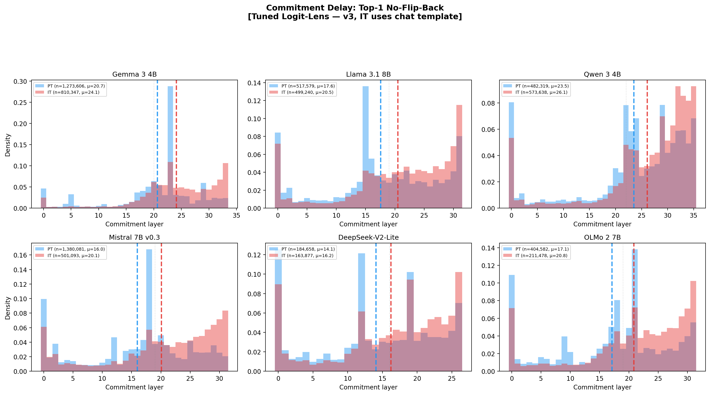
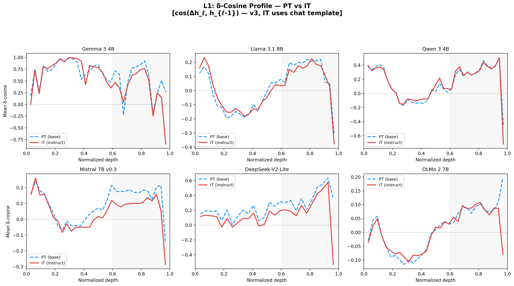

# The Convergence Gap in Instruction-Tuned Language Models: Evidence for a Mid-to-Late Policy-to-Prediction Handoff

**Anonymous authors** | NeurIPS 2026 Submission

---

## Abstract

We introduce the **convergence gap** as a trajectory-level target for pretrained-to-instruction-tuned model diffing: how far each intermediate layer's next-token distribution remains from the model's own final distribution. Across six paired PT/IT families, instruction-following descendants stay farther from final for longer and commit later. This broad signature survives identical teacher histories and an endpoint-free same-layer JS replay: dense-5 pooled `JS(A', C)` is already nonzero before the late window (`0.106`) and rises in the final 20% of layers (`0.169`). Symmetric equal-width MLP grafts and swaps show that late MLPs have the largest tested causal effect on delayed stabilization itself: late IT→PT grafts recreate the delay (`B_late - A' = +0.34` nats), and mirrored late PT→IT swaps collapse it most strongly (`D_late - C = -0.51` nats versus `-0.23` mid and `-0.10` early). Exp20 then separates token identity from readout at the first PT/IT divergent token. Under a shared raw prompt, mid swaps transfer opposite-model token identity more than late swaps, while late layers dominate IT-token margin/readout (`+2.52` logits raw-shared; `+11.18` native when comparing pure IT late margin to `IT+PT late`). The resulting synthesis is a policy-to-prediction handoff: middle layers more strongly affect candidate/token identity; late MLPs reconcile selected candidates into final next-token prediction. The convergence gap is the late readout cost of making instruction-tuned candidates win, not the birthplace of those candidates.

---

## 1. Introduction

Instruction tuning is usually studied through output behavior: does the model follow instructions, refuse unsafe prompts, or adopt an assistant register? We ask a more internal question. Does post-training change the **trajectory** by which a transformer settles on its own final next-token prediction?

This paper introduces the **convergence gap** as that trajectory-level object. Across six pretrained/instruction-tuned model families, instruction-following descendants remain farther from their own final output distribution for longer than their pretrained ancestors. The gap appears under native decoding, survives identical-history replay, has its largest tested delayed-stabilization effect in late MLPs under matched-prefix graft/swap interventions, and has behavioral consequences under free generation. The contribution is the full object-to-mechanism chain: a new PT↔post-training prediction-dynamics target, a cross-family matched-prefix identification design, and a mid-to-late handoff account backed by direct token-flow and first-divergence counterfactual evidence.

Prior work gives important adjacent pieces: late-layer sharpening, confidence correction, behavioral directions, post-training diffing, and cross-model patching. The missing object is the convergence gap as a PT↔post-training prediction-dynamics target. Once that object is measurable, a sharper causal question becomes available: which computations introduce the instruction-tuned candidate, and which computations make that candidate dominate the final next-token distribution? Our current answer, sharpened by Exp18 and Exp20, is a mid-to-late handoff. Middle layers carry much of the behavioral token-identity change; late MLPs are the clearest tested control point for delayed stabilization and final-token reconciliation.

Throughout, we use `instruction tuning` and `IT` as readable shorthand for the instruction-following post-trained descendants of PT checkpoints. The downstream recipes in our six families are heterogeneous, ranging from SFT-only to multi-stage preference/RL-style pipelines, so the paper's exact empirical object is PT-versus-post-training model diffing rather than isolation of a single uniform post-training recipe.

We study six PT/IT pairs: Gemma 3 4B, Llama 3.1 8B, Qwen 3 4B, Mistral 7B, OLMo 2 7B, and DeepSeek-V2-Lite. The evidence chain is:

| Step | Main question | Design | Main result |
|---|---|---|---|
| Discovery | Does post-training change stabilization dynamics? | Native decoding across six PT/IT families | IT stays farther from its own final distribution across the stack. |
| Matched-history check | Does the gap survive identical histories and endpoint-free readout? | Same teacher tokens, native same-layer JS | PT↔IT divergence persists under identical histories. |
| Depth localization | Which MLP window most controls delayed stabilization? | Equal-width early/mid/late PT↔IT grafts and swaps | Late MLPs produce the largest convergence-gap effect; behavioral effects are more mid-to-late. |
| Behavioral bridge | Does the same intervention family matter for outputs? | Free-running judged outputs after graft/swap | Late swaps clearly degrade IT assistant behavior; mid-layer contributions remain plausible and sometimes larger. |
| Mechanism sharpening | How do middle and late layers divide labor? | Exp18 token-flow plus Exp20 first-divergence counterfactuals | Mid swaps transfer token identity more; late layers give the strongest IT-specific margin/readout effects. |

This structure is the paper's main claim architecture. The first two steps establish the convergence gap as a real PT↔post-training object. The next two show that late MLPs are the clearest tested control point for delayed stabilization and that the same intervention family matters for natural outputs. The final step directly tests the handoff interpretation: mid layers more strongly affect candidate/token identity, while late layers write selected candidates into next-token prediction. Detailed scope boundaries and counter-interpretations are collected in Appendix F so the main text can follow the causal story directly without implying a solved late-only circuit.

---

## 2. Setup

### 2.1 Models

We compare PT/IT pairs from six families spanning dense and MoE architectures, hybrid and fully global attention, and a wide range of data and post-training regimes:

| Model | Layers | d_model | Attention | Pre-training data | Post-training |
|---|---|---|---|---|---|
| Gemma 3 4B | 34 | 2560 | GQA, hybrid local/global (5:1) | Undisclosed | Multi-stage post-training |
| Llama 3.1 8B | 32 | 4096 | GQA, all global | 15T tokens | Iterative supervised + preference optimization |
| Qwen 3 4B | 36 | 2560 | GQA, all global | 36T tokens, 119 languages | Multi-stage post-training |
| Mistral 7B v0.3 | 32 | 4096 | GQA, sliding window | Undisclosed | Instruct checkpoint |
| DeepSeek-V2-Lite | 27 | 2048 | MLA, MoE | 5.7T tokens | SFT-only chat checkpoint |
| OLMo 2 7B | 32 | 4096 | MHA, all global | OLMo-mix-1124 | SFT + DPO + RLVR |

OLMo 2's base recipe is centered on `OLMo-mix-1124` with a late `Dolmino-mix-1124` curriculum, so the earlier single-dataset shorthand was too coarse. DeepSeek-V2-Lite-Chat is an SFT-only chat checkpoint, which makes it a post-training outlier in addition to being the lone MoE family in our six-model set.

Accordingly, the paper's cross-family claim is about a shared PT↔IT phenotype across heterogeneous instruction-following post-training pipelines, not one homogeneous downstream recipe. The discovery curves use each model in its native prompting regime; matched-history replay, template controls, and graft/swap experiments then test the internal signature under controlled histories. For OLMo we use the retrained non-preview PT/IT checkpoints with shared tokenization. For DeepSeek we keep the MoE SFT-only case separate whenever architectural routing or post-training heterogeneity would make dense-family pooling misleading.

### 2.2 Architecture-agnostic pipeline and metrics

All core interventions are architecture-agnostic at the implementation level. Direction extraction, steering, and matched-prefix graft/swap experiments operate on raw MLP activations and residual-stream states through a model-agnostic adapter system. No core claim depends on transcoders, SAEs, or model-specific decomposition dictionaries; Gemma transcoders appear only in a supplementary feature-level analysis.

Our primary observable is the layerwise convergence trajectory

`KL(p_l || p_L)`,

where `p_l` is the decoded distribution at layer `l` and `p_L` is the final-layer distribution of the same model. We summarize it with:

- `Convergence gap (CG)`: mean late-layer IT-minus-PT excess KL.
- `Top-1 commitment`: first layer whose top-1 matches the final top-1.
- `No-flip-back commitment`: first stable top-1 match.
- `KL-threshold commitment`: first layer with `KL(p_l || p_L) < τ`.
- `Majority-vote commitment`: first layer after which most later layers remain below threshold.

These metrics all point in the same direction in our suite: IT commits later than PT.

The endpoint in this metric is not a cross-model target and is not meant to say that PT and IT have the same final distribution. It asks a within-model question: how far is the current layer from the model's own eventual next-token distribution? Because PT and IT are both evaluated relative to their own endpoints, the comparison is symmetric. A moved endpoint is part of what post-training changes, and delayed convergence measures how much late computation is needed before that endpoint is reached. In that sense, stronger late computation is not a pathology for this metric; it is part of the object being measured.

The real concern is not endpoint circularity but **probe dependence**. A tuned lens is an estimator of each layer's implied output distribution, and probe quality can affect the absolute magnitude of `KL(layer || own final)`. At the same time, the tuned lens does not mechanically force a larger IT gap: if an IT model's earlier layers already linearly encoded the eventual distribution, the probe would decode that and the gap would shrink. We therefore use the tuned lens for the main low-noise discovery plots, but we do not treat it as the sole identification step.

Accordingly, every paper-level claim about the broad convergence gap is triangulated across three readouts: tuned-lens KL for the clearest layerwise visualization, raw-logit-lens variants as a probe-quality-independent check, and matched-prefix native same-layer JS as the endpoint-free companion. Probe quality is strong in five families and weaker in Gemma, so Gemma's tuned-lens thresholded readouts are always interpreted together with raw-lens corroboration. Full probe validation is deferred to Appendix A.

Our main geometric summary is

`δ-cosine = cos(h_l - h_{l-1}, h_{l-1})`,

which measures whether a layer's update reinforces or opposes the accumulated residual direction. Because late PT layers already show negative `δ`-cosine, the substantive geometric claim is the **IT-minus-PT late shift**, not the sign itself.

For the final mechanism analysis we use three complementary token-level summary families. In native PT/IT runs (Exp18 pure-flow), we aggregate windowed `support_target_delta`, `repulsion_top10_delta`, and `margin_delta` for the finally emitted token. In matched-prefix traces, we aggregate first-entry depth into top-k, teacher-rank gain, top-1 displacement, and a strict mid-selected/late-reconciled handoff rate. In Exp20, we stop at the first PT/IT divergent token and ask which grafted or swapped pipeline chooses the PT token, the IT token, or another token, while also measuring the layerwise IT-vs-PT token-margin trajectory. Exp18 supplies direct final-token logit flow, the matched-prefix traces supply chronology under identical histories, and Exp20 supplies the cleanest token-identity versus margin/readout split. None alone proves a single mediating scalar; together they bound the handoff interpretation.

### 2.3 Datasets

We use four main data regimes.

**Discovery dataset.** The cross-family free-running convergence analyses use 2,936 prompts spanning factual QA, reasoning, code, safety, format compliance, and custom assistant-style prompts. Each prompt is decoded greedily up to 512 tokens. This dataset is designed to establish a broad model-in-use signature rather than a narrow benchmark artifact.

**Matched-prefix localization datasets.** The internal causal experiments use teacher-forced matched-prefix runs on 400- and 600-prompt subsets derived from the same broader prompt pool. These runs compare `A'`, `B_early/mid/late`, `C`, and `D_early/mid/late` under identical teacher tokens.

**Matched-prefix native-JS replay.** The primary robustness run reuses the 600-prompt matched-prefix manifest and stored IT teacher token sequences. It compares PT and IT native same-layer output distributions under identical teacher histories, giving an endpoint-free matched-history readout of the same broad PT↔IT separation. A reverse appendix replay uses PT-generated continuations as the teacher stream.

**Behavioral dataset.** The free-running behavioral follow-up uses a frozen 600-prompt subset of `eval_dataset_v2.jsonl`, emphasizing conversational prompts, assistant-register prompts, benign and harmful safety prompts, and format-sensitive items.

**First-divergence token-flow dataset.** Exp20 reuses the same six paired families and 600 prompts per mode, comparing native prompting and a raw-shared prompt control. For each prompt we identify the first token where PT and IT disagree, then evaluate early/mid/late graft or swap pipelines at that shared prefix. This reduces autoregressive confounding and directly separates token identity transfer from final logit-margin readout.

Throughout, pooled paper claims are made on the five dense families. DeepSeek is used only as a separate MoE/SFT-only side case in experiments where we actually ran it, and it is not part of the canonical judged behavioral pool.

---

## 3. The Convergence-Gap Signature and a Mid-to-Late Handoff

This section develops the central claim: **instruction-tuned variants exhibit a broad convergence-gap signature, and current evidence points to a mid-to-late handoff that turns instruction-tuned candidates into final next-token predictions**. Section 3.1 establishes the signature. Section 3.2 shows the late geometric shift that accompanies delayed stabilization. Section 3.3 gives the matched-prefix causal localization result: late MLPs have the largest tested effect on delayed stabilization. Section 3.4 then separates that convergence-gap result from the broader behavioral story: middle layers more strongly affect token identity, while late layers more strongly affect final margin/readout.

### 3.1 Broad convergence gap and delayed commitment across six families

The paper's first finding is simple: under native free-running decoding, instruction-tuned models remain farther from their own final output distribution than pretrained models do through much of the forward pass. We call this the **broad convergence gap**, and we treat delayed commitment as its discrete summary.

Figure 1 shows the clearest discovery visualization of the pattern, but not the whole evidential burden. Under the tuned lens, the pooled IT-minus-PT `KL(layer || own final)` gap is positive in the early, middle, and late thirds of the network (`+0.62`, `+0.56`, and `+0.30` nats). The raw lens tells the same qualitative story in five families and remains positive on late-half average in all six. We therefore use Figure 1 as a probe-based view of a broader signature rather than as a standalone proof.

Across five commitment definitions, IT commits later than PT in all six families; no metric shows an earlier IT commitment in any family. Figure 2 shows the cleanest threshold-free top-1 view under the tuned lens. Raw-lens variants, KL-threshold views, majority-vote summaries, and full threshold-sensitivity plots are consistent and are moved to Appendix Figures S33-S37 to keep the main text focused on the headline result.

The matched-history check then freezes token history and changes the readout. We replay the same teacher continuations through PT and IT and compare **native same-layer** output distributions using symmetric JS divergence. On the dense-5 pool, matched-prefix `JS(A', C)` is `0.106` through the pre-late stack and `0.169` in the final 20%, with `final20 > pre` in all five dense families.

This establishes the broad-gap claim on an endpoint-free readout: PT↔IT divergence survives identical histories and appears directly in same-layer native output distributions. That is why the paper does not ask Figure 1 to carry the whole identification burden by itself. A reverse replay with PT-generated teacher continuations gives the same qualitative result and is reported in Appendix F.

Direct target-gap closure under the same replay is more mid-to-late distributed, which is exactly why we separate the claims: the PT↔IT distributional change is broad, behavioral policy may be selected before the end, and the largest tested effect on delayed stabilization lies late. Per-model curves and controls are in Appendix Figures S50-S52.

### 3.2 A late geometric signature: a late-concentrated shift toward stronger MLP opposition

The convergence gap is the functional signature. The late geometric companion is a stronger IT-vs-PT shift toward MLP updates that oppose the accumulated residual stream. We measure this with `δ`-cosine, the cosine between each MLP update and the residual stream entering that layer. Across families, the shift is heterogeneous in size but consistently late-skewed: IT's MLP updates become more counter-aligned with the accumulated residual stream than PT's, and this geometric shift is more late-concentrated than the KL gap itself.

The logit lens decodes each layer's residual stream via `W_U · h_l`. PT models already exhibit late-layer negative `δ`-cosine, consistent with residual sharpening. The instruction-tuning effect is the additional late shift: when IT makes late updates more opposing than PT's, it can partially cancel accumulated prediction signal, reduce the current dominant logit, and free probability mass for the eventual output. This is one efficient late geometry for reducing premature commitment. Section 3.3 then shows that teacher support and current-top suppression summarize the late intervention more directly than `δ`-cosine alone.

If early and middle layers have accumulated a residual direction pointing toward token `X`, and the model needs to produce token `Y` instead, adding opposition to the current residual direction is an efficient move: a unit-norm update with negative cosine produces a large reduction in the current top-1 logit per unit perturbation magnitude. IT performs more of this late cancellation than PT, and the matched-prefix results below show how that cancellation fits into a broader teacher-support / anti-premature-commitment computation.

Figure 3 shows the δ-cosine profile across all six families. The claim is the additional IT-vs-PT increase in late-layer negativity, not the mere existence of negative late updates.

The late `δ`-cosine shift is directionally consistent in all six families and heterogeneous in magnitude. On the final-20% summary it ranges from `-0.269` in Gemma and `-0.201` in DeepSeek to `-0.021` in Llama, with Qwen and OLMo concentrated much more sharply in the final one or two layers. Pooled across families, the IT-minus-PT shift is near zero early (`-0.007`), modest in the middle (`-0.023`), and largest late (`-0.086`, or `-0.108` in the final 20%). The broad convergence gap is the cross-family functional signature; increased late MLP opposition is its clearest geometric companion.

Families with sustained late opposition appear to implement correction as a distributed late computation, while families with terminal spikes appear to implement a sharper final adjustment. Detailed onset, weight-difference, and family-by-family geometry analyses are deferred to the appendix.

### 3.3 Causal localization: late reconciliation within a broader mid-to-late circuit

The free-running results in §3.1–§3.2 establish the signature. Section 3.3 asks how it is implemented. The spine is cross-family matched-prefix evidence: a depth ablation shows that late MLPs most reliably recreate the *late delayed-convergence* signature, and a mirrored sufficiency/necessity follow-up shows that the same late window has the largest collapse effect in IT. The behavioral and JS evidence, however, is more mid-to-late distributed. We therefore treat the result as a handoff rather than a late-confined account: middle layers appear to introduce or select instruction-tuned candidates, while late layers reconcile those candidates with the final next-token distribution. This is the paper's main methodological novelty: it turns cross-model patching from a task-specific or single-pair diagnostic into a cross-family symmetric PT↔IT localization template for a newly defined prediction-dynamics object.

#### 3.3.1 Cross-family matched-prefix depth ablation localizes the late stabilization effect

This experiment is the paper's first cross-family matched-prefix causal test and the first half of the main internal identification backbone. Weight grafting between base and post-trained variants is closely related to prior work on MLP editing, skill localization, and layer-scoped alignment interventions; our version asks whether IT MLP parameters at different depths recreate the convergence signature once token history is held fixed. For each prompt, `C` is the full IT model, `A'` is the PT backbone teacher-forced to `C`'s emitted continuation, and `B` is the same PT backbone with IT MLPs grafted into one equal-width window under that same continuation. We also run a raw-versus-template control, and we treat the five dense families as the main pooled set while reporting DeepSeek separately because its MoE swap also changes routing behavior.

The main result is simple for the convergence-gap readout. Under matched prefix, late IT grafting increases final-20% `KL(layer || own final)` relative to `A'` in all five dense families, with nearly identical raw and templated branches, and it also moves the PT backbone closer to the IT teacher under the shared PT readout. Thus late IT MLP weights are sufficient to recreate an IT-like delayed-convergence signature even when the teacher tokens are fixed. DeepSeek is directionally concordant on the same readouts but is kept separate as an MoE case.

The depth-specific pattern is sharp for delayed stabilization. Every branch is evaluated by the same within-model stabilization metric, and every grafted branch has its own endpoint, so the comparison is about which equal-width substitution produces the IT-like delay. On the dense-family mean, the final-20% KL effect is `+0.34` nats for the late graft versus `-0.03` early and `-0.05` mid. The same late window is also the only one that moves final-20% `δ`-cosine and threshold-free commitment in the consistently IT-like direction on average. Early and middle grafts perturb local dynamics and can improve teacher similarity, which is exactly the clue that behavioral policy is not late-only. What they do not recreate is the *late-region delayed-convergence signature*.

The matched-prefix graft is therefore a clean internal localization result for delayed stabilization: late MLPs most strongly recreate delayed convergence under identical token histories. It is not a claim that late MLPs alone introduce the assistant policy. Free-running behavior and broader assistantness are tested separately below, and Appendix F collects the scope boundaries.

#### 3.3.2 Symmetric matched-prefix graft/swap shows late sufficiency and necessity for the gap

The mirrored follow-up asks for the IT-side counterpart: if late IT MLPs can impose the delay on PT, do late PT MLP swaps also remove it from IT? We also add output-relevant late-stage summaries that go beyond `δ`-cosine alone.

![Figure 5: Symmetric matched-prefix sufficiency/necessity and output-relevant late-stage summaries. Left: PT-side final-20% KL-to-own-final deltas for early, middle, and late IT-MLP grafts relative to `A'`. Center: IT-side deltas for early, middle, and late PT-MLP swaps relative to `C`. Right: dense-family predictive correlation between late KL shifts and late-stage scalar summaries. The late window has the largest convergence-gap effect in both directions, and the best output-relevant summaries modestly outperform `δ`-cosine alone.](../results/exp14_symmetric_matched_prefix_causality/exp13exp14_full_20260416/exp13_full_causal_main.png)

Late is the largest sufficiency and necessity window for the convergence-gap metric in the dense-family pool, with DeepSeek reported separately as the MoE case. On the PT side, the dense-family mean final-20% KL effect is `+0.34` nats for `B_late` versus slightly negative early and mid values. On the IT side, the mirrored late PT swap produces the largest collapse of IT's delay, with a dense-family mean `D_late - C = -0.51` nats versus `-0.10` early and `-0.23` mid. The auxiliary late-geometry ordering points the same way. The mirrored design is important: the same late window that is sufficient to impose an IT-like delay on PT is also necessary for maintaining that delay in IT.

The best output-relevant summary is also broader than `δ`-cosine alone. Across the dense-family pool, `support_teacher_proj` (`r = +0.220`) and `anti_top1_proj` (`r = -0.219`) modestly outperform `δ`-cosine (`r = -0.186`) as predictors of later late-region KL, while `anti_kl_final_proj` is weak. The mechanism picture is therefore sharper than pure anti-residual opposition: the late IT-like update supports the eventual teacher token while weakening premature commitment to the current dominant alternative. In the handoff interpretation, this is the late write-in step: the model has an IT-like candidate available, and late MLPs increase its margin against raw-continuation alternatives. Appendix F states the mediation boundary explicitly.

Taken together, the symmetric matched-prefix result is the paper's clearest causal localization evidence for the convergence gap. Late IT MLPs are the window whose installation most reliably recreates delayed convergence in PT and whose removal most reliably collapses it in IT. That result localizes the late reconciliation readout; it leaves open, and in fact motivates, a separate mid-layer candidate-selection role.

#### 3.3.3 Free-running symmetric behavioral follow-up: late behavioral necessity and measurable sufficiency

The matched-prefix results establish the paper's main internal localization result. The behavioral follow-up asks whether the same intervention family changes actual assistant outputs under natural decoding. We evaluate eight deterministic free-running pipelines on a frozen 600-prompt core subset of `eval_dataset_v2`, pooling the five dense families only. DeepSeek is not part of the canonical judged behavioral run, so it does not contribute to the pooled behavioral claims in this section.

![Figure 6: Paper-facing summary of the free-running behavioral follow-up. Left: IT-side pooled pointwise worsening on assistant register (G2) and benign false-refusal control (S2), where the late PT swap is the largest window on these two endpoints; bars show prompt-bootstrap 95% CIs over dense-family records. Center: dense-family pooled blind pairwise judging for PT late graft vs PT baseline. Right: dense-family pooled blind pairwise judging for IT baseline vs late PT swap. The cleanest behavioral claim is late necessity in IT; late grafting into PT shows a smaller but reliable sufficiency effect under pairwise judging.](../results/exp15_symmetric_behavioral_causality/plots/exp15_eval_core_600_t512_dense5/exp15_paper_behavior_main.png)

The clearest late result is IT-side necessity. On the dense-family pooled pointwise metrics, the IT-side ordering is `late > mid > early` for both primary endpoints: assistant register (`G2`) worsens by `+0.42` (95% CI `[+0.27, +0.62]`) for `D_late`, and benign false-refusal control (`S2`) worsens by `+0.05` (95% CI `[+0.02, +0.10]`). Late IT-side `G2` loss is positive in every dense family. Blind pairwise judging says the same thing more directly: the intact IT model is preferred over `D_late` on `75.3%` of `G2` comparisons (95% CI `[72.8%, 77.9%]`) and `76.3%` of `S2` comparisons (95% CI `[72.0%, 80.3%]`). The same late window whose replacement most strongly collapses IT's internal delay therefore also produces clear behavioral degradation under natural decoding.

The PT side shows measurable but partial sufficiency. In blind pairwise judging, `B_late` beats `A` on `56.3%` of resolved assistant-register items and `63.8%` of resolved benign-safety items. The direct PT-versus-IT baseline gives scale: in the same dense-family pairwise setup, intact `C` beats intact `A` on `98.0%` of `G2` comparisons (95% CI `[97.2%, 98.8%]`) and `96.8%` of `S2` comparisons (95% CI `[94.9%, 98.4%]`). Late grafting into PT therefore moves behavior in the IT direction without recovering the full PT-to-IT pairwise preference gap.

The effect is targeted: `D_late` harms assistant register most strongly on conversational and register-sensitive prompt buckets, especially `GOV-REGISTER` (Appendix Figure S49). The behavioral bridge is asymmetric but meaningful: late intervention is a clear necessity window on the IT side and a measurable sufficiency window on the PT side, while the broader behavioral policy likely depends on mid-layer contributions as well.

#### 3.3.4 Gemma steering provides a concrete single-model causal bridge

The cross-family matched-prefix results above are the paper's identification backbone. Gemma steering provides a complementary single-model bridge: it shows directly, within one model, that modulating a late IT-minus-PT direction during generation co-modulates both convergence and output behavior. In Gemma 3 4B, we extract the mean IT-minus-PT MLP-output difference in the late reconciliation range (layers 20–33) from 600 calibration prompts and intervene on that direction with a projection-based scaling rule during generation. The direction is stable under bootstrap resampling, robust to calibration/evaluation splits, and still aligns strongly under matched-token validation, so it is not a small-sample artifact or a pure token-sequence artifact (Appendix B).

As the late direction is reduced from `α = 1` toward `α = 0` and then reversed, format and register metrics fall monotonically, safety behavior degrades, and the model moves toward raw-completion-like output. Content metrics remain near baseline over a moderate range and collapse only at more destructive intervention strengths. This is the key causal dissociation in the single-model setting: the same manipulation that weakens assistant-style behavior also shrinks the convergence gap and moves IT's internal profile toward PT. Convergence speed and output-governance behavior are therefore co-modulated readouts of the same late computation.

The main controls point in the same direction. The effect is sharply layer-specific: early and middle directions do not reproduce the late-layer governance modulation. It is also direction-specific: a projection-magnitude-matched random vector produces far weaker governance modulation while causing comparable extreme-regime content damage, showing that the content collapse at large interventions is mostly generic perturbation whereas the governance effect is carried by the corrective direction itself. The signal is MLP-specific: attention-side interventions are nearly null, while residual-stream intervention is catastrophically destructive. And it is weight-encoded rather than prompt-wrapping-only: the effect persists when the chat template is removed. We also observe an important asymmetry: injecting the direction into PT is noisy, while removing it from IT is clean. We interpret that asymmetry as evidence that the direction is part of a learned late circuit that IT downstream layers know how to use, not a standalone feature that can simply be pasted into PT.

This Gemma result is the clearest single-direction causal bridge in the paper. It complements the cross-family matched-prefix story by showing, in one model and one explicit direction, the same qualitative co-modulation between convergence speed and assistant behavior that the broader graft/swap program localizes across families.

### 3.4 Token-level handoff: mid identity, late margin/readout

The results above localize delayed stabilization most strongly to late MLPs. They do not imply that late layers are where assistant behavior is born. Exp20 tests that boundary directly. For each prompt, we run PT and IT until the first token where they would disagree, then evaluate early/mid/late grafted or swapped pipelines at that shared prefix. This removes most downstream autoregressive-history confounding and asks a concrete question: which window changes the divergent token's identity, and which window changes its final logit margin?

The cleaner identity test is the raw-shared prompt condition. There, `PT + IT mid` matches the IT divergent token in `33.5%` of dense-5 cases, while `PT + IT late` matches it in only `13.6%`. The mirror direction is similar: `IT + PT mid` matches the PT divergent token in `34.5%` of cases, while `IT + PT late` matches it in only `15.8%`. Thus, single-window middle swaps transfer opposite-model token identity much more than single-window late swaps. This is positive evidence for the handoff account: instruction-tuned candidate selection is already visible before the final layers.

Late layers then dominate readout. Replacing IT late layers with PT late layers often preserves the already-selected IT token, but substantially weakens its margin over the PT alternative. In raw-shared mode, pure IT late margin exceeds `IT + PT late` by `+2.52` logits (95% CI `[+2.41, +2.63]`); in native mode, where the IT model receives its trained chat template, the gap is `+11.18` logits (95% CI `[+10.89, +11.48]`). Pure IT also shows a large late-minus-mid margin gain (`+3.75` logits raw-shared; `+20.63` native). These comparisons keep upstream IT computation largely present while changing the late stack, so they support a late reconciliation/readout role rather than a generic "late layers do everything" account.

Exp18 supplies the complementary final-token flow view. It uses native PT/IT runs with direct logit deltas and no grafting. On the dense-5 pool, late IT windows increase the eventual token's margin more than middle windows for both `FORMAT` (`1.96` vs `1.13`) and `CONTENT` (`1.75` vs `1.12`), while PT is much flatter. The increase is driven mainly by stronger late target support, so the late write-in is more IT-specific than a generic property of autoregressive finalization.

The matched-prefix chronology gives a supporting, lower-resolution view under identical histories. It is necessarily less direct than Figures 8-9 because the older matched-prefix traces store ranks and top-k sets, not per-layer logits. The pattern is nonetheless informative and category-dependent. `FORMAT` tokens enter top-20 earlier than `CONTENT` on average (`6.59` vs `13.12`), yet `FORMAT` teacher-rank gain is strongly negative early (`-37.9`), near-neutral in mid (`-2.29`), and positive only late (`+3.04`), with lower late top-1 displacement than mid (`0.071` vs `0.139`). `CONTENT` is different: it shows large middle-window teacher-rank gains (`+42.1`) and only smaller late gains (`+1.29`). Strict mid-selected/late-reconciled handoff rates are modest (`0.095` for `FORMAT`, `0.129` for `CONTENT`) rather than universal.

Taken together, Exp18 and Exp20 support a genuine mid-to-late handoff. Middle layers are more diagnostic of candidate exposure, reshuffling, and token identity transfer. Late layers are more diagnostic of final readout: increasing the selected token's margin against PT/raw alternatives and producing the delayed-stabilization component of the convergence gap. The evidence does not yet prove the strongest amplification interaction, `PT + IT mid+late > PT + IT mid`; that exact factorial condition remains the next causal test. The current claim is deliberately narrower: the convergence gap is a late readout/reconciliation cost embedded in a broader mid-to-late instruction-tuned behavioral circuit.

---

## 4. Deeper Characterization

### 4.1 Geometry beyond the main result is mixed

We also tested whether the broad convergence gap has a simple representation-geometric counterpart beyond the late logit-space effect itself. Multi-estimator dimensionality, covariance-spectrum, and attention-entropy follow-ups are mixed across families, so they remain exploratory. The main result does not require a universal rank, width, or entropy story: it is a forward-pass prediction-dynamics signature with a mid-to-late implementation hypothesis.

### 4.2 Relation to known behavioral directions

Our results fit naturally with prior work on refusal directions, safety layers, and assistant-style control, while sharpening a different question. Refusal directions (Arditi et al., 2024) and the Assistant Axis (Lu et al., 2026) suggest that post-training leaves compact behavioral control signals in activation space. Du et al. (2025) separates post-training effects across knowledge, truthfulness, refusal, and confidence. Li et al. (2025) and Chaudhury (2025) localize safety or preference effects to middle bands under readouts centered on malicious-vs-normal discrimination and HHH-style preference behavior. Our paper measures output-side convergence and assistant-like generation, then asks which window most strongly recreates or collapses that signature under matched prefix.

The resulting synthesis is a broader middle-to-late control circuit with a late-skewed output reconciliation point. Exp18 makes the final-token write-in concrete: in native IT runs, late windows produce the largest final-token margin gains, while matched-prefix chronology shows that some categories, especially content, can receive substantial middle-window rank improvement before late stabilization. Exp20 sharpens the identity/readout distinction: middle swaps transfer the opposite model's first divergent token identity more than late swaps, while late IT layers more strongly preserve or increase the IT-vs-PT token margin. Middle layers may encode, select, or route safety/preference/persona information; late MLPs are where our matched-prefix interventions and token-margin analyses find the clearest final-token write-in. In the language of this paper, middle layers plausibly choose the instruction-tuned candidate, and late layers make that candidate win. Appendix F states the remaining chronology boundary explicitly.

### 4.3 Feature-level results are supplementary

Gemma feature-level analyses are consistent with substantial late post-training reorganization: IT redistributes activation mass across a broader feature repertoire, and the fraction of activation mass attributable to IT-amplified features rises sharply in the late reconciliation region. Those findings are useful for intuition and for locating a layer-resolved alignment tax, but they depend on variant-matched transcoders and remain supplementary to the main architecture-agnostic evidence chain.

---

## 5. Discussion

### 5.1 What the current evidence shows

The paper's central claim is paired: instruction-tuned descendants exhibit a broad convergence-gap signature under native decoding, and current evidence points to a mid-to-late handoff that implements it. The first half is the cross-family observational result: IT predictions remain farther from their own final distribution for longer across all six families. The second half is the cross-family localization result: under matched prefix, late IT MLPs are the largest tested sufficiency window for delayed stabilization on the PT side and late PT swaps are the largest tested necessity window for collapsing that delay on the IT side. The behavioral result shows consequence without reducing assistant behavior to a late-only mechanism. Exp18 and Exp20 then supply the bridge: middle layers more strongly affect candidate/token identity; late MLPs reconcile selected candidates into final next-token prediction. Read together, these results support broad whole-stack change under native decoding, mid-to-late behavioral control, and a late output-reconciliation step that creates the convergence-gap readout.

The novelty is the object-to-localization chain. We make convergence-to-final prediction dynamics a PT↔post-training model-diffing target, show that the target recurs across six paired families, and apply an identical-history symmetric graft/swap design to separate late stabilization control from broader mid-to-late behavioral change. Negative late updates, difference-of-means steering, and activation patching across related models are important precedents; this paper asks a different object-level question and answers it cross-family. That is what turns the work from a single-model steering observation into a cross-family causal-localization study.

Put differently, the paper changes the question from "do late layers sharpen predictions?" to "does post-training systematically alter when a model stabilizes its own prediction, and how do middle and late layers divide candidate selection from final-token reconciliation?" That is a different and more specific mechanistic question than prior late-layer or alignment-localization work, and it is why the contribution is stronger than a repackaging of known ingredients.

### 5.2 The handoff interpretation: mid-layer policy, late next-token reconciliation

A late-layer stabilization result is fully compatible with a gap that appears earlier in the stack. Our main observable is intentionally a stabilization-to-own-decision metric: if post-training selects an IT-like behavioral candidate before the end, and late layers then reconcile that candidate against raw or premature alternatives, earlier IT layers should be farther from their own endpoint until that reconciliation has run. That is exactly the operational signature of a model whose final decision requires a stronger late write-in step. The broad free-running gap and the late matched-prefix localization result are therefore complementary: the former describes the whole trajectory of the model in use, while the latter identifies where intervention has the largest effect on delayed stabilization.

Exp18 and Exp20 make this interpretation concrete. Exp18 shows that late IT windows raise the eventual token's margin more than middle windows for both format and content, whereas PT is flatter. Exp20 adds the missing identity check: under a shared raw prompt, mid swaps transfer first-divergent token identity more than late swaps, while late layers more strongly determine IT-token margin/readout. The clean synthesis is therefore not "mid causes behavior and late is irrelevant," nor "late causes assistant behavior." It is a division of labor: mid layers are more tied to candidate identity; late layers are more tied to making the selected candidate dominate next-token prediction.

This also explains why our result can coexist with mid-layer safety and preference localization. The PT-to-post-training change is broad, and middle layers can carry policy, preference, or persona information. The late result says something sharper and narrower: when the target is delayed stabilization to the model's own final output, the clearest tested control point is late. The convergence gap is not the birthplace of instruction-tuned behavior; it is the late readout cost of turning selected instruction-tuned candidates into final next-token predictions.

### 5.3 Scope boundaries

The main text has focused on the positive story: a new convergence-gap object, matched-history validation, late stabilization control, and behavioral consequence. The scope boundaries are equally important. The evidence directly shows a broad convergence gap, the largest tested late-MLP leverage on delayed stabilization, and a mid-to-late behavioral split in which token identity and token margin are partly separable. It does not yet show a full mediating circuit from a named middle-layer feature to a named late-layer write-in operation. It also does not yet show the strongest amplification interaction `PT + IT mid+late > PT + IT mid`, because that exact combined branch was not part of Exp20. Following activation-patching best practice, we therefore treat grafts and swaps as evidence for causal leverage on specified metrics, not as a complete circuit proof. Additional counter-interpretations and boundary cases are collected in Appendix F.

### 5.4 Most useful next causal tests after Exp18 and Exp20

Exp18 and Exp20 close an important gap: we now have direct token-flow and first-divergence evidence rather than only a handoff interpretation inferred from earlier late-stage summaries. The remaining causal question is no longer whether the evidence is late-only; it is whether middle-layer policy selection and late-layer reconciliation interact multiplicatively or merely contribute different readouts.

The most decisive next experiment is therefore a factorial middle/late graft-swap design. On the PT host, compare pure PT (`PT_mid + PT_late`), IT-mid-only (`IT_mid + PT_late`), IT-late-only (`PT_mid + IT_late`), and IT-mid-plus-late (`IT_mid + IT_late`). The primary interaction is `P(match IT token | IT_mid + IT_late) - P(match IT token | IT_mid + PT_late)`, and the stronger synergy test is `[ML - M] - [L - A]`. If `IT_mid + IT_late` exceeds `IT_mid + PT_late`, then IT late layers amplify IT-mid-selected candidates. If the gain is small but margins increase, the current interpretation becomes even sharper: mid controls token identity, late controls confidence/readout. The mirror IT-host version asks the corresponding necessity question.

A second high-value follow-up is a higher-resolution matched-prefix rerun that stores per-layer logits rather than only ranks and top-k sets. Exp18's matched-prefix chronology is supportive but limited by the older logging format. Re-running the same `A'`, `B_early`, `B_mid`, `B_late`, and `C` branches with per-layer logit capture would let us measure windowed `support_target_delta`, `repulsion_top10_delta`, and margin growth under identical histories rather than relying on rank-only proxies.

A third, more surgical follow-up is a finer-grained decomposition inside the late MLP update itself. Our present evidence points to a combined teacher-support / anti-premature-commitment signal. We can decompose the late update into that aligned component and an orthogonal remainder, then test whether the aligned component alone recovers most of the delay and whether removing it from IT collapses the delay more than matched-norm orthogonal controls. The factorial middle/late test answers the circuit-chronology question; the higher-resolution matched-prefix rerun answers the chronology-under-identical-history question; this component test answers the late-reconciliation-mechanism question.

---

## 6. Related Work

**Table 1: Closest adjacent papers and the question each one answers.** The table highlights the paper's main novelty: a new convergence-gap object paired with a cross-family identical-history localization design.

| Paper | Primary object | Checkpoint scope | Internal causal control | Natural-decoding behavior link |
|---|---|---|---|---|
| Wu et al. (2024) | Instruction-conditioned behavior shift | PT→IT comparison | Attribution / attention / FFN analysis; no matched-prefix symmetric graft/swap | No explicit localization-to-behavior bridge |
| Du et al. (2025) | Knowledge, truthfulness, refusal, confidence after post-training | Multi-family PT vs post-trained | Direction / transferability analysis; not matched-prefix symmetric depth localization | No convergence-gap behavior bridge |
| Li et al. (2025) | Malicious-vs-normal safety layers | Safety-aligned models | Mid-layer security localization; not PT↔IT matched-prefix graft/swap | Security behavior, not convergence / commitment dynamics |
| Chaudhury (2025) | Preference layers / reward-consistent behavior | Single PT/tuned pair | Layer-wide causal patching; not cross-family matched-prefix convergence localization | Preference behavior, not assistant-style natural-decoding bridge |
| Ours | Convergence-to-final dynamics / policy-to-prediction handoff | Cross-family PT↔instruction-following descendants | Matched-prefix native-JS replay + symmetric equal-width early/mid/late MLP graft/swap | Yes: assistant / benign-safety consequence test |

Wu et al. (2024) and Du et al. (2025) are the closest PT-versus-post-training neighbors, while Li et al. (2025) and Chaudhury (2025) are the closest localization foils. Throughout, we use `instruction tuning` as shorthand for heterogeneous instruction-following post-training descendants, so the table compares questions answered rather than assuming one homogeneous downstream recipe. The paper's distinctiveness is the conjunction of a new prediction-dynamics object, a matched-prefix identical-history control regime, a symmetric early/mid/late MLP graft/swap design, and a natural-decoding consequence test. None of the adjacent work combines these ingredients, and none targets convergence-to-final dynamics as the object of PT↔post-training model diffing.

Papers built on the logit lens and tuned lens already show that late layers matter for calibration, correction, residual sharpening, and early-exit behavior in pretrained or modern LLMs (nostalgebraist, 2020; Belrose et al., 2023; Lad et al., 2024; Joshi et al., 2025; Wei et al., 2026). Our contribution is the PT↔post-training convergence-gap object and its matched-prefix localization, not the standalone fact that late layers can sharpen predictions. Among PT-versus-post-training comparison papers, Wu et al. (2024) explains instruction-conditioned behavior shift through attribution, attention, and FFN analyses, while Du et al. (2025) compares base and post-trained models through knowledge, truthfulness, refusal, and confidence. These papers study nearby phenomena; ours targets convergence-to-final dynamics and uses that target to separate late next-token reconciliation from broader mid-to-late behavioral control.

Alignment-localization papers ask a different question. Li et al. (2025) identifies middle safety layers crucial for distinguishing malicious from normal queries, and Chaudhury (2025) localizes reward-consistent preference behavior to middle bands in a base/tuned Llama pair; Jain et al. (2024) is also nearby in spirit on safety fine-tuning. Our paper instead measures output-side convergence and assistant-like generation, then asks which window most reliably recreates or collapses that signature under matched prefix. The result is therefore complementary rather than contradictory: mid-layer safety/preference localization and late effects on convergence dynamics can both be true if middle layers choose or route a post-training policy and late layers reconcile that policy with the final next-token distribution.

Behavioral direction and intervention papers provide important context for interpreting what late interventions change. Arditi et al. (2024) and Lu et al. (2026) show that refusal and assistant-like behavior admit compact activation-space summaries, while Prakash et al. (2024) gives the closest methodological precedent through CMAP-style activation patching across related models. We also follow Heimersheim and Nanda (2024) in treating activation patching as evidence about causal leverage on a chosen metric, not as automatic proof of a complete circuit. Our design changes the unit of analysis: instead of a task-specific mechanism in one base/fine-tuned setting, we use equal-width early/mid/late swaps across paired model families to localize effects on a newly defined convergence-gap signature, then use Exp20 to separate token identity from margin/readout. This is why the novelty claim is clearest at the object-and-design level: convergence-to-final dynamics supplies the object, and matched-prefix symmetric graft/swap supplies the causal localization template for testing a policy-to-prediction handoff. Appendix E broadens the comparison to these papers and to conceptual work on instruction following by Hewitt et al. (2024) and Rocchetti and Ferrara (2026).

---

## 7. Conclusion

The convergence gap is a new mechanistic object for studying post-training. Across six transformer families, instruction-tuned descendants remain farther from their own final output distribution for longer than pretrained models do. Matched-prefix native same-layer JS replay shows that the broad PT↔IT separation survives identical histories, and symmetric early/mid/late grafts and swaps show that late MLPs produce the largest tested effect on the delayed-stabilization signature.

The same late intervention family is behaviorally consequential under natural decoding, but the behavioral evidence is not late-only. The resulting story is compact and more realistic: post-training changes the layerwise process by which models settle on their own outputs; middle layers more strongly affect instruction-tuned token identity; and late MLPs help selected candidates win the next-token competition by increasing teacher-token support and IT-token margin. Exp18's native token-flow and matched-prefix chronology analyses show category-dependent candidate exposure and late write-in. Exp20 adds the clean first-divergent-token split: mid swaps transfer token identity more, while late layers contribute more to margin/readout. The next decisive step is a factorial middle/late graft-swap test plus higher-resolution matched-prefix logit logging.

---

## References

Aghajanyan, A., et al. (2021). Intrinsic Dimensionality Explains the Effectiveness of Language Model Fine-Tuning. *ACL 2021*. arXiv:2012.13255.

Ansuini, A., et al. (2019). Intrinsic Dimension of Data Representations in Deep Neural Networks. *NeurIPS 2019*. arXiv:1905.12784.

Arditi, A., et al. (2024). Refusal in Language Models Is Mediated by a Single Direction. *arXiv:2406.11717*.

Belrose, N., et al. (2023). Eliciting Latent Predictions from Transformers with the Tuned Lens. *COLM 2024*. arXiv:2303.08112.

Bricken, T., et al. (2023). Towards Monosemanticity: Decomposing Language Models with Dictionary Learning. *Anthropic*.

Chaudhury, A. (2025). Alignment is Localized: A Causal Probe into Preference Layers. *arXiv:2510.16167*.

Cheng, E., Doimo, D., Kervadec, C., Macocco, I., Yu, J., Laio, A., & Baroni, M. (2024). Emergence of a High-Dimensional Abstraction Phase in Language Transformers. *ICLR 2025*. arXiv:2405.15471.

Chuang, Y., et al. (2024). DoLA: Decoding by Contrasting Layers Improves Factuality. *ICLR 2024*. arXiv:2309.03883.

Conmy, A., Mavor-Parker, A. N., Lynch, A., Heimersheim, S., & Garriga-Alonso, A. (2023). Towards Automated Circuit Discovery for Mechanistic Interpretability. *NeurIPS 2023*. arXiv:2304.14997.

Cui, G., et al. (2025). The Entropy Mechanism of Reinforcement Learning for Reasoning Language Models. *arXiv:2505.22617*.

Du, H., Li, W., Cai, M., Saraipour, K., Zhang, Z., Lakkaraju, H., Sun, Y., & Zhang, S. (2025). How Post-Training Reshapes LLMs: A Mechanistic View on Knowledge, Truthfulness, Refusal, and Confidence. *COLM 2025*. arXiv:2504.02904.

Dunefsky, J., et al. (2024). Transcoders Find Interpretable LLM Feature Circuits. *arXiv:2406.11944*.

Elhage, N., et al. (2021). A Mathematical Framework for Transformer Circuits. *Anthropic*.

Elhage, N., et al. (2022). Toy Models of Superposition. *Anthropic Transformer Circuits Thread*. arXiv:2209.10652.

Facco, E., et al. (2017). Estimating the Intrinsic Dimension of Datasets by a Minimal Neighborhood Information. *Scientific Reports*.

Friston, K. (2005). A Theory of Cortical Responses. *Philosophical Transactions of the Royal Society B*, 360(1456), 815–836.

Geva, M., Schuster, R., Berant, J., & Levy, O. (2022). Transformer Feed-Forward Layers Are Key-Value Memories. *EMNLP 2022*. arXiv:2012.14913.

Gold, J. I., & Shadlen, M. N. (2007). The Neural Basis of Decision Making. *Annual Review of Neuroscience*, 30, 535–574.

Hyland, K. (2005). *Metadiscourse: Exploring Interaction in Writing*. Continuum.

Heimersheim, S., & Nanda, N. (2024). How to Use and Interpret Activation Patching. *arXiv:2404.15255*.

Hewitt, J., Liu, N. F., Liang, P., & Manning, C. D. (2024). Instruction Following without Instruction Tuning. *arXiv:2409.14254*.

Jain, S., Lubana, E. S., Oksuz, K., Joy, T., Torr, P. H. S., Sanyal, A., & Dokania, P. K. (2024). What Makes and Breaks Safety Fine-tuning? A Mechanistic Study. *NeurIPS 2024*. arXiv:2407.10264.

Joad, F., et al. (2026). There Is More to Refusal in Large Language Models than a Single Direction. *arXiv:2602.02132*.

Joshi, A., Ahmad, A., & Modi, A. (2025). Calibration Across Layers: Understanding Calibration Evolution in LLMs. *EMNLP 2025*. arXiv:2511.00280.

Lad, F., et al. (2024). The Remarkable Robustness of LLMs: Stages of Inference? *arXiv:2406.19384*.

Levelt, W. J. M. (1989). *Speaking: From Intention to Articulation*. MIT Press.

Li, S., Yao, L., Zhang, L., & Li, Y. (2025). Safety Layers in Aligned Large Language Models: The Key to LLM Security. *ICLR 2025*. arXiv:2408.17003.

Lin, B. Y., et al. (2024). The Unlocking Spell on Base LLMs: Rethinking Alignment via In-Context Learning. *ICLR 2024*. arXiv:2312.01552.

Lindsey, J., Templeton, A., Marcus, J., Conerly, T., Batson, J., & Olah, C. (2024). Sparse Crosscoders for Cross-Layer Features and Model Diffing. *Transformer Circuits Thread*.

Lu, C., Gallagher, J., Michala, J., Fish, K., & Lindsey, J. (2026). The Assistant Axis: Situating and Stabilizing the Default Persona of Language Models. *arXiv:2601.10387*.

Meng, K., Bau, D., Andonian, A., & Belinkov, Y. (2022). Locating and Editing Factual Associations in GPT. *NeurIPS 2022*. arXiv:2202.05262.

Nanda, N., & Lieberum, T. (2022). A Mechanistic Interpretability Analysis of Grokking. *ICLR MATH-AI Workshop 2023*.

nostalgebraist. (2020). interpreting GPT: the logit lens. *LessWrong*.

Ouyang, L., Wu, J., Jiang, X., Almeida, D., Wainwright, C. L., Mishkin, P., Zhang, C., Agarwal, S., Slama, K., Ray, A., et al. (2022). Training Language Models to Follow Instructions with Human Feedback. *NeurIPS 2022*. arXiv:2203.02155.

Panigrahi, A., Saunshi, N., Zhao, H., & Arora, S. (2023). Task-Specific Skill Localization in Fine-tuned Language Models. *ICML 2023*. arXiv:2302.06600.

Park, K., Choe, Y. J., & Veitch, V. (2023). The Linear Representation Hypothesis and the Geometry of Large Language Models. *arXiv:2311.03658*.

Prakash, N., Shaham, T. R., Haklay, T., Belinkov, Y., & Bau, D. (2024). Fine-Tuning Enhances Existing Mechanisms: A Case Study on Entity Tracking. *ICLR 2024*. arXiv:2402.14811.

Singh, A., et al. (2024). Representation Surgery: Theory and Practice of Affine Steering in Language Models. *arXiv:2402.09631*.

Rafailov, R., et al. (2023). Direct Preference Optimization: Your Language Model Is Secretly a Reward Model. *NeurIPS 2023*. arXiv:2305.18290.

Rocchetti, E., & Ferrara, A. (2026). How LLMs Follow Instructions: Skillful Coordination, Not a Universal Mechanism. *arXiv:2604.06015*.

Saxe, A. M., et al. (2018). On the Information Bottleneck Theory of Deep Learning. *ICLR 2018*.

Shwartz-Ziv, R., & Tishby, N. (2017). Opening the Black Box of Deep Neural Networks via Information. *arXiv:1703.00810*.

Song, Y., et al. (2025). Bridging the Dimensional Chasm: Uncover Layer-wise Dimensional Reduction in Transformers through Token Correlation. *arXiv:2503.22547*.

Templeton, A., et al. (2024). Scaling Monosemanticity: Extracting Interpretable Features from Claude 3 Sonnet. *Anthropic*.

Stolfo, A., et al. (2024). Improving Instruction-Following in Language Models through Activation Steering. *arXiv:2410.12877*.

Wang, K., Variengien, A., Conmy, A., Shlegeris, B., & Steinhardt, J. (2022). Interpretability in the Wild: A Circuit for Indirect Object Identification in GPT-2 Small. *ICLR 2023*. arXiv:2211.00593.

Wei, R., Du, R., Yu, H., Tiwari, D., Li, J., Xu, Z., & Wang, H. (2026). The Diminishing Returns of Early-Exit Decoding in Modern LLMs. *arXiv:2603.23701*.

Wu, X., Yao, W., Chen, J., Pan, X., Wang, X., Liu, N., & Yu, D. (2024). From Language Modeling to Instruction Following: Understanding the Behavior Shift in LLMs after Instruction Tuning. *NAACL 2024*. arXiv:2310.00492.

Xu, Z., et al. (2025). Rethinking Fine-Tuning when Scaling Test-Time Compute: Limiting Confidence Improves Mathematical Reasoning. *NeurIPS 2025*. arXiv:2502.07154.

---

## Appendix A: Supplementary Figures

[Figure S10: Direction calibration sensitivity (0A). Convergence curves and bootstrap pairwise stability.](figures/fig_0A_direction_stability.png)
[Figure S11: Matched-token direction validation (0B). Cosine similarity between free-running and forced-decoded directions.](figures/fig_0B_matched_token_cosine.png)
[Figure S12: Corrective onset threshold sensitivity (0J). Onset layer vs. thresholds; detection success matrix.](figures/fig_0J_onset_sensitivity.png)
[Figure S13: Projection-magnitude-matched random control (0C). Three panels with multiseed ±1σ bands.](figures/fig_0C_projection_matched.png)
[Figure S14: Intervention formula comparison (0I). Four methods tested at corrective layers.](figures/fig_0I_formula_comparison.png)
[Figure S15: Layer range sensitivity (0F). Four overlapping ranges tested.](figures/fig_0F_layer_range_sensitivity.png)
[Figure S16: Calibration-evaluation split validation (0H). Five metric panels, three direction variants.](figures/fig_0H_calibration_split.png)
[Figure S17: Generation-step × layer heatmap for Gemma 3 4B. Four panels showing δ-cosine stability across generation steps.](figures/it_plot10_generation_heatmap.png)
[Figure S18: Per-layer weight change localization (PT → IT) across six families. Gemma shows late-layer concentration; others show more diffuse changes.](../results/exp09_cross_model_observational_replication/plots/L3_weight_diff_6panel.png)

[Figure S19: Classifier perturbation sensitivity (0E). Maximum STR impact under four boundary perturbation scenarios and baseline category distribution.](../results/exp07_methodology_validation_tier0/plots/0E_classifier_robustness.png)

[Figure S20: Category enrichment under corrective direction amplification. STRUCTURAL tokens reach 30.5× enrichment at α = 5 while CONTENT is depleted to 0.68× at α = 3. DISCOURSE is depleted rather than enriched, distinguishing hard formatting from discourse control.](../results/exp07_methodology_validation_tier0/plots/0E_enrichment.png)

[Figure S21: Cross-model δ-cosine heatmaps. Full layer × generation-step heatmaps for all six families (PT and IT side by side), showing the distribution of MLP opposition across the full forward pass.](../results/exp09_cross_model_observational_replication/plots/L1_heatmaps_6x2.png)

[Figure S22: Matched-token analysis at multiple thresholds. Cosine similarity between free-running and matched-token directions at four commitment thresholds (0.01, 0.02, 0.05, 0.10 nats), confirming the direction's weight-driven nature is threshold-robust.](../results/exp03_corrective_stage_characterization/plots/plot_e3_4_matched_token.png)

[Figure S23: Feature importance analysis. Per-feature contribution to the corrective computation at layers 20–33, showing the distribution of importance across transcoder features.](../results/exp03_corrective_stage_characterization/plots/plot_e3_11_feature_importance.png)

[Figure S24: Feature population dynamics. Gini coefficient and N50 distributions for IT vs PT at corrective layers, quantifying the broadening of the active feature repertoire.](../results/exp03_corrective_stage_characterization/plots/plot_feature_populations.png)

[Figure S25: Tuned-lens validation. KL(layer ℓ ‖ final) for all six models (PT variant). Red = tuned logit lens, blue = raw logit lens. The tuned lens substantially reduces KL at intermediate layers for five models (about 50–74% improvement at 60% depth for Llama, Qwen, Mistral, DeepSeek, and OLMo). Gemma improves only modestly at comparable depth (about 3%), indicating weaker probe quality for its hybrid local/global attention architecture rather than total probe failure. We therefore report both tuned and raw results throughout, and interpret Gemma's tuned-lens thresholded metrics with extra caution.](../results/exp09_cross_model_observational_replication/plots/tuned_lens_validation_kl_to_final.png)

[Figure S26: KL-to-final trajectories in Gemma 3 4B. IT (solid) shows elevated KL-to-final at corrective layers (20–33), converging to the 0.1 nat threshold later than PT (dashed). The divergence begins near the corrective onset.](../results/exp03_corrective_stage_characterization/plots/plot6_kl_trajectory.png)

[Figure S27: Mind-change analysis in Gemma 3 4B. Per-layer mind-change rates by token category. IT's corrective layers (20–33) show a sharp spike in mind-changes, with many targeting structural and discourse tokens.](../results/exp03_corrective_stage_characterization/plots/plot_e3_10_mind_change.png)

[Figure S28: Adjacent-layer KL divergence in Gemma 3 4B. IT (solid red) shows three discrete revision phases — early (layers 5–6), mid (15–17), and corrective (27–28) — while PT (dashed blue) shows lower and more uniform prediction revision across layers.](../results/exp03_corrective_stage_characterization/plots/plot_e3_12_adjacent_layer_kl.png)

[Figure S29: Candidate reshuffling in Gemma 3 4B. Number of unique top-1 candidates encountered up to each layer. IT (red) shows rapid expansion at corrective layers; PT (blue) stabilizes earlier.](../results/exp03_corrective_stage_characterization/plots/plot_e3_13_candidate_reshuffling.png)

[Figure S30: Layer specificity — same α-sweep applied at three layer ranges. Red = corrective (20–33), blue = early (1–11), green = mid (12–19). Only corrective layers produce format dose-response.](../results/exp06_corrective_direction_steering/plots/merged_A1_it_v4_A1_layer_specificity_v5.png)

[Figure S31: Direction specificity control. Red = corrective direction, blue = random unit vector at same layers. Only the corrective direction produces format dose-response.](../results/exp06_corrective_direction_steering/plots/merged_A1_rand_it_v1_A1_rand_vs_A1.png)

[Figure S32: Template ablation. Solid = IT with template; dashed = IT without template; dotted = PT baseline. Dose-response shape is preserved without template.](../results/exp06_corrective_direction_steering/plots/merged_A1_notmpl_it_v1_A1_combined_tmpl_vs_notmpl.png)

[Figure S33: Alignment tax localization in Gemma 3 4B. Fraction of total activation mass allocated to IT-amplified features by layer depth. Corrective layers (20–33) show 14–16% of activation mass at layers 28–33.](../results/exp03_corrective_stage_characterization/plots/plot5_alignment_tax.png)

[Figure S33b: Raw vs tuned logit lens commitment scatter. Per-step top-1 commitment layer under raw (x-axis) vs tuned (y-axis) logit lens. Points below the diagonal indicate tuned lens commits earlier (i.e., the tuned lens reveals earlier convergence that the raw lens misses). For most models, the tuned lens detects commitment at earlier absolute layers — consistent with its more faithful intermediate predictions — while preserving the IT > PT ordering.](../results/exp09_cross_model_observational_replication/plots/L2_raw_vs_tuned_scatter.png)

[Figure S34: Alternative commitment definitions. Commitment delay under majority-vote (≥90% subsequent layers KL < 0.1) for tuned and raw logit lens. The delay pattern replicates under this more conservative definition.](../results/exp09_cross_model_observational_replication/plots/L2_commitment_tuned_majority_0.1.png)

[Figure S35: KL threshold sensitivity (full). Mean commitment vs KL threshold τ for both tuned (red) and raw (blue) lenses. The IT–PT gap is consistent across thresholds from 0.05 to 1.0 nats.](../results/exp09_cross_model_observational_replication/plots/L2_pure_kl_threshold_sensitivity.png)

[Figure S36: Cosine and entropy commitment. Commitment defined via cosine similarity (cos(h_ℓ, h_final) > 0.95) and entropy convergence (|H_ℓ − H_final| < 0.2). These representation-space metrics show minimal IT–PT difference, establishing that the convergence gap is a logit-space phenomenon.](../results/exp09_cross_model_observational_replication/plots/L2_commitment_cosine_0.95.png)

[Figure S37: Commitment CDF by normalized depth. Cumulative distribution of commitment layers for PT (dashed) and IT (solid), four methods. The rightward shift of IT CDFs is visible under KL-based metrics but absent under top-1 for some models — confirming the delay is distributional, not merely an argmax effect.](../results/exp09_cross_model_observational_replication/plots/L2_commitment_cdf_4methods.png)

[Figure S41: Matched-prefix MLP graft trajectories across the five dense families plus a separate DeepSeek-V2-Lite MoE case. Pipeline C (IT) generates freely; PT control A' and grafted B are then forced to follow the same continuation. Solid lines show the raw-prompt branch and dashed lines the chat-template branch. The graft consistently reduces cross-KL to the IT teacher while reproducing the negative δ-cosine signature only partially in the dense-model pool.](../results/exp11_matched_prefix_mlp_graft/plots/exp11_exp3_400rand_v11_teacherforced/overview_trajectories.png)

[Figure S42: Depth-specific matched-prefix graft ablation. Equal-width early, middle, and late IT-MLP grafts are compared under identical teacher-forced token histories. Early and middle grafts can perturb their own local windows, but only the late graft consistently recreates the late delayed-convergence signature on the primary final-20% KL metric across the five dense families; DeepSeek is a separate concordant MoE case.](../results/exp11_matched_prefix_mlp_graft/plots/exp11_exp3_600rand_v11_depthablation_full/depth_ablation_paper_main.png)

[Figure S43: Free-running A/B/C output evaluation overview across all four judged metrics. A = PT raw, B = PT + late IT MLP graft under the same raw prompt, C = full IT model with its native chat template. B moves consistently toward C on benign false-refusal reduction, more selectively on assistant register, and only weakly on broad structure and harmful-prompt refusal.](../results/exp12_free_running_abc_graft/plots/exp12_eval_v1_20260413_v3/exp12_scores_overview.png)

[Figure S44: Improvement relative to the PT baseline in the free-running A/B/C evaluation. Red = B − A, green = C − A. Positive bars indicate improvement for G1, G2, and S1; for S2, positive bars indicate a reduction in false refusal. The graft consistently captures part of the A→C gap, but remains well short of the full IT endpoint on most metrics.](../results/exp12_free_running_abc_graft/plots/exp12_eval_v1_20260413_v3/exp12_delta_vs_a.png)

[Figure S45: Cross-family descriptive token-type analysis of the matched-prefix late stage. Left: displaced vs supported token classes under `A' -> B_late`. Center: teacher-token rank gain by collapsed token type. Right: token-type rank gain under early, middle, and late graft windows on the subset with recoverable raw depth traces. The late stage broadly supports the eventual teacher token and suppresses `FUNCTION/OTHER` raw-continuation-style alternatives, with a secondary formatting/discourse component.](../results/exp13_late_stage_token_support_analysis/exp13A_lite_20260415_live/exp13a_lite_paper_main.png)

[Figure S46: Descriptive token-support appendix view. Per-model panels, candidate entry/exit distributions, and mind-change summaries for the matched-prefix token-type analysis.](../results/exp13_late_stage_token_support_analysis/exp13A_lite_20260415_live/exp13a_lite_appendix.png)

[Figure S47: Symmetric matched-prefix sufficiency/necessity summary. Left: PT-side late-region KL deltas for early, middle, and late IT-MLP grafts relative to `A'`. Center: IT-side late-region KL deltas for early, middle, and late PT-MLP swaps relative to `C`. Right: dense-family predictive correlations for output-relevant late-stage summaries (`support_teacher`, `anti_top1`, `anti_kl_final`) and `δ`-cosine.](../results/exp14_symmetric_matched_prefix_causality/exp13exp14_full_20260416/exp13_full_causal_main.png)

[Figure S48: Symmetric graft/swap appendix view. Per-model sufficiency/necessity panels and late-stage mechanism summaries for the matched-prefix graft/swap analysis.](../results/exp14_symmetric_matched_prefix_causality/exp13exp14_full_20260416/exp13_full_causal_appendix.png)

[Figure S49: Assistant-facing bucket deltas in the free-running behavioral follow-up. Dense-family pooled `G2` deltas by prompt bucket for PT-side grafts and IT-side swaps, highlighting that the largest late behavioral degradation on the IT side concentrates on conversational and register-sensitive prompts.](../results/exp15_symmetric_behavioral_causality/plots/exp15_eval_core_600_t512_dense5/exp15_paper_it_targeting.png)

[Figure S50: Matched-prefix native same-layer JS divergence under identical teacher tokens. Per-model `JS(A', C)` curves and dense-family pooled summaries show that broad PT↔IT output divergence is already present through much of the stack and amplifies late even when teacher histories are frozen.](../results/exp16_matched_prefix_js_gap/exp16_js_replay_runpod_20260422_075307/exp16_js_appendix_models.png)

[Figure S51: Matched-prefix JS control view. PT-side and IT-side target-gap closure bars and host-local perturbation controls under matched prefix show that direct same-layer gap closure is more mid-to-late distributed than purely late, motivating the paper's “broad circuit, late delayed-stabilization window” synthesis rather than a strict late-only story.](../results/exp16_matched_prefix_js_gap/exp16_js_replay_runpod_20260422_075307/exp16_js_appendix_controls.png)

[Figure S52: Reverse teacher-stream JS check. Replaying the same matched-prefix native-JS analysis with PT-generated continuations as teacher tokens again shows a broad dense-family PT↔IT same-layer JS gap. Late amplification is teacher-stream-dependent under token-step weighting, while prompt-mean aggregation still rises late; this supports the broad identical-history divergence claim while arguing against a strict teacher-stream-invariant late-only interpretation. The Llama reverse replay excludes 11 empty PT-teacher continuations.](../results/exp16_matched_prefix_js_gap/exp16_js_reverse_pt_teacher_20260422_165259/plots/exp16_teacher_direction_comparison.png)

[Figure S53: Exp20 token identity at the first PT/IT divergent token. Under the raw-shared prompt, middle swaps transfer opposite-model token identity more than late swaps, while native prompting shows the deployment-format counterpart.](../results/exp20_divergence_token_counterfactual/full_runpod_20260423_2148_combined_final/deep_dive/exp20_token_identity_dense5_ci.png)

[Figure S54: Exp20 mid-vs-late IT-token margin effects. Late windows dominate IT-vs-PT token-margin changes, especially under the native IT chat template.](../results/exp20_divergence_token_counterfactual/full_runpod_20260423_2148_combined_final/deep_dive/exp20_mid_late_margin_dense5_ci.png)

[Figure S55: Exp20 raw-shared per-model token-transfer heatmap. Across dense families, middle swaps generally transfer token identity more than late swaps, with DeepSeek reported separately as the MoE case in all-model outputs.](../results/exp20_divergence_token_counterfactual/full_runpod_20260423_2148_combined_final/deep_dive/exp20_raw_shared_model_transfer_heatmap.png)

## Appendix B: Evaluation Methodology

[B1: LLM judge rubric definitions]
[B2: Gold standard validation (κ scores)]
[B3: Statistical testing approach]
[B4: Prompt dataset construction]

### B5: Direction extraction calibration (0A)

Our corrective direction is computed as the mean IT–PT activation difference across generation records. To verify this is not a small-sample artifact, we test calibration stability via bootstrap resampling (n = 600 records, 50 resamples per subset size). The convergence curve (Figure S10, left) shows that the canonical direction stabilizes rapidly: pairwise cosine similarity between bootstrap samples exceeds 0.993 by n = 300 for all three layer groups (early, mid, corrective). Even at n = 100, cosine is above 0.92 — the direction is well-determined far below our full sample size. The per-layer bootstrap (Figure S10, right) confirms mean pairwise cosine > 0.98 at every layer, with corrective layers showing slightly higher variance (std = 0.004) than early layers (std = 0.002), consistent with the direction carrying more signal at corrective layers.

### B6: Matched-token direction validation (0B)

A potential confound in our direction extraction is that IT and PT generate different tokens, so the IT–PT activation difference could reflect token-content differences rather than weight-level representational changes. We address this via forced-decoded matched-token analysis (Figure S11). When IT and PT are forced to decode the same token sequence (governance-selected, i.e., tokens chosen by whichever model's token is used), the resulting IT–PT activation difference has cosine 0.82 with the free-running direction at corrective layers (mean across corrective layers 20–33). The reversed-governance condition yields mean cosine −0.59 — a sign flip confirming opposition-consistency. The result is noisier at individual layers (range 0.34–0.98 for governance-selected, −0.95–0.81 for reversed). The key takeaway: the direction is primarily weight-driven, not token-driven, but some token-content contribution cannot be fully excluded.

### B7: Projection-magnitude-matched random control (0C)

The raw random direction control in the Gemma steering case has a known limitation: in d = 2560, a random unit vector projects ~50× less onto the residual stream than the corrective direction. We resolve this by scaling each random direction's perturbation to match the corrective direction's projection magnitude at each layer and token position. Five independent random seeds are used, with mean ±1σ bands reported.

Results (Figure S13): On governance (STR), the corrective direction produces STR = 0.58 at α = 5 while the magnitude-matched random produces only STR = 0.20 — a 3× difference confirming direction-specificity. On content (reasoning EM), both directions produce nearly identical degradation curves. On safety (alignment behavior), the corrective direction shows somewhat stronger modulation. The multiseed analysis confirms these patterns are not single-seed artifacts: STR std < 0.05 and reasoning std < 0.06 across 5 seeds.

### B8: Layer range sensitivity and single-layer importance (0F)

Four overlapping ranges: 18–33, 20–33 (canonical), 20–31, and 22–33 (Figure S15). All produce comparable governance dose-response. Content metrics show a nuance: the broader 18–33 range produces slightly more content degradation at extreme α. Per-layer importance analysis reveals governance signal concentrates at layers 23, 28, 21, 25, and 32 — clustering near the commitment boundary.

### B9: Calibration-evaluation split validation (0H)

Three disjoint prompt subsets: canonical top-600, random-600, and bottom-600. Each produces nearly identical dose-response curves with overlapping 95% BCa bootstrap CIs (Figure S16). The corrective direction is a fundamental property of the IT–PT weight difference, observable from any sufficiently large prompt sample.

### B10: Intervention formula comparison (0I)

MLP projection removal produces clean dose-response. MLP additive: zero effect. Attention projection removal: near-zero. Residual stream projection removal: catastrophically destructive (MMLU: 0.51 → 0.02, reasoning: 0.53 → 0.0 at α = 0). This confirms the corrective signal is stored in MLP outputs and superposed with other features in the residual stream (Figure S14).

## Appendix C: Token Classifier Specification and Robustness

### C1: Classifier specification

Five categories with priority order (first match wins): STRUCTURAL (regex-matched, 2.8% baseline), PUNCTUATION (1.2%), DISCOURSE (Hyland 2005 taxonomy, 0.5%), FUNCTION (closed-class, 34.9%), CONTENT (default, 59.9%).

### C2: Perturbation robustness analysis

Four perturbation scenarios tested. Only the STRUCTURAL/DISCOURSE boundary produces measurable sensitivity (Δ = 0.145 when merged — expected, as both capture formatting). Content-side perturbations produce Δ < 0.00001. No core finding depends on precise boundary choices.

### C3: Category enrichment under intervention

At α = 3, STRUCTURAL tokens are 11.9× enriched relative to baseline, PUNCTUATION 5.9×, while CONTENT is depleted to 0.68× and FUNCTION to 0.50×. At α = 5, STRUCTURAL reaches 30.5×. DISCOURSE enrichment does not track STRUCTURAL — it is depleted at extreme α (0.03× at α = 5), suggesting the corrective direction primarily controls hard formatting rather than soft discourse connectors.

## Appendix D: Threshold and Onset Sensitivity

Systematic threshold sweep (0J, Figure S12): across the five families with detectable sustained onset (all except Qwen), onset layer shifts by at most 5 layers as threshold varies from 0.5σ to 2.0σ. For the three robustly-detected models (Gemma, Mistral, OLMo), onset remains within 47–62% depth. The "suspiciously tight" ~59% onset reflects integer-layer arithmetic rather than a universal constant. Qwen's opposition concentrates in the final layer, precluding meaningful onset detection. The 0.1 nat KL threshold is validated empirically: below it, top-1 token remains unchanged in >99% of positions and top-5 set remains stable in >97%.

## Appendix E: Broader Literature Positioning

Table E1 broadens the main-text comparison to methodological precedents, behavioral-direction papers, and conceptual work on instruction following. The coarse labels are conservative: `Yes` means the element is directly part of the paper's design, `Partial` means a narrower task-specific version, and `No` means it is not part of the main design.

| Paper | PT↔post-trained descendants? | Cross-family paired checkpoints? | Identical-history internal comparison? | Symmetric depth-localized intervention? | Natural-decoding consequence test? |
|---|---|---|---|---|---|
| Wu et al. (2024) | Yes | No | No | No | No |
| Du et al. (2025) | Yes | Yes | No | No | No |
| Li et al. (2025) | No | No | No | No | No |
| Chaudhury (2025) | Yes | No | No | No | No |
| Prakash et al. (2024) | Yes | No | No | Partial | No |
| Arditi et al. (2024) | No | No | No | No | Yes |
| Lu et al. (2026) | No | No | No | No | Yes |
| Hewitt et al. (2024) | No | No | No | No | No |
| Rocchetti & Ferrara (2026) | No | No | No | No | No |
| Ours | Yes | Yes | Yes | Yes | Yes |

Prakash et al. (2024) is the closest methodological precedent in this broader set: CMAP patches activations across related base/fine-tuned models to reveal improved mechanisms. Our use is different in scope and target: we apply a symmetric equal-width early/mid/late graft/swap design across model families, and the localized object is not entity tracking but PT↔post-training convergence-to-final dynamics. Arditi et al. (2024) and Lu et al. (2026) show that post-training leaves low-dimensional behavioral control signals, which is compatible with the broader mid-to-late handoff story but does not define the convergence-gap object itself.

The appendix table makes the novelty claim deliberately concrete. Prior rows contain individual ingredients: PT↔post-training comparison, behavioral localization, cross-model substitution, or natural-decoding intervention. The paper's row is distinct because those ingredients are combined around a new mechanistic object: convergence-to-final dynamics under PT↔post-training model diffing. Hewitt et al. (2024) and Rocchetti and Ferrara (2026) are useful conceptual boundary papers rather than direct method-level foils. They ask what instruction following is, or whether it reflects a universal mechanism at all. Our paper asks a narrower and more operational question: what paired PT↔post-training forward-pass signature appears across families, how middle and late layers divide candidate selection from final-token reconciliation, and whether that same intervention family matters under natural decoding.

## Appendix F: Scope Boundaries and Counter-Interpretations

**Free-running histories.** The six-family native-decoding curves establish the convergence gap as a model-in-use signature. They are not used as the sole causal proof because PT and IT continuations can diverge. The matched-prefix native-JS replay and MLP graft/swap experiments are the controlled-history evidence.

**Endpoint metric and probe dependence.** `KL(layer || own final)` is intentionally a stabilization-to-own-decision metric, not a direct cross-model distance. It asks how far a layer is from the same model's eventual next-token distribution. If post-training installs stronger late computation, remaining farther from that endpoint earlier in the stack is part of the phenomenon, not by itself a flaw in the metric. The real concern is estimator dependence: tuned-lens quality can change absolute KL magnitudes. We therefore do not treat the tuned-lens discovery figure as standalone identification. Raw-logit-lens variants and native same-layer JS under identical histories are the required companion readouts, and they preserve the same qualitative PT↔IT separation.

**Prompt formatting.** The primary discovery condition uses each model in its native regime: IT models receive native chat templates and PT models receive raw prompts. This is the relevant model-in-use comparison. Template-free Gemma ablations and raw-vs-templated matched-prefix controls support that the signal is not only a prompt-format artifact.

**Teacher direction.** The primary matched-prefix replay uses IT-generated teacher continuations because the paper studies how PT differs from its instruction-following descendant. A reverse PT-teacher replay again shows a broad dense-family same-layer JS gap. Late amplification is teacher-stream-dependent under token-step weighting, so we use the reverse run as a robustness check for broad same-history divergence rather than as a separate late-localization claim.

**Middle versus late.** Direct same-layer target-gap closure and behavioral token identity are more mid-to-late distributed than purely late. Exp18 sharpens this rather than erasing it: the native pure-flow analysis shows larger late IT margin gains for format and content, while the matched-prefix chronology shows that content-like candidate promotion can already be strong in middle windows. Exp20 sharpens the boundary further: middle swaps transfer first-divergent token identity more than late swaps, while late layers more strongly affect IT-vs-PT margin/readout. That does not contradict the main result because delayed stabilization to the model's own endpoint is a different target. The directly tested causal claim is late MLP control of delayed stabilization; the broader middle-to-late handoff is supported by token-flow evidence but remains an interpretation at the full circuit-chronology level.

**Behavioral asymmetry.** The behavioral bridge is clearest on IT-side necessity. Late PT grafting into PT is measurable but smaller than the full PT-to-IT behavioral gap. This is expected if late MLPs are a privileged final-token reconciliation window embedded in a broader post-training circuit, not a complete assistantness module.

**Handoff status.** We now include direct handoff analyses. Exp20 is the cleanest token-identity test because it conditions on the first PT/IT divergent token and evaluates grafted pipelines at the shared prefix. Exp18 is the cleanest final-token margin-flow test because it stores native-run logit deltas by window. The matched-prefix chronology is supportive but limited because the older traces store ranks/top-k sets rather than per-layer logits. A complete circuit chronology still requires a factorial middle/late intervention and matched-prefix reruns with per-layer logit capture.

**Missing mid+late interaction.** The current evidence does not yet prove that IT late layers amplify IT-mid-selected candidates in the strongest factorial sense. Exp20 includes `PT + IT mid` and `PT + IT late`, but not `PT + IT mid+late`. Therefore the exact test `P(match IT token | PT + IT mid+late) > P(match IT token | PT + IT mid)` remains future work. If that interaction is positive, the paper can strengthen the mediation claim. If it is weak while margins increase, the current division-of-labor story becomes sharper: mid layers control identity, late layers control readout confidence.

**Geometry and mediation.** Negative late `δ`-cosine is not new by itself and is present in pretrained models. The geometric claim is the additional IT-minus-PT late shift. Teacher support and current-top suppression are more output-relevant summaries of the late intervention, but they remain descriptive summaries rather than a full causal decomposition.
