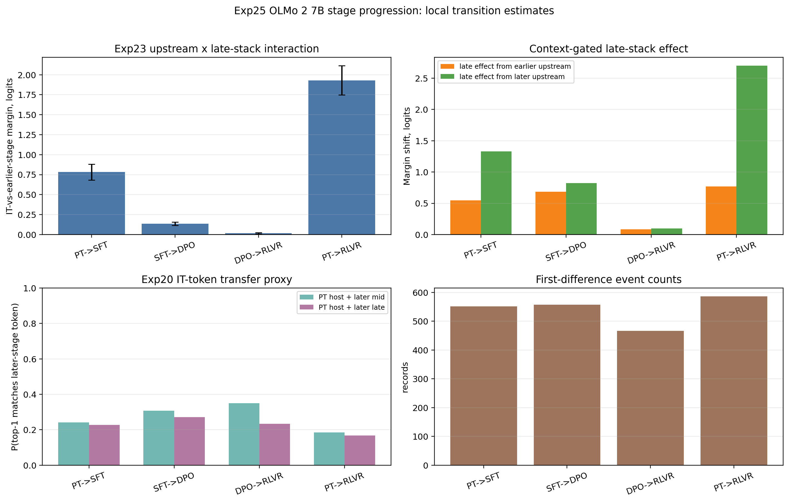
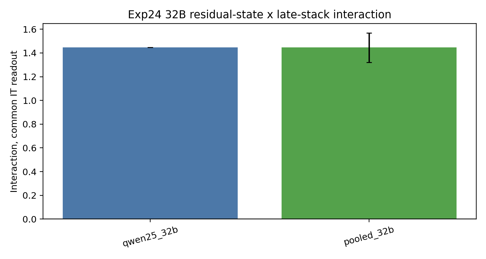

# First-Divergence Factorial Diffing for Post-Trained Language Models

**Anonymous authors** | NeurIPS 2026 Submission

---

## Abstract

Late-layer patching is a tempting one-cell summary of how post-training changes a model, but it can be unstable across prompt regimes. We show this at the first PT/IT next-token disagreement: on a factual/reasoning stress test, the late-only effect from PT upstream moves against the post-trained token (`-1.18` logits), while the upstream × late-stack interaction remains positive (`+1.81`). We introduce **first-divergence factorial diffing** to measure that interaction directly: at the earliest shared-history prefix where a pretrained checkpoint (PT) and its post-trained descendant (IT) prefer different next tokens, we cross PT/IT upstream residual state with PT/IT downstream late stack and score the IT-vs-PT divergent-token margin. Across six dense PT/IT pairs, including Qwen2.5-32B, the interaction is positive in every family. We use the Gemma-removed Dense-5 estimate as the conservative magnitude headline: `+1.71` logits (95% CI `[+1.64, +1.78]`). Including Gemma, the Dense-6 family-balanced summary is `+2.44` logits (`[+2.35, +2.52]`). The effect is not confined to immediate response openings: restricting to generated positions `≥3` still gives `+1.43` logits (`[+1.30, +1.57]`), with all six family-specific intervals above zero. The sign is label-aligned under a permutation null on the 4B-8B five-family raw-record subset (`p=5×10⁻⁵`). A staged OLMo-2 case study shows where the same estimand appears along one released post-training path: the largest adjacent-stage jump is Base→SFT (`+0.78`), followed by smaller positive SFT→DPO (`+0.14`) and DPO→RLVR (`+0.016`) interactions. Supporting tests give a graded anatomy of the change: middle-positioned MLP substitutions transfer token identity more often, while late-positioned substitutions and native late MLP write-outs have larger margin/readout effects. The contribution is a reusable diagnostic protocol for paired-checkpoint diffing plus a cross-family characterization of how post-training changes next-token formation at the first PT/IT disagreement.

---

## 1. Introduction

Suppose a pretrained checkpoint (PT) and its post-trained descendant (IT) read the same prefix and arrive at different next-token preferences — say PT prefers `.` and IT prefers `,`. This is a model-diffing question: what changed inside the forward pass when the checkpoint became instruction-following? The practical risk is that a late-layer patch can be interpreted as a portable post-training mechanism when it is actually measuring compatibility between a late stack and the upstream residual state it expects. The point is not that late transformer blocks ordinarily ignore upstream state; they do not. The point is whether the PT→IT change is portable as a late-only update, or whether post-training makes late computation effective only after earlier layers have shaped the residual stream toward the IT candidate.

A layerwise signature made this counterfactual worth testing: IT checkpoints show delayed stabilization, meaning decoded intermediate layers stay farther from the same checkpoint's final next-token distribution than PT layers do. Late-window graft/swap controls localize this delay to learned late MLP changes rather than generic late perturbations (§3.3). The first-divergence factorial asks the sharper model-diffing question: when PT and IT first disagree, does the learned IT late computation carry the IT-token margin by itself, or only in compatibility with an IT-shaped upstream state?

**Definition 1: first-divergence factorial diffing.** Let the **first-divergence prefix** be the earliest shared-history position where PT and IT prefer different next tokens; denote those tokens `t_PT` and `t_IT`. At a pre-specified late boundary, `U_PT` and `U_IT` are the residual states produced by running PT and IT on that identical prefix up to the boundary; `L_PT` and `L_IT` are the PT and IT downstream blocks from the boundary onward. The four hybrid forward passes are:

| Upstream state | PT late stack `L_PT` | IT late stack `L_IT` |
|---|---|---|
| PT upstream `U_PT` | PT baseline | Late-only |
| IT upstream `U_IT` | Upstream-only | Matched IT |

A readout `R` is specified separately (final norm, `lm_head`, real-token mask). The outcome is the divergent-token margin `Y_R(U,L) = logit(t_IT) − logit(t_PT)`. The primary estimand is the **upstream × late interaction**:

`[Y_R(U_IT,L_IT) − Y_R(U_IT,L_PT)] − [Y_R(U_PT,L_IT) − Y_R(U_PT,L_PT)]`.

A portable late-delta account of post-training would make this interaction small: the IT late stack would add a similar IT-token margin from PT-shaped and IT-shaped upstream states. We measure how far the paired PT/IT contrast departs from that account. This also makes the design a validity diagnostic for simple late-only effects: if the one-cell late-only estimate and the four-cell interaction disagree, the late-only estimate is not a stable summary of the PT→IT change. Common-IT and common-PT readout variants (which score every cell with one fixed readout) and the full implementation are described in §2.2.

**Result.** Across six dense PT/IT pairs, the upstream × late interaction is positive in every family. Because Gemma has the largest family-specific estimate, we lead with the Gemma-removed Dense-5 estimate (`+1.71` logits, 95% CI `[+1.64, +1.78]`) and report the all-family Dense-6 summary including Gemma separately (`+2.44` logits, `[+2.35, +2.52]`). A conservative later-position check at generated position `≥3` remains positive (`+1.43`) with all six family-specific intervals above zero. The interaction is label-aligned under a PT/IT label-swap null on the five-family 4B-8B raw-record subset (`p=5×10⁻⁵`) and remains positive even when the simple late-only term reverses sign on factual/reasoning prompts. Magnitude varies by family, prompt regime, and generated position; we treat that variation as regime structure of the PT→IT change, not as a failure of the claim. The OLMo-2 stage-lineage case study in §3.2 asks when the estimand appears along one released post-training path: the largest adjacent-stage jump is Base→SFT, followed by smaller positive SFT→DPO and DPO→RLVR interactions and a large Base→RLVR contrast. Details for Gemma, position thresholds, and Qwen2.5-32B are reported in §3.1 and Appendices A/F.

**Contributions.** The paper has three connected contributions.

1. **A validity diagnostic for late-only patching.** The factual/reasoning stress test exposes the central failure mode: the simple PT-upstream late-only term can reverse sign (`-1.18`) while the factorial interaction remains positive (`+1.81`). One-cell late-only patching is therefore not always a stable summary of the PT→IT change; it must be checked against the upstream context in which the late stack normally operates.
2. **A reusable paired-checkpoint estimand.** First-divergence factorial diffing tests portability directly at the natural PT/IT token disagreement by estimating the upstream × late interaction on the divergent-token margin. Across six dense PT/IT pairs, the interaction is positive in every family, remains positive without Gemma, survives the generated-position `≥3` check, and is label-aligned under a permutation null on the five-family 4B-8B raw-record subset. The OLMo-2 stage lineage shows where the estimand appears along one released post-training trajectory: the largest adjacent-stage jump is Base→SFT, followed by smaller positive SFT→DPO and DPO→RLVR interactions.
3. **A graded depth-route characterization of the change.** Candidate identity is more mid-sensitive: middle-positioned MLP substitutions transfer first-divergent token identity more often than late-positioned substitutions. Final margin/readout is more late-sensitive: late-positioned substitutions have larger margin effects, and late IT MLPs provide the strongest local IT-token support.

This does not claim to discover that late computation reads upstream state. The narrower contribution is to turn that working assumption into a falsifiable paired-checkpoint diagnostic with explicit nulls and stress tests. To our knowledge, prior paired-checkpoint diffing work (Du et al. 2025; Prakash et al. 2024; Lindsey et al. 2024; Minder et al. 2025) does not measure the upstream × late interaction at the natural first-token disagreement. The protocol applies to any paired-checkpoint contrast where the two checkpoints share architecture and tokenizer, including base→SFT, SFT→DPO, safety-tuned, reasoning-tuned, and constitution-modified model pairs.

We use **IT** throughout as readable shorthand for instruction-following post-trained descendants of released pretrained checkpoints; the recipes are heterogeneous (SFT, DPO, RLVR, multi-stage post-training), so the claim is about paired PT-versus-post-trained model diffs rather than a single training algorithm.

---

## 2. Setup

**Terminology used throughout the paper.**

| Term | Meaning |
|---|---|
| **PT / IT** | Pretrained checkpoint and its instruction-following post-trained descendant from the same model family. |
| **PT/IT pair** | One paired pretrained/post-trained checkpoint contrast. |
| **Dense-6 core set** | The six dense PT/IT pairs used for the core first-divergence factorial synthesis: Gemma 3 4B, Llama 3.1 8B, Qwen 3 4B, Mistral 7B, OLMo 2 7B, and Qwen2.5 32B. |
| **4B-8B Dense-5 support set** | The five 4B-8B dense families used in supporting analyses that were not rerun or not pooled with Qwen2.5-32B: Gemma 3 4B, Llama 3.1 8B, Qwen 3 4B, Mistral 7B, and OLMo 2 7B. |
| **Gemma-removed Dense-5** | The Dense-6 core set excluding Gemma, used as the conservative first-divergence magnitude summary: Llama 3.1 8B, Qwen 3 4B, Mistral 7B, OLMo 2 7B, and Qwen2.5 32B. |
| **First-divergence prefix** | Earliest shared-history position where PT and IT prefer different next tokens (`t_PT` vs `t_IT`). |
| **Late stack** | Transformer blocks from the pre-specified late boundary to the final hidden state. |
| **Late-MLP window** | MLP sublayers inside the pre-specified late window; used in graft/swap, identity/margin, and write-out tests. |
| **Early / middle / late windows** | Overlapping depth windows at comparable normalized depths across families (Appendix F gives boundaries). The middle/late identity-margin split in §3.4 is a relative-localization signal across overlapping windows, not a partition into disjoint subnetworks. |
| **Divergent-token margin** | `Y_R(U,L) = logit(t_IT) − logit(t_PT)`, scored under a fixed readout `R`. |
| **Upstream × late interaction** | `[Y(U_IT,L_IT) − Y(U_IT,L_PT)] − [Y(U_PT,L_IT) − Y(U_PT,L_PT)]`, the primary estimand. |
| **Final-20% KL region** | Final normalized-depth segment used to summarize `KL(layer || own final)` in §3.3. |

### 2.1 Models

The core first-divergence evidence covers six dense PT/IT pairs. The five 4B-8B members are:

| Model | Layers | d_model | Attention | Pre-training data | Post-training |
|---|---|---|---|---|---|
| Gemma 3 4B | 34 | 2560 | GQA, hybrid local/global (5:1) | Undisclosed | Multi-stage post-training |
| Llama 3.1 8B | 32 | 4096 | GQA, all global | 15T tokens | Iterative supervised + preference optimization |
| Qwen 3 4B | 36 | 2560 | GQA, all global | 36T tokens, 119 languages | Multi-stage post-training |
| Mistral 7B v0.3 | 32 | 4096 | GQA, full attention (`sliding_window=null`) | Undisclosed | Instruct checkpoint |
| OLMo 2 7B | 32 | 4096 | MHA, all global | OLMo-mix-1124 | SFT + DPO + RLVR |

The sixth dense member is larger:

| Model | Layers | d_model | Attention | Role |
|---|---:|---:|---|---|
| Qwen2.5 32B | 64 | 5120 | GQA, all global | Included in the Dense-6 core first-divergence synthesis. |

The exact Hugging Face checkpoint IDs used by the Dense-6 core runs are:

| Family | PT checkpoint | IT checkpoint |
|---|---|---|
| Gemma 3 4B | `google/gemma-3-4b-pt` | `google/gemma-3-4b-it` |
| Llama 3.1 8B | `meta-llama/Llama-3.1-8B` | `meta-llama/Llama-3.1-8B-Instruct` |
| Qwen 3 4B | `Qwen/Qwen3-4B-Base` | `Qwen/Qwen3-4B` |
| Mistral 7B v0.3 | `mistralai/Mistral-7B-v0.3` | `mistralai/Mistral-7B-Instruct-v0.3` |
| OLMo 2 7B | `allenai/OLMo-2-1124-7B` | `allenai/OLMo-2-1124-7B-Instruct` |
| Qwen2.5 32B | `Qwen/Qwen2.5-32B` | `Qwen/Qwen2.5-32B-Instruct` |

These checkpoint IDs and their pinned Hugging Face snapshot revisions are part of the estimand: the claim is about these released PT/post-trained descendants, not an abstract training algorithm. The native layerwise curves use each model in its native prompting regime; raw-shared first-divergence and residual-state runs force identical raw prompt token IDs before comparing residual states. Appendix G records the immutable revisions now used by the experiment loaders, tokenizer notes, chat-template behavior, and the historical limitation that earlier traces stored repo IDs rather than resolved snapshot hashes.

Grouped rows labeled Dense-6 include Qwen2.5-32B. Rows labeled 4B-8B Dense-5 or Dense-4 deliberately exclude it because the corresponding supporting analysis was only run or only pooled for the five 4B-8B families. Rows labeled Gemma-removed Dense-5 are different: they are the Dense-6 core set with Gemma excluded, so they include Qwen2.5-32B. The Qwen2.5-32B PT/IT run repeats the core first-divergence factorial, identity/margin, MLP write-out, and raw-KL bridge analyses; its standalone details are reported in Appendix A.7, and its interaction is included in the Dense-6 §3.1 estimate. A non-pooled OLMo-2 7B stage-progression case study applies the same first-divergence factorial to released Base, SFT, DPO, and Instruct/RLVR checkpoints; it is reported in §3.2 and Appendix A.8 as local transition evidence, not as an additive decomposition of the full Base→Instruct/RLVR contrast.

### 2.2 Readouts and interventions

The implementation is model-adapter based rather than feature-dictionary based. Matched-prefix graft/swap and first-divergence tests operate on raw MLP activations and residual-stream states through a shared adapter interface, and no core claim depends on transcoders, SAEs, or model-specific decomposition dictionaries. The reported residual interventions are restricted to paired PT/IT checkpoints with compatible residual dimensions, tokenizer IDs for the tested prompts/tokens, and block semantics; we do not patch residual states across unrelated architectures.

Definition 1 fixes the core notation. The setup section adds the implementation details needed to interpret the interventions:

| Object | Implementation detail | Role in the story |
|---|---|---|
| First-divergence factorial diffing | Patch upstream residual state at the late boundary, run PT or IT downstream blocks at the first-divergence prefix, then score with a specified readout. | Estimates the primary upstream-late interaction. |
| Identity/margin decomposition | Measure token transfer separately from the IT-vs-PT logit margin at the same shared prefix. | Separates candidate identity from final readout pressure. |
| Delayed-stabilization context | Track `KL(p_l || p_L)` from each layer's decoded distribution to the same model's final distribution. | Motivates testing late windows under controlled histories. |

Prompting is matched to the question being asked:

| Analysis | Prompt regime | Why this regime is used |
|---|---|---|
| First-divergence factorial and identity/margin tests | **Raw-shared:** PT and IT receive identical raw prompt token IDs before the divergent-token comparison. | Isolates checkpoint computation under a shared history. |
| Native layerwise convergence curves | **Native:** PT uses raw prompt text; IT uses the checkpoint chat template. | Measures the deployment-style layerwise signature that motivated late-window interventions. |
| Matched-prefix graft/swap and JS replay | **Teacher-forced shared histories** under the run's specified raw or native prompt stream. | Tests late-window effects after removing generated-history divergence. |

**First-divergence position distribution.** First-divergence prefixes are selected events, not random token positions. In the five-family 4B-8B holdout, the `2,983` valid events occur early: mean generated position `2.17`, median `0`, with `1,499` at the first generated token. Qwen2.5-32B contributes `1,397` additional valid events with a later median position (`2`), giving `4,380` Dense-6 prompt clusters for the core synthesis. Position `0` is still the next-token prediction after the full raw prompt under identical raw token IDs, not a BOS-only or chat-template comparison. The five-family IT-side divergent tokens are mixed (`1,265` content, `685` format, `1,033` function/other), and `551/2,983` events contain an assistant-marker token. We treat position as an informative axis of the phenomenon: first-response disagreements, later-content disagreements, and format/safety/register disagreements are different regimes of post-training behavior. Section 3.1 therefore reports position-stratified and category-mix checks; Appendices A.7 and F give the full distribution notes.

The late boundary in the Dense-6 first-divergence factorial is the first layer of the pre-specified late window: Gemma layer `20`, Llama layer `19`, Qwen3 layer `22`, Mistral layer `19`, OLMo layer `19`, and Qwen2.5-32B layer `38` (late window `38-63`). Appendix F lists the five 4B-8B windows and boundary-sensitivity checks; Appendix A.7 reports the Qwen2.5-32B details.

Implementation details matter for interpretation but are mechanical: residual-state patching replaces the full hidden-state sequence at the late boundary and recomputes downstream blocks; the diagonal 2×2 cells are asserted to reconstruct native PT/IT passes; and the off-diagonal cells are the only non-trivial hybrids. Appendix G gives the exact tolerance, clustering rule, and audit paths.

Supporting machinery: the delayed-stabilization signature `KL(p_l || p_L)` for layerwise context, same-history replay and endpoint matching (coarsened exact matching, Iacus et al. 2012, on final entropy and top-1/top-2 margin) for confound control, label-swap permutation nulls, and matched random residual-projection controls for the late-MLP KL analysis (per Heimersheim and Nanda 2024). Each is introduced only where it protects a claim.

All causal language is intervention-scoped: replacing an upstream state, late stack, or MLP window in a constructed forward pass changes a specified readout. The protocol does not assert that hybrid states are natural states or that any intervention recovers a feature-level circuit; matched histories, label-swap controls, raw-shared validation, and the matched random control reduce obvious artifacts but do not remove the need to interpret each intervention with its metric and direction fixed.

Secondary diagnostics are demoted to appendices. Commitment summaries and raw-lens variants address metric/probe robustness; `δ`-cosine and feature-level Gemma analyses are supplementary diagnostics, not part of the evidence spine.

### 2.3 Evidence sets

The core Dense-6 first-divergence results use controlled-history runs that freeze the token history, compare pure and intervened PT/IT branches, and supply the upstream-late factorial. The five 4B-8B runs use 400- and 600-prompt subsets from the same broad prompt pool; Qwen2.5-32B uses its own larger prompt set and is pooled into the Dense-6 factorial synthesis. Supporting identity/margin decomposition, same-history JS, graft/swap, and MLP write-out analyses are labeled by their actual scope: Dense-6 when Qwen2.5-32B is included, 4B-8B Dense-5 when only the five 4B-8B families are pooled, and Gemma-removed Dense-5 when the Dense-6 core set is summarized without Gemma.

Layerwise context comes from two supporting runs: a native free-running 2,936-prompt convergence analysis, and a dense-family 600-prompt endpoint-matched run with raw and tuned probes.

### 2.4 Code and artifact availability

For double-blind review, code and paper-facing artifacts are released through an anonymized archive containing the model adapters, experiment packages, launch scripts, analysis scripts, prompt datasets, summary tables, bootstrap intervals, human-audit summaries, and final plots needed to audit the claims.

The release commits the summaries and plots from which manuscript numbers are read, plus a mechanical audit entrypoint, `bash scripts/reproduce/reproduce_claims_from_summaries.sh`, that checks the primary numbers against those artifacts. Large raw activation arrays, probe tensors, tuned-lens checkpoints, and per-token traces are omitted from git for size and mirrored separately where needed. Appendix G maps each main claim to commands, expected artifacts, expected numbers, and rerun costs.

Internal run identifiers and file-level provenance are kept in Appendix G and the anonymized artifact archive rather than in the main narrative.

---

## 3. Results

The results start with the primary first-divergence factorial. The question is not whether late layers read upstream state in the ordinary architectural sense; they do. The question is whether a late-only PT→IT patch is a stable model-diffing summary, or whether its effect changes with the upstream residual state. We then use OLMo-2's released Base/SFT/DPO/RLVR lineage to ask where the estimand appears along one post-training path. Finally, we give the delayed-stabilization context that made late windows worth testing, followed by the first-divergence identity/margin decomposition.

### 3.1 Core diagnostic: late-stack effects are not portable across upstream states

> *TL;DR. The same late stack has a much larger effect on the divergent-token margin from an IT-shaped upstream state than from a PT-shaped one. The asymmetry is positive in every Dense-6 core family; the conservative Gemma-removed magnitude is `+1.71` logits, and the all-family Dense-6 summary including Gemma is `+2.44`. It remains positive at generated position `≥3` with all six family intervals above zero and is label-aligned in the five-family 4B-8B raw-record null (`p=5×10⁻⁵`). On factual/reasoning prompts, the simple late-only term reverses sign while the factorial interaction stays positive, so the one-cell late-only patch is not a stable summary of the PT→IT change.*

Using Definition 1 with a fixed readout `R`, the simple late effect from PT upstream is `Y_R(U_PT,L_IT) − Y_R(U_PT,L_PT)`; the simple late effect from IT upstream is `Y_R(U_IT,L_IT) − Y_R(U_IT,L_PT)`; their difference is the upstream × late interaction, the paper's primary estimand. This section reports both the factorial interaction and the one-cell late-only term because their disagreement is the diagnostic: if late-only patching were a portable summary, the two would tell the same story. The common-IT readout scores every cell with the IT final norm, `lm_head`, and real-token mask; the common-PT variant uses the PT readout analogously; native readouts score each cell with its host checkpoint's own readout.

**The 2×2 decomposition.** Under the common-IT readout, swapping in the IT late stack shifts the IT-vs-PT margin by `+0.639` logits (95% CI `[+0.570, +0.709]`) from a PT upstream state, but by `+3.076` logits (95% CI `[+2.978, +3.174]`) from an IT upstream state. For the Dense-6 core set, the matched 2×2 decomposition gives a late-stack main effect of `+1.858` `[+1.786, +1.930]`, a larger upstream-context effect of `+3.874` `[+3.761, +3.987]`, and a positive interaction of `+2.437` `[+2.353, +2.521]`. Because Gemma has the largest family-specific estimate, we treat the Gemma-removed Dense-5 interaction (`+1.71`, 95% CI `[+1.64, +1.78]`) as the conservative magnitude headline, while the Dense-6 number is the all-family summary including Gemma. Thus the IT late stack is not a portable late delta: the same downstream computation contributes much more IT-token margin when the upstream state is already IT-shaped. This upstream × late interaction is the paper's central model-diffing estimate.

*Common-PT readout cross-check.* Scoring every cell with the PT readout instead gives the same direction and magnitudes (`+0.662`, 95% CI `[+0.600, +0.724]`, versus `+3.083`, 95% CI `[+2.986, +3.180]`, for IT-late given PT versus IT upstream; interaction `+2.421`, 95% CI `[+2.337, +2.506]`), confirming the result is not a readout-choice artifact.

**Dissociation from the simple late-only effect.** On a factual/reasoning stress test, the IT late stack from PT upstream moves *against* the IT token (`-1.18` logits, 95% CI `[-1.26, -1.09]`), while the upstream × late interaction remains positive (`+1.81` logits, 95% CI `[+1.72, +1.90]`). This is the failure mode the factorial is meant to catch: the simple late-only term tracks prompt regime, while the four-cell interaction continues to measure whether late computation is portable across upstream states. Appendix F gives the factual/reasoning, per-family, and subgroup breakdowns.

The practical diagnostic is the gap between two late-stack effects: the one-cell late-only patch from PT upstream, and the matched-context late effect from IT upstream. We call this the **late-effect portability gap** in the table below; algebraically it is the same upstream × late interaction, not a new estimand. The scope column matters: the Gemma-removed row is the conservative magnitude headline, the Dense-6 row is the all-family synthesis including Gemma, and subgroup rows use the 4B-8B five-family artifacts that carry prompt, token, and position labels. The all-family Dense-6 generated-position `≥3` interaction is `+1.43`; the `+1.52` row below is the corresponding 4B-8B Dense-5 labeled-position audit.

| Regime | Scope | Late-only from PT upstream | Matched-context late effect | Portability gap / interaction | Diagnostic read |
|---|---|---:|---:|---:|---|
| First-divergence | Gemma-removed Dense-5 | `+0.75` | `+2.46` | `+1.71` | Conservative magnitude headline. |
| First-divergence | Dense-6 family-balanced core synthesis | `+0.64` | `+3.08` | `+2.44` | All-family summary including Gemma. |
| Factual/reasoning extension | 4B-8B Dense-5 content/reasoning extension | `-1.18` | `+0.64` | `+1.81` | Sign failure for the late-only summary. |
| Later positions `≥3` | 4B-8B Dense-5 labeled-position audit | `+0.98` | `+2.49` | `+1.52` | Underestimates in later shared-history regimes. |
| Governance/conversation | 4B-8B Dense-5 subgroup-labeled records | `+0.64` | `+2.69` | `+2.05` | Underestimates. |
| Format/register | 4B-8B Dense-5 subgroup-labeled records | `+0.76` | `+4.37` | `+3.61` | Strong underestimation. |
| Safety | 4B-8B Dense-5 subgroup-labeled records | `+0.25` | `+3.08` | `+2.83` | Strong underestimation. |

**Label alignment.** A label-swap control asks whether the sign is PT/IT-oriented rather than an arbitrary orientation. On the five-family 4B-8B raw-record subset, preserving each prompt's four factorial cell values but randomly swapping PT/IT labels gives a null centered near zero (99.9th percentile `+0.239` logits), while the observed 4B-8B Dense-5 interaction is far outside it (`+2.64`, `p=5.0e-5` with `20,000` permutations). This does not replace the Dense-6 interval evidence above; it rules out a metric-construction artifact in the raw-record subset where the null can be recomputed directly.

**Position regimes.** In the Dense-6 core set, the interaction remains positive after removing immediate first-token divergences (`+2.08`, 95% CI `[+1.96, +2.19]`) and through generated position `≥3` (`+1.43`, 95% CI `[+1.30, +1.57]`; all six family-specific intervals above zero). Position selects different disagreement regimes — format and safety openings, mid-response content disagreements, later shared-history disagreements — and the magnitude differences across them are part of the result. Position 0 is not a chat-template or BOS artifact: the factorial uses raw-shared prompts on both branches, validates identical token IDs, and evaluates the first generated token after the full prompt-conditioned residual state. Per-position thresholds appear in the headline-robustness table below; the 4B-8B five-family category-mix audit for the `≥3` subset is in Appendix F, and the Qwen2.5-32B audit is in Appendix A.7.

![Figure 2: Core diagnostic: late-stack effects are not portable across upstream states under this readout. First-divergence factorial diffing crosses upstream residual state with downstream late stack while holding the scoring readout fixed. The conservative magnitude headline is the Gemma-removed Dense-5 interaction (`+1.71` logits, 95% CI `[+1.64, +1.78]`). The all-family Dense-6 common-IT 2x2 contrast shown at left gives an IT late-stack effect of `+0.64` logits from PT upstream and `+3.08` logits from IT upstream, producing an upstream-state x late-stack interaction of `+2.44` logits (95% CI `[+2.35, +2.52]`). The right panel shows family-level interaction CIs for all six dense pairs; each per-family 95% interval excludes zero. A conservative generated-position `≥3` check remains positive (`+1.43` logits, `[+1.30, +1.57]`) with all six family intervals above zero, showing the result is not only an immediate response-opening effect. The label-swap null is computed on the five-family 4B-8B raw-record subset, where the observed 4B-8B Dense-5 interaction is far outside the null 99.9th percentile (`+0.239` logits; `p=5.0e-5`). The factual/reasoning stress test reported in text is the companion validity check: the one-cell late-only term flips sign while this interaction remains positive. We do not use the IT/PT ratio as the inferential quantity because the small PT-upstream denominator inflates ratios. Magnitude varies by family and by first-divergence position (Section 3.1, Appendix F).](../results/paper_synthesis/exp23_dense6_core/exp23_dense6_interaction.png)

Families are sorted ascending by interaction magnitude; the IT/PT ratio is omitted because the small PT-upstream denominator inflates ratios (descriptive only) and the logit interaction is the inferential quantity.

| Family | First-divergence records | IT late stack from PT upstream | IT late stack from IT upstream | Interaction (95% CI) |
|---|---:|---:|---:|---:|
| Llama 3.1 8B | `600` | `+0.79` | `+2.05` | `+1.25` `[+1.10, +1.42]` |
| Qwen2.5 32B | `1,397` | `+0.98` | `+2.42` | `+1.45` `[+1.32, +1.57]` |
| Qwen 3 4B | `600` | `+0.59` | `+2.05` | `+1.46` `[+1.32, +1.62]` |
| OLMo 2 7B | `586` | `+0.76` | `+2.61` | `+1.85` `[+1.67, +2.03]` |
| Mistral 7B | `597` | `+0.61` | `+3.15` | `+2.53` `[+2.35, +2.72]` |
| Gemma 3 4B | `600` | `+0.10` | `+6.18` | `+6.08` `[+5.72, +6.44]` |
| Gemma-removed Dense-5 | `3,780` | `+0.75` | `+2.46` | `+1.71` `[+1.64, +1.78]` |
| Dense-6 (family-balanced) | `4,380` | `+0.64` | `+3.08` | `+2.44` `[+2.35, +2.52]` |

**Family heterogeneity, including Gemma.** The interaction is positive in all six dense pairs, but the magnitude is not uniform: Llama is smallest (`+1.25`) and Gemma is largest (`+6.08`). We therefore use the Gemma-removed Dense-5 estimate (`+1.71`) as the conservative magnitude headline, while `+2.44` is the family-balanced Dense-6 summary including Gemma. Other robust summaries are similar: family median `+1.66` and trimmed mean `+1.82`. Appendix A.1 centralizes the Gemma diagnostics; we report Gemma as a high-magnitude family rather than explaining it away with a single weight-change story.

**Subgroups.** In the 4B-8B five-family holdout with detailed category labels, the interaction is positive for every prompt-category subgroup: conversational/governance (`+2.05`), format (`+3.61`), safety (`+2.83`), and for every first-divergent IT-token type: content-like (`+2.50`), format (`+2.60`), function/other (`+2.81`). These strata characterize where the estimate comes from rather than adding new claims; Qwen2.5-32B category notes are in Appendix A.7.

**Headline robustness (the interaction).** The interaction is positive across every family aggregation and position threshold we test. Magnitude variation across these axes is part of the characterization: early response formation and Gemma have larger effects, while later-position and Gemma-removed estimates remain positive. Rows labeled 4B-8B Dense-5 are intentionally five-family diagnostics where the underlying artifact does not include Qwen2.5-32B; rows labeled Gemma removed summarize the Dense-6 core set without Gemma.

| Check | Result | Interpretation |
|---|---:|---|
| Gemma-removed Dense-5 | `+1.71` `[+1.64, +1.78]` | Conservative summary; not only a Gemma effect. |
| Dense-6 family-balanced | `+2.44` `[+2.35, +2.52]` | All-family summary including Gemma. |
| Family median | `+1.66` | Typical-family magnitude across six dense pairs. |
| Trimmed family mean | `+1.82` | Drops smallest and largest family interactions. |
| Drop generated position 0 | `+2.08` `[+1.96, +2.19]` | Not only an immediate-disagreement effect. |
| Generated position `≥3` | `+1.43` `[+1.30, +1.57]` | All six family-specific intervals above zero. |
| Generated position `≥3`, Gemma removed | `+0.83` `[+0.75, +0.91]` | Later-position regime remains positive without Gemma. |
| Generated position `≥5` | `+1.48` `[+1.28, +1.68]` | Lower-powered later-position regime. |
| Generated position `≥5`, Gemma removed | `+0.80` `[+0.70, +0.90]` | Llama family interval compatible with zero in the 4B-8B five-family subset. |
| Factual/reasoning stress test (4B-8B Dense-5) | `+1.81` `[+1.72, +1.90]` | Persists outside governance/register-heavy holdout. |
| Label-swap null (4B-8B Dense-5 raw records) | observed `+2.64`; null 99.9% `+0.239`; `p=5×10⁻⁵` | Interaction is PT/IT-label aligned where the raw null is recomputed. |

All rows above use the common-IT 2×2 interaction readout. The diagnostic table separates the PT-upstream late-only term from the matched-context late effect; this robustness table focuses on the interaction itself.

The staged-lineage question is separated in §3.2 because it is not a pooled robustness check: it asks where this same estimand appears along one released post-training trajectory.

**Companion controls (identity/margin decomposition and late-window context).**

| Check | Result | Interpretation |
|---|---:|---|
| Raw-shared PT-host IT-token transfer (4B-8B Dense-5 support set) | middle `26.0%` `[24.5%, 27.7%]`; late `17.6%` `[16.2%, 18.9%]` | Identity split survives without native IT templates; Qwen2.5-32B repeats the same ordering in Appendix A.7. |
| Native IT-template IT-host margin drop (4B-8B Dense-5 support set) | late `13.25` logits `[12.91, 13.61]`; middle `12.01` `[11.66, 12.35]` | Native prompting makes late margin/readout strongest. |
| Matched random residual projection (4B-8B Dense-5 support set, final-20% KL) | true late graft `+0.327` nats `[+0.298, +0.359]`; random `+0.003` `[-0.002, +0.008]` | Late MLP graft is not a generic late-window perturbation. |

### 3.2 OLMo-2 stage progression: the largest adjacent-stage jump is Base→SFT

> *TL;DR. The OLMo-2 released lineage turns the endpoint PT→IT contrast into a stage question. Under the same first-divergence factorial, the largest adjacent-stage interaction appears at Base→SFT (`+0.782` logits), while SFT→DPO (`+0.135`) and DPO→RLVR (`+0.016`) are positive but much smaller. The full Base→RLVR contrast is large (`+1.930`), but adjacent rows are local transition estimates, not additive components.*

The Dense-6 result compares released PT and post-trained endpoints across heterogeneous training recipes. OLMo-2 gives a cleaner within-lineage check because AllenAI released Base, SFT, DPO, and Instruct/RLVR checkpoints for the same 7B architecture and tokenizer family. We therefore rerun the first-divergence factorial on four OLMo transitions: Base→SFT, SFT→DPO, DPO→RLVR, and the full Base→RLVR endpoint contrast.

This case study asks a different question from the Dense-6 pool: not "is the interaction positive across families?", but "where does this interaction first appear along one released post-training path?" Each row below uses its own first-divergence prefixes and divergent-token pairs, so the adjacent-stage estimates should not be summed to recover the full Base→RLVR number.

**Table 2: OLMo-2 7B local transition estimates.** All rows use raw-shared first-divergence factorial diffing under the common later-stage readout. "Later-stage late effect" and "earlier-stage late effect" are the simple late-stack effects from later-shaped and earlier-shaped upstream states, respectively.

| Transition | Valid first-divergence events | Interaction (95% CI) | Later-stage late effect | Earlier-stage late effect | IT-token transfer proxy | Interpretation |
|---|---:|---:|---:|---:|---:|---|
| Base→SFT | `551` | `+0.782` `[+0.681, +0.882]` | `+1.328` | `+0.546` | mid+late `40.8%` vs mid `24.1%` | Strongest adjacent-stage interaction. |
| SFT→DPO | `557` | `+0.135` `[+0.114, +0.157]` | `+0.821` | `+0.686` | mid+late `57.1%` vs mid `30.7%` | Smaller preference-stage refinement. |
| DPO→RLVR | `466` | `+0.016` `[+0.008, +0.025]` | `+0.098` | `+0.082` | mid+late `43.8%` vs mid `35.0%` | Positive but tiny local addition. |
| Base→RLVR | `586` | `+1.930` `[+1.749, +2.112]` | `+2.698` | `+0.768` | mid+late `36.0%` vs mid `18.4%` | Full endpoint contrast remains large. |

The ordering is the important result: Base→SFT accounts for the largest adjacent-stage shift under this readout, while DPO and RLVR add smaller positive local changes. This is consistent with supervised instruction tuning doing most of the adjacent-step rerouting of first-divergence next-token formation in this lineage, with later preference/reasoning stages refining rather than recreating that middle-to-late compatibility. The full Base→RLVR interaction is larger than any adjacent row because it measures a different endpoint contrast on its own selected first-divergence events. Appendix A.8 gives the tokenizer and preflight details for the stage run.

### 3.3 Layerwise context: delayed stabilization and late-window localization

> *TL;DR. Context for why we tested late windows: IT models stay farther from their own final-layer prediction than PT models do. Late-MLP grafts have the largest tested leverage on that delay, with specificity confirmed against a matched random control (`+0.327` nats vs `+0.003`). This section motivates the late boundary used by the factorial; it is not the causal headline.*

The §3.1 factorial result is computed on raw logits at the divergent prefix and does not depend on a learned probe; this section provides the layerwise context for why we tested late windows in the first place. Under native free-running decoding, IT models remain farther from their own final next-token distribution than PT models do through much of the forward pass. Under the tuned lens, the dense-family IT-minus-PT `KL(layer || own final)` gap is positive in the early, middle, and late thirds of the network (`+0.62`, `+0.54`, and `+0.33` nats), and raw-lens variants preserve the qualitative ordering.

Intervals in this section are family-bootstrap (over dense-family means) for KL graft/swap depth ablations and prompt-bootstrap for random-control rows; they support the layerwise context and are not the same bootstrap object as the §3.1 factorial intervals.

This metric is endpoint-relative, so we check it against the most direct endpoint and history confounds. After matching token steps on final entropy, final confidence, and final top-1/top-2 margin, the late IT-minus-PT gap remains positive under both raw (`+0.425` nats, 95% CI `[+0.356, +0.493]`) and tuned (`+0.762` nats, 95% CI `[+0.709, +0.814]`) probes. Under identical teacher-forced histories, same-layer PT/IT JS divergence is also positive and grows late (`0.121` pre-late to `0.196` final-20% under the prompt-mean regional estimator). Appendix A gives the full endpoint-matching, same-history replay, probe, commitment, per-family, and reverse-teacher views.

Under identical token histories, late MLP substitutions have the largest tested leverage on that delayed-stabilization side. On the dense-family mean, the final-20% KL effect is `+0.34` nats (family-bootstrap 95% CI `[+0.18, +0.50]`) for PT with late IT MLPs grafted in, versus `-0.03` (95% CI `[-0.10, +0.02]`) early and `-0.05` (95% CI `[-0.11, +0.02]`) middle. The raw late-graft effect is positive in all five dense families (`+0.115` to `+0.609` nats), and leave-one-family-out dense means remain positive (`+0.274` to `+0.398`), so the result is not driven by a single family.

The mirrored swap test asks whether removing late IT MLPs from an IT host also reduces the delay. It does: replacing late IT MLPs with PT MLPs produces the largest reduction of IT delayed stabilization, with a dense-family mean effect of `-0.51` nats (family-bootstrap 95% CI `[-0.83, -0.22]`) versus `-0.10` (95% CI `[-0.26, +0.03]`) early and `-0.23` (95% CI `[-0.37, -0.09]`) middle.

A matched random-control follow-up rules out the simplest "late layers are fragile" reading. Replacing the learned late IT-minus-PT MLP effect with matched random residual-projection controls gives a dense-family final-20% KL effect of `+0.003` nats (`[-0.002, +0.008]`), compared with `+0.327` (`[+0.298, +0.359]`) for the true late graft — a true-minus-random margin of `+0.324` nats (`[+0.294, +0.358]`). Late MLP substitutions are therefore the only tested substitutions with a large delayed-stabilization effect, not generic perturbations of a sensitive window. Appendix A gives per-family, probe, weight-change, and random-control details.

### 3.4 Supporting decomposition: middle-positioned substitutions transfer identity more often than late substitutions

> *TL;DR. Within the 4B-8B Dense-5 support-set decomposition, middle-positioned MLP substitutions transfer token identity more often than late-positioned (`26%` vs `18%`; both well below 50%, so neither window alone controls token identity — this is a relative-localization signal). Late-positioned substitutions show larger margin/readout effects. Qwen2.5-32B repeats the same middle-over-late identity ordering in Appendix A.7, but the full table below keeps the common 4B-8B Dense-5 bootstrap scope.*

The factorial estimates the upstream × late interaction; we now ask what the middle and late windows contribute to first-divergence token formation. At prefixes where PT and IT first choose different next tokens, which depth window changes the token identity and which changes the final margin? The first-divergence test evaluates intervened models at the shared prefix, and the companion MLP write-out test measures each window's finite-difference logit support for the PT token, the IT token, and top alternatives.

Identity and margin readouts are reported in one table so the two effects are not conflated; intervals are 95% percentile bootstrap over the 4B-8B Dense-5 support-set prompt clusters or prompt-level first-divergence records. The middle and late windows overlap by 3–4 layers per family (Appendix F), so the comparison below is between *overlapping* depth windows at comparable normalized depths, not between disjoint subnetworks; the asymmetry should be read as a relative-localization signal rather than as evidence for non-overlapping module assignments.

| Readout | Early MLP window | Middle MLP window | Late MLP window | What it says |
|---|---:|---:|---:|---|
| PT host: IT-token transfer | — | `26.0%` `[24.5%, 27.7%]` | `17.6%` `[16.2%, 18.9%]` | Middle substitutions transfer candidate identity more often. |
| IT host: PT-token transfer | — | `31.2%` `[29.6%, 32.9%]` | `20.8%` `[19.4%, 22.3%]` | Mirror direction gives the same identity pattern. |
| IT-host margin drop | `11.53` `[11.20, 11.88]` | `12.01` `[11.66, 12.35]` | `13.25` `[12.91, 13.61]` | Late substitutions have the largest margin effect. |
| Pure IT MLP support for `t_IT` | `-0.041` `[-0.049, -0.032]` | `+0.021` `[+0.011, +0.032]` | `+0.789` `[+0.754, +0.825]` | Native IT-token support is concentrated late. |
| PT-to-IT change in `t_IT` support | `+0.034` `[+0.027, +0.042]` | `+0.070` `[+0.059, +0.080]` | `+0.715` `[+0.683, +0.747]` | The learned write-out difference is also concentrated late. |

The first two rows give the identity side. The transfer rates are well below `50%`, so a single-window MLP substitution does not dominantly redirect token identity. The middle-over-late gap is a relative localization signal: middle windows are systematically more involved in candidate identity than late windows, not a claim that any one window alone controls the divergent token.

The last three rows show why the late window still matters. Late MLP windows have the largest effect on the IT-vs-PT margin and provide the strongest local support for the IT divergent token in native IT runs. The local MLP-only proxy is included as a miniature version of the §3.1 portability check: inside the native IT trajectory the late MLP update strongly supports `t_IT`, but transplanting late IT MLP updates into a PT host changes the same fixed-prefix IT-vs-PT margin by only `+0.0035` logits (95% CI `[-0.001, +0.009]`). Thus the write-out rows should be read as native late support, not as evidence for a portable MLP-only module.

Putting both sides together: middle windows are more diagnostic of which PT- or IT-like token candidate is exposed, while late windows interact with upstream state to shape the final margin. Mid and late windows must be modeled jointly under this readout — neither in isolation captures the PT/IT disagreement. The delayed-stabilization pattern in §3.3 is the layerwise trace of this handoff: upstream state already encodes much of the PT/IT decision, and late computation changes the margin only in compatibility with that state. Appendix A gives the token-flow chronology and additional same-history controls.

## 4. Related Work: From Stage Heuristics to Estimands

**What prior work does not provide.** Prior work makes late-stage dependence plausible, but it does not give a diagnostic for whether a late-only patch is portable across upstream states at the actual PT/IT disagreement token. Our contribution is the estimand: a paired PT/IT upstream-state × late-stack interaction at the first natural token where the checkpoints disagree, with a label-swap permutation null for the factorial and a matched random residual-projection control for the late-MLP localization. Du et al. (2025) is the closest cross-family comparator: they compare base and post-trained checkpoints globally on knowledge, truthfulness, refusal, and confidence; we condition on the natural first-token disagreement and run hybrid-pass interventions at that exact prefix. Prakash et al. (2024) is the closest methodological precedent (cross-model activation patching across base and fine-tuned models); their target is entity tracking and ours is the natural PT/IT next-token disagreement under matched-prefix control. Following the caution urged by activation-patching work (Heimersheim and Nanda 2024), we describe these interventions as effects on measured readouts, not as complete mechanism recovery.

**What the estimand rules out.** Since transformer layers are trained end-to-end, ordinary upstream dependence is not the claim and would not be novel. The model-diffing claim is narrower: the PT→IT change does not behave like a portable late update whose IT-token margin contribution is similar across PT-shaped and IT-shaped upstream states. The factual/reasoning stress test makes this sharper: the simple late-only term can move against the IT token while the upstream × late interaction remains positive. This is not a general critique of patching; it is a warning that a one-cell late-only patch can be the wrong summary statistic for a paired-checkpoint contrast. The matched random control also matters in this narrower sense: a matched random late-MLP perturbation does not reproduce the delayed-stabilization effect (`+0.003` vs `+0.327` nats). What remains for circuit-level work is feature mediation: which upstream features make the IT late stack effective, and which late subspaces carry the remaining interaction?

**Compatibility with the layerwise and intervention literatures.** The vocabulary for late-stage dependence — residual-stream computation (Elhage et al. 2021), FFN readouts (Geva et al. 2022a,b), tuned-lens prediction refinement (nostalgebraist 2020; Belrose et al. 2023), DoLA contrastive decoding (Chuang et al. 2024), late-stage residual sharpening and confidence calibration (Lad et al. 2025; Joshi et al. 2025), and task-oriented layer transitions (Zhao, Ziser, and Cohen 2024; Panigrahi et al. 2023) — presupposes upstream dependence. We operationalize the counterfactual at the natural first-divergent token rather than proposing a competing stage theory.

The middle/late identity-margin split echoes Zhao et al. and Panigrahi et al. with explicit counterfactual interventions, and is compatible with rather than competing with steering-vector and safety-localization work (Panickssery et al. 2024; Arditi et al. 2024; Li et al. 2025; Jain et al. 2024). Lin et al. (2024) document that PT/IT next-token distributions diverge most at stylistic, format, and safety-register positions — exactly where our first-divergence prefixes concentrate (Appendix F category mix). Our upstream × late interaction is the *mechanistic* counterpart of that surface observation: at the same positions where Lin et al. observe a distribution-shift signature, we measure whether late computation's effect on that shift is portable across upstream states, and find it is not. Sparse-crosscoder model diffing (Lindsey et al. 2024; Minder et al. 2025) gives a complementary feature-level route into paired-checkpoint comparisons — a natural follow-up is to train a crosscoder at the late boundary and test whether IT-specific features mediate the upstream × late interaction. First-divergent-token metrics also appear in model-compression work (Deiseroth et al. 2024) for detecting where a compressed model first departs from its reference; we instead condition on the first natural PT/IT disagreement to run paired interventions.

Taken together, the measurement battery supports a depth-window model-diffing account: post-training changes next-token formation through a middle-to-late handoff. The first-divergence factorial measures the handoff as a positive upstream × late interaction; the factual/reasoning stress test shows why the simple late-only term is not a stable substitute; the identity/margin decomposition makes middle windows more tied to candidate transfer than late windows; and delayed stabilization explains why late revision was the right place to test. The contribution is not another qualitative stage taxonomy, but a label-aligned, stratified counterfactual estimate at the natural first PT/IT next-token disagreement, with a reusable paired-checkpoint protocol.

## 5. Limitations and Next Tests

The result is a window-level model-diffing measurement. The interventions estimate effects on specified readouts in hybrid forward passes; they do not identify the features, heads, or complete set of MLP directions that mediate the upstream state. The next circuit-level test is feature- or subspace-level mediation inside the middle-to-late handoff, for example training a BatchTopK crosscoder at the late boundary and testing whether IT-specific features carry the interaction.

The empirical scope is six dense PT/IT pairs for the core first-divergence evidence: five 4B-8B families plus Qwen2.5-32B. Supporting layerwise, graft/swap, and random-control analyses remain Dense-5 where they were not rerun or pooled at 32B, and are labeled that way. We also include one non-pooled OLMo-2 7B stage-progression case study. This is broad for mechanistic model diffing, but it is not frontier-scale validation and it excludes non-dense claims from the main pool. The DeepSeek MoE run remains an appendix side case because dense MLP grafts and MoE routing perturbations are not the same intervention.

First-divergence events are selected token regimes, not random positions. That is the object of study: the protocol asks what happens at the first natural token where post-training changes the next-token preference. Position, prompt category, and token category stratification therefore characterize the effect rather than invalidate it. Native convergence-gap analyses are supporting context; the first-divergence factorial is the primary estimand.

## 6. Conclusion

Post-training does not appear in these paired checkpoints as a portable late-only delta. At the first token where PT and IT disagree, IT late computation contributes much more IT-token margin when the upstream residual state is already IT-shaped; the same pattern is positive across six dense PT/IT pairs. In the OLMo-2 stage lineage, the largest adjacent-stage jump appears at Base→SFT, with smaller positive SFT→DPO and DPO→RLVR interactions and a large Base→RLVR contrast. The factual/reasoning stress test shows the practical reason to use the factorial: a simple late-only patch can reverse sign even when the upstream × late interaction remains positive. Middle-positioned substitutions move candidate identity more often, and late-positioned substitutions move margin more. First-divergence factorial diffing turns that handoff into an auditable model-diffing diagnostic: a way to measure how a post-trained descendant reroutes next-token formation relative to its pretrained ancestor.

---

## References

Aghajanyan, A., et al. (2021). Intrinsic Dimensionality Explains the Effectiveness of Language Model Fine-Tuning. *ACL 2021*. arXiv:2012.13255.

Ansuini, A., et al. (2019). Intrinsic Dimension of Data Representations in Deep Neural Networks. *NeurIPS 2019*. arXiv:1905.12784.

Arditi, A., Obeso, O., Syed, A., Paleka, D., Panickssery, N., Gurnee, W., & Nanda, N. (2024). Refusal in Language Models Is Mediated by a Single Direction. *NeurIPS 2024*. arXiv:2406.11717.

Belrose, N., et al. (2023). Eliciting Latent Predictions from Transformers with the Tuned Lens. arXiv:2303.08112.

Bricken, T., et al. (2023). Towards Monosemanticity: Decomposing Language Models with Dictionary Learning. *Anthropic*.

Cheng, E., Doimo, D., Kervadec, C., Macocco, I., Yu, J., Laio, A., & Baroni, M. (2024). Emergence of a High-Dimensional Abstraction Phase in Language Transformers. *ICLR 2025*. arXiv:2405.15471.

Chuang, Y., et al. (2024). DoLA: Decoding by Contrasting Layers Improves Factuality. *ICLR 2024*. arXiv:2309.03883.

Conmy, A., Mavor-Parker, A. N., Lynch, A., Heimersheim, S., & Garriga-Alonso, A. (2023). Towards Automated Circuit Discovery for Mechanistic Interpretability. *NeurIPS 2023*. arXiv:2304.14997.

Deiseroth, B., Meuer, M., Gritsch, N., Eichenberg, C., Schramowski, P., Assenmacher, M., & Kersting, K. (2024). Divergent Token Metrics: Measuring Degradation to Prune Away LLM Components -- and Optimize Quantization. *NAACL 2024*. arXiv:2311.01544.

Du, H., Li, W., Cai, M., Saraipour, K., Zhang, Z., Lakkaraju, H., Sun, Y., & Zhang, S. (2025). How Post-Training Reshapes LLMs: A Mechanistic View on Knowledge, Truthfulness, Refusal, and Confidence. *COLM 2025*. arXiv:2504.02904.

Dubois, Y., Galambosi, B., Liang, P., & Hashimoto, T. B. (2024). Length-Controlled AlpacaEval: A Simple Way to Debias Automatic Evaluators. *COLM 2024*. arXiv:2404.04475.

Elhage, N., et al. (2021). A Mathematical Framework for Transformer Circuits. *Anthropic*.

Elhage, N., et al. (2022). Toy Models of Superposition. *Anthropic Transformer Circuits Thread*. arXiv:2209.10652.

Facco, E., et al. (2017). Estimating the Intrinsic Dimension of Datasets by a Minimal Neighborhood Information. *Scientific Reports*.

Friston, K. (2005). A Theory of Cortical Responses. *Philosophical Transactions of the Royal Society B*, 360(1456), 815–836.

Geva, M., Schuster, R., Berant, J., & Levy, O. (2022a). Transformer Feed-Forward Layers Are Key-Value Memories. *EMNLP 2022*. arXiv:2012.14913.

Geva, M., Caciularu, A., Wang, K. R., & Goldberg, Y. (2022b). Transformer Feed-Forward Layers Build Predictions by Promoting Concepts in the Vocabulary Space. *EMNLP 2022*. arXiv:2203.14680.

Gold, J. I., & Shadlen, M. N. (2007). The Neural Basis of Decision Making. *Annual Review of Neuroscience*, 30, 535–574.

Guerdan, L., Barocas, S., Holstein, K., Wallach, H., Wu, S., & Chouldechova, A. (2025). Validating LLM-as-a-Judge Systems under Rating Indeterminacy. *NeurIPS 2025*. OpenReview.

Hyland, K. (2005). *Metadiscourse: Exploring Interaction in Writing*. Continuum.

Iacus, S. M., King, G., & Porro, G. (2012). Causal Inference Without Balance Checking: Coarsened Exact Matching. *Political Analysis*, 20(1), 1-24.

Heimersheim, S., & Nanda, N. (2024). How to Use and Interpret Activation Patching. *arXiv:2404.15255*.

Jain, S., Lubana, E. S., Oksuz, K., Joy, T., Torr, P. H. S., Sanyal, A., & Dokania, P. K. (2024). What Makes and Breaks Safety Fine-tuning? A Mechanistic Study. *NeurIPS 2024*. arXiv:2407.10264.

Joshi, A., Ahmad, A., & Modi, A. (2025). Calibration Across Layers: Understanding Calibration Evolution in LLMs. *EMNLP 2025*. arXiv:2511.00280.

Lad, V., Lee, J. H., Gurnee, W., & Tegmark, M. (2025). The Remarkable Robustness of LLMs: Stages of Inference? *NeurIPS 2025*. arXiv:2406.19384.

Levelt, W. J. M. (1989). *Speaking: From Intention to Articulation*. MIT Press.

Li, S., Yao, L., Zhang, L., & Li, Y. (2025). Safety Layers in Aligned Large Language Models: The Key to LLM Security. *ICLR 2025*. arXiv:2408.17003.

Lin, B. Y., et al. (2024). The Unlocking Spell on Base LLMs: Rethinking Alignment via In-Context Learning. *ICLR 2024*. arXiv:2312.01552.

Lindsey, J., Templeton, A., Marcus, J., Conerly, T., Batson, J., & Olah, C. (2024). Sparse Crosscoders for Cross-Layer Features and Model Diffing. *Transformer Circuits Thread*.

Liu, Y., Iter, D., Xu, Y., Wang, S., Xu, R., & Zhu, C. (2023). G-Eval: NLG Evaluation Using GPT-4 with Better Human Alignment. *EMNLP 2023*. arXiv:2303.16634.

Meng, K., Bau, D., Andonian, A., & Belinkov, Y. (2022). Locating and Editing Factual Associations in GPT. *NeurIPS 2022*. arXiv:2202.05262.

Minder, J., Dumas, C., Juang, C., Chughtai, B., & Nanda, N. (2025). Overcoming Sparsity Artifacts in Crosscoders to Interpret Chat-Tuning. *NeurIPS 2025*. arXiv:2504.02922.

Nanda, N., & Lieberum, T. (2022). A Mechanistic Interpretability Analysis of Grokking. *ICLR MATH-AI Workshop 2023*.

nostalgebraist. (2020). interpreting GPT: the logit lens. *LessWrong*.

Ouyang, L., Wu, J., Jiang, X., Almeida, D., Wainwright, C. L., Mishkin, P., Zhang, C., Agarwal, S., Slama, K., Ray, A., et al. (2022). Training Language Models to Follow Instructions with Human Feedback. *NeurIPS 2022*. arXiv:2203.02155.

Panickssery, N., Gabrieli, N., Schulz, J., Tong, M., Hubinger, E., & Turner, A. M. (2024). Steering Llama 2 via Contrastive Activation Addition. *ACL 2024*. arXiv:2312.06681.

Panigrahi, A., Saunshi, N., Zhao, H., & Arora, S. (2023). Task-Specific Skill Localization in Fine-tuned Language Models. *ICML 2023*. arXiv:2302.06600.

Prakash, N., Shaham, T. R., Haklay, T., Belinkov, Y., & Bau, D. (2024). Fine-Tuning Enhances Existing Mechanisms: A Case Study on Entity Tracking. *ICLR 2024*. arXiv:2402.14811.

Rafailov, R., et al. (2023). Direct Preference Optimization: Your Language Model Is Secretly a Reward Model. *NeurIPS 2023*. arXiv:2305.18290.

Saxe, A. M., et al. (2018). On the Information Bottleneck Theory of Deep Learning. *ICLR 2018*.

Templeton, A., et al. (2024). Scaling Monosemanticity: Extracting Interpretable Features from Claude 3 Sonnet. *Anthropic*.

van der Lee, C., Gatt, A., van Miltenburg, E., Wubben, S., & Krahmer, E. (2019). Best Practices for the Human Evaluation of Automatically Generated Text. *INLG 2019*.

Wang, P., Li, L., Chen, L., Cai, Z., Zhu, D., Lin, B., Cao, Y., Liu, Q., Liu, T., & Sui, Z. (2023). Large Language Models Are Not Fair Evaluators. *ACL 2024*. arXiv:2305.17926.

Wang, K., Variengien, A., Conmy, A., Shlegeris, B., & Steinhardt, J. (2022). Interpretability in the Wild: A Circuit for Indirect Object Identification in GPT-2 Small. *ICLR 2023*. arXiv:2211.00593.

Wu, X., Yao, W., Chen, J., Pan, X., Wang, X., Liu, N., & Yu, D. (2024). From Language Modeling to Instruction Following: Understanding the Behavior Shift in LLMs after Instruction Tuning. *NAACL 2024*. arXiv:2310.00492.

Xu, Z., et al. (2025). Rethinking Fine-Tuning when Scaling Test-Time Compute: Limiting Confidence Improves Mathematical Reasoning. *NeurIPS 2025*. arXiv:2502.07154.

Zheng, L., Chiang, W.-L., Sheng, Y., Zhuang, S., Wu, Z., Zhuang, Y., Li, D., Gonzalez, J. E., Xing, E. P., Zhang, H., & Stoica, I. (2023). Judging LLM-as-a-Judge with MT-Bench and Chatbot Arena. *NeurIPS 2023 Datasets and Benchmarks*. arXiv:2306.05685.

Zhao, Z., Ziser, Y., & Cohen, S. B. (2024). Layer by Layer: Uncovering Where Multi-Task Learning Happens in Instruction-Tuned Large Language Models. *EMNLP 2024*. arXiv:2410.20008.

---

## Appendix Guide

The appendices are organized by purpose rather than by experiment ID. Appendix figures use local monotone labels (`Figure A1`-`A39` in Appendix A, `Figure B1` in Appendix B) rather than legacy run numbers; appendix tables use `Table A1`-`A5`. A reviewer checking a specific claim can use this map:

| Need to check | Where to go | What is there |
|---|---|---|
| Primary upstream-late interaction and audit trail | Appendix G | Claim-to-command-to-number table for Exp23, label-swap null, subgroup checks, and content/reasoning extension. |
| Why late windows were tested | Appendix A.3-A.4 | Probe/commitment robustness, endpoint matching, same-history JS, graft/swap localization, and matched random control. |
| Gemma magnitude caveat | Appendix A.1 and A.3 | Weight-change diagnostics, raw-vs-tuned lens sensitivity, and Gemma-specific layerwise plots. |
| Identity/margin decomposition | Appendix A.5 | Same-history JS, first-divergence token identity, margin flow, and candidate/amplification chronology. |
| Qwen2.5-32B dense-family member | Appendix A.7 | Standalone details for the sixth Dense-6 core pair: Exp20/21/23, raw-KL bridge, and position audit. |
| OLMo-2 stage progression | §3.2 and Appendix A.8 | Main local-transition table plus tokenizer/preflight details. |
| Auxiliary mechanism check | Appendix A.9 | Natural-rollout controls that ablate the late residual-opposing MLP component while each model predicts its own generated tokens. |
| Auxiliary consequence check | Appendix B | LLM-judge design, human-audit resolved rates, unresolved-label rates, and kappa diagnostics. |
| Scope and boundary interpretation | Appendix F | Window definitions, first-divergence position sensitivity, prompt formatting, pooling, and mechanism granularity. |
| Reproducibility details | Appendix G | Checkpoint manifest, artifact policy, commands, hardware costs, and code/artifact map. |

### Auxiliary mechanism and consequence checks

Two appendices preserve extra experiments that are informative but not part of the paper's main evidence spine. Appendix A.9 asks whether the late residual-opposing MLP component matters during each model's own natural rollout. Appendix B asks whether the same intervention family has visible consequences under free-running natural decoding. Both are useful sanity and mechanism-adjacent checks; neither is used to establish the core first-divergence factorial claim.

## Appendix A: Supplementary Evidence Map

This appendix keeps the full diagnostic surface, grouped by the role each artifact plays in the argument.

### A.1 Weight-change and auxiliary diagnostics

[Figure A2: Generation-step × layer heatmap for Gemma 3 4B. Four panels showing δ-cosine stability across generation steps.](figures/it_plot10_generation_heatmap.png)
[Figure A3: Per-layer weight-change localization (PT -> IT) across the five dense families plus a separate DeepSeek MoE side case. Gemma has large absolute late-window weight changes but also strong mid-window changes; the other dense families show more diffuse profiles.](../results/exp09_cross_model_observational_replication/plots/L3_weight_diff_6panel.png)

[Figure A4: δ-cosine profiles across the five dense families plus a separate DeepSeek MoE side case. IT (solid) vs PT (dashed). Gemma shows the largest late IT-vs-PT shift; Llama shows the weakest sustained shift because its PT variant already has a substantial late δ-cosine profile.](../results/exp09_cross_model_observational_replication/plots/L1_delta_cosine_6panel.png)

**Table A1: depth-ablation effect normalized by window weight-change proxy.** `Δ KL` is the matched-prefix PT-side final-20% `B_window - A'` effect. `Mean ΔW` is the mean per-layer MLP weight-change proxy from Figure A3 over the same graft window. `Δ KL / Mean ΔW` is a descriptive scale-normalized diagnostic, not a formal parameter-efficiency estimand. Late is the largest raw effect and the largest normalized effect in every family, while the largest weight-change window is not consistently late.

| Family | Early ΔKL / Mean ΔW | Mid ΔKL / Mean ΔW | Late ΔKL / Mean ΔW | Largest ΔW window |
|---|---:|---:|---:|---|
| Gemma 3 4B | `-5.5` | `-14.0` | `146.6` | Mid |
| Llama 3.1 8B | `-236.7` | `-148.9` | `453.2` | Late |
| Qwen 3 4B | `-38.8` | `-60.1` | `184.4` | Late |
| Mistral 7B | `878.2` | `736.2` | `1754.4` | Mid |
| OLMo 2 7B | `0.6` | `27.1` | `130.3` | Mid |
| DeepSeek-V2-Lite | `-11.4` | `-55.1` | `234.7` | Late |

The dense-family mean raw effect is `+0.341` nats late versus `-0.035` early and `-0.045` mid, while mean window weight-change is nearly identical for middle and late (`0.00180` vs `0.00179`). Thus the late intervention effect is not explained by a systematically larger late MLP weight delta in the dense-family pool.

**Table A2: per-family raw late effect and leave-one-family-out sensitivity.** Mistral is extreme only on the weight-normalized ratio because its `Mean ΔW` denominator is unusually small; it is not an outlier in raw late effect and does not drive the dense-family mean.

| Family | Raw late ΔKL | Late Mean ΔW | Late ΔKL / Mean ΔW | Dense-4 mean if removed |
|---|---:|---:|---:|---:|
| Gemma 3 4B | `+0.609` | `0.004156` | `146.6` | `+0.274` |
| Llama 3.1 8B | `+0.310` | `0.000685` | `453.2` | `+0.349` |
| Qwen 3 4B | `+0.491` | `0.002661` | `184.4` | `+0.304` |
| Mistral 7B | `+0.115` | `0.000066` | `1754.4` | `+0.398` |
| OLMo 2 7B | `+0.181` | `0.001392` | `130.3` | `+0.381` |
| Dense-5 mean | `+0.341` | — | — | — |

The leave-one-family-out means remain positive in every case. Removing Mistral increases the dense-family mean, so the pooled raw late-graft effect is not Mistral-driven. The large Mistral normalized value instead reflects a small absolute PT→IT MLP RMS weight-change denominator (`6.6e-5`) paired with a modest positive raw effect.

[Figure A5: Cross-model δ-cosine heatmaps. Full layer x generation-step heatmaps for the five dense families plus the DeepSeek side case (PT and IT side by side), showing how the δ-cosine diagnostic varies across layers and generated positions.](../results/exp09_cross_model_observational_replication/plots/L1_heatmaps_6x2.png)

### A.2 Feature-level supplements

[Figure A6: Feature importance analysis. Per-feature contribution to late post-training computation at layers 20–33, showing the distribution of importance across transcoder features.](../results/exp03_corrective_stage_characterization/plots/plot_e3_11_feature_importance.png)

[Figure A7: Feature population dynamics. Gini coefficient and N50 distributions for IT vs PT at late layers, quantifying the broadening of the active feature repertoire.](../results/exp03_corrective_stage_characterization/plots/plot_feature_populations.png)

### A.3 Probe and commitment robustness

This subsection supports the layerwise context claim: the delayed-stabilization pattern is visible under raw and tuned probes, survives endpoint matching, and is not a Gemma-only tuned-lens artifact. These figures explain why late windows were worth testing, but they are not the paper's primary intervention estimand.

[Figure A8: Tuned-lens validation. KL(layer ell || final) for the five dense PT variants plus the DeepSeek side case. Red = tuned logit lens, blue = raw logit lens. The tuned lens substantially reduces KL at intermediate layers for Llama, Qwen, Mistral, and OLMo, with the DeepSeek side case behaving similarly. Gemma improves only modestly at comparable depth, indicating small tuned-vs-raw improvement rather than total probe failure. We therefore report both tuned and raw results throughout, and interpret Gemma's tuned-lens thresholded metrics with extra caution.](../results/exp09_cross_model_observational_replication/plots/tuned_lens_validation_kl_to_final.png)

**Table A3: raw-vs-tuned sensitivity for the convergence-gap context metric.** Values are mean IT-minus-PT `KL(layer || own final)` differences from the existing cross-family layerwise summaries. The raw lens does not remove the dense-family effect: the dense-5 final-half convergence gap is larger under raw lens (`0.771`) than tuned lens (`0.410`), and Gemma's own raw final-half gap (`1.008`) is larger than its tuned value (`0.351`). Excluding Gemma leaves the dense-family late-half raw gap positive (`0.712`), so the dense-family late stabilization result is not driven by Gemma's weak tuned-lens probe. The all-run row with DeepSeek is reported only as an appendix side case. This table is a sensitivity check for the layerwise readout, not a raw-only rerun of every matched-prefix KL intervention; the matched-prefix JS replay and first-divergence token projections are the non-tuned companion evidence for those later claims.

| Scope | Lens | Early third | Middle third | Late third | Final-half CG | Full-stack mean |
|---|---:|---:|---:|---:|---:|---:|
| Dense-5 + MoE side case | Tuned | `0.617` | `0.558` | `0.303` | `0.398` | `0.492` |
| Dense-5 + MoE side case | Raw | `0.330` | `0.598` | `0.638` | `0.729` | `0.526` |
| Dense-5 | Tuned | `0.616` | `0.536` | `0.329` | `0.410` | `0.493` |
| Dense-5 | Raw | `0.177` | `0.420` | `0.771` | `0.771` | `0.461` |
| Dense-5 excluding Gemma | Tuned | `0.487` | `0.545` | `0.324` | `0.425` | `0.453` |
| Dense-5 excluding Gemma | Raw | `-0.228` | `0.217` | `0.734` | `0.712` | `0.251` |
| Gemma only | Tuned | `1.133` | `0.500` | `0.350` | `0.351` | `0.652` |
| Gemma only | Raw | `1.797` | `1.231` | `0.922` | `1.008` | `1.305` |

[Figure A9: KL-to-final trajectories in Gemma 3 4B. IT (solid) shows elevated KL-to-final at late layers (20–33), converging to the 0.1 nat threshold later than PT (dashed).](../results/exp03_corrective_stage_characterization/plots/plot6_kl_trajectory.png)

[Figure A10: Mind-change analysis in Gemma 3 4B. Per-layer mind-change rates by token category. IT's late layers (20–33) show a sharp spike in mind-changes, with many targeting structural and discourse tokens.](../results/exp03_corrective_stage_characterization/plots/plot_e3_10_mind_change.png)

[Figure A11: Adjacent-layer KL divergence in Gemma 3 4B. IT (solid red) shows three discrete revision phases: early (layers 5–6), mid (15–17), and late (27–28), while PT (dashed blue) shows lower and more uniform prediction revision across layers.](../results/exp03_corrective_stage_characterization/plots/plot_e3_12_adjacent_layer_kl.png)

[Figure A12: Candidate reshuffling in Gemma 3 4B. Number of unique top-1 candidates encountered up to each layer. IT (red) shows rapid expansion in late layers; PT (blue) stabilizes earlier.](../results/exp03_corrective_stage_characterization/plots/plot_e3_13_candidate_reshuffling.png)

[Figure A13: Alignment tax localization in Gemma 3 4B. Fraction of total activation mass allocated to IT-amplified features by layer depth. Late layers (20–33) show 14–16% of activation mass at layers 28–33.](../results/exp03_corrective_stage_characterization/plots/plot5_alignment_tax.png)

[Figure A14: Raw vs tuned logit lens commitment scatter. Per-step top-1 commitment layer under raw (x-axis) vs tuned (y-axis) logit lens. Points below the diagonal indicate tuned lens commits earlier (i.e., the tuned lens reveals earlier convergence that the raw lens misses). For most models, the tuned lens detects commitment at earlier absolute layers — consistent with its more faithful intermediate predictions — while preserving the IT > PT ordering.](../results/exp09_cross_model_observational_replication/plots/L2_raw_vs_tuned_scatter.png)

[Figure A15: Alternative commitment definitions. Commitment delay under majority-vote (≥90% subsequent layers KL < 0.1) for tuned and raw logit lens. The delay pattern replicates under this more conservative definition.](../results/exp09_cross_model_observational_replication/plots/L2_commitment_tuned_majority_0.1.png)

[Figure A16: KL threshold sensitivity (full). Mean commitment vs KL threshold τ for both tuned (red) and raw (blue) lenses. The IT–PT gap is consistent across thresholds from 0.05 to 1.0 nats.](../results/exp09_cross_model_observational_replication/plots/L2_pure_kl_threshold_sensitivity.png)

[Figure A17: Cosine and entropy commitment. Commitment defined via cosine similarity (cos(h_ℓ, h_final) > 0.95) and entropy convergence (|H_ℓ − H_final| < 0.2). These representation-space metrics show minimal IT–PT difference, indicating that the convergence gap is mainly a logit-space phenomenon under these probes.](../results/exp09_cross_model_observational_replication/plots/L2_commitment_cosine_0.95.png)

[Figure A18: Commitment CDF by normalized depth. Cumulative distribution of commitment layers for PT (dashed) and IT (solid), four methods. The rightward shift of IT CDFs is visible under KL-based metrics but absent under top-1 for some models — confirming the delay is distributional, not merely an argmax effect.](../results/exp09_cross_model_observational_replication/plots/L2_commitment_cdf_4methods.png)

[Figure A19: Endpoint-matched convergence-gap check. Token steps are matched within `model x probe_family` on final-layer entropy, final top-1 confidence, and final top-1/top-2 margin. IT retains a higher late `KL(layer || own final)` under raw and tuned probes, and endpoint-free path metrics also remain positive.](../results/paper_synthesis/exp22_endpoint_deconfounded_summary.png)

**Table A4: endpoint-matched convergence-gap control.** Dense-family endpoint-control run over 600 prompts per PT/IT branch. Matching is coarsened exact matching within `model x probe_family` on final entropy, final confidence, and final top-1/top-2 margin.

| Quantity | Estimate |
|---|---:|
| Raw-probe late `KL(layer || own final)`, IT - PT | `+0.425` nats, 95% CI `[+0.356, +0.493]` |
| Tuned-probe late `KL(layer || own final)`, IT - PT | `+0.762` nats, 95% CI `[+0.709, +0.814]` |
| Remaining adjacent JS after endpoint matching, IT - PT | `+0.052`, 95% CI `[+0.048, +0.057]` |
| Future top-1 flips after endpoint matching, IT - PT | `+0.203`, 95% CI `[+0.190, +0.215]` |
| Minimum matched-token retention across model/probe branches | `0.796` |
| Maximum post-match endpoint-covariate SMD | `0.057` |
| Maximum malformed branch rate | `0.000` |

### A.4 Matched-prefix localization and diagnostic behavioral figures

This subsection supports the late-window localization claim under identical token histories. The load-bearing artifacts are the graft/swap depth ablations and the matched random late-MLP KL control; the free-running behavior figures are consequence checks, not localization evidence.

[Figure A20: Matched-prefix MLP graft trajectories across the five dense families plus a separate DeepSeek-V2-Lite MoE case. The intact IT model generates freely; the PT teacher-forced control and grafted PT branches are then forced to follow the same continuation. Solid lines show the raw-prompt branch and dashed lines the chat-template branch. The graft consistently reduces cross-KL to the IT teacher while reproducing auxiliary layerwise diagnostics only partially in the dense-model pool.](../results/exp11_matched_prefix_mlp_graft/plots/exp11_exp3_400rand_v11_teacherforced/overview_trajectories.png)

[Figure A21: PT-side graft depth ablation. Equal-width early, middle, and late IT-MLP grafts are compared under identical teacher-forced token histories in a PT host. The late graft is the only window that consistently induces the final-window convergence-gap increase across the five dense families.](../results/exp11_matched_prefix_mlp_graft/plots/exp11_exp3_600rand_v11_depthablation_full/depth_ablation_paper_main.png)

[Figure A22: Free-running A/B/C output evaluation overview across all four judged metrics. A = PT raw, B = PT + late IT MLP graft under the same raw prompt, C = full IT model with its native chat template. B moves consistently toward C on benign false-refusal reduction, more selectively on assistant register, and only weakly on broad structure and harmful-prompt refusal.](../results/exp12_free_running_abc_graft/plots/exp12_eval_v1_20260413_v3/exp12_scores_overview.png)

[Figure A23: Improvement relative to the PT baseline in the free-running A/B/C evaluation. Red = B − A, green = C − A. Positive bars indicate improvement for G1, G2, and S1; for S2, positive bars indicate a reduction in false refusal. The graft consistently captures part of the A→C gap, but remains well short of the full IT endpoint on most metrics.](../results/exp12_free_running_abc_graft/plots/exp12_eval_v1_20260413_v3/exp12_delta_vs_a.png)

[Figure A24: Cross-family descriptive token-type analysis of the matched-prefix late stage. Left: displaced vs supported token classes under `A' -> B_late`. Center: teacher-token rank gain by collapsed token type. Right: token-type rank gain under early, middle, and late graft windows on the subset with recoverable raw depth traces. The late stage broadly supports the eventual teacher token and suppresses `FUNCTION/OTHER` raw-continuation-style alternatives, with a secondary formatting/discourse component.](../results/exp13_late_stage_token_support_analysis/exp13A_lite_20260415_live/exp13a_lite_paper_main.png)

[Figure A25: Descriptive token-support appendix view. Per-model panels, candidate entry/exit distributions, and mind-change summaries for the matched-prefix token-type analysis.](../results/exp13_late_stage_token_support_analysis/exp13A_lite_20260415_live/exp13a_lite_appendix.png)

[Figure A26: Symmetric matched-prefix graft/swap summary. Left: PT-side late-region KL deltas for early, middle, and late IT-MLP grafts relative to `A'`. Center: IT-side late-region KL deltas for early, middle, and late PT-MLP swaps relative to `C`. Right: dense-family predictive correlations for output-relevant late-stage summaries (`support_teacher`, `anti_top1`, `anti_kl_final`) and `δ`-cosine.](../results/exp14_symmetric_matched_prefix_causality/exp13exp14_full_20260416/exp13_full_causal_main.png)

[Figure A27: Symmetric graft/swap appendix view. Per-model bidirectional window-effect panels and late-stage diagnostic summaries for the matched-prefix graft/swap analysis.](../results/exp14_symmetric_matched_prefix_causality/exp13exp14_full_20260416/exp13_full_causal_appendix.png)

[Figure A28: Matched random-control specificity check. Actual IT graft deltas are compared with matched random residual-projection controls on final-20% KL-to-own-final. The dense-family late true effect is large while the matched random late effect is near zero, ruling out a generic same-window perturbation account for the main late KL result.](../results/exp19_late_mlp_specificity_controls/exp19B_core120_h100x8_20260424_050421_analysis/exp19B_final20_kl_true_vs_random.png)

[Figure A29: Assistant-facing bucket deltas in the free-running LLM-judge behavioral follow-up. Dense-family pooled `G2` deltas by prompt bucket for PT-side grafts and IT-side swaps, highlighting that the largest late judge-rated degradation on the IT side concentrates on conversational and register-sensitive prompts.](../results/exp15_symmetric_behavioral_causality/plots/exp15_eval_core_600_t512_dense5/exp15_paper_it_targeting.png)

### A.5 Same-history JS and candidate/amplification details

This subsection supports the identity/margin decomposition. Same-history JS shows that PT/IT distributions differ under matched histories; first-divergence token-transfer figures show the relative middle-over-late identity effect; margin-flow figures show why late windows still matter for readout.

[Figure A30: Matched-prefix native same-layer JS divergence under identical teacher tokens. Per-model `JS(A', C)` curves and dense-family pooled summaries show that broad PT↔IT output divergence is already present through much of the stack and amplifies late even when teacher histories are frozen.](../results/exp16_matched_prefix_js_gap/exp16_js_replay_runpod_20260422_075307/exp16_js_appendix_models.png)

[Figure A31: Matched-prefix JS control view. PT-side and IT-side target-gap closure bars and host-local perturbation controls under matched prefix show that direct same-layer gap closure is more mid-to-late distributed than purely late, motivating the paper's “broad circuit, late delayed-stabilization window” synthesis rather than a strictly late-confined story.](../results/exp16_matched_prefix_js_gap/exp16_js_replay_runpod_20260422_075307/exp16_js_appendix_controls.png)

[Figure A32: Reverse teacher-stream JS check. Replaying the same matched-prefix native-JS analysis with PT-generated continuations as teacher tokens again shows a broad dense-family PT↔IT same-layer JS gap. Late amplification is teacher-stream-dependent under token-step weighting, while prompt-mean aggregation still rises late; this supports the broad identical-history divergence claim while arguing against a strict teacher-stream-invariant late-confined interpretation. The Llama reverse replay excludes 11 empty PT-teacher continuations.](../results/exp16_matched_prefix_js_gap/exp16_js_reverse_pt_teacher_20260422_165259/plots/exp16_teacher_direction_comparison.png)

[Figure A33: Token identity at the first PT/IT divergent token. Under the raw-shared prompt, middle swaps transfer opposite-model token identity more than late swaps, while native prompting shows the deployment-format counterpart.](../results/exp20_divergence_token_counterfactual/full_runpod_20260423_2148_combined_final/deep_dive/exp20_token_identity_dense5_ci.png)

[Figure A34: Mid-vs-late IT-token margin effects. Late windows dominate IT-vs-PT token-margin changes, especially under the native IT chat template.](../results/exp20_divergence_token_counterfactual/full_runpod_20260423_2148_combined_final/deep_dive/exp20_mid_late_margin_dense5_ci.png)

[Figure A35: Raw-shared per-model token-transfer heatmap. Across dense families, middle swaps generally transfer token identity more than late swaps, with DeepSeek reported separately as the MoE case in all-model outputs.](../results/exp20_divergence_token_counterfactual/full_runpod_20260423_2148_combined_final/deep_dive/exp20_raw_shared_model_transfer_heatmap.png)

[Figure A36: Native PT/IT final-token margin flow. Dense-5 pooled mid and late window margin deltas for the finally emitted token, plus dense-family mid-selected/late-helped rates and per-model IT `FORMAT` late-minus-mid margin. Late IT windows produce the strongest margin gains, especially for `FORMAT` and `CONTENT`, while PT is flatter.](figures/exp18_pure_flow_overview.png)

[Figure A37: Matched-prefix candidate/amplification chronology. Left: teacher-token rank gain by disjoint window under identical histories. Middle: strict rate at which a token is first selected in the middle window and then further helped late. Right: continuity view of `A' -> B_window` top-1 displacement. Format-like tokens become teacher-rank-positive only late, while content shows larger middle-window gains.](figures/exp18_handoff_summary.png)

### A.6 DeepSeek/MoE side case

DeepSeek-V2-Lite is retained only as a descriptive side case wherever the experiments were run. It is not pooled into the main dense-family intervention, behavioral, endpoint-control, or first-divergence claims. We did not add a second MoE model or analyze router/expert-selection mechanisms, so the paper makes no claim about MoE generalization. The reason is methodological rather than cosmetic: in a MoE checkpoint, an MLP graft can change both expert computation and routing/expert selection, which is not directly comparable to dense MLP substitutions without additional controls.

### A.7 Qwen2.5-32B dense-family member

Exp24 repeats the core first-divergence battery on `Qwen/Qwen2.5-32B` and `Qwen/Qwen2.5-32B-Instruct`. This is the sixth dense PT/IT pair in the Dense-6 core factorial estimate; it is still only one 32B family, not a pooled 32B-scale claim. The run covers Exp20 identity/margin, Exp21 MLP write-out, Exp23 residual-state × late-stack factorial, raw-KL bridge, and a 32B-specific first-divergence position audit. It preserves the central sign: the residual-state × late-stack interaction is positive under both common readouts, while the simple PT-upstream late effect is smaller than the IT-upstream late effect.

| Qwen2.5-32B readout | Estimate | 95% CI | Interpretation |
|---|---:|---:|---|
| Exp23 late IT given PT upstream | `+0.977` | `[+0.880, +1.075]` | Late stack helps from PT upstream, but less. |
| Exp23 late IT given IT upstream | `+2.423` | `[+2.265, +2.583]` | Same late stack helps more from IT-shaped upstream. |
| Exp23 upstream × late interaction, common-IT readout | `+1.446` | `[+1.321, +1.569]` | Sixth dense-family contribution to the Dense-6 main estimand. |
| Exp23 upstream × late interaction, common-PT readout | `+1.478` | `[+1.346, +1.606]` | Readout-choice cross-check. |
| Exp23 position `≥3` interaction, common-IT readout | `+1.020` | `[+0.853, +1.205]` | Not only first-response formation. |
| Exp23 position `≥5` interaction, common-IT readout | `+0.686` | `[+0.521, +0.875]` | Later-position signal remains positive. |
| Exp23 position `≥10` interaction, common-IT readout | `+0.886` | `[+0.589, +1.223]` | Thin but positive later subset. |
| Exp20 PT-host IT-token transfer, middle vs late | `45.7%` vs `27.4%` | — | Middle substitutions are more identity-moving. |
| Exp21 raw-shared late MLP margin write-in | `+0.0498` | `[+0.0457, +0.0536]` | Token-specific late write-out persists. |
| Raw-KL bridge, IT-side final-20% interaction | `+0.465` nats | `[+0.435, +0.494]` | IT-side convergence-gap interaction persists. |
| Raw-KL bridge, PT-side final-20% interaction | `-0.125` nats | `[-0.133, -0.118]` | Not a symmetric KL-positive claim. |

The Qwen2.5-32B first-divergence distribution is later and more mixed than the five-family 4B-8B holdout: `1,397` valid prompt clusters, mean generated position `4.66`, median `2`, and `628` clusters at position `≥3`. Prompt categories are not a single residue (`CONTENT-FACT 21.5%`, `GOV-CONV 21.5%`, `GOV-FORMAT 17.8%`, `CONTENT-REASON 14.2%`, plus smaller safety/register/baseline groups). At position `≥3`, the interaction is positive for content factual (`+1.47`, 95% CI `[+1.05, +1.93]`) and content reasoning (`+1.58`, 95% CI `[+0.90, +2.33]`) subsets. These rows characterize the 32B family contribution to the Dense-6 result, not a separate pooled 32B-scale result.

### A.8 OLMo-2 stage-progression implementation details

The OLMo-2 stage-progression estimates are reported in §3.2. Exp25 uses the released OLMo-2 7B Base, SFT, DPO, and Instruct/RLVR checkpoints to ask whether the upstream × late interaction appears in adjacent post-training transitions, not only in the full Base→Instruct/RLVR contrast. This is a single-lineage case study and is not pooled with the Dense-6 core estimate. Each adjacent transition has its own first-divergence events and divergent token pair, so the adjacent estimates are local transition measurements rather than additive components of the full Base→RLVR number.

Exp20 collection completed all four transitions at `600/600` records; valid first-divergence units were `551` for Base→SFT, `557` for SFT→DPO, `466` for DPO→RLVR, and `586` for Base→RLVR. Preflight checks found no raw-prompt token-ID mismatches across the stage pairs; all variants use `GPT2TokenizerFast`, shared vocab size `100278`, EOS `<|endoftext|>` (`100257`), and pad `<|pad|>` (`100277`). The SFT, DPO, and Instruct/RLVR tokenizers share the same chat-template hash, while the raw-shared factorial uses raw text for both branches.

### A.9 Auxiliary mechanism check: natural-rollout residual opposition

Exp27 asks a simpler question than the first-divergence factorial: during deployment-style greedy generation, how much does each model rely on its own late residual-opposing MLP component to predict the tokens it actually emits? For each PT and IT checkpoint in the 4B-8B Dense-5 support set, we generate a native greedy continuation from the same prompt set (PT raw prompt; IT native chat format), then replay that model's own generated continuation under full and ablated late-MLP variants. The intervention is applied only on generated-token source positions. Positive `NLL hurt` means the ablation worsens prediction of the model's own generated tokens; `true-logit drop` is the corresponding drop in the logit of the generated token.

This is an auxiliary natural-rollout importance measurement, not a same-prefix PT/IT causal comparison and not a mediation test for the upstream × late interaction. Its value is that it checks whether the residual-opposing component is consequential in normal IT generation. It is: removing the component barely changes PT own-token NLL on average but consistently hurts IT own-token prediction, and the direct true-logit drop is much larger for IT than PT. Norm-preserving removal keeps the conclusion, while same-magnitude random removal hurts PT more in NLL, so the result is not simply that IT is more fragile to any late-vector deletion.

**Table A5: natural-rollout residual-opposition importance.** 4B-8B Dense-5 run over `600` prompts per PT/IT family. The analyzed table contains `372,144` generated-token source-position units after aggregating random seeds. `IT-PT` compares each model's own native rollout, so it should be read as deployment-style importance rather than a matched-history causal effect.

| Variant | PT NLL hurt | IT NLL hurt | IT-PT NLL hurt | PT true-logit drop | IT true-logit drop | IT-PT true-logit drop | Interpretation |
|---|---:|---:|---:|---:|---:|---:|---|
| Remove opposition (`noopp`) | `+0.0004` `[-0.0016, +0.0027]` | `+0.0432` `[+0.0418, +0.0448]` | `+0.0428` `[+0.0403, +0.0453]` | `+0.83` | `+7.37` | `+6.54` `[+6.40, +6.68]` | Structured removal matters much more for IT own-token prediction. |
| Norm-preserving removal | `+0.0007` `[-0.0012, +0.0027]` | `+0.0342` `[+0.0329, +0.0356]` | `+0.0336` `[+0.0312, +0.0357]` | `+0.51` | `+6.35` | `+5.84` `[+5.70, +5.97]` | Not explained by shrinking MLP-update norm. |
| Flip opposition | `+0.0269` `[+0.0237, +0.0304]` | `+0.1013` `[+0.0983, +0.1043]` | `+0.0744` `[+0.0699, +0.0786]` | `+1.73` | `+10.91` | `+9.19` `[+9.01, +9.36]` | The opposing direction's sign is important for IT. |
| Same-magnitude random removal | `+0.1758` `[+0.1710, +0.1804]` | `+0.1414` `[+0.1364, +0.1461]` | `-0.0344` `[-0.0397, -0.0293]` | `+1.43` | `+4.40` | `+2.97` `[+2.91, +3.03]` | Generic same-size deletion is not the explanation. |
| Random removal, residual-norm matched | `+0.1826` `[+0.1778, +0.1874]` | `+0.1614` `[+0.1564, +0.1664]` | `-0.0213` `[-0.0267, -0.0160]` | `+1.81` | `+9.02` | `+7.22` `[+7.07, +7.36]` | Residual-norm matching does not erase the IT true-logit dependence. |

The strongest defensible conclusion is absolute importance, especially for direct own-token logit support. We do not claim from this table that IT has universally larger per-unit NLL sensitivity to residual opposition, nor that residual opposition alone mediates the first-divergence upstream × late interaction. Instead, Exp27 supports the auxiliary mechanism picture: post-training makes this late residual-opposing component much more consequential for the IT model's own next-token readout, while the main paper's causal estimand remains the first-divergence upstream × late interaction.

## Appendix B: Auxiliary Consequence Check: Evaluation Methodology

### B.1 LLM judge design and rubric definitions

The behavioral run uses four pointwise judge tasks and two blind pairwise judge tasks. `G1` is a 1-5 score for response structure and formatting, independent of factual correctness. `G2` is a 1-5 score for assistant-like conversational register versus raw web-text continuation, applied to assistant-facing prompts. `S1` classifies harmful-request responses as `REFUSE`, `COMPLY`, or `INCOHERENT`; incoherence is not counted as refusal. `S2` is a binary benign false-refusal metric, where 1 means the model refused, over-hedged, or failed to engage with a safe request. Pairwise `G2` and `S2` ask which of two anonymized responses better satisfies the same criterion, with randomized A/B ordering and a `TIE` option.

Pointwise judging uses a bulk model (`google/gemini-2.5-flash`) and a second model (`openai/gpt-4o-mini`) through the OpenRouter-compatible interface. The manifest also records an escalation model (`openai/gpt-4o`), parser versions, rubric hashes, dataset hash, pipeline hash, and output hash. Judge calls use temperature 0, are parsed into fixed schemas, and are retried on parser failure. Pointwise items are escalated if the two judge models differ by at least 2 points on `G1/G2`, disagree on `S1`, or disagree on `S2`. Pairwise judging uses the bulk model, is blind to model family and condition names, and uses randomized A/B presentation for `B_late` versus `A`, `C` versus `D_late`, and `C` versus `A`.

The rubrics intentionally separate surface structure from assistant register and safety behavior. `G1` asks only about structure/formatting; `G2` asks whether the response behaves like a helpful assistant addressing the user; `S1` asks whether harmful prompts are refused; and `S2` asks whether benign safety prompts are incorrectly refused or over-hedged. Pairwise `G2` and `S2` are the primary behavioral readouts because they are condition-blind, randomized, and closer to the human-preference setup used in LLM-as-judge work. We do not use the judge to score factual correctness or content quality in these claims.

Known LLM-judge failure modes motivate this design. Prior work finds that strong LLM judges can approximate human preferences but are sensitive to position, verbosity, self-enhancement, rating indeterminacy, and rubric design (Liu et al., 2023; Zheng et al., 2023; Wang et al., 2023; Dubois et al., 2024; Guerdan et al., 2025). We therefore use condition blinding, randomized order, a `TIE` option, fixed rubrics, schema-validated outputs, model-disagreement escalation, bootstrap uncertainty, and a completed blind human audit rather than treating the automated judge as ground truth.

### B.2 Human audit results

The current behavioral run materialized blind human-audit packs for all five dense families: 120 pointwise audit items per model, 600 total. The primary pairwise human packet contains 1,200 blinded comparisons per rater: 60 items per dense model for each of four primary contrasts, `C` versus `D_late` on `G2`, `C` versus `D_late` on `S2`, `B_late` versus `A` on `G2`, and `B_late` versus `A` on `S2`. Four completed rater sheets (`R1`-`R4`) are present in `paper_draft/human_eval_survey/pointwise/` and `paper_draft/human_eval_survey/pairwise/`; the hidden keys are kept separately under `paper_draft/human_eval_survey/keys/`.

The human protocol follows standard NLG human-evaluation practice: blinded rating, unchanged row IDs, no access to condition or model labels, confidence ratings, optional notes for ambiguity, and frozen labels before unblinding (van der Lee et al., 2019). We do not adjudicate disagreements into a forced single label, because rating indeterminacy is itself informative for these outputs. Pairwise resolved rates therefore exclude `TIE` and `BOTH_BAD`, but those unresolved votes are reported explicitly. Confidence intervals bootstrap over `pair_id` clusters, with all completed rater votes included for each sampled item.

| Contrast | Criterion | Human resolved target win (95% CI) | Resolved votes | Unresolved vote rate | LLM same-sample resolved target win |
|---|---:|---:|---:|---:|---:|
| `C` over `D_late` | `G2` | `73.1%` `[66.5, 79.5]` | `398/1200` | `66.8%` | `76.5%` |
| `C` over `D_late` | `S2` | `71.8%` `[61.8, 80.8]` | `181/1200` | `84.9%` | `75.4%` |
| `B_late` over `A` | `G2` | `60.2%` `[52.9, 67.5]` | `540/1200` | `55.0%` | `62.1%` |
| `B_late` over `A` | `S2` | `65.0%` `[57.4, 71.8]` | `531/1200` | `55.8%` | `65.7%` |

The audit agrees directionally with the LLM judge on all four primary pairwise contrasts, and all four pooled human confidence intervals are above chance on resolved votes. The result is stronger after the additional rater sheets, but should still be read conservatively. Ties and both-bad labels remain common, especially for IT-vs-`D_late` benign-safety comparisons, and some per-family cells have small resolved counts or flip direction. We include this appendix to answer the basic output-consequence sanity question; the behavioral audit is not part of the internal evidence spine and is not a per-family behavioral localization claim.

| Contrast | Criterion | Mean pairwise raw agreement | Mean pairwise κ | Fleiss κ | Collapsed Fleiss κ |
|---|---:|---:|---:|---:|---:|
| `C` vs `D_late` | `G2` | `70.4%` | `0.40` | `0.40` | `0.40` |
| `C` vs `D_late` | `S2` | `82.3%` | `0.52` | `0.42` | `0.44` |
| `B_late` vs `A` | `G2` | `69.3%` | `0.54` | `0.54` | `0.62` |
| `B_late` vs `A` | `S2` | `71.1%` | `0.61` | `0.61` | `0.73` |

Mean pairwise κ averages Cohen's κ over rater pairs; Fleiss κ is the multi-rater nominal agreement statistic. Collapsed κ merges `TIE` and `BOTH_BAD` into a single unresolved label. Agreement is now moderate on all four pairwise contrasts, with the weakest reliability still on the IT-side assistant-register comparison. This motivates using the human audit as directional confirmation of the behavioral sanity check, not as a high-precision substitute for the automated judge.

Pointwise audit labels, on common/applicable filled fields, are used only as judge-calibration diagnostics. Mean pairwise rater κ is `0.78` for `G1`, `0.65` for `G2`, `0.72` for `S1`, and `0.68` for `S2`. Human-vs-judge κ is `0.62` for `G1`, `0.48` for `G2`, `0.61` for `S1`, and `0.20` for `S2`. These values support the aggregate direction of the behavioral check, but the high unresolved rate in the pairwise audit is why behavior remains a sanity check rather than a mechanism-identification endpoint.

### B.3 Statistical testing approach

Pointwise behavioral summaries are prompt-bootstrap estimates over dense-family records. Pairwise summaries report target win rate, other win rate, tie rate, and resolved win rate, with bootstrap 95% confidence intervals. Dense-family claims pool Gemma, Llama, Qwen, Mistral, and OLMo; DeepSeek is excluded from the canonical behavioral pool because its MoE routing makes dense-family MLP graft/swap interpretation non-comparable. The main LLM-judge behavioral claim is deliberately asymmetric: IT-side late-window degradation is strong, while PT-side late grafting produces partial movement mainly supported by blind pairwise preferences.

For the completed human audit, the primary diagnostic quantities are pairwise resolved win rates and bootstrap confidence intervals for the same four primary contrasts shown in Figure B1. The rater packets randomize A/B order, expose no model or condition labels, and include `TIE`/`BOTH_BAD` to avoid forcing noisy preferences. The human audit was analyzed after the automated judge setup, endpoint definitions, and primary contrasts were fixed, so it functions as an external validation check rather than as a source of endpoint selection. We report same-sample LLM rates beside the human rates to show direction agreement directly.

### B.4 Prompt dataset construction

The behavioral run uses a frozen 600-prompt core subset of `eval_dataset_v2.jsonl`. The subset emphasizes conversational and register-sensitive prompts, benign safety prompts, harmful safety prompts, and format-sensitive items. Pointwise `G1` applies broadly; `G2` applies only to assistant-facing records; `S1` applies to harmful safety records; and `S2` applies to benign safety records. The judge manifest stores hashes for the dataset manifest, pipeline manifest, human-audit manifest, and sample outputs so reruns can detect accidental dataset or pipeline drift.

## Appendix C: Token Classifier Specification and Robustness

### C.1 Classifier specification

Five categories with priority order (first match wins): STRUCTURAL (regex-matched, 2.8% baseline), PUNCTUATION (1.2%), DISCOURSE (Hyland 2005 taxonomy, 0.5%), FUNCTION (closed-class, 34.9%), CONTENT (default, 59.9%).

### C.2 Perturbation robustness analysis

Four perturbation scenarios tested. Only the STRUCTURAL/DISCOURSE boundary produces measurable sensitivity (Δ = 0.145 when merged — expected, as both capture formatting). Content-side perturbations produce Δ < 0.00001. No core finding depends on precise boundary choices.

## Appendix D: Commitment Threshold Sensitivity

The convergence-gap claim does not depend on a single commitment threshold. The main text summarizes the threshold-free top-1 commitment view; Appendix Figures A15-A18 show majority-vote, KL-threshold, cosine, entropy, and normalized-depth CDF variants. Across KL thresholds from 0.05 to 1.0 nats, the IT-minus-PT delay remains qualitatively stable. Representation-space commitment summaries are weaker, which is consistent with the paper's narrower claim that the robust PT↔IT separation is in decoded next-token distributions rather than arbitrary residual-stream distances.

## Appendix E: Broader Literature Positioning

Table E1 is an orientation map, not a proof of priority. To keep the comparison disciplined, it includes accepted conference papers or field-standard sources that are directly used by the argument, rather than every adjacent arXiv preprint. Each ingredient in the table already appears somewhere in the literature: PT/post-training comparison, cross-model or cross-checkpoint patching, layer localization, behavioral intervention, first-divergent-token metrics, and conceptual accounts of late computation reading upstream state. The novelty claim is narrower: in this paper those ingredients are assembled into a measurable upstream-state x late-stack interaction at the first natural PT/IT next-token disagreement, with matched-history controls, separate identity/margin readouts, a label-swap permutation null for the factorial, and a matched random residual-projection control for the late-MLP KL analysis. The coarse labels below only indicate which ingredients are directly part of each paper's design (`Yes`), present in a narrower task-specific form (`Partial`), or outside that paper's main design (`No`).

| Paper | PT↔post-trained descendants? | Cross-family paired checkpoints? | Identical-history internal comparison? | Symmetric depth-localized intervention? | First-divergence candidate/margin? | State x late-stack factorial? | Natural-decoding consequence test? |
|---|---|---|---|---|---|---|---|
| Lad et al. (2025) | No | No | No | No | No | No | No |
| Joshi et al. (2025) | No | No | No | No | No | No | No |
| Wu et al. (2024) | Yes | No | No | No | No | No | No |
| Du et al. (2025) | Yes | Yes | No | No | No | No | No |
| Li et al. (2025) | No | No | No | No | No | No | No |
| Jain et al. (2024) | Yes | Partial | No | Partial | No | No | Yes |
| Prakash et al. (2024) | Yes | No | No | Partial | No | No | No |
| Deiseroth et al. (2024) | Partial | No | Yes | No | No | No | No |
| Zhao, Ziser, and Cohen (2024) | Yes | No | No | No | No | No | No |
| Panigrahi et al. (2023) | No | No | No | Partial | No | No | No |
| Panickssery et al. (2024) | No | No | No | No | No | No | Yes |
| Ours | Yes | Yes | Yes | Yes | Yes | Yes | Yes |

Lad et al. (2025) and Joshi et al. (2025) are the closest phenomenon-level comparisons. Lad gives a generic vocabulary for mid-to-late inference stages: prediction ensembling followed by residual sharpening. Joshi studies late confidence calibration after decision certainty has emerged. We do not treat late sharpening, late calibration, or late-stage confidence correction as new phenomena. The delayed-stabilization analysis is the aggregate background signature; the contribution is the paired PT/IT first-divergence analysis that asks which depth windows change the divergent token identity and how the final IT-vs-PT margin depends jointly on upstream state and late computation.

Du et al. (2025) overlaps with the paper's basic model-diffing premise: compare base and post-trained descendants and ask how knowledge, truthfulness, refusal, and confidence change internally. That overlap is real and useful. Our narrower addition is to condition on the first natural PT/IT next-token disagreement and run matched-history interventions at that exact prefix, so the readout is not only "post-training changes confidence/refusal" but "this upstream state and this late stack interact on this divergent-token margin."

Prakash et al. (2024) is the closest methodological precedent in this broader set: CMAP patches activations across related base/fine-tuned models to reveal improved mechanisms. Our use is different in scope and target: we apply a symmetric equal-width early/mid/late MLP graft/swap design across model families, and the localized target is not entity tracking but natural PT/IT next-token disagreement under matched-prefix control. Following the caution urged by activation-patching work such as Heimersheim and Nanda (2024), we describe these interventions as effects on measured readouts, not as complete mechanism recovery.

Zhao, Ziser, and Cohen (2024) and Panigrahi et al. (2023) are important layer-localization precedents. Zhao, Ziser, and Cohen study where task-oriented representations appear in instruction-tuned models, and Panigrahi et al. study task-specific skill localization in fine-tuned language models. These papers make upstream dependence plausible rather than surprising. The distinction is not that we are the first to see layer structure after instruction tuning, and the paper should not be read as another qualitative layer-stage taxonomy. The distinction is the estimand: we estimate a window-level upstream-state x late-stack interaction at the first natural PT/IT token disagreement, with matched histories, separate candidate-identity and margin outcomes, and a PT/IT label-swap null. That design directly tests whether the late-stage effect is portable across upstream states; the factual/reasoning sign flip shows why this is not a cosmetic strengthening of the older heuristic.

Panickssery et al. (2024), Li et al. (2025), and Jain et al. (2024) are the main reason we do not frame the contribution as finding an instruction-following activation vector or safety layer. Those papers show that activation-space interventions or layer-localized analyses can affect behavior, including safety-relevant behavior. The paper-level contribution here is that paired PT/IT next-token disagreement is decomposed with graft/swap interventions under identical histories and first-divergence counterfactuals, rather than by extracting a behavioral vector.

The table should therefore be read as a map of overlap, not as a claim that novelty follows from a unique combination of checkmarks. The stronger claim is the estimand: prior ingredient-papers motivate pieces of the design, but they do not report an upstream-state x late-stack interaction on the actual first-divergent PT/IT token margin with the label-swap factorial control and matched random late-MLP KL control used here. Our paper asks a narrower and more operational question: what paired PT↔post-training forward-pass signature appears across dense families, how middle and late windows divide candidate selection from margin effects, and whether that same intervention family matters under natural decoding.

## Appendix F: Additional Scope Notes

The main limitations are stated in Section 5. This appendix keeps only the scope details that are useful for interpreting or reproducing the experiments.

The early/middle/late labels are coarse intervention windows, not discovered sharp phase boundaries. We use overlapping windows at comparable normalized depths so that the comparisons are not forced by a single brittle cutoff:

| Family | Early window | Middle window | Late window |
|---|---:|---:|---:|
| Gemma 3 4B | `0-13` | `10-23` | `20-33` |
| Llama 3.1 8B | `0-12` | `9-21` | `19-31` |
| Qwen 3 4B | `0-13` | `11-24` | `22-35` |
| Mistral 7B | `0-12` | `9-21` | `19-31` |
| OLMo 2 7B | `0-12` | `9-21` | `19-31` |

Earlier boundary checks support this conservative reading. A Gemma layer-range sensitivity run varied the late intervention range across `18-33`, `20-31`, `20-33`, and `22-33`; broad late-range behavior survived, while magnitudes changed. An onset-threshold sensitivity run found that estimated onset layers move with threshold and family. We therefore interpret the interventions as depth-window tests rather than evidence for a single exact start layer.

Prompt formatting is part of the estimand rather than a nuisance to erase. Native layerwise runs use each checkpoint in its natural deployment regime: PT branches receive raw prompts and IT branches receive the checkpoint chat template. Raw-shared first-divergence controls force identical raw prompt token IDs before comparing residual states, and they preserve the qualitative middle-identity/late-margin split. We therefore read templates as part of native IT operation, not as the sole source of the effect.

First-divergence position is an informative axis of the phenomenon, so we stratify the Exp23 interaction by generated position. In the Dense-6 synthesis, the interaction remains positive when immediate first-token divergences are removed and in later shared-history regimes:

| Position stratum | Prompt clusters (Gemma-removed / Dense-6) | Gemma-removed interaction, logits (95% CI) | Dense-6 interaction, logits (95% CI) |
|---|---:|---:|---:|
| all positions | `3,780 / 4,380` | `+1.71` `[+1.64, +1.78]` | `+2.44` `[+2.35, +2.52]` |
| positions `>=1` | `2,054 / 2,339` | `+1.16` `[+1.08, +1.24]` | `+2.08` `[+1.96, +2.19]` |
| positions `>=3` | `1,353 / 1,428` | `+0.83` `[+0.75, +0.91]` | `+1.43` `[+1.30, +1.57]` |
| position `>=5` | `886 / 922` | `+0.80` `[+0.70, +0.90]` | `+1.48` `[+1.28, +1.68]` |
| position `>=10` | `344 / 352` | `+1.01` `[+0.81, +1.21]` | `+1.39` `[+0.82, +1.97]` |

The more detailed 4B-8B five-family raw-record table below preserves the original position bins used by the category-mix audit:

| Position stratum | Records | 4B-8B Dense-5 interaction, logits (95% CI) | 4B-8B Gemma-removed Dense-4 interaction, logits (95% CI) |
|---|---:|---:|---:|
| all positions | `2,983` | `+2.64` `[+2.54, +2.73]` | `+1.77` `[+1.69, +1.86]` |
| position `0` | `1,499` | `+3.01` `[+2.88, +3.16]` | `+2.38` `[+2.25, +2.52]` |
| positions `1-4` | `989` | `+2.42` `[+2.26, +2.58]` | `+1.29` `[+1.17, +1.41]` |
| positions `>=1` | `1,484` | `+2.25` `[+2.11, +2.38]` | `+1.14` `[+1.05, +1.23]` |
| positions `>=2` | `1,123` | `+1.77` `[+1.63, +1.93]` | `+1.06` `[+0.97, +1.15]` |
| positions `>=3` | `800` | `+1.52` `[+1.36, +1.68]` | `+0.79` `[+0.70, +0.88]` |
| positions `>=4` | `641` | `+1.52` `[+1.33, +1.71]` | `+0.80` `[+0.70, +0.91]` |
| position `>=5` | `495` | `+1.64` `[+1.39, +1.88]` | `+0.83` `[+0.71, +0.94]` |
| position `>=10` | `140` | `+1.49` `[+0.85, +2.20]` | `+1.05` `[+0.81, +1.29]` |

Per-family thresholding clarifies how the effect changes with first-divergence position and where the data become lower-powered. At generated position `>=3`, all five 4B-8B family-specific intervals are above zero, with Llama close to the boundary. At generated position `>=5`, the 4B-8B Dense-5 and 4B-8B Gemma-removed Dense-4 pooled estimates remain positive, but Llama's family-specific interval is compatible with zero (`+0.116`, 95% CI `[-0.047, +0.269]`). We therefore use `>=3` for the stronger family-level later-position statement and treat `>=5` and `>=10` as lower-powered diagnostics of later shared-history disagreements.

A CPU-only category-mix audit checks what the `>=3` threshold is selecting. It is composition-shifted, so it should be read as a later-position regime rather than a balanced prompt-category estimate: `800` records remain across all five dense families, with prompt categories `GOV-CONV` `700` (`87.5%`), `GOV-FORMAT` `61` (`7.6%`), and `SAFETY` `39` (`4.9%`). The divergent IT-token categories remain more mixed: `CONTENT` `476` (`59.5%`), `FUNCTION_OTHER` `199` (`24.9%`), and `FORMAT` `125` (`15.6%`).

Crossing position with prompt category gives the same dynamic read. GOV-CONV dominates the later-position subset, but its own interaction also changes from `+2.05` logits over all positions to `+1.51` logits at position `>=3`. GOV-FORMAT remains larger at position `>=3` (`+2.28` logits, `61` clusters), while SAFETY is positive but lower-powered (`+0.64` logits, `39` clusters). Thus the later-position change is partly a category-composition effect and partly a within-category position effect.

Assistant-marker tokens are not the whole explanation. In the five-family holdout, `551/2,983` events contain an assistant-marker token; the non-assistant-marker stratum remains strongly positive (`+2.48` logits, 95% CI `[+2.38, +2.59]`), while assistant-marker events are larger (`+3.30`, `[+3.07, +3.53]`). This is the pattern expected if response-opening conventions are one high-magnitude case of the same upstream-late compatibility effect, not the sole source of it.

The main convergence metric, `KL(layer || own final)`, is intentionally endpoint-relative: it measures stabilization toward a model's own eventual next-token distribution. Endpoint-matched controls balance final entropy, final top-1 confidence, and final top-1/top-2 margin, and matched-prefix JS gives a separate endpoint-free check. The first-divergence factorial remains the primary intervention estimand; the KL and JS analyses provide layerwise context.

First-divergence intervals use prompt-cluster bootstraps within fixed families. Appendix G gives the exact clustering rule, including the content/reasoning extension where multiple event records can share one prompt.

The remaining limitation is circuit granularity. The evidence supports window-level intervention leverage and upstream-late non-additivity in constructed hybrid forward passes, not a named circuit with identified features, heads, and subspaces. The natural next tests are feature- or subspace-level mediation inside the middle-to-late handoff, larger dense checkpoints, and a non-dense design that separates MoE routing from expert computation.

## Appendix G: Reproducibility and Artifact Map

**Public release.** During double-blind review, the project repository is provided through an anonymized artifact archive. It includes the current manuscript draft, all source experiment packages under `src/poc/`, shared cross-model infrastructure under `src/poc/cross_model/`, grouped script entrypoints under `scripts/`, and committed paper-facing artifacts under `results/`. The canonical prompt and evaluation datasets are committed under `data/`, including `eval_dataset_v2.jsonl`, `eval_dataset_v2_holdout_0600_1199.jsonl`, `exp3_dataset.jsonl`, `exp6_dataset.jsonl`, and `gold_standard_v1.csv`.

**Intervention and uncertainty details.** The first-divergence residual-state patch replaces the full hidden-state sequence entering the late-boundary transformer block, not only the final-token vector. Donor and host branches share raw prompt IDs, generated-prefix IDs, and attention masks; downstream attention and MLP computations are recomputed with `use_cache=False`, so K/V caches are not reused across patched cells. The diagonal factorial cells `(U_IT,L_IT)` and `(U_PT,L_PT)` are no-op reconstructions of native IT and PT forward passes. Runtime assertions require their hidden states to match the unmodified native hidden states within `1e-4` max-absolute deviation, a bf16-safe tolerance whose observed deviations sit at the bf16 round-trip floor.

Unless otherwise stated, first-divergence factorial intervals are 95% percentile bootstraps over `model × prompt_id` clusters. When several event records share one prompt, the analysis first averages the effect within that prompt and then resamples prompt clusters within each dense family before averaging family estimates. The five-family 4B-8B holdout analyzes only `first_diff`, so its `2,983` valid records are exactly `2,983` prompt clusters; Qwen2.5-32B contributes another `1,397` prompt clusters to the Dense-6 core synthesis. Dense-6 paper-facing intervals combine the stored per-family prompt-bootstrap intervals with an independent normal approximation because the 32B raw event records are mirrored separately rather than committed in git. The content/reasoning extension is the harder case: `5,889` event records reduce to `2,983` prompt clusters, and the manuscript reports the cluster-corrected intervals.

**Audit levels.** We expose the results at three levels, so a reviewer can check the main numbers without trusting prose summaries.

| Level | Command | What it verifies | Expected cost |
|---|---|---|---|
| Summary audit | `bash scripts/reproduce/reproduce_claims_from_summaries.sh` | Recomputes the primary paper numbers from committed JSON/CSV summaries. | CPU only; under 1 minute. |
| Minimal raw shard | `bash scripts/reproduce/reproduce_minimal.sh` after fetching the shard | Validates a 20-prompt, one-family raw shard containing cached per-layer logits, intervention outputs, first-divergence records, and expected summary JSONs. | CPU-only if cached logits are used; about 1-3 GPU-hours on one 80GB A100/H100 if regenerated. |
| Full rerun | Experiment launchers under `scripts/run/` and source packages under `src/poc/` | Regenerates full traces, summaries, and plots. | Multi-GPU; see estimates below. |

**Checkpoint and tokenizer manifest.** The current artifact pins Hugging Face model and tokenizer loading through immutable registry revisions in `src/poc/cross_model/config.py`; the shared loader passes those revisions to both `AutoTokenizer.from_pretrained(..., revision=SHA)` and `AutoModelForCausalLM.from_pretrained(..., revision=SHA)`. The manifest generated by `scripts/analysis/build_model_checkpoint_manifest.py` is committed at `results/paper_synthesis/model_checkpoint_manifest.json` and records, for each model, the repo ID, configured immutable revision, current Hub `main` resolution, tokenizer metadata, and chat-template hash when the tokenizer is accessible; all configured revisions in the manifest equal the audited current `main` SHA. The reported full-run artifacts were generated before this registry-wide pinning patch and their per-run configs stored repo IDs rather than resolved hashes, so they should be read as repo-ID historical runs whose closest recoverable and now-pinned rerun target is the audited revision below. For Qwen, Mistral, OLMo, and DeepSeek, local Hugging Face cache `refs/main` matched these audited SHAs; Gemma and Llama were gated in the local audit but resolved through the Hub metadata API.

| Family | PT repo and pinned/audited SHA | IT repo and pinned/audited SHA | Tokenizer and prompt-template note |
|---|---|---|---|
| Gemma 3 4B | `google/gemma-3-4b-pt` `cc012e0a6d0787b4adcc0fa2c4da74402494554d` | `google/gemma-3-4b-it` `093f9f388b31de276ce2de164bdc2081324b9767` | Gated tokenizer in this audit; code uses raw PT prompts and IT `apply_chat_template(..., add_generation_prompt=True)`, with `<end_of_turn>` as an additional IT stop token. |
| Llama 3.1 8B | `meta-llama/Llama-3.1-8B` `d04e592bb4f6aa9cfee91e2e20afa771667e1d4b` | `meta-llama/Llama-3.1-8B-Instruct` `0e9e39f249a16976918f6564b8830bc894c89659` | Gated tokenizer in this audit; code uses raw PT prompts and IT `apply_chat_template(..., add_generation_prompt=True)`, with `<|eot_id|>` as an additional IT stop token. |
| Qwen 3 4B | `Qwen/Qwen3-4B-Base` `906bfd4b4dc7f14ee4320094d8b41684abff8539` | `Qwen/Qwen3-4B` `1cfa9a7208912126459214e8b04321603b3df60c` | `Qwen2TokenizerFast`, shared vocab size `151669`; base EOS `<|endoftext|>` (`151643`), IT EOS `<|im_end|>` (`151645`); IT native prompts call `apply_chat_template` with `enable_thinking=False`. |
| Qwen2.5 32B | `Qwen/Qwen2.5-32B` `1818d35814b8319459f4bd55ed1ac8709630f003` | `Qwen/Qwen2.5-32B-Instruct` `5ede1c97bbab6ce5cda5812749b4c0bdf79b18dd` | Sixth Dense-6 core pair; `Qwen2TokenizerFast`, shared tokenizer family, raw-shared first-divergence runs force identical raw prompt token IDs. |
| Mistral 7B v0.3 | `mistralai/Mistral-7B-v0.3` `caa1feb0e54d415e2df31207e5f4e273e33509b1` | `mistralai/Mistral-7B-Instruct-v0.3` `c170c708c41dac9275d15a8fff4eca08d52bab71` | `LlamaTokenizerFast`, shared vocab size `32768`, shared EOS `</s>` (`2`); IT native prompts use the checkpoint chat template. |
| OLMo 2 7B | `allenai/OLMo-2-1124-7B` `7df9a82518afdecae4e8c026b27adccc8c1f0032` | `allenai/OLMo-2-1124-7B-Instruct` `470b1fba1ae01581f270116362ee4aa1b97f4c84` | `GPT2TokenizerFast`, shared vocab size `100278`, shared EOS `<|endoftext|>` (`100257`) and pad `<|pad|>` (`100277`); IT native prompts use the OLMo chat template. |
| OLMo 2 7B stage progression | Base `allenai/OLMo-2-1124-7B` `7df9a82518afdecae4e8c026b27adccc8c1f0032` | SFT `allenai/OLMo-2-1124-7B-SFT` `1de02c0175118a9de5854aec80a1f970e701e928`; DPO `allenai/OLMo-2-1124-7B-DPO` `e34ea60adff2e575f4fe7569eaffd1b28509b6fd`; Instruct/RLVR `allenai/OLMo-2-1124-7B-Instruct` `470b1fba1ae01581f270116362ee4aa1b97f4c84` | Non-pooled local-transition case study; `GPT2TokenizerFast`, shared vocab size `100278`, no raw prompt token-ID mismatches in preflight. |
| DeepSeek-V2-Lite side case | `deepseek-ai/DeepSeek-V2-Lite` `604d5664dddd88a0433dbae533b7fe9472482de0` | `deepseek-ai/DeepSeek-V2-Lite-Chat` `85864749cd611b4353ce1decdb286193298f64c7` | MoE appendix side case only; `LlamaTokenizerFast`, shared vocab size `100002`, shared EOS (`100001`), shared chat-template hash in the audit. |

Across native runs, PT branches use raw prompt text and IT branches use the checkpoint's own chat template through `tokenizer.apply_chat_template([{"role": "user", "content": prompt}], tokenize=False, add_generation_prompt=True)`. Across `raw_shared` first-divergence and residual-state runs, both PT and IT branches are forced to raw text and the code validates identical raw prompt token IDs before comparing residual states.

**Claim to command to expected number.** The first command below is the most important reviewer audit path: it checks the manuscript numbers directly against committed artifacts.

| Claim or number | Command | Expected artifact | Expected number |
|---|---|---|---|
| Dense-5 final-half convergence gap | `bash scripts/reproduce/reproduce_claims_from_summaries.sh` | `results/exp09_cross_model_observational_replication/data/convergence_gap_values.json` | tuned `0.410`; raw `0.771`; raw excluding Gemma `0.712` |
| Endpoint-matched late convergence gap | same | `results/paper_synthesis/exp22_endpoint_deconfounded_table.csv` | raw `+0.425` `[+0.356, +0.493]`; tuned `+0.762` `[+0.709, +0.814]`; remaining adjacent JS `+0.052` `[+0.048, +0.057]`; future flips `+0.203` `[+0.190, +0.215]` |
| Endpoint-free matched-prefix JS | same | `results/exp16_matched_prefix_js_gap/exp16_js_replay_runpod_20260422_075307/js_summary.json` | prompt-mean `JS(A', C)=0.121` `[0.119, 0.123]` pre-corrective and `0.196` `[0.193, 0.198]` in the final 20%; layer-weighted curve point estimates `0.106` and `0.169` |
| Matched-prefix depth ablation | same | `results/exp11_matched_prefix_mlp_graft/plots/exp11_exp3_600rand_v11_depthablation_full/depth_ablation_metrics.json` | family-bootstrap intervals over dense-family means: early `-0.035` `[-0.096, +0.019]`, middle `-0.045` `[-0.114, +0.023]`, late `+0.341` `[+0.181, +0.502]` nats |
| Symmetric late graft/swap | same | `results/exp14_symmetric_matched_prefix_causality/exp13exp14_full_20260416/exp13_full_summary.json` | family-bootstrap intervals over dense-family means: PT-side late graft `+0.338` `[+0.182, +0.504]`; IT-side late PT-swap `-0.509` `[-0.828, -0.224]` nats |
| Late random-control specificity | same | `results/exp19_late_mlp_specificity_controls/exp19B_core120_h100x8_20260424_050421_analysis/exp19B_summary_light.json` | true `+0.327` `[+0.298, +0.359]`; matched random residual-projection `+0.003` `[-0.002, +0.008]`; true-minus-random `+0.324` `[+0.294, +0.358]` nats |
| First-divergence identity split | same | `results/exp20_divergence_token_counterfactual/factorial_validation_holdout_fast_20260425_2009_with_early/validation_analysis/summary.json` | raw-shared `PT+IT mid` vs `PT+IT late`: `26.0%` `[24.5, 27.7]` vs `17.6%` `[16.2, 18.9]`; mirror `31.2%` `[29.6, 32.9]` vs `20.8%` `[19.4, 22.3]` |
| Native late readout loss | same | same | pure IT minus late PT-swap margin drop `13.25` logits `[12.91, 13.61]` |
| MLP write-out proxy | same | `results/exp21_productive_opposition/exp21_full_productive_opposition_clean_20260426_053736/analysis/summary.json`; `analysis/effects.csv` | late IT-token support `+0.789` `[+0.754, +0.825]`; MLP-only PT-host late graft `+0.0035` `[-0.001, +0.009]` |
| Residual-state x late-stack context gating (Dense-6 core) | `uv run python scripts/analysis/build_exp23_dense6_core_synthesis.py` | `results/paper_synthesis/exp23_dense6_core/exp23_dense6_core_effects.csv`; `exp23_dense6_family_effects.csv`; `exp23_dense6_position_sensitivity.csv`; `exp23_dense6_interaction.png` | common-IT late given PT upstream `+0.639` `[+0.570, +0.709]`; late given IT upstream `+3.076` `[+2.978, +3.174]`; upstream `+3.874` `[+3.761, +3.987]`; late-stack `+1.858` `[+1.786, +1.930]`; interaction `+2.437` `[+2.353, +2.521]` over `4,380` prompt clusters; Gemma-removed interaction `+1.71` `[+1.64, +1.78]` |
| First-divergence position stratification (Dense-6 core) | `uv run python scripts/analysis/build_exp23_dense6_core_synthesis.py`; five-family raw details via `python scripts/analysis/analyze_first_divergence_position_sensitivity.py --n-bootstrap 2000` | `results/paper_synthesis/exp23_dense6_core/exp23_dense6_position_sensitivity.csv`; `results/paper_synthesis/exp23_position_sensitivity_table.csv`; `results/paper_synthesis/exp23_position_sensitivity_per_family.csv` | drop position 0 interaction `+2.08` `[+1.96, +2.19]`; position `>=3` interaction `+1.43` `[+1.30, +1.57]`, with all six family intervals above zero; position `>=5` interaction `+1.48` `[+1.28, +1.68]` with lower-powered per-family support |
| First-divergence `>=3` category mix | `python scripts/analysis/analyze_exp23_position_category_mix.py` | `results/paper_synthesis/exp23_position_category_mix.csv`; `results/paper_synthesis/exp23_position_category_mix_note.md` | `800` records across all five families; prompt mix `GOV-CONV 87.5%`, `GOV-FORMAT 7.6%`, `SAFETY 4.9%`; IT-token mix `CONTENT 59.5%`, `FUNCTION_OTHER 24.9%`, `FORMAT 15.6%` |
| First-divergence position x prompt category | `python scripts/analysis/analyze_exp23_position_prompt_category.py` | `results/paper_synthesis/exp23_position_prompt_category_effects.csv`; `results/paper_synthesis/exp23_position_prompt_category_note.md` | GOV-CONV interaction all positions `+2.05`, position `>=3` `+1.51`; GOV-FORMAT position `>=3` `+2.28`; SAFETY position `>=3` `+0.64` with only `39` clusters |
| Exp23 label-swap interaction control | `uv run python scripts/analysis/analyze_exp23_compatibility_permutation.py --run-root results/exp23_midlate_interaction_suite/exp23_dense5_full_h100x8_20260426_sh4_rw4 --n-permutations 20000` | `results/exp23_midlate_interaction_suite/exp23_dense5_full_h100x8_20260426_sh4_rw4/analysis/compatibility_permutation/` | primary IT-late boost `+5.56`, PT-late boost `+2.92`, interaction `+2.64` over `2,983` prompt clusters; label-swap null 99.9th percentile `+0.239`, `p=5.0e-5` |
| Exp23 subgroup characterization | `python scripts/analysis/analyze_exp23_interaction_subgroups.py --run-root results/exp23_midlate_interaction_suite/exp23_dense5_full_h100x8_20260426_sh4_rw4 --n-bootstrap 2000` | `results/exp23_midlate_interaction_suite/exp23_dense5_full_h100x8_20260426_sh4_rw4/analysis/subgroups/` | prompt-category interactions: `GOV-CONV +2.05`, `GOV-FORMAT +3.61`, `SAFETY +2.83`; IT-token-category interactions: `CONTENT +2.50`, `FORMAT +2.60`, `FUNCTION_OTHER +2.81`; assistant-marker `+3.30`, non-assistant-marker `+2.48`; primary records equal prompt clusters |
| Content/reasoning residual-state extension | `bash scripts/run/run_exp23_exp21_content_reasoning_extension.sh` | `results/exp23_midlate_interaction_suite/exp23_content_reasoning_residual_20260427_0930_h100x8/analysis/exp23_summary.json`; `analysis/subgroups/exp23_subgroup_report.md` | common-IT interaction `+1.81` `[+1.72, +1.90]` over `2,983` prompt clusters from `5,889` event records; prompt interactions: `CONTENT-FACT +1.96`, `CONTENT-REASON +1.35`, `GOV-FORMAT +2.28`; late IT from PT upstream `-1.18` `[-1.26, -1.09]` |
| Content/reasoning label-swap interaction control | `uv run python scripts/analysis/analyze_exp23_compatibility_permutation.py --run-root results/exp23_midlate_interaction_suite/exp23_content_reasoning_residual_20260427_0930_h100x8 --n-permutations 20000` | `results/exp23_midlate_interaction_suite/exp23_content_reasoning_residual_20260427_0930_h100x8/analysis/compatibility_permutation/` | content/reasoning IT-late boost `+4.62`, PT-late boost `+2.81`, interaction `+1.81`; label-swap null 99.9th percentile `+0.178`, `p=5.0e-5` |
| Content/reasoning MLP write-out extension | same | `results/exp21_productive_opposition/exp21_content_reasoning_20260427_0943_h100x8/analysis/summary.json`; `analysis/effects.csv` | late-weight IT-vs-PT MLP margin `+0.042` `[+0.036, +0.048]`; remaining/token-specific component `+0.049` `[+0.043, +0.055]` |
| Natural-rollout residual-opposition importance | `bash scripts/run/run_exp27_natural_rollout_residual_opposition_ntp_runpod.sh`; analysis via `python scripts/analysis/analyze_exp27_natural_rollout_residual_opposition_ntp.py` | `results/exp27_natural_rollout_residual_opposition_ntp/exp27_full_dense5_combined_20260430_2050/analysis/exp27_summary.json`; `exp27_effects.csv`; `exp27_natural_rollout_ntp.png` | remove-opposition NLL hurt: PT `+0.0004` `[-0.0016, +0.0027]`, IT `+0.0432` `[+0.0418, +0.0448]`, IT-PT `+0.0428` `[+0.0403, +0.0453]`; norm-preserving IT-PT `+0.0336` `[+0.0312, +0.0357]`; no-opposition true-logit IT-PT `+6.54` `[+6.40, +6.68]` |
| Qwen2.5-32B Dense-6 family contribution | `bash scripts/run/run_exp24_32b_external_validity.sh --model qwen25_32b --phase all`; synthesis via `python scripts/analysis/build_exp24_32b_external_validity_synthesis.py --run-root results/exp24_32b_external_validity/exp24_qwen25_32b_full_eval_v21_20260427_194839 --models qwen25_32b`; position audit via `python scripts/analysis/analyze_exp24_32b_position_sensitivity.py` | `results/exp24_32b_external_validity/exp24_qwen25_32b_full_eval_v21_20260427_194839/analysis/`; `results/paper_synthesis/exp24_32b_external_validity/` | residual-state interaction `+1.446` `[+1.321, +1.569]`; position `>=3` interaction `+1.020` `[+0.853, +1.205]`; PT-upstream late `+0.977`; IT-upstream late `+2.423`; raw-KL IT-side interaction `+0.465` `[+0.435, +0.494]` |
| OLMo-2 stage progression | `RUN_NAME=exp25_olmo_stage_full_20260428_0905 MODE=full bash scripts/run/run_exp25_olmo_stage_progression_runpod.sh`; synthesis via `python scripts/analysis/analyze_olmo_stage_progression.py --exp20-root results/exp20_divergence_token_counterfactual/exp25_olmo_stage_full_20260428_0905_exp20 --exp23-summary results/exp23_midlate_interaction_suite/exp25_olmo_stage_full_20260428_0905_exp23/analysis/exp23_summary.json --compatibility-root results/exp23_midlate_interaction_suite/exp25_olmo_stage_full_20260428_0905_exp23/analysis/compatibility_permutation --out-dir results/paper_synthesis/exp25_olmo_stage_full_20260428_0905 --models olmo2_7b_pt_sft olmo2_7b_sft_dpo olmo2_7b_dpo_rlvr olmo2_7b --prompt-mode raw_shared` | `results/paper_synthesis/exp25_olmo_stage_full_20260428_0905/olmo_stage_progression_table.csv`; `olmo_stage_progression_summary.json`; `olmo_stage_preflight.json`; `olmo_stage_progression.png` | Base→SFT interaction `+0.782` `[+0.681, +0.882]`; SFT→DPO `+0.135` `[+0.114, +0.157]`; DPO→RLVR `+0.016` `[+0.008, +0.025]`; Base→RLVR `+1.930` `[+1.749, +2.112]` |
| Behavioral sanity check and human audit | same | `results/exp15_symmetric_behavioral_causality/plots/exp15_eval_core_600_t512_dense5/exp15_behavior_summary.json`; `results/exp15_symmetric_behavioral_causality/human_eval/human_eval_summary.json` | LLM resolved G2: `56.3%` `[53.3, 59.5]` and `77.1%` `[74.7, 79.6]`; human resolved G2: `60.2%` `[52.9, 67.5]` and `73.1%` `[66.5, 79.5]` |

**Committed versus regenerated artifacts.** The repository commits paper-facing summaries and plots used for manuscript numbers: JSON/CSV/MD summaries, bootstrap confidence intervals, human-evaluation summaries, and final PNG figures. It does not commit large regenerated intermediates such as raw activation arrays (`*.npy`, `*.npz`), model/probe tensors (`*.pt`, `*.safetensors`), tuned-lens checkpoints, or multi-gigabyte raw per-token trace JSONL/GZ files. These are size exclusions, not confidentiality exclusions. The corresponding collection scripts, analysis scripts, prompt manifests, and anonymized archive pointers are public within the review artifact.

**Large-artifact locations.** During review, raw traces, tuned-lens probes, endpoint-control records, late random-control traces, first-divergence archives, and the minimal audit shard are mirrored under the anonymized artifact archive. The archive contains concrete paths for review; the public camera-ready release will replace anonymized review paths with permanent non-anonymous storage locations after the double-blind period.

**Hardware and runtime.** All full reruns use bf16 inference and deterministic greedy decoding unless a script states otherwise. The 4B-8B Dense-5 experiments fit on one 80GB A100/H100 per model job; Qwen2.5-32B is a separate multi-GPU Exp24 run that supplies the sixth Dense-6 core family and is costed separately from the older Dense-5 suite. DeepSeek-V2-Lite is reported separately because it is MoE/SFT-only. The full Dense-5 intervention and endpoint-control suite (Exp11/14/16/20/21/22/23, including trace collection and analysis) should be budgeted as hundreds of H100 GPU-hours and roughly 0.5-1.5 TB of transient disk if raw traces and per-token records are retained; reproducing the Dense-6 core first-divergence result additionally requires the Qwen2.5-32B Exp24 run or the committed paper-facing synthesis artifacts. The minimal 20-prompt shard needs one 80GB A100/H100, about 1-3 GPU-hours if regenerated from checkpoints, and about 20-80 GB local disk depending on whether all per-layer logits are kept. The summary audit is CPU-only and reads only committed JSON/CSV files.

**Tuned-lens reproducibility.** The main intervention claims do not require tuned-lens checkpoints. The matched-prefix JS replay, graft/swap KL summaries, first-divergence identity/margin results, and finite-difference MLP write-out analyses are auditable from committed summaries and do not depend on trained probes. The tuned lens is used for the layerwise visualization and commitment diagnostics, and the paper reports raw-lens sensitivity alongside it. Probe checkpoints are included in the anonymized artifact archive; retraining uses `uv run python -m src.poc.cross_model.tuned_lens --model MODEL --variant {pt,it} --device cuda:N`. A complete dense-5 retrain is 10 PT/IT runs; including the DeepSeek side case is 12 runs. The full set takes about 4-6 wall-clock hours on 8x80GB A100/H100 GPUs with joint all-layer training.

**Main claim-to-artifact map.**

| Claim or analysis | Code entrypoints | Committed artifacts |
|---|---|---|
| Dense-5 convergence gap and commitment delay, with DeepSeek side case in appendix artifacts | `src/poc/exp09_cross_model_observational_replication/`; shared adapters in `src/poc/cross_model/` | `results/exp09_cross_model_observational_replication/data/`, `results/exp09_cross_model_observational_replication/plots/` |
| Endpoint-matched convergence gap | `src/poc/exp22_endpoint_deconfounded_gap/`; `scripts/run/run_exp22_endpoint_deconfounded_gap_runpod.sh`; `scripts/analysis/analyze_exp22_endpoint_deconfounded_gap.py`; `scripts/analysis/build_exp22_endpoint_deconfounded_synthesis.py` | `results/paper_synthesis/exp22_endpoint_deconfounded_table.csv`, `results/paper_synthesis/exp22_endpoint_deconfounded_summary.png`, raw mirror listed above |
| Gemma feature and Tier-0 validation controls | `src/poc/exp06_corrective_direction_steering/`; `src/poc/exp07_methodology_validation_tier0/`; `scripts/run/run_exp7_0*.sh`; `scripts/plot/plot_validation_tier0.py` | `results/exp06_corrective_direction_steering/plots/`, `results/exp07_methodology_validation_tier0/data/`, `results/exp07_methodology_validation_tier0/plots/` |
| Layer-range and onset sensitivity | `scripts/plot/plot_validation_tier0.py`; Tier-0 0F/0J runs | `results/exp07_methodology_validation_tier0/0F/layer_range_sensitivity_table.csv`, `results/exp07_methodology_validation_tier0/0J/onset_table.csv`, `results/exp07_methodology_validation_tier0/plots/0F_layer_range_sensitivity.png`, `results/exp07_methodology_validation_tier0/plots/0J_onset_sensitivity.png` |
| Matched-prefix graft depth ablation | `src/poc/exp11_matched_prefix_mlp_graft/` | `results/exp11_matched_prefix_mlp_graft/plots/exp11_exp3_600rand_v11_depthablation_full/` and selected summaries under `results/exp11_matched_prefix_mlp_graft/data/` |
| Symmetric graft/swap and late random-control specificity | `src/poc/exp14_symmetric_matched_prefix_causality/`; `src/poc/exp19_late_mlp_specificity_controls/` | `results/exp14_symmetric_matched_prefix_causality/exp13exp14_full_20260416/`, `results/exp19_late_mlp_specificity_controls/` |
| Behavioral sanity check and human audit | `src/poc/exp15_symmetric_behavioral_causality/`; `scripts/eval/llm_judge.py`; human-audit materials under `paper_draft/human_eval_survey/` | `results/exp15_symmetric_behavioral_causality/plots/exp15_eval_core_600_t512_dense5/`, `results/exp15_symmetric_behavioral_causality/human_eval/` |
| Natural-rollout residual-opposition importance | `src/poc/exp27_natural_rollout_residual_opposition_ntp/`; Exp27 analysis scripts under `scripts/analysis/` | `results/exp27_natural_rollout_residual_opposition_ntp/exp27_full_dense5_combined_20260430_2050/analysis/` |
| Endpoint-free matched-prefix JS replay | `src/poc/exp16_matched_prefix_js_gap/`; `scripts/analysis/analyze_exp16.py`; `scripts/plot/plot_exp16.py` | `results/exp16_matched_prefix_js_gap/exp16_js_replay_runpod_20260422_075307/`, `results/exp16_matched_prefix_js_gap/exp16_js_reverse_pt_teacher_20260422_165259/` |
| Native final-token flow and matched-prefix chronology | `src/poc/exp18_midlate_token_handoff/`; `scripts/run/run_exp18_yanda_full.sh` | `results/exp18_midlate_token_handoff/full_runpod_20260423_095122/`, `results/exp18_midlate_token_handoff/matched_prefix_latest/` |
| First-divergence token identity and margin amplification | `src/poc/exp20_divergence_token_counterfactual/`; Exp20 analysis scripts under `scripts/analysis/` | `results/exp20_divergence_token_counterfactual/full_runpod_20260423_2148_combined_final/deep_dive/`, `results/exp20_divergence_token_counterfactual/factorial_validation_holdout_fast_20260425_2009_with_early/validation_analysis/` |
| MLP write-out, local context-gating proxy, content/reasoning extension, and synthesis figure | `src/poc/exp21_productive_opposition/`; `scripts/run/run_exp21_productive_opposition_runpod.sh`; `scripts/run/run_exp23_exp21_content_reasoning_extension.sh`; `scripts/analysis/analyze_exp21_productive_opposition.py`; `scripts/analysis/build_exp20_exp21_handoff_synthesis.py` | `results/exp21_productive_opposition/exp21_full_productive_opposition_clean_20260426_053736/analysis/`, `results/exp21_productive_opposition/exp21_content_reasoning_20260427_0943_h100x8/analysis/`, `results/paper_synthesis/` |
| Mid+late KL factorial, residual-state x late-stack interaction, subgroup/position characterization, label-swap control, and content/reasoning extension | `src/poc/exp23_midlate_interaction_suite/`; `src/poc/exp23_midlate_kl_factorial/`; `scripts/run/run_exp23_midlate_interaction_suite.sh`; `scripts/run/run_exp23_exp21_content_reasoning_extension.sh`; `scripts/analysis/analyze_exp23_midlate_interaction_suite.py`; `scripts/analysis/analyze_exp23_interaction_subgroups.py`; `scripts/analysis/analyze_first_divergence_position_sensitivity.py`; `scripts/analysis/analyze_exp23_position_category_mix.py`; `scripts/analysis/analyze_exp23_position_prompt_category.py`; `scripts/analysis/analyze_exp23_compatibility_permutation.py` | `results/exp23_midlate_interaction_suite/exp23_dense5_full_h100x8_20260426_sh4_rw4/analysis/`, `results/exp23_midlate_interaction_suite/exp23_content_reasoning_residual_20260427_0930_h100x8/analysis/`, `results/paper_synthesis/exp23_position_sensitivity_table.csv`, `results/paper_synthesis/exp23_position_sensitivity_per_family.csv`, `results/paper_synthesis/exp23_position_category_mix.csv`, `results/paper_synthesis/exp23_position_prompt_category_effects.csv` |
| Qwen2.5-32B Dense-6 core member | `scripts/run/run_exp24_32b_external_validity.sh`; `scripts/analysis/build_exp24_32b_external_validity_synthesis.py`; `scripts/analysis/analyze_exp24_32b_position_sensitivity.py`; `scripts/analysis/build_exp23_dense6_core_synthesis.py` | `results/exp24_32b_external_validity/exp24_qwen25_32b_full_eval_v21_20260427_194839/analysis/`, `results/paper_synthesis/exp24_32b_external_validity/`, `results/paper_synthesis/exp23_dense6_core/` |
| OLMo-2 stage progression | `src/poc/exp25_olmo_stage_progression/`; `scripts/run/run_exp25_olmo_stage_progression_runpod.sh`; `scripts/analysis/analyze_olmo_stage_progression.py` | `results/paper_synthesis/exp25_olmo_stage_full_20260428_0905/`, `results/exp20_divergence_token_counterfactual/exp25_olmo_stage_full_20260428_0905_exp20/`, `results/exp23_midlate_interaction_suite/exp25_olmo_stage_full_20260428_0905_exp23/analysis/` |
