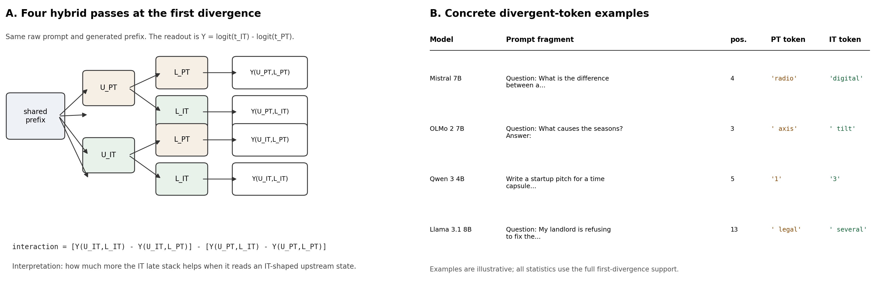
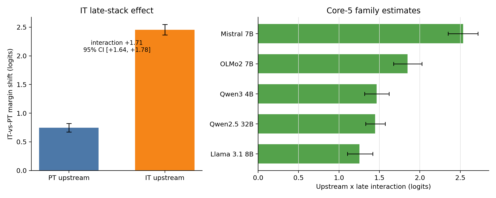

# Instruction Tuning Changes How Upstream State Conditions Late Readout: A Cross-Patching Diagnostic

**Anonymous authors** | NeurIPS 2026 Submission

---

## Abstract

Recent interpretability work has identified directions, features, and layers that are most responsible for post-trained behavior, including refusal directions, assistant/persona axes, and sparse chat-tuning features. These results localize where behaviors can be read out or controlled, often in middle-to-late layers. We ask how upstream computation and the late stack cooperate to turn those differences into next-token margins. To test this, we introduce first-divergence cross-patching: at the first token where pretrained base (PT) and instruction-tuned (IT) checkpoints disagree, we cross each model's upstream state with each model's late stack. The diagnostic is recipe-discriminative: same-base instruction-following descendants show an upstream-conditioned profile, while OpenMath2 math-domain supervised fine-tuning (SFT) and controlled code/biomed continuation-pretraining (CPT) foils with verified domain learning do not show it on the main support; for OpenMath2, the late effect is already exposed by base upstream. Across five dense families ($4\mathrm{B}$-$32\mathrm{B}$), the IT late stack adds $+0.76$ logits from PT upstream and $+2.44$ from IT upstream, giving a $+1.68$ interaction that is positive in every family. Thus the late stack has a real PT-upstream effect, but its larger effect appears only when it reads upstream state from its own post-trained checkpoint. Sparse terminal features partially mediate the effect and are driven by upstream patches, supporting a handoff from preterminal state to terminal feature activation to IT-token margin. Forced-token scoring shows downstream suffix consequences on exact-answer prompts. Operationally, paired-checkpoint studies that localize a difference to late layers should test whether it survives when the late stack is run on the other checkpoint's upstream state before treating the late stack as self-contained.

---

## 1. Introduction

Where in the forward pass does instruction tuning become a logit? Recent mechanistic interpretability work has found directions, features, and layers that affect post-trained behavior: refusal and harmfulness directions, assistant/persona axes, instruction-following steering vectors, preference-sensitive layers, and sparse chat-tuning features. Many appear in middle-to-late or late layers, where post-training differences are expressed near readout. Our question is the pathway that makes this expression work: does post-training mainly change late features themselves, or also the upstream computation that activates and conditions them? A late-layer feature can be a reader: it changes output only when upstream computation supplies the residual pattern that activates it.

We measure this coupling with **first-divergence cross-patching**. For each prompt, we find the earliest generated position where PT and IT prefer different next tokens under the same generated history. At that prefix, we pair one checkpoint's upstream residual state ($U_{\mathrm{PT}}$ or $U_{\mathrm{IT}}$) with one checkpoint's downstream late stack ($L_{\mathrm{PT}}$ or $L_{\mathrm{IT}}$) and score $\mathrm{logit}(t_{\mathrm{IT}})-\mathrm{logit}(t_{\mathrm{PT}})$. The difference-in-differences asks how much larger the IT-minus-PT late-stack replacement effect is when the upstream state is IT-shaped rather than PT-shaped, separating direct late-stack contribution from upstream-conditioned contribution.

At the first PT/IT disagreement, the IT late stack adds $+0.76$ logits from PT upstream and $+2.44$ from IT upstream. This is the central story: base-to-instruct differences are not just late-layer features and not just upstream state. The late stack has a real direct effect, but the larger effect appears when upstream computation supplies the feature-activating state produced by its own post-trained checkpoint.

> **Result in one place.** Across five dense families ($4\mathrm{B}$-$32\mathrm{B}$), at the first token where PT and IT disagree:
>
> - Late stack from PT upstream: $+0.76$ logits toward the IT token.
> - Late stack from IT upstream: $+2.44$ logits toward the IT token.
> - Interaction: $+1.68$ logits, positive in $5/5$ Core-5 families.
> - Recipe discrimination: same-base instruction-following descendants show this upstream-conditioned profile; OpenMath2's math-domain effect is already exposed by base upstream (interaction $-0.154$ on math support), and controlled code/biomed continuation-pretraining foils are near zero on the main support (interactions $-0.002$, $+0.018$) despite verified domain learning.
> - Component split: a direct late-stack component plus a larger upstream-conditioned component.
> - Direct component share: $31.1\%$ family-balanced; family range $19.5$-$44.3\%$.

This makes the same four-cell test a worked example of model-diffing discrimination, not just a measurement of one base/instruct gap. On the same base and architecture, instruction-following descendants require their own upstream state for their late effects; OpenMath2's math-domain effect is already exposed by base upstream, and controlled continuation-trained foils do not reproduce the main-support pathway.

> **Operational takeaway.** When a paired-checkpoint study localizes a difference to late layers, report the same late-stack effect under both its own checkpoint's upstream state and the other checkpoint's upstream state. A late effect measured only in its own checkpoint localizes expression; by itself it does not show that the computation is self-contained.

> **Behavioral scope.** The main claim is local: it concerns the first moment where released base and instruct checkpoints choose different next tokens. Forced-token scoring improves suffix-only exact-answer success on CONTENT-REASON prompts, and constrained continuation shows short-horizon persistence, but broad free-running behavior is not the load-bearing claim.

The paper has three contributions.

1. **A cross-patching diagnostic for upstream dependence.** First-divergence cross-patching decomposes the IT-minus-PT late-stack replacement effect into PT-upstream and IT-upstream components.
2. **Recipe discrimination across same-base descendants.** This is the main empirical payoff: instruction-following descendants show upstream-conditioned late effects, while OpenMath2 and controlled continuation-pretraining foils show that this profile is not automatic same-base post-training.
3. **Mechanistic and consequence bridges.** Terminal crosscoders identify sparse MLP features that partially mediate, gate, and rescue the interaction; forced-token scoring and constrained continuation show suffix consequences and short-horizon persistence. These are bridges, not full circuit reconstruction or broad behavior estimates.

Scope is intentionally local. In Core-5 contrasts, **PT** is the released pretrained/base checkpoint and **IT** is the released instruction-following descendant; recipe and lineage checks name stages explicitly.

---

## 2. Setup

### 2.1 Model Sets and Statistical Reporting

The main factorial uses five dense PT/IT pairs: Llama 3.1 8B, Qwen 3 4B, Mistral 7B, OLMo 2 7B, and Qwen2.5 32B. Appendix A gives revisions, prompt supports, valid-event counts, position mix, and late-stack boundaries.

Prompt-bootstrap intervals quantify precision on the sampled prompts and released checkpoints, not over all model families, recipes, or prompt distributions. We therefore report Core-5 means plus family ranges or medians where useful. The Appendix Roadmap maps claims to audit trails and artifact roots.

### 2.2 First-Divergence Cross-Patching Factorial

Starting from the raw prompt, we compare PT and IT greedy top-1 predictions step by step. Until the first disagreement, the generated prefix is identical by construction; the first position where their top-1 next tokens differ defines the intervention site. Let those tokens be $t_{\mathrm{PT}}$ and $t_{\mathrm{IT}}$, and define

$$Y(U,L)=\mathrm{logit}(t_{\mathrm{IT}})-\mathrm{logit}(t_{\mathrm{PT}}).$$

Larger $Y$ means the hybrid forward pass favors the IT divergent token. Late-stack boundaries were fixed before Core-5 synthesis using a consistent architecture-relative rule: the late stack starts at roughly 60% depth and includes the final blocks. Appendix A gives full per-family boundaries. We then run the four cells below:

**Table 1: Four-cell cross-patching factorial.**

| Upstream state | PT late stack $L_{\mathrm{PT}}$ | IT late stack $L_{\mathrm{IT}}$ |
|---|---:|---:|
| PT upstream $U_{\mathrm{PT}}$ | $Y(U_{\mathrm{PT}},L_{\mathrm{PT}})$ | $Y(U_{\mathrm{PT}},L_{\mathrm{IT}})$ |
| IT upstream $U_{\mathrm{IT}}$ | $Y(U_{\mathrm{IT}},L_{\mathrm{PT}})$ | $Y(U_{\mathrm{IT}},L_{\mathrm{IT}})$ |

Conceptually, the primary estimand is the interaction effect of instruction tuning on the late-stack replacement: how much more the IT late stack helps when it reads an IT-shaped upstream state rather than a base-shaped one. Formally:

$$[Y(U_{\mathrm{IT}},L_{\mathrm{IT}})-Y(U_{\mathrm{IT}},L_{\mathrm{PT}})]-[Y(U_{\mathrm{PT}},L_{\mathrm{IT}})-Y(U_{\mathrm{PT}},L_{\mathrm{PT}})].$$

Equivalently: measure the IT-minus-PT late-stack replacement effect under each upstream state, then compare those two effects. Common-IT and common-PT readouts score all cells with one fixed final norm, `lm_head`, and real-token mask; main numbers use common-IT readout unless stated otherwise.

> **What this estimand measures.** First-divergence cross-patching is a local next-token readout test. It does not estimate average instruction-following behavior or claim that hybrid states are natural trajectories. It tests how the IT late-stack replacement effect changes between PT-shaped and IT-shaped upstream residual states at natural PT/IT disagreement prefixes.

**Hybrid forward-pass implementation.** Cached decoding is used only to find the shared prefix. Each scored cell is recomputed as a full `use_cache=False` forward pass over the raw prompt plus shared generated prefix. The patch replaces the full hidden-state tensor entering the late-boundary layer, so the downstream late stack recomputes attention keys and values for all prefix positions. Diagonal no-op cells are runtime-checked against the unmodified forward pass.

All raw-shared runs force PT and IT branches to raw text and validate identical prompt token IDs before residual comparisons. This alignment is necessary for position-wise patching, but evaluates IT checkpoints without native chat templates; we interpret the result as a raw-shared upstream-dependence test, not a native-chat behavior estimate.

---

## 3. Results

### 3.1 Main Upstream-Late Decomposition

The four-cell result separates three interpretations of a late-stack effect: self-contained across upstream states, useless under PT upstream, or coupled to IT-shaped upstream state. Replacing the PT late stack with the IT late stack shifts the IT-token margin by $+0.76$ logits from PT upstream, but by $+2.44$ logits from IT upstream. The headline magnitude is the $+1.68$ interaction: a direct late-stack component is present, but most of the matched-context effect is exposed only under IT-shaped upstream state.

The verdict is simple. A self-contained account is disfavored because the matched-context effect is much larger than the PT-upstream effect. A no-transfer account is also disfavored because the PT-upstream component is $+0.76$ logits. The supported picture is upstream-late coupling.

The sign pattern is consistent across families: every Core-5 interaction is positive, ranging from $+1.25$ to $+2.53$ logits. The direct late-stack share ranges from $19.5\%$ to $44.3\%$ across families, with median $29.2\%$ and family-balanced center $31.1\%$. We treat the logit interaction as primary; Appendix B reports scale conversions.

The interaction is also not confined to response openings: generated position $\geq 3$ and $\geq 5$ subsets remain positive, though smaller and thinner.

\begin{samepage}
\noindent\textbf{Table 2: Core-5 headline four-cell effects.}

\begin{center}
\begin{tabular}{lrrr}
\toprule
Scope & PT-up late & IT-up late & Interaction \\
\midrule
Core-5, common-IT & +0.76 & +2.44 & +1.68 \\
Core-5, common-PT & +0.78 & +2.49 & +1.70 \\
Qwen2.5-32B only & +1.04 & +2.34 & +1.30 \\
\bottomrule
\end{tabular}
\end{center}
\end{samepage}

The $+1.68$ interaction multiplies the odds of $t_{\mathrm{IT}}$ over $t_{\mathrm{PT}}$ by about $5.4\times$ within the constructed contrast. This is still local token-margin evidence, not a deployment behavior estimate. On a factual/reasoning-enriched stress support, the PT-upstream late effect is negative ($-1.18$) while the interaction remains positive ($+1.81$).

### 3.2 Recipe Discrimination: Instruction-Following Descendants Are More Upstream-Conditioned

The same coupling diagnostic separates instruction-following descendants from same-base domain/task foils. This is the worked example of why reporting the other-checkpoint upstream condition matters: a late effect can look strong in its own checkpoint for two descendants of the same base, while the four-cell diagnostic shows different pathways. OpenMath2 shares the Llama-3.1-8B base and architecture with the instruction descendants (Toshniwal et al., 2024); on math-domain support its matched-context late effect is large, but base upstream already exposes it. Instruction-following descendants remain upstream-conditioned.

**Table 3: Same-base recipe discrimination.**

| Same-base comparison | Main result | Read |
|---|---:|---|
| OpenMath2 math-domain SFT | math-support interaction `-0.154` despite matched-context `+3.275` and base-upstream `+3.430` late effects | the domain late effect is already exposed by base upstream, not upstream-conditioned |
| General-purpose instruction-following descendants | instruction mean `+0.959`; instruction-minus-OpenMath2 matched contrast `+1.335`; math-support instruction mean `+1.670` | instruction-following descendants show the upstream-conditioned profile |
| Controlled code/biomed CPT foils | main-support code `-0.002`; main-support biomed `+0.018`; biomed-domain `+0.283` | same-base continuation training is not enough; upstream-conditioning can be support-local |

This is the main empirical payoff of the diagnostic: upstream-conditioned late effects are not an automatic consequence of sharing a base model and applying further training. OpenMath2's math-domain effect is strong, but base upstream already exposes it. By contrast, general-purpose instruction-following descendants retain a larger IT-upstream component on matched instruction/format and math supports. Appendix F gives per-descendant tables and controls.

Controlled CPT foils sharpen the same point. Code and biomedical continuation adapters improve held-out domain NLL and pass merge/generation-health checks, but they do not reproduce the large instruction/governance-support interaction on the main support. The biomedical adapter does show a domain-local interaction, so the claim is recipe/support structure.

Consequence and persistence checks support the interpretation without replacing the token-level estimand. On CONTENT-REASON exact-answer prompts, forcing the descendant-preferred divergent token improves suffix-only objective success by `+0.157` `[+0.120,+0.192]`; the forced token itself is excluded from scoring. Constrained continuation stays positive through `N=8`, coherent descendant tails carry more interaction than shuffled tails, and OpenMath2 again behaves differently. Released Tulu-3 and OLMo-2 sweeps (Lambert et al., 2025; Team OLMo et al., 2025) show partial supervised-fine-tuning (SFT) presence and direct-preference-optimization (DPO)/preference checkpoints near the final fixed-support score; these are cumulative checkpoint comparisons, not causal stage attributions.

### 3.3 Validation Against Hybrid and Selection Artifacts

The cross-patching factorial selects a high-signal disagreement point and constructs hybrid forward passes. The validation question is narrower than naturalness: do the main artifact explanations make the estimand uninformative? The decisive checks pass; Appendix C gives the audit trail.

**Controls passed.**

- **Hybrid-state checks pass.** Native diagonals reconstruct exactly, PT->IT boundary interpolation is smooth and positive, and signed permutations recover only a minority of the effect.
- **First divergence is high-signal but not arbitrary.** Random local disagreements from the same prompts retain `56%` of the interaction, while pre-divergence prefixes scored on the future token pair are near zero (`3%`).
- **Native histories preserve the interaction.** Because raw-shared scoring omits native chat templates, we also drop the shared-history requirement. Local disagreements after greedy native IT histories give `+1.51` logits `[+1.42,+1.61]`; a PT-history mirror gives `+1.49` `[+1.33,+1.65]`, with all four Core-small dense families positive in both directions.
- **Pre-late logit commitment does not explain the effect.** The interaction remains positive when the IT boundary readout does not yet favor $t_{\mathrm{IT}}$ and in the lowest boundary-margin tercile.
- **Readout choice agrees.** Common-IT and common-PT readouts give the same answer (`+1.68` vs `+1.70`).
- **The label-swap null passes.** Reversing the PT/IT token labels does not reproduce the observed orientation.

The selected-support control is important enough to visualize directly. Random later PT/IT disagreements from the same rollouts show the same positive sign at reduced magnitude (`56%`), while scoring the future divergent token pair before the models diverge is near zero (`3%`). First divergence concentrates the interaction, but related local disagreements retain a weaker version. Native-history local disagreements also give large same-sign interactions, without serving as free-running behavior estimates.

Secondary checks agree: later-position subsets remain positive, every core family has a positive interaction, and native-history local disagreements remain positive in every Core-small dense family. The exact magnitude remains intervention-scoped, but the pattern is robust under tests that would otherwise explain it away.

### 3.4 Mechanistic Bridge: Sparse Terminal Features and Structured State

These analyses ask whether part of the readout interaction can be traced to terminal MLP features and structured boundary-state shifts. The bridge tested is preterminal computation $\rightarrow$ terminal sparse features $\rightarrow$ IT-token margin. Window anatomy motivates terminal MLPs; sparse terminal features are the main feature-level bridge; boundary-state closure is an independent residual-state check. This is a partial bridge, not full circuit reconstruction.

We use two units in this section. **Feature rescue** means an absolute logit gain in the weak $U_{\mathrm{PT}},L_{\mathrm{IT}}$ hybrid. The **missing margin** is the gap between native IT-upstream readout and the weak hybrid, $Y(U_{\mathrm{IT}},L_{\mathrm{IT}})-Y(U_{\mathrm{PT}},L_{\mathrm{IT}})$; closure fractions divide a gain by this missing margin.

#### 3.4.1 Window Anatomy

The window-level anatomy is a candidate-to-margin handoff: middle windows transfer divergent-token identity more often, while late and terminal windows are more margin-sensitive. Middle-positioned MLP substitutions transfer which token wins more often than late substitutions, while late windows dominate IT-token support under IT upstream state. Terminal-depth audits in Appendix D sharpen the same story. The handoff is operational rather than a complete circuit.

#### 3.4.2 Sparse Terminal Features Carry a Concentrated Part

Terminal crosscoders connect the window-level handoff to sparse MLP features in the three families that pass the predeclared crosscoder quality gate. We train paired PT/IT BatchTopK crosscoders on terminal MLP outputs, rank features by held-out causal effect, and ablate their IT-branch decoder contribution inside the terminal IT stack. The fixed top-200 subset accounts for `26-48%` of the terminal readout interaction in these quality-gated families, while matched-random sets have the wrong sign or near-zero effect.

For the feature edits below, rescue is an absolute logit gain; rescue fractions in Appendix E divide by the missing margin defined above.

#### 3.4.3 Upstream Patches Drive Terminal Features

Within the same quality-gated families, the sparse terminal features inherit the upstream conditioning seen at window level. Ablating the top-200 causal terminal features hurts the $U_{\mathrm{IT}},L_{\mathrm{IT}}$ readout much more than the $U_{\mathrm{PT}},L_{\mathrm{IT}}$ readout, and patching their activations from the $U_{\mathrm{IT}},L_{\mathrm{IT}}$ pass into the weak $U_{\mathrm{PT}},L_{\mathrm{IT}}$ hybrid gives a $+0.49$ logit rescue. Both effects beat matched-random controls. This is not full reconstruction, but it recovers a measurable slice of the missing IT-token margin.

A direct handoff test perturbs upstream computation and re-measures the same terminal features. Injecting IT mid-to-preterminal computation into the weak $U_{\mathrm{PT}},L_{\mathrm{IT}}$ hybrid rescues $+1.71$ logits, with $+0.13$ mediated by selected terminal features. The reverse PT patch into the $U_{\mathrm{IT}},L_{\mathrm{IT}}$ pass causes a $+3.57$ drop, with $+0.53$ mediated. Thus preterminal state changes drive a measurable part of terminal sparse-feature readout.

#### 3.4.4 Independent Structured Boundary-State Closure

This is an independent state-space check, not a crosscoder result. On Llama-3.1 descendants, we fit PCA directions to train-split descendant-minus-base boundary-state shifts and inject held-out projections into the weak base-upstream/descendant-late hybrid. At terminal boundary 31, a rank-256 projection closes `0.71` of the missing IT-token margin; the full held-out delta gives the expected upper bound (`0.97`). Matched Gaussian and random full directions are near zero, and sign-flipped directions go negative. We use this as structured residual-state support, not as a recipe-level or completion-level claim.

## 4. Related Work

**Late refinement and post-training diffs.** Feed-forward layers promote vocabulary-space concepts and refine predictions (Geva et al., 2021, 2022), and layerwise/tuned-lens or layer-contrast analyses describe late residual sharpening and confidence adjustment (nostalgebraist, 2020; Belrose et al., 2023; Chuang et al., 2024; Lad et al., 2025; Joshi et al., 2025). Fine-tuning and post-training studies report low-dimensional, localized, or layerwise shifts in trained models (Aghajanyan et al., 2021; Panigrahi et al., 2023; Lin et al., 2024; Wu et al., 2024; Zhao, Ziser, and Cohen, 2024; Du et al., 2025; Chaudhury, 2025). Instruction Vectors find complementary early-to-late conditionality (Bigoulaeva et al., 2026), while Sparse but Critical analyzes reinforcement-learning-with-verifiable-rewards (RLVR) token substitutions during sampling (Meng et al., 2026). Divergent-token metrics also use token-level changes as degradation signals (Deiseroth et al., 2024); our question is internal to paired checkpoints at the selected disagreement token.

**Activation patching, steering axes, and sparse model diffs.** Activation patching requires care because metric choice, intervention direction, and off-manifold hybrids affect interpretation (Heimersheim and Nanda, 2024). Representation-engineering and activation-steering work identifies directions and layers associated with sentiment, refusal, harmfulness, assistant persona, and instruction following (Zou et al., 2023; Turner et al., 2023; Rimsky et al., 2024; Arditi et al., 2024; Stolfo et al., 2025; Zhao et al., 2025; Lu et al., 2026). Our contribution is to make upstream dependence of a localized late effect measurable by scoring the same late-stack replacement under its own checkpoint's upstream state and the other checkpoint's upstream state. Cross-model activation patching is the closest methodological precedent (Prakash et al., 2024), but asks whether fine-tuning enhances an existing task circuit; ours asks how the IT late-stack replacement depends on upstream state at a natural PT/IT disagreement. Unlike global sparse model-diff work (Lindsey et al., 2024; Minder et al., 2025), and complementary to sparse-autoencoder evaluation work (Makelov et al., 2024), we apply crosscoders after defining the causal estimand and ask which terminal features mediate it. Full circuit discovery is a separate goal (Conmy et al., 2023).

**Novelty.** Prior work localizes fine-tuning effects, steering directions, or chat-specific features; here upstream-late coupling is the estimand. We score the same late-stack replacement under PT-shaped and IT-shaped upstream state at a natural PT/IT disagreement, decomposing one late-stack effect into direct and upstream-conditioned components. Instruction Vectors give convergent qualitative evidence; our contribution is the paired-checkpoint causal decomposition and sparse-feature bridge for the PT/IT readout margin.

---

## 5. Discussion, Scope, and Next Tests

### 5.1 Interpretation

Released base-to-instruct contrasts appear to reshape how upstream computation prepares late readout, not merely change a standalone late stack. Our evidence is scoped to dense checkpoint pairs, first-divergence token readouts, and constructed cross-patches.

The same-base recipe check sharpens the interpretation: OpenMath2 has a large math-domain late effect already exposed by base upstream, while instruction-following descendants remain upstream-conditioned. Tulu-3 and OLMo-2 show the estimand can be reused along released lineages, but these are cumulative checkpoint comparisons, not stage attributions.

The behavioral connection is deliberately narrower than a benchmark claim. Local token margins are the right unit for this diagnostic because the intervention is a next-token counterfactual. Forced-token scoring improves downstream suffix-only exact-answer success on CONTENT-REASON prompts, and constrained continuation shows fixed-continuation persistence.

### 5.2 Scope

The primary estimand is local to first-divergence next-token readouts; native-history checks show a same-sign local-disagreement variant, but neither is an average over deployment behavior. The interventions are window-level compatibility tests: validation makes practical hybrid artifacts unlikely, constrained continuation shows short-horizon likelihood persistence, and crosscoders expose a partial, terminal, quality-gated sparse-feature trace. The raw-shared design is intentional because exact residual comparisons require aligned token IDs; a template-aware variant remains future work. A separate fixed-history native-template late-KL audit shows that the related late-convergence signal survives identical forced token histories and endpoint matching, supporting the late-readout context without replacing template-aware cross-patching.

The empirical scope is five dense core PT/IT pairs including one 32B pair, same-base released and controlled recipe controls, and two released dense lineages. DeepSeek-V2-Lite is artifact-only because MoE routing and expert swaps need different controls; architecture and MoE generalization remain next-step questions.

### 5.3 Practical Implications and Next Tests

For paired checkpoints, a large late effect measured only in its own checkpoint localizes expression but does not show whether the computation is self-contained or upstream-conditioned. The four-cell test distinguishes direct late-stack contribution, upstream-conditioned contribution, and no useful late-stack transfer; next work should identify middle/preterminal drivers of the terminal features.

---

## 6. Conclusion

First-divergence cross-patching turns "do late layers explain the base-to-instruct difference?" into an upstream-late coupling test. At the first PT/IT disagreement, the IT-minus-PT late-stack replacement effect decomposes into a positive direct component from PT upstream and a larger upstream-conditioned component exposed by IT-shaped upstream state. The result is positive across five dense families, recipe-discriminative under released and controlled same-base foils, coherent along two lineages, and robust to artifact and native-history checks.

Taken together, the results support an upstream-to-late compatibility story rather than a standalone late-stack story: released base-to-instruct contrasts show upstream-state differences that condition late readout, and the same four-cell test exposes both this coupling and recipe differences.

---

## References

Aghajanyan, A., Gupta, S., & Zettlemoyer, L. (2021). Intrinsic Dimensionality Explains the Effectiveness of Language Model Fine-Tuning. *ACL-IJCNLP 2021*.

Arditi, A., et al. (2024). Refusal in Language Models Is Mediated by a Single Direction. *NeurIPS 2024*. arXiv:2406.11717.

Belrose, N., et al. (2023). Eliciting Latent Predictions from Transformers with the Tuned Lens. arXiv:2303.08112.

Bigoulaeva, I., Rohweder, J., Dutta, S., & Gurevych, I. (2026). Patches of Nonlinearity: Instruction Vectors in Large Language Models. arXiv:2602.07930.

Bills, S., et al. (2023). Language Models Can Explain Neurons in Language Models. OpenAI. https://openai.com/index/language-models-can-explain-neurons-in-language-models/.

Chuang, Y., et al. (2024). DoLa: Decoding by Contrasting Layers Improves Factuality in Large Language Models. *ICLR 2024*.

Chaudhury, A. (2025). Alignment is Localized: A Causal Probe into Preference Layers. arXiv:2510.16167.

Conmy, A., et al. (2023). Towards Automated Circuit Discovery for Mechanistic Interpretability. *NeurIPS 2023*.

Deiseroth, B., et al. (2024). Divergent Token Metrics: Measuring Degradation to Prune Away LLM Components -- and Optimize Quantization. *NAACL 2024*.

Du, H., et al. (2025). How Post-Training Reshapes LLMs: A Mechanistic View on Knowledge, Truthfulness, Refusal, and Confidence. *COLM 2025*. arXiv:2504.02904.

Geva, M., Schuster, R., Berant, J., & Levy, O. (2021). Transformer Feed-Forward Layers Are Key-Value Memories. *EMNLP 2021*.

Geva, M., et al. (2022). Transformer Feed-Forward Layers Build Predictions by Promoting Concepts in the Vocabulary Space. *EMNLP 2022*.

Heimersheim, S., & Nanda, N. (2024). How to Use and Interpret Activation Patching. arXiv:2404.15255.

Huang, J., et al. (2023). Rigorously Assessing Natural Language Explanations of Neurons. *BlackboxNLP 2023*.

Joshi, A., Ahmad, A., & Modi, A. (2025). Calibration Across Layers: Understanding Calibration Evolution in LLMs. *EMNLP 2025*.

Lad, V., et al. (2025). The Remarkable Robustness of LLMs: Stages of Inference? *NeurIPS 2025*.

Lambert, N., et al. (2025). Tulu 3: Pushing Frontiers in Open Language Model Post-Training. *COLM 2025*.

Lin, B. Y., et al. (2024). The Unlocking Spell on Base LLMs: Rethinking Alignment via In-Context Learning. *ICLR 2024*.

Lindsey, J., et al. (2024). Sparse Crosscoders for Cross-Layer Features and Model Diffing. *Transformer Circuits Thread*. https://transformer-circuits.pub/2024/crosscoders/.

Lu, C., Gallagher, J., Michala, J., Fish, K., & Lindsey, J. (2026). The Assistant Axis: Situating and Stabilizing the Default Persona of Language Models. arXiv:2601.10387.

Makelov, A., Lange, G., & Nanda, N. (2024). Towards Principled Evaluations of Sparse Autoencoders for Interpretability and Control. arXiv:2405.08366.

Meng, H., et al. (2026). Sparse but Critical: A Token-Level Analysis of Distributional Shifts in RLVR Fine-Tuning of LLMs. arXiv:2603.22446.

Minder, J., et al. (2025). Overcoming Sparsity Artifacts in Crosscoders to Interpret Chat-Tuning. *NeurIPS 2025*. arXiv:2504.02922.

nostalgebraist. (2020). Interpreting GPT: The Logit Lens. LessWrong. https://www.lesswrong.com/posts/AcKRB8wDpdaN6v6ru/interpreting-gpt-the-logit-lens.

Panigrahi, A., et al. (2023). Task-Specific Skill Localization in Fine-tuned Language Models. *ICML 2023*.

Prakash, N., et al. (2024). Fine-Tuning Enhances Existing Mechanisms: A Case Study on Entity Tracking. *ICLR 2024*.

Rimsky, N., Gabrieli, N., Schulz, J., Tong, M., Hubinger, E., & Turner, A. (2024). Steering Llama 2 via Contrastive Activation Addition. *ACL 2024*. arXiv:2312.06681.

Stolfo, A., Balachandran, V., Yousefi, S., Horvitz, E., & Nushi, B. (2025). Improving Instruction-Following in Language Models through Activation Steering. *ICLR 2025*. arXiv:2410.12877.

Team OLMo et al. (2025). 2 OLMo 2 Furious (COLM's Version). *COLM 2025*.

Toshniwal, S., et al. (2024). OpenMathInstruct-2: Accelerating AI for Math with Massive Open-Source Instruction Data. arXiv:2410.01560.

Turner, A. M., et al. (2023). Steering Language Models With Activation Engineering. arXiv:2308.10248.

Wu, X., et al. (2024). From Language Modeling to Instruction Following: Understanding the Behavior Shift in LLMs after Instruction Tuning. *NAACL 2024*.

Zhao, J., Huang, J., Wu, Z., Bau, D., & Shi, W. (2025). LLMs Encode Harmfulness and Refusal Separately. arXiv:2507.11878.

Zhao, Z., Ziser, Y., & Cohen, S. B. (2024). Layer by Layer: Uncovering Where Multi-Task Learning Happens in Instruction-Tuned Large Language Models. *EMNLP 2024*.

Zou, A., et al. (2023). Representation Engineering: A Top-Down Approach to AI Transparency. arXiv:2310.01405.

---

## Appendix Roadmap

The main text is written around stable claim names. For details, start with Appendix B for the main four-cell factorial, Appendix F for recipe discrimination, Appendix C for validation controls, and Appendix E for sparse terminal features. Numeric run IDs appear only in file paths or script names; they are provenance labels, not concepts the reader needs to parse.

**Table R.1: Claim roadmap.**

| Claim | Main location | Appendix | Artifact/script pointer |
|---|---|---|---|
| Minimal reproducibility snapshot | Sec. 2.1 | A, B, H | model registry, dataset manifests, raw first-divergence records |
| Core-5 first-divergence interaction and scale conversions | Sec. 3.1 | B | Core synthesis artifacts and first-divergence collectors |
| Recipe discrimination and consequence bridges | Sec. 3.2 | F | same-base Llama recipe controls including controlled non-instruction CPT foils; forced-token objective bridge; constrained continuation bridge; fixed-support Tulu-3 and OLMo-2 Base/SFT/DPO/Final stage sweeps |
| Validation ladder | Sec. 3.3 | C | hybrid-state validation, random-disagreement baselines, native-history local-disagreement check, token-support audit, pre-late logit-commitment control |
| Depth and terminal anatomy | Sec. 3.4 | D | identity/margin handoff, terminal-depth audit, terminal MLP audit |
| Terminal feature mediation, upstream-conditioning, rescue, structured boundary-state closure, handoff, and structure-bucket validation | Sec. 3.4 | E | terminal crosscoder synthesis, hardening runs, upstream-conditioning audit, feature rescue, structured boundary-state closure, preterminal handoff, autointerp taxonomy, structure-readout edit |
| Architecture and MoE scope | Sec. 5 | G | dense/MoE scope note |

Prompt-bootstrap CIs in the main text are conditional precision estimates over sampled prompts and released checkpoints. They are paired with family-level summaries or family ranges where a claim could otherwise be mistaken for a population-level model-family generalization.

**Table R.2: What each appendix supports.**

| Appendix | Supports | Does not prove |
|---|---|---|
| A | Model scope, prompt supports, sampling, revision pins, boundary choices, and dataset documentation. | Population-level model-family generalization or template-aware deployment behavior. |
| B | Core-5 interaction magnitude, secondary scale conversions, family consistency, and readout robustness. | Population-level generalization over all dense or post-trained models. |
| C | Main artifact explanations are unlikely: broken hybrids, arbitrary token support, first-divergence-only support, and pre-late logit commitment. | Hybrid passes are natural deployment trajectories or completion-level behavior estimates. |
| D | Depth anatomy: middle windows are relatively more identity-selective while late/terminal windows are more margin-sensitive. | A complete circuit or a unique layer boundary. |
| E | Sparse terminal features partially mediate, gate, and rescue the terminal readout interaction; structured boundary-state shifts close much of the missing margin. | Full mechanism recovery, recipe-unique boundary directions, or feature monosemanticity. |
| F | Same-base released and controlled recipe controls, constrained continuation scoring, forced-token objective scoring, and two released dense lineages show that the result is not an automatic consequence of fine-tuning/CPT, a one-token artifact, or one final checkpoint accident. | Isolated causal attribution to SFT, DPO, or RLVR algorithms, broad completion-level behavioral interaction, or natural-rollout behavior for every recipe. |
| G | Dense-family scope and MoE limitations are explicit. | MoE generalization. |
| H | Reviewer-facing reproduction levels and artifact roots. | That full raw GPU reruns are cheap. |

---

## Appendix A: Model Scope and Statistical Reporting

**Claim supported.** The paper uses fixed released checkpoint pairs, fixed prompt supports, and a consistent statistical reporting convention.

**Primary evidence.** Full checkpoint revisions, prompt mixes, and the exact scale definitions used in Sec. 3.1.

**What this does not prove.** The released checkpoints are not controlled training-recipe ablations.

**Where to audit.** Model registry, dataset manifests, and artifact roots are consolidated in Appendix H.

**Core-5 set.** Llama 3.1 8B, Qwen 3 4B, Mistral 7B, OLMo 2 7B, and Qwen2.5 32B. Qwen2.5 32B is included as the scale check in the core first-divergence synthesis.

**Core-small support set.** Llama 3.1 8B, Qwen 3 4B, Mistral 7B, and OLMo 2 7B. Supporting identity/margin, terminal MLP, and crosscoder analyses use this smaller-family scope unless explicitly marked otherwise. The Qwen2.5 32B pair is included in the main factorial and omitted from these support analyses for compute.

**Prompt supports and sampling.** All prompt supports are fixed JSONL manifests generated by `scripts/data/build_eval_dataset_v2.py`. The full manifest has `1400` records; the Core-5 headline support has `600` records. Records contain a stable `id`, `category`, `source`, raw prompt text, and task metadata where available.

**Table A.1: Prompt support composition.**

| Support | Size | Composition | Paper role |
|---|---:|---|---|
| Full evaluation manifest | `1400` records | CONTENT-FACT 300; CONTENT-REASON 200; GOV-FORMAT 250; GOV-CONV 300; SAFETY 150; GOV-REGISTER 100; BASELINE-EASY 100 | parent manifest for held-out and stress-test supports |
| Holdout-600 | `600` records | GOV-CONV 300; GOV-FORMAT 150; SAFETY 150 | Core-5 headline first-divergence support |
| Content/reasoning-enriched stress support | `5889` valid units | MMLU `CONTENT-FACT`; GSM8K `CONTENT-REASON`; smaller IFEval `GOV-FORMAT` slice | checks that the pattern is not confined to response-shaping/safety prompts |

Exact support identifiers are: full manifest `data/eval_dataset_v2.jsonl`, headline holdout `data/eval_dataset_v2_holdout_0600_1199.jsonl`, and the content/reasoning-enriched Exp23 residual-factorial artifact listed in Appendix H.

The full manifest is intentionally mixed. `CONTENT-FACT` records are MMLU multiple-choice questions; `CONTENT-REASON` records are GSM8K reasoning prompts; `GOV-FORMAT` records are IFEval prompts with explicit instruction-following/format-compliance criteria; `GOV-CONV` combines `200` custom governance/assistant-conversation prompts, `80` MT-Bench prompts, and `20` WildChat-style prompts; `SAFETY` contains `75` harmful/refusal prompts (`69` AdvBench and `6` custom in the committed manifest) and `75` safe comply prompts (`custom_safe`, XSTest-style safe prompts in the metadata). Here `GOV` denotes governance/assistant-behavior supports rather than a government domain: `GOV-CONV` is open-ended conversational governance, while `GOV-FORMAT` is explicit response-format compliance. `GOV-REGISTER` and `BASELINE-EASY` are custom auxiliary categories used outside the Core-5 headline support.

The holdout-600 support is the fixed slice used for the Core-5 headline factorial. It contains only governance conversation, formatting, and safety prompts: `GOV-CONV/GOV-FORMAT/SAFETY = 300/150/150`. The Qwen2.5 32B raw run was collected on a larger support, but the Core-5 synthesis restricts it to this same holdout mix (`599` valid events because one safety prompt has no first divergence).

The content/reasoning-enriched stress support is separate from the Core-5 headline average. It was run to test whether the upstream-conditioned late-stack pattern survives on prompts less dominated by assistant-opening, formatting, and safety behavior. The run uses raw-shared first-divergence collection over five dense families available for that stress test (`gemma3_4b`, `llama31_8b`, `mistral_7b`, `olmo2_7b`, `qwen3_4b`) and produces `5889` valid first-divergence units across `2983` prompt clusters with `0` invalid events. The analyzed prompt-source counts are MMLU `2837` units over `1485` clusters, GSM8K `2087` units over `999` clusters, and IFEval `965` units over `499` clusters. This stress support is reported as a robustness check only; it is not pooled into the Core-5 headline magnitude.

For all raw-shared first-divergence and residual-state runs, PT and IT branches receive the same raw prompt text, and the runner validates identical raw prompt token IDs before comparing residual states. Starting from that shared prompt, both checkpoints are greedily decoded until the first top-1 disagreement, with a real-token mask and at most `128` generated tokens. Events are excluded if the record is malformed, no first disagreement is found within the generation budget, a required model file is missing, or the token/readout validity checks fail. Position `0` is therefore the first generated token after the full raw prompt, not a chat-template artifact. Unless otherwise stated, bootstrap intervals resample prompt clusters within family.

**Minimal reproducibility snapshot.** Revision prefixes are unique abbreviations of the pinned Hugging Face revisions listed below.

**Table A.2: Core-5 reproducibility snapshot.**

| Family | PT rev. | IT rev. | Valid events | First-div. position `0 / >=3 / >=5` | Late stack |
|---|---:|---:|---:|---:|---|
| Llama 3.1 8B | `d04e592` | `0e9e39f` | `600/600` | `59.3% / 28.0% / 17.3%` | layers `19-31` |
| Qwen 3 4B | `906bfd4` | `1cfa9a7` | `600/600` | `48.7% / 35.2% / 23.5%` | layers `22-35` |
| Mistral 7B | `caa1feb` | `c170c70` | `597/600` | `30.8% / 31.3% / 20.1%` | layers `19-31` |
| OLMo 2 7B | `7df9a82` | `470b1fb` | `586/600` | `60.1% / 27.1% / 16.0%` | layers `19-31` |
| Qwen2.5 32B | `1818d35` | `5ede1c9` | `599/600` | `46.4% / 39.4% / 28.9%` | layers `38-63` |

All rows use the holdout-600 support and the raw-shared first-divergence procedure above. Bootstrap unit is the prompt cluster within family.

**Pinned checkpoint identifiers.** The PDF uses short revision prefixes to keep the table readable; the supplementary manifest stores full 40-character revisions.

- Llama 3.1 8B: `meta-llama/Llama-3.1-8B` -> `meta-llama/Llama-3.1-8B-Instruct` (`d04e592` -> `0e9e39f`).
- Qwen 3 4B: `Qwen/Qwen3-4B-Base` -> `Qwen/Qwen3-4B` (`906bfd4` -> `1cfa9a7`).
- Mistral 7B: `mistralai/Mistral-7B-v0.3` -> `mistralai/Mistral-7B-Instruct-v0.3` (`caa1feb` -> `c170c70`).
- OLMo 2 7B: `allenai/OLMo-2-1124-7B` -> `allenai/OLMo-2-1124-7B-Instruct` (`7df9a82` -> `470b1fb`).
- Qwen2.5 32B: `Qwen/Qwen2.5-32B` -> `Qwen/Qwen2.5-32B-Instruct` (`1818d35` -> `5ede1c9`).

The Core-5 synthesis combines stored per-family prompt-bootstrap estimates for the five families in Sec. 2.1. Secondary scale conversions include the matched/portable ratio:

$$\mathrm{matched/portable\ ratio}=\frac{Y(U_{\mathrm{IT}},L_{\mathrm{IT}})-Y(U_{\mathrm{IT}},L_{\mathrm{PT}})}{Y(U_{\mathrm{PT}},L_{\mathrm{IT}})-Y(U_{\mathrm{PT}},L_{\mathrm{PT}})}.$$

This secondary scale compares the same IT late-stack replacement under the two upstream states. We also report a native-shift scale, computed inside the same 2x2:

$$\mathrm{native\ PT\to IT\ diagonal\ margin\ shift}=Y(U_{\mathrm{IT}},L_{\mathrm{IT}})-Y(U_{\mathrm{PT}},L_{\mathrm{PT}}).$$

The reported interaction share is `interaction / native diagonal margin shift`. This is a scale reference, not a claim that the interaction linearly decomposes all behavioral difference.

---

## Appendix B: Main First-Divergence Cross-Patching Audit Trail

**Claim supported.** The Core-5 first-divergence interaction is positive across families and decomposes into a portable PT-upstream component plus a larger upstream-conditioned component under both common readouts.

**Primary evidence.** Core-5 common-IT/common-PT four-cell summaries, family-level interaction ranges, and the content/reasoning-enriched stress test.

**What this does not prove.** The prompt-bootstrap intervals are conditional on sampled prompts and released checkpoints; they are not population-level uncertainty over all post-training recipes.

**Where to audit.** Core synthesis artifacts, raw first-divergence mirrors, and Qwen2.5 32B support are listed in Appendix H.2.

Main Core-5 effects:

**Table B.1: Core-5 four-cell effect summary.**

| Scope | PT-up late | IT-up late | Interaction | Ratio | Portable share |
|---|---:|---:|---:|---:|---:|
| Core-5, common-IT | `+0.759` `[+0.682, +0.835]` | `+2.439` `[+2.344, +2.533]` | `+1.680` `[+1.604, +1.756]` | `3.2x` | `31.1%` |
| Core-5, common-PT | `+0.784` `[+0.717, +0.850]` | `+2.488` `[+2.397, +2.578]` | `+1.704` `[+1.628, +1.780]` | `3.2x` | `31.5%` |

The native diagonal margin shifts are `+4.991` logits under common-IT readout and `+5.051` under common-PT readout; the interaction is `33.7%` of that native shift in both readouts.

Core-5 family-level common-IT interactions:

**Table B.2: Family-level common-IT interactions.**

| Family | Interaction | Native diagonal shift | Interaction share |
|---|---:|---:|---:|
| Llama 3.1 8B | `+1.253` | `+5.358` | `23.4%` |
| Qwen2.5 32B | `+1.302` | `+3.995` | `32.6%` |
| Qwen 3 4B | `+1.464` | `+3.938` | `37.2%` |
| OLMo 2 7B | `+1.847` | `+5.227` | `35.3%` |
| Mistral 7B | `+2.534` | `+6.437` | `39.4%` |

The Core-5 family interaction range is `+1.253` to `+2.534` logits, with median `+1.464`. Interaction share ranges from `23.4%` to `39.4%`.

The portable-share family range is similarly heterogeneous. Under common-IT readout, `late_it_given_pt_upstream / late_it_given_it_upstream` ranges from `19.5%` to `44.3%`, with median `29.2%`; the Core-5 family-balanced center is `31.1%`. We report the family range where heterogeneity matters and use `31.1%` only as a center-of-mass summary of the local token-margin contrast, not as a constant across families or as a deployment-level transfer estimate.

The Core-small label-swap null is computed from the compatibility-permutation synthesis in Appendix H.2.

On the content/reasoning-enriched stress-test support, the late-only PT-upstream term is `-1.176` and the upstream x late interaction is `+1.812` (`[+1.721, +1.901]`).

The Qwen2.5 32B scale-check artifacts include both the larger raw run and the matched-support holdout synthesis; Appendix H.2 lists both audit paths.

---

## Appendix C: Validation Controls

**Claim supported.** The main upstream x late interaction is not made uninformative by broken hybrids, arbitrary selected-token support, first-divergence-only support, or pre-late logit commitment.

**Primary evidence.** Hybrid interpolation is smooth and positive, random local disagreements retain a reduced but same-sign interaction, native-history local disagreements remain positive, pre-divergence future-token scoring is near zero, and pre-late logit-commitment restrictions preserve the interaction.

**What this does not prove.** These controls do not make hybrid states natural deployment trajectories, nor do they estimate completion-level behavior; they show that the main artifact explanations are unlikely to account for the estimand.

**Where to audit.** Full validation artifacts and scripts are listed in Appendix H.2.

**Table C.1: Validation control summary.**

| Check | Result | Takeaway |
|---|---:|---|
| Hybrid endpoint interaction | `+1.794` | Constructed cells reproduce the expected endpoint effect. |
| PT-to-IT interpolation slope | `+1.831` | The effect grows smoothly along the residual-state interpolation. |
| Signed-permutation random/observed ratio | `0.31x` | Matched-magnitude random signed patches do not reproduce the effect. |
| Random local disagreement | `+1.005` (`56%` of first divergence) | First divergence is high-signal, not the only same-sign support. |
| Native-history local disagreements | IT-history `+1.51`, PT-history `+1.49` | The interaction persists after native continuations at horizons `h=4,8,16`. |
| Pre-divergence future token pair | `+0.059` (`3%`) | The token pair matters; arbitrary earlier prefixes do not carry the effect. |

### C.1 Hybrid-State Validation

Key checks are summarized over the Core-small support families:

**Table C.2: Hybrid-state validation.**

| Check | Result |
|---|---:|
| Endpoint interaction, common-IT | `+1.794` |
| PT-to-IT interpolation slope | `+1.831` |
| Signed-permutation random/observed ratio | `0.31x` |

These checks target the main off-manifold worry. A pathological hybrid artifact would more naturally appear as endpoint mismatch, non-smooth interpolation, or a matched-magnitude random intervention producing similar effects. We do not see that pattern.

### C.2 Selection and Token-Support Controls

The main-text figure and table below report Core-small family-balanced means computed from the per-family random-disagreement summaries.

**Table C.3: Selection and token-support controls.**

| Condition | Interaction | Share of first divergence |
|---|---:|---:|
| True first divergence | `+1.794` | `100%` |
| Random local disagreement, source-balanced | `+1.005` | `56%` |
| Random PT-rollout disagreement | `+0.836` | `47%` |
| Random IT-rollout disagreement | `+1.190` | `66%` |
| Pre-divergence prefix, future token pair | `+0.059` | `3%` |

Random local disagreements are later and more content-token-heavy than first divergences, yet their factorial interaction is smaller. The selected-support audit likewise finds that most labeled first-divergence events fall in substantive instruction, safety, formatting, response-shaping, or semantic-content categories rather than pure surface formatting. We keep the full category table in the artifact report because it is a support audit, not part of the evidence spine.

### C.3 Pre-Late Logit-Commitment Control

The support-run control restricts to events where the IT boundary readout does not yet favor $t_{\mathrm{IT}}$, bins events by IT boundary margin, and fits boundary-margin controls. In all three views the interaction remains positive. This rules out the simplest "the late stack is irrelevant because the boundary already committed" reading without promoting these support-run magnitudes to Core-5 headline estimates.

### C.4 Native-History Local-Disagreement Check

This check drops the shared-history first-divergence support. For each prompt, we greedily generate a native PT or IT history, take fixed horizons $h\in\{4,8,16\}$, keep horizons where the two checkpoints disagree on the next token at that native prefix, and run the same four-cell late-stack factorial. The run covers the four Core-small dense families (Llama, Qwen3, Mistral, OLMo); all `3000` prompt rows are valid and diagonal no-op patch deltas are `0.0`.

**Table C.4: Native-history local-disagreement check.**

| Native-history support | Interaction | Events / prompt clusters | Family sign |
|---|---:|---:|---:|
| IT history, $h=4,8,16$ | `+1.514` `[+1.418, +1.607]` | `2035 / 1466` | `4/4` |
| PT history mirror, $h=4,8,16$ | `+1.490` `[+1.334, +1.646]` | `551 / 355` | `4/4` |

Because the PT-history mirror is also strongly positive, the claim is native-history/local-disagreement generalization rather than IT-history specificity. This does not turn the estimand into a deployment-level behavior measure; it shows that the upstream-conditioned late-stack pattern is not confined to the first shared-history disagreement.

### C.5 Fixed-History Native-Template Late-KL Audit

This audit is supporting context for the late-readout picture, not a replacement for the first-divergence cross-patching estimand. It asks whether the related native IT late-convergence signal survives when the token history is fixed. We generate one teacher continuation, replay the same forced token IDs through PT raw, IT native-chat, and IT raw/no-template cells, and measure the raw-lens late `KL(layer || own final)`.

**Table C.5: Fixed-history native-template late-KL audit.**

| Teacher history | Paired same-history effect | Endpoint-matched CEM effect |
|---|---:|---:|
| IT-native teacher, IT native-chat minus PT raw | `+1.181` nats `[+1.153,+1.211]` | `+0.548` `[+0.502,+0.594]` |
| PT-raw teacher, IT native-chat minus PT raw | `+0.547` nats `[+0.506,+0.588]` | `+0.121` `[+0.059,+0.183]` |

Quality gates are clean for the Core-small fixed-history audit: malformed rows `0`, missing aligned steps `0`, CEM retention `99.9%`, and maximum post-match SMD `0.061`. We therefore use this result to reduce the concern that the late-readout context is only a rollout-length, generated-history, or endpoint-confidence artifact. It does not directly test the cross-patched margin and does not make the raw-shared factorial a native-chat behavior estimate.

---

## Appendix D: Depth and Terminal Anatomy

**Claim supported.** Middle windows are relatively more candidate/identity-selective, while late and terminal windows are more margin/readout-sensitive.

**Primary evidence.** Identity-transfer and margin-support tables, terminal-depth retention, and terminal-MLP margin interaction.

**What this does not prove.** The depth windows are not modular circuits, and the boundary between "middle" and "late" is graded.

**Where to audit.** Depth-anatomy artifacts are listed in Appendix H.2.

Main depth-anatomy quantities:

**Table D.1: Depth-anatomy quantities.**

| Readout | Early | Middle | Late / terminal | Interpretation |
|---|---:|---:|---:|---|
| PT host: IT-token identity transfer | - | `25.6%` | `18.8%` | Middle substitutions transfer candidate identity more often. |
| IT host: PT-token identity transfer | - | `28.2%` | `21.5%` | Mirror direction gives the same identity pattern. |
| Pure IT MLP support for $t_{\mathrm{IT}}$ | `-0.085` | `+0.136` | `+0.986` | Native IT-token support is late-concentrated. |
| PT-host late MLP margin gain | - | - | `+0.004` | Late MLP updates alone are near zero in PT upstream state. |
| Source decomposition interaction | - | - | `+0.360` | MLP-level readout also shows context gating. |

In the Core-small support set, the final-three stack retains `52%` of the same-prompt full-late interaction; the final block alone retains `23%`. Final-three MLP substitutions transfer IT-token identity `8.8%` of the time, with terminal MLP margin interaction `+0.524` (`[+0.491, +0.558]`). The final layer alone gives terminal MLP margin interaction `+0.146` (`[+0.128, +0.165]`).

---

## Appendix E: Sparse Terminal Feature Bridge

**Claim supported.** Causally ranked terminal crosscoder features and structured boundary-state shifts carry concentrated, partial bridges for the terminal readout interaction.

**Primary evidence.** Top-200 causal features mediate `26-48%` of the terminal interaction in three quality-gated families, matter more under IT-shaped upstream state, partially rescue the weak hybrid, and respond to upstream/preterminal patches. Separately, train-fit PCA components of the descendant-minus-base boundary-state shift close much of the missing margin at terminal boundaries.

**What this does not prove.** This is not full circuit recovery, and it does not prove feature monosemanticity. The crosscoder edits are quality-gated tests on the same constructed hybrid distribution, not proof that every hybrid activation lies inside the native crosscoder training distribution. The boundary-state closure test is not recipe-unique and does not estimate completion-level behavior. OLMo is excluded from feature-level claims because its terminal crosscoder did not pass the reconstruction gate.

**Where to audit.** Crosscoder training, mediation, gating, feature rescue, structured boundary-state closure, handoff, autointerp, and structure-readout artifacts are listed in Appendix H.2.

### E.1 Terminal Crosscoder Mediation and Upstream-Conditioning

For a feature set `S`, the mediation table uses the same four-cell interaction as the main cross-patching result. Let

$$I_{\mathrm{full}}=[Y(U_{\mathrm{IT}},L_{\mathrm{IT}})-Y(U_{\mathrm{IT}},L_{\mathrm{PT}})]-[Y(U_{\mathrm{PT}},L_{\mathrm{IT}})-Y(U_{\mathrm{PT}},L_{\mathrm{PT}})].$$

We ablate $S$ only in the two cells that use the IT terminal stack, $(U_{\mathrm{IT}},L_{\mathrm{IT}})$ and $(U_{\mathrm{PT}},L_{\mathrm{IT}})$, leaving the two PT-late cells unchanged, and recompute the interaction as $I_{\mathrm{ablate}}(S)$. The reported top-200 drop is therefore:

$$\mathrm{interaction\_drop}(S)=I_{\mathrm{full}}-I_{\mathrm{ablate}}(S).$$

The displayed share is `interaction_drop(S) / I_full`, computed from the family-level mean interaction and mean drop in this mediation replay. It is not a single-cell ablation divided by a difference-in-differences. The later causal-gate audit is a separate upstream-conditioning stress test and is not a replacement numerator for this mediated fraction.

In the quality column, `VE` is held-out variance explained by the paired crosscoder decoder branch, `L0` is the mean number of active features per token, and `alive` is the fraction of tokens on which a feature activates. The reconstruction-quality gate requires every selected terminal layer to have both PT and IT held-out VE at least `0.75`, mean `L0` within `10%` of the configured BatchTopK target, alive fraction between `0.01` and `0.20`, a positive top-200 causal drop, and matched-random drop no larger than `0.05`.

**Table E.1: Terminal crosscoder mediation.**

| Family and scope | Quality gate summary | Top-200 interaction drop | Drop / terminal interaction | Matched random drop |
|---|---|---:|---:|---:|
| Llama, final 3 layers | VE min `0.774`; L0 `64`; alive max `0.096` | `+0.599` `[+0.469, +0.733]` | `48%` | `-0.209` `[-0.255, -0.165]` |
| Mistral, final 3 layers | VE min `0.786`; L0 `64`; alive max `0.089` | `+0.684` `[+0.600, +0.764]` | `26%` | `-0.100` `[-0.159, -0.044]` |
| Qwen, final 2 layers | layer VE `0.957/0.960` and `0.967/0.970` | `+0.324` | `37%` | `-0.033` |

OLMo terminal crosscoder quality did not pass this predeclared reconstruction gate, so OLMo is excluded from feature-level claims.

The artifact report includes mediation curves that sweep the number of ablated causally ranked features; the paper table below gives the corresponding top-200 and top-500 summaries. The main table reports top-200 because it is fixed across families and far from the full-dictionary reconstruction setting; the top-500 comparison checks that the effect is not a single hand-picked feature count. The top-200 set is a small causally ranked subset of the crosscoder dictionary, not a full reconstruction. Reducing `26-48%` of the exposed terminal interaction by ablating this subset is therefore a concentration result; matched-random features do not reproduce it.

**Table E.2: Top-k saturation check.**

| Family | top-200 share | top-500 share | Saturation read |
|---|---:|---:|---|
| Llama | `48%` | `52%` | modest additional distributed mass |
| Mistral | `26%` | `29%` | modest additional distributed mass |
| Qwen | `37%` | `38%` | mostly saturated by top-200 |

The same feature sets show upstream-conditioned causal importance in a separate hardening audit.

For the same causally ranked terminal features, we compare ablation effects in the $(U_{\mathrm{IT}},L_{\mathrm{IT}})$ and $(U_{\mathrm{PT}},L_{\mathrm{IT}})$ cells. The primary feature causal gate is:

$$\mathrm{drop}_{U_{\mathrm{IT}},L_{\mathrm{IT}}}-\mathrm{drop}_{U_{\mathrm{PT}},L_{\mathrm{IT}}}.$$

Positive values mean the feature set matters more when the IT terminal stack receives IT-shaped upstream state. These gate values are not used as mediated-share numerators. They are recomputed in the Exp42 upstream-conditioning audit with its own event support and direct feature-ablation protocol, so their absolute magnitudes need not equal the Table E.1 interaction drops. The paper-facing use is the sign and the matched-control comparison. At top-200 features:

**Table E.3: Upstream-conditioned causal gate.**

| Metric | Estimate |
|---|---:|
| Separate causal feature gate, clean-family mean | `+0.703` |
| Causal gate minus matched-random features | `+0.887` |
| Causal gate minus top-active noncausal features | `+1.495` |
| Margin-weighted activation gate minus matched-random features | `+0.520` |

Per-family gates:

**Table E.4: Per-family causal gates.**

| Family | Separate causal gate | Causal minus matched random |
|---|---:|---:|
| Llama | `+0.922` | `+1.254` |
| Mistral | `+0.816` | `+0.982` |
| Qwen | `+0.370` | `+0.426` |

Raw decoder-weighted activation mass is not uniformly higher under IT-shaped upstream state across families. We therefore use the finite-difference causal gate as the primary upstream-conditioning result and the signed margin-weighted activation gate as supporting evidence.

### E.2 Terminal Feature Rescue and Middle-to-Terminal Handoff

The rescue analysis tests a partial-sufficiency version of the same feature-level story. It runs on the three clean rescue families with quality-gated terminal crosscoders (Llama, Mistral, Qwen). OLMo is excluded because its current terminal crosscoder does not pass the reconstruction-quality gate needed for faithful feature-space rescue edits.

The edit takes the top-200 causal terminal feature activations from the native $(U_{\mathrm{IT}},L_{\mathrm{IT}})$ pass and patches them into the $(U_{\mathrm{PT}},L_{\mathrm{IT}})$ hybrid, decoded through the IT branch of the paired PT/IT crosscoder. The metric is rescued IT-token margin:

$$Y(U_{\mathrm{PT}},L_{\mathrm{IT}}+\mathrm{rescued\ features})-Y(U_{\mathrm{PT}},L_{\mathrm{IT}}).$$

These rescue rows are absolute logit gains. Rescue fractions divide the gain by the missing margin, $Y(U_{\mathrm{IT}},L_{\mathrm{IT}})-Y(U_{\mathrm{PT}},L_{\mathrm{IT}})$, so they are not the same unit as the logit-gain rows.

**Table E.5: Terminal feature rescue.**

| Rescue metric, Llama/Mistral/Qwen family-balanced | Estimate | 95% CI |
|---|---:|---:|
| Direct top-200 causal feature rescue | `+0.494` | `[+0.451, +0.539]` |
| Direct rescue fraction | `8.1%` | `[5.5%, 10.3%]` |
| Causal minus matched-random rescue | `+0.561` | `[+0.510, +0.613]` |
| Causal minus matched-random rescue fraction | `10.8%` | `[7.6%, 13.7%]` |
| Causal minus same-delta-random rescue | `+0.471` | `[+0.427, +0.517]` |
| Causal minus same-delta-random rescue fraction | `8.3%` | `[5.7%, 10.6%]` |

Per-family direct rescue is Llama `+0.627`, Mistral `+0.755`, and Qwen `+0.101` logits. The $\alpha=0$ no-edit sanity check is exact (`max |rescue_gain| = 0`). This is partial sufficiency rather than circuit recovery: the selected terminal features recover a measurable slice of the missing margin and beat both controls, but most of the $(U_{\mathrm{IT}},L_{\mathrm{IT}})$ vs. $(U_{\mathrm{PT}},L_{\mathrm{IT}})$ gap remains.

The middle-to-terminal handoff analysis tests whether upstream/preterminal computation drives the selected terminal features, rather than merely co-occurring with them. It uses the same three quality-gated feature families and top-200 terminal causal features. In the rescue direction, we start from the weak $(U_{\mathrm{PT}},L_{\mathrm{IT}})$ hybrid and replace an upstream MLP window with IT computation before running the IT terminal stack. In the degrade direction, we start from native $(U_{\mathrm{IT}},L_{\mathrm{IT}})$ and replace the same window with PT computation. The mediated effect is the part of the margin change that disappears when the selected terminal features are ablated in both the base and perturbed passes. The mediated fraction is estimated separately as a prompt-level fraction with finite-denominator filtering and then family-balanced; it is not the ratio of the two aggregate means shown in the neighboring columns.

**Table E.6: Middle-to-terminal handoff.**

| Handoff window / direction | Total margin effect | Terminal-feature-mediated part | Mediated fraction |
|---|---:|---:|---:|
| mid-to-preterminal rescue into $(U_{\mathrm{PT}},L_{\mathrm{IT}})$ | `+1.714` `[+1.634, +1.791]` | `+0.132` `[+0.118, +0.147]` | `6.5%` |
| mid-to-preterminal degradation of $(U_{\mathrm{IT}},L_{\mathrm{IT}})$ | `+3.570` `[+3.427, +3.721]` | `+0.527` `[+0.478, +0.576]` | `10.8%` |
| terminal-entry upper-bound rescue | `+5.147` `[+4.936, +5.351]` | `+0.705` `[+0.643, +0.767]` | `12.5%` |
| terminal-entry upper-bound degradation | `+5.147` `[+4.953, +5.358]` | `+0.705` `[+0.644, +0.762]` | `12.5%` |

The mid-to-preterminal mediated effect beats matched-random features (`+0.188` rescue; `+0.655` degradation), same-delta random directions (`+0.115` rescue; `+0.390` degradation), and top-active noncausal features (`+0.496` rescue; `+0.928` degradation). The terminal-entry rows are upper-bound sanity checks: they patch directly at the boundary into the terminal readout, so they should be larger than nonterminal windows. The late-preterminal-only window is weaker, especially in Qwen's event-permutation null, so the paper-facing claim is about mid-to-preterminal/preterminal handoff, not a late-preterminal-only mechanism.

### E.3 Structured Boundary-State Closure

The feature-rescue analysis edits a selected sparse terminal feature set and reports absolute logit gains. As a complementary check, we ask whether the missing upstream state itself has a structured low-rank form. For five Llama-3.1-8B descendants, we fit PCA components to train-split descendant-minus-base boundary-state shifts and inject held-out projections into the weak base-upstream/descendant-late hybrid. The rank-256 rows are the main structured-closure test; the full-delta rows are upper-bound sanity checks. Closure fraction is:

`[rescued margin - floor margin] / [native descendant-upstream margin - floor margin]`.

**Table E.7: Structured boundary-state closure.**

| Boundary | Train-fit PCA rank-256 | Full-delta upper bound | Gaussian full | Random full | Sign-flip full |
|---|---:|---:|---:|---:|---:|
| 29 | `0.634` | `0.929` | `-0.019` | `-0.036` | `-0.816` |
| 31 | `0.707` | `0.966` | `-0.021` | `-0.058` | `-0.788` |

The same-base wrong-descendant controls are nonzero in the artifact report, so we do not interpret these PCA directions as recipe-unique. The defensible claim is narrower: the missing upstream contribution at terminal boundaries is a structured descendant-minus-base residual-state shift, not generic perturbation magnitude.

### E.4 Descriptive Autointerp and Structure-Readout Edit

Across `225` interpreted features from the clean terminal-crosscoder families, mean validation AUROC is `0.886`. We use these labels descriptively, not as causal evidence: the causal claim remains the mediation, upstream-conditioning, and rescue results above. The paper-facing semantic check is the narrower `structure_readout` bucket below, where a predeclared readable subset is edited and tested against controls.

The structure-readout edit tests one readable subset from the taxonomy rather than every label bucket. The predeclared `structure_readout` bucket contains `10` causal features across the three clean crosscoder families, with labels such as paragraph breaks, list openings, answer boundaries, and field separators. Automated labels are used as audit aids in the spirit of prior neuron-explanation work (Bills et al., 2023; Huang et al., 2023), not as proof of feature monosemanticity. This is not an `N=10` statistical generalization claim: the features are the predeclared edit set, while the test is whether the edited terminal readout changes monotonically over prompts and families and beats matched controls. Editing this bucket inside the same terminal crosscoder windows gives a monotone dose response in interaction drop; matched-random and same-delta random controls are much smaller.

**Table E.8: Structure-readout bucket edit.**

| Edit strength `alpha` | Structure bucket | Matched random | Same-delta random |
|---|---:|---:|---:|
| `0.0` | `0.000` | `0.000` | `0.000` |
| `0.5` | `+0.039` | `-0.015` | `+0.001` |
| `1.0` | `+0.078` | `-0.028` | `+0.012` |
| `1.5` | `+0.125` | `-0.041` | `+0.020` |
| `2.0` | `+0.180` | `-0.048` | `+0.039` |

At `alpha=2.0`, per-family structure-bucket interaction drops are Llama `+0.091`, Mistral `+0.339`, and Qwen `+0.110`. Magnitudes are heterogeneous, but all three signs are positive. We use only this selective structure/readout result in the paper-facing feature-label validation. Other bucket edits were run as diagnostics but are not part of the evidence spine because their feature support is smaller or more domain-specific.

---

## Appendix F: Recipe, Continuation, Behavior-Audit, and Released Stage-Lineage Checks

**Claim supported.** The interaction is not merely an automatic consequence of fine-tuning/continuation pretraining (CPT) or a one-token artifact, and fixed-support versions appear coherently along two released dense post-training lineages.

**Primary evidence.** On the same Llama-3.1-8B base, general-purpose instruction-following descendants show positive interaction on instruction/format supports, while OpenMath2's math-domain late effect is already exposed by base upstream. Controlled same-base code and biomedical continuation fine-tunes do not reproduce the large main-support interaction despite verified domain NLL gains. A constrained continuation bridge shows the instruction-following interaction persists beyond the selected first token. A forced-token objective bridge is strongest on CONTENT-REASON exact-answer prompts; safety is smaller, format is borderline, and open-ended conversation is not objectively scored. On Base->Final support, Tulu-3 and OLMo-2 both show partial SFT presence, and the DPO/preference checkpoint expresses most of the final measured interaction.

**What this does not prove.** These are token-factorial recipe, constrained-likelihood, forced-token objective, and cumulative checkpoint comparisons, not isolated causal attributions to training algorithms, broad completion-level behavioral interaction, or natural-rollout guarantees for each recipe.

**Where to audit.** Recipe-structure, controlled-CPT, constrained-continuation, forced-token, and stage-sweep artifacts are listed in Appendix H.2.

### F.1 Same-Base Recipe Structure

The recipe-structure check compares descendants of the same Llama-3.1-8B base. On instruction/format support, general-purpose instruction-following descendants are consistently upstream-conditioned, while the OpenMath2 domain-specialized descendant does not reproduce the same interaction. A controlled continuation-training foil then asks whether same-base non-instruction CPT alone is enough.

**Table F.1: Same-base recipe control.**

| Same-base descendant | Support | Interaction | Matched-context late effect | Portable late effect |
|---|---|---:|---:|---:|
| Meta Instruct | instr./format | `+1.053` | `+2.070` | `+1.018` |
| Tulu SFT | instr./format | `+0.287` | `+0.895` | `+0.608` |
| Tulu DPO | instr./format | `+1.131` | `+2.196` | `+1.065` |
| Tulu Final | instr./format | `+1.365` | `+2.407` | `+1.041` |
| OpenMath2 | instr./format | `-0.358` | `+1.052` | `+1.411` |

The instruction-following mean interaction is `+0.959` `[+0.907, +1.017]`; the matched instruction-following-minus-OpenMath2 contrast is `+1.335` logits after controlling for prompt category, generated-position bin, and token category. On math-domain support, OpenMath2 still does not show a positive interaction (`-0.154` `[-0.450, +0.128]`), even though both its matched-context and base-upstream late effects are large (`+3.275` and `+3.430`). The instruction-following mean on the same math-domain support is `+1.670` `[+1.540, +1.795]`. Thus the OpenMath2 control is not merely failing because instruction/format prompts are out of domain; in these supports, base upstream already exposes the domain late effect rather than requiring the same upstream-conditioned handoff. The sign-flip null for the instruction-following orientation is clean (`+0.968` observed vs `+0.108` null 99.9th percentile; `p=5e-5`). We use this as evidence that the readout interaction is recipe-structured, not as a claim that the same token-level interaction directly predicts natural behavior for every descendant.

We also trained two LoRA continuation adapters from the same pinned Llama-3.1-8B base on code and biomedical text, merged them into BF16 checkpoints, and verified domain learning before applying the same factorial. Code CPT improves held-out code NLL by `4.66%`, biomed CPT improves held-out biomedical NLL by `4.81%`, and both pass merge-equivalence and generation-health checks. On the main support, code CPT is essentially zero and biomed CPT is tiny; on biomedical support, biomed CPT has a real domain-local interaction. This separates the instruction/governance-support result from generic continuation training while leaving room for domain-local upstream-conditioning.

**Table F.1b: Controlled non-instruction CPT foils.**

| Same-base descendant | Support | Domain NLL gate | Interaction |
|---|---|---:|---:|
| Code CPT | main eval | `+4.66%` | `-0.002` `[-0.011,+0.006]` |
| Biomed CPT | main eval | `+4.81%` | `+0.018` `[+0.005,+0.033]` |
| Code CPT | code support | `+4.66%` | `+0.027` `[-0.013,+0.070]` |
| Biomed CPT | biomed support | `+4.81%` | `+0.283` `[+0.193,+0.386]` |

### F.2 Constrained Continuation Bridge

The constrained continuation bridge extends the same-base token-factorial without switching to full free-running benchmarks. Its support is the full-1400 same-base recipe support, not the Core-5 holdout-600 support: the table pools one event per valid prompt-descendant pair for the four instruction-following Llama-3.1 descendants (Meta Instruct, Tulu SFT, Tulu DPO, and Tulu Final/RLVR), giving `5432` valid `N=0` events. For each event, we force the descendant-preferred token, construct short native descendant and base continuations, and teacher-force those fixed candidate sequences through the same four hybrid cells. The sequence margin is the log probability of the descendant candidate minus the base candidate; `N=0` recovers the one-token factorial on this support, while `N>0` asks whether the interaction persists over short continuations.

Because this analysis re-scores the four cells in bf16 runtime conditions, `N=0` cell values do not reproduce the Sec. 3.1 estimates bit-exactly: median maximum drift is `0.125`, q99 is `0.375`, and `61/13664` comparisons exceed `0.5`. We therefore use aggregate horizon estimates rather than eventwise exact equality.

**Table F.2: Constrained continuation bridge.**

| Instruction-following descendants, common-descendant readout | `C_N` interaction | Tail-only `C_N` | Events |
|---:|---:|---:|---:|
| `N=0` | `+1.50` `[+1.45, +1.56]` | -- | `5432` |
| `N=1` | `+1.97` `[+1.90, +2.04]` | `+0.43` `[+0.39, +0.46]` | `4801` |
| `N=2` | `+1.74` `[+1.66, +1.81]` | `+0.56` `[+0.51, +0.60]` | `3607` |
| `N=4` | `+2.06` `[+1.97, +2.16]` | `+0.89` `[+0.83, +0.96]` | `3471` |
| `N=8` | `+2.71` `[+2.59, +2.84]` | `+1.54` `[+1.45, +1.64]` (`+0.193/token`) | `3422` |
| `N=8` same-forced descendant-tail control | `+2.46` `[+2.35, +2.59]` | -- | `3850` |
| `N=8` shuffled descendant-tail control | `+0.87` `[+0.77, +0.97]` | -- | `3523` |

Controls keep the interpretation local. At `N=8`, the same-forced-descendant-tail control is also positive (`+2.46` `[+2.35, +2.59]`), showing that the effect persists after the forced first token; shuffled descendant tails are much smaller (`+0.87` `[+0.77, +0.97]`), showing that coherent native descendant tails carry substantially more interaction than arbitrary descendant tails. This is constrained likelihood evidence, not a natural-rollout behavior estimate.

The horizon filter is not ignored. The `N=8` row contains the `3422` events whose candidate sequences remain valid for eight tokens; on that same survivor subset, the `N=0` interaction is `+1.17`, while the `N=8` interaction is `+2.71`. The growth is therefore not solely a population-shift artifact from dropping shorter valid continuations.

OpenMath2 again has a different profile. On math-domain support, the common-descendant interaction is near zero at `N=0` and negative at `N=8` (`-4.67` `[-5.52, -3.82]`), while common-base becomes positive by `N=8` (`+1.81` `[+0.98, +2.61]`). We use this as a readout-sensitive diagnostic for recipe structure, not as a universal sequence-level taxonomy of fine-tunes.

### F.3 Forced-Token Objective Consequence Bridge

This bridge asks whether the selected divergent token has downstream objective consequences without constructing hybrid rollouts or judging free-form completions. For each same-base first-divergence event, we force four possible first tokens -- the descendant-preferred token, the base-preferred token, a rank-matched alternative, and a token-class-matched alternative -- then continue with the native descendant model. Deterministic validators score either exact-answer correctness, safety/refusal compliance, or objective format criteria. The primary view is **suffix-only**: the forced token itself is excluded from scoring, so the estimate measures consequences for the continuation after the selected token.

The run contains `4127` records, `0` invalid or malformed records, `49524` branch score rows, and `29292` branch-difference rows. Validator coverage includes `200` CONTENT-REASON exact-answer prompts, `150` safety prompts, and `193/250` objectively scoreable GOV-FORMAT prompts. GOV-CONV prompts are present in the records, but the current validators do not assign them an objective primary criterion, so they are not included in the objective aggregate below.

**Table F.3: Forced-token objective consequence bridge.**

| Objective category, suffix-only descendant-minus-base forced token | Delta | Events | Read |
|---|---:|---:|---|
| CONTENT-REASON exact answer | `+0.157` `[+0.120, +0.192]` | `980` | clean strongest objective consequence bridge |
| SAFETY objective behavior | `+0.039` `[+0.014, +0.066]` | `747` | smaller positive validator-specific effect |
| GOV-FORMAT objective criteria | `+0.026` `[-0.00004, +0.054]` | `714` | positive but borderline under suffix-only scoring |

The CONTENT-REASON result is the main use of this experiment in the paper: at first divergences with exact-answer validators, selecting the descendant-preferred token measurably improves the downstream native-descendant suffix. It is also the cleanest category for significance because the score is not a format/style preference and the forced first token is excluded from the suffix-only objective. The safety and format rows are useful checks but weaker; they show that objective scoring can detect additional positive consequences, not that the token-factorial estimand is a broad benchmark score.

### F.4 Tulu-3 Fixed-Support Stage Sweep

The primary Tulu analysis fixes the support to Base->Final first-divergence prefixes for the Llama-3.1-8B Base and Tulu-3 final checkpoint, then scores SFT, DPO, and Final on the same `t_Base`/`t_Final` contrast. The checkpoints share architecture; Tulu adds special tokens, so the preflight validates identical raw prompt token IDs and rejects target tokens outside the shared base vocabulary.

**Table F.4: Tulu fixed-support stage sweep.**

| Tulu stage on fixed Base->Final support | Interaction score | % of Final score | Native top-1 picks `t_Final` |
|---|---:|---:|---:|
| Base | `0` by definition | `0%` | `0.2%` |
| SFT | `+0.419` `[+0.349, +0.491]` | `28.8%` `[25.5%, 31.8%]` | `56.9%` |
| DPO | `+1.216` `[+1.090, +1.341]` | `83.6%` `[81.5%, 85.7%]` | `90.4%` |
| Final/RLVR | `+1.455` `[+1.316, +1.606]` | `100%` | `99.1%` |

Base interaction is zero by definition because Base is the reference checkpoint; the nonzero native top-1 rate reflects rare cases where the Base native readout still selects the final-token label under the fixed token contrast.

The fixed-support label-swap null passes the same orientation test as the main factorial: the observed final interaction is `+1.455`, while the null 99.9th percentile is `+0.296` (`p=5e-5`). Native readout is nearly identical (`+1.470` final interaction). Position `>=3` remains positive for all stages (`+0.172`, `+0.770`, `+0.770`).

Two base-anchored support checks ask whether the Base->Final support is doing the work. On Base->SFT support, the final checkpoint interaction is `+1.322`; on Base->DPO support, it is `+1.436`. Both label-swap nulls pass at `p=5e-5`, and both show the same qualitative pattern: SFT is real but smaller, while the DPO checkpoint reaches most of the final-support interaction.

**Table F.5: Tulu base-anchored support checks.**

| Tulu support | Valid events | SFT score | DPO score | Final score |
|---|---:|---:|---:|---:|
| Base->Final | `585/600` | `+0.419` | `+1.216` | `+1.455` |
| Base->SFT | `564/600` | `+0.401` | `+1.146` | `+1.322` |
| Base->DPO | `583/600` | `+0.427` | `+1.241` | `+1.436` |

### F.5 OLMo-2 Fixed-Support Stage Sweep

The primary fixed-support sweep fixes the support to Base->RLVR first-divergence prefixes and scores every intermediate checkpoint against the same `t_Base`/`t_RLVR` contrast. This makes SFT, DPO, and RLVR cumulative estimates comparable on the same local support. The older adjacent-pair analysis is retained only as historical motivation because each adjacent contrast uses its own first-divergence support and token labels; those adjacent estimates are useful local contrasts, but they are not additive attributions to the final Base->RLVR contrast.

**Table F.6: OLMo fixed-support stage sweep.**

| Stage on fixed Base->RLVR support | Interaction score | % of Final score | Native top-1 picks `t_RLVR` |
|---|---:|---:|---:|
| Base | `0` by definition | `0%` | `0.0%` |
| SFT | `+0.773` `[+0.674, +0.873]` | `40.2%` `[37.6%, 42.8%]` | `61.0%` |
| DPO | `+1.629` `[+1.473, +1.793]` | `84.7%` `[83.3%, 86.0%]` | `93.0%` |
| RLVR/Instruct | `+1.924` `[+1.747, +2.104]` | `100%` | `99.7%` |

Base interaction is zero by definition because Base is the reference checkpoint.

The fixed-support label-swap null passes the same orientation test as the main factorial: the observed RLVR interaction is `+1.924`, while the null 99.9th percentile is `+0.382` (`p=5e-5`). Position `>=3` remains positive for all stages (`+0.283`, `+0.677`, `+0.813`). The result is a local lineage case study: in this released OLMo-2 path, the measured upstream-conditioned interaction is partly present in the SFT checkpoint, largely present in the DPO checkpoint, and strongest in the final RLVR/Instruct checkpoint.

---

## Appendix G: Architecture and MoE Scope

**Claim supported.** The current paper is a dense-family result, with architecture and MoE scope explicitly bounded.

**Primary evidence.** Core-5 covers dense transformer families plus a 32B dense scale check; MoE is artifact-only.

**What this does not prove.** The result may not transfer unchanged to MoE models, expert-routing interventions, or controlled attention-architecture comparisons.

**Where to audit.** Dense/MoE scope and artifact roots are summarized in Appendix H.

The Core-5 set covers dense transformer families only. It includes one Mistral family with an attention variant and one 32B Qwen scale check, but it is not a controlled architecture sweep. MoE generalization remains open: DeepSeek-V2-Lite is artifact-only because expert routing, expert swaps, and sparse activation patterns require additional controls beyond the dense-stack cross-patching test used here. The clean follow-up is to run the same first-divergence cross-patching analysis across multiple MoE base/instruct pairs with expert-routing controls and to separate attention-pattern effects from post-training recipe effects.

---

## Appendix H: Reproducibility and Artifact Map

**Claim supported.** The paper can be audited from committed summary artifacts, with raw rerun scope and hardware requirements made explicit.

**Primary evidence.** CPU synthesis paths reproduce paper-facing tables/figures from committed JSON/CSV summaries; raw intervention reruns are mapped separately.

**What this does not prove.** Full raw GPU reproduction is cheap or necessary for every reviewer.

**Where to audit.** This appendix is the audit map.

We provide a CPU-only reviewer artifact bundle that regenerates all paper tables and figures from committed JSON/CSV summaries. Artifact paths below use the anonymized archive layout intended for supplementary submission. Full raw intervention reruns require multi-GPU hardware and are optional for audit; large raw mirrors, if supplied, should be provided through anonymous object-store links with the same logical names.

### H.1 Reviewer-Facing Reproduction Path

**Table H.1: Reviewer-facing reproduction levels.**

| Reproduction level | What it reproduces | Hardware |
|---|---|---|
| CPU synthesis | Paper tables and figures from committed JSON/CSV artifacts. | CPU |
| Small raw rerun | One 4B/7B family first-divergence cross-patching run and analysis. | 1-8 A100/H100/RTX PRO 6000 GPUs, depending on batching |
| Full raw rerun | Core-small dense runs plus the Qwen2.5 32B pair and feature experiments. | Multi-GPU A100/H100/RTX PRO 6000-class jobs |

**Approximate compute budget.** We report GPU time as 80GB-class GPU-hours, counting one GPU used for one wall-clock hour as one GPU-hour. This is an engineering audit estimate, not a FLOP count: runs mix A100, H100, and RTX PRO 6000 96GB hardware, model-download/cache overhead, CPU synthesis, and failed or smoke-test retries. The successful paper-facing GPU runs used approximately `1.4k` GPU-hours; including exploratory pilots, failed preflights, and reruns used during method development, the total project budget for this paper was approximately `2.0k` GPU-hours.

**Table H.2: Approximate compute budget.**

| Compute group | Included runs | Approx. GPU-hours |
|---|---|---:|
| Core first-divergence factorial, Qwen2.5 32B pair, and content/reasoning-enriched stress support | Core-5 raw collection/synthesis, 32B holdout restriction, Exp23 stress support | `300` |
| Hybrid/selection/pre-late validation controls | off-manifold validation, random-local/pre-divergence controls, native-history local disagreements, pre-late logit-commitment checks | `250` |
| Depth, terminal MLP, and feature-level analyses | handoff runs, terminal-depth/MLP audits, crosscoder training/mediation, feature gating/rescue/handoff, structure bucket | `550` |
| Recipe, stage, continuation, and structured-state checks | Tulu/OLMo sweeps, same-base recipe controls, controlled CPT foils, constrained continuation, static-chimera/structured-rescue checks | `350` |
| CPU/API-only paper-facing analyses | table/figure synthesis and bootstrap analysis | `0` local GPU |
| Exploratory pilots and failed/smoke reruns not used as headline evidence | early pilots, preflight failures, debugging reruns | additional `~600` |

**Model and dataset licenses.** Licenses below are the upstream Hugging Face or project-card licenses as checked on `2026-05-05`; we do not redistribute model weights in the supplement. This table is documentation for reproducibility and is not legal advice.

**Table H.3: Model and dataset license documentation.**

| Resource group | Paper use | Upstream license |
|---|---|---|
| Meta Llama 3.1 8B and Llama 3.1 8B Instruct | Core Llama PT/IT pair; Meta Instruct same-base descendant | Meta Llama 3.1 Community License (`llama3.1`) |
| Tulu-3 Llama 3.1 descendants and OpenMath2-Llama3.1-8B | same-base recipe and Tulu stage checks | Meta Llama 3.1 Community License (`llama3.1`) |
| Exp53 code and biomedical CPT foils | controlled non-instruction continuation fine-tunes on the Llama-3.1-8B base | Meta Llama 3.1 Community License for base weights; code rows filtered to permissive licenses; biomedical rows filtered to Creative Commons/CC BY/CC0 metadata |
| Qwen3 4B Base/Instruct and Qwen2.5 32B Base/Instruct | Core Qwen PT/IT pairs including the 32B member of Core-5 | Apache-2.0 |
| Mistral 7B v0.3 Base/Instruct | Core Mistral PT/IT pair | Apache-2.0 |
| OLMo-2 1124 7B Base/SFT/DPO/Instruct | Core OLMo pair and OLMo stage-lineage check | Apache-2.0 |
| MMLU (`cais/mmlu`) | `CONTENT-FACT` prompts | MIT |
| GSM8K (`openai/gsm8k`) | `CONTENT-REASON` prompts | MIT |
| IFEval (`google/IFEval`) | `GOV-FORMAT` prompts | Apache-2.0 |
| MT-Bench prompts | `GOV-CONV` source slice | Apache-2.0 via FastChat/MT-Bench prompt releases |
| AdvBench / harmful safety prompts | harmful `SAFETY` source slice | MIT for `walledai/AdvBench`; remaining harmful prompts are project-curated custom prompts |
| XSTest-style safe prompts and other custom prompts | safe `SAFETY`, `GOV-CONV`, `GOV-REGISTER`, `BASELINE-EASY` custom slices | committed manifest uses project-authored `custom`/`custom_safe` prompts released under CC BY 4.0 with the supplementary artifact; upstream XSTest prompts are CC BY 4.0 |
| WildChat-style prompts | `GOV-CONV` style slice | project-authored style prompts released under CC BY 4.0; no WildChat records are redistributed |

\clearpage

### H.2 Full Artifact Map

The submitted supplement contains the exact paths and SHA256 hashes for every included file in `MANIFEST.sha256`. The PDF keeps the audit map compact so the appendix remains readable.

**Table H.4: Compact artifact map.**

| Claim group | Reproduction entry point | Supplement key |
|---|---|---|
| Core-5 four-cell result including Qwen2.5 32B | Core synthesis scripts and first-divergence collectors | `core5`; `qwen25_32b`; `exp23_core5` |
| Hybrid-state, token-selection, native-history, fixed-history late-KL, and pre-late controls | Validation and selection-control analyzers | `validation`; `exp36`; `exp37`; `exp40`; `exp51`; `exp54_fixed_history` |
| Depth and terminal anatomy | Handoff, terminal-depth, and terminal-MLP analyzers | `depth_terminal`; `exp20`; `exp21`; `exp31-33` |
| Sparse terminal feature bridge | Crosscoder mediation, gating, rescue, handoff, autointerp, and structure-readout analyses | `sparse_features`; `exp34`; `exp39`; `exp41-44` |
| Structured boundary-state closure | Static-chimera and structured-rescue analysis | `boundary_state`; `exp48` |
| Recipe and consequence bridge checks | Same-base recipe, controlled CPT foil, forced-token objective bridge, continuation, Tulu, and OLMo analyzers | `recipe_stage`; `exp35`; `exp46`; `exp47`; `exp49`; `exp52`; `exp53` |
| Reviewer-facing CPU checks | Claim checker and minimal reproduction scripts | `claim_checker`; `minimal_rerun` |

<!-- Detailed per-file path table retained in source history; the submission PDF uses the compact table above and the supplement MANIFEST for audit.

| Claim | Command/script family | Anonymized artifact key |
|---|---|---|
| Core-5 upstream x late interaction | `scripts/analysis/build_exp23_core5_synthesis.py`; Core-5 figure generated from `exp23_core5_family_effects.csv` | `results/paper_synthesis/exp23_core5/exp23_core5_core_effects.csv`; `results/paper_synthesis/exp23_core5/exp23_core5_family_effects.csv`; `results/paper_synthesis/exp23_core5/exp23_core5_interaction.png` |
| Core first-divergence raw mirrors | raw first-divergence collectors and analysis scripts | `raw_mirrors/core5_first_divergence/`; `raw_mirrors/qwen25_32b_external_validity.tar.zst`; `results/paper_synthesis/exp24_32b_external_validity/exp24_32b_holdout600_summary.json`; `results/paper_synthesis/exp24_32b_external_validity/exp24_32b_holdout600_position_sensitivity.csv` |
| Position sensitivity | same plus `scripts/analysis/analyze_first_divergence_position_sensitivity.py` | `results/paper_synthesis/exp23_core5/exp23_core5_position_sensitivity.csv`; `results/paper_synthesis/exp23_position_sensitivity_table.csv` |
| Label-swap null | `scripts/analysis/analyze_exp23_compatibility_permutation.py` | `results/paper_synthesis/exp23_core_small_compatibility_permutation/` |
| Off-manifold sanity audit | `scripts/analysis/analyze_exp23_offmanifold_sanity.py` | `results/paper_synthesis/exp23_offmanifold_sanity/` |
| Content/reasoning-enriched stress test | content/reasoning residual analysis | `results/exp23_midlate_interaction_suite/exp23_content_reasoning_residual_20260427_0930_h100x8/analysis/exp23_summary.json` |
| Hybrid-state validation | `scripts/run/run_exp36_offmanifold_validation_runpod.sh`; `scripts/analysis/analyze_exp36_offmanifold_validation.py` | `results/exp36_offmanifold_validation/exp36_offmanifold_dense5_full_a100x8_20260502_233904/analysis/summary.json`; `results/exp36_offmanifold_validation/exp36_offmanifold_dense5_full_a100x8_20260502_233904/analysis/exp36_offmanifold_validation_report.md`; `results/exp36_offmanifold_validation/exp36_offmanifold_dense5_full_a100x8_20260502_233904/analysis/interpolation_dose_response.png`; `results/exp36_offmanifold_validation/exp36_offmanifold_dense5_full_a100x8_20260502_233904/analysis/low_anomaly_robustness.png` |
| Selection baselines and token-support control | `scripts/run/run_exp37_random_prefix_baseline_runpod.sh`; `scripts/analysis/analyze_exp37_random_prefix_baseline.py`; `scripts/analysis/analyze_exp37_token_support_control.py`; `scripts/plot/plot_exp37_selection_baselines_paper.py` | `results/exp37_random_prefix_baseline/exp37_full_dense5_auth_xetfast_h100x8_20260503_002609/analysis/summary.json`; `results/exp37_random_prefix_baseline/exp37_full_dense5_auth_xetfast_h100x8_20260503_002609/analysis/effects.csv`; `results/exp37_random_prefix_baseline/exp37_full_dense5_auth_xetfast_h100x8_20260503_002609/analysis/exp37_matched_prefix_baselines.png`; `results/paper_synthesis/exp37_core_small_selection_baseline/selection_baselines_core_small.png`; `results/exp37_random_prefix_baseline/exp37_full_dense5_auth_xetfast_h100x8_20260503_002609/analysis/token_support_control/summary.json` |
| Native-history local-disagreement check | `src/poc/exp51_native_history_crosspatch/collect.py`; `src/poc/exp51_native_history_crosspatch/analyze.py` | `results/exp51_native_history_crosspatch/exp51_full_rpro6000x4_20260505_235900/analysis/summary.json`; `results/exp51_native_history_crosspatch/exp51_full_rpro6000x4_20260505_235900/analysis/effects.csv`; `results/exp51_native_history_crosspatch/exp51_full_rpro6000x4_20260505_235900/analysis/native_history_interaction.png`; `results/exp51_native_history_crosspatch/exp51_full_rpro6000x4_20260505_235900/analysis/paper_claims_exp51.md` |
| Selected-support audit | `scripts/analysis/analyze_first_divergence_token_support.py` | `results/first_divergence_token_support/dense5_llm_gpt55_20260503_121500/summary.json`; `results/first_divergence_token_support/dense5_llm_gpt55_20260503_121500/token_support_report.md` |
| Pre-late logit-commitment control | `scripts/analysis/analyze_exp40_prelate_commitment_control.py`; exact collector in `src/poc/exp40_prelate_commitment_control/collect.py` | `results/exp40_prelate_commitment_control/exp40_exp20_layerwise_proxy_20260503_110001/analysis/summary.json`; `results/exp40_prelate_commitment_control/exp40_exp20_layerwise_proxy_20260503_110001/analysis/effects.csv`; `results/exp40_prelate_commitment_control/exp40_exp20_layerwise_proxy_20260503_110001/analysis/exp40_prelate_commitment_report.md`; `results/exp40_prelate_commitment_control/exp40_exp20_layerwise_proxy_20260503_110001/analysis/prelate_commitment_bins.png` |
| Identity/margin handoff | `scripts/analysis/build_exp20_exp21_handoff_synthesis.py` | `results/paper_synthesis/exp20_exp21_handoff_table.csv`; `results/paper_synthesis/exp20_exp21_handoff_core_small.png`; `results/exp20_divergence_token_counterfactual/factorial_validation_holdout_fast_20260425_2009_with_early/validation_analysis/summary.json`; `results/exp21_productive_opposition/exp21_full_productive_opposition_clean_20260426_053736/analysis/summary.json`; `results/exp21_productive_opposition/exp21_full_productive_opposition_clean_20260426_053736/analysis/effects.csv` |
| Terminal-depth and terminal-MLP audit | `scripts/analysis/analyze_exp31_terminal_depth_factorial.py`; terminal MLP analysis scripts | `results/exp31_terminal_depth_factorial/exp31_terminal_depth_full_a100x4_localdisk_fixedsched_20260502_021238/analysis/terminal_depth_summary.json`; `results/exp31_terminal_depth_factorial/exp31_terminal_depth_full_a100x4_localdisk_fixedsched_20260502_021238/analysis/terminal_depth_effects.csv`; `results/exp32_terminal_mlp_writeout/exp32_terminal_mlp_full_dense5_a100x8_w2_20260502_043950/analysis/exp32_terminal_mlp_summary.json`; `results/exp33_terminal_identity_margin/exp33_terminal_identity_margin_full_dense5_a100x8_overlap_20260502_0509/analysis/exp33_terminal_identity_margin_summary.json` |
| Terminal crosscoder mediation | `scripts/analysis/analyze_exp34_dense5_final_readout_crosscoder.py`; crosscoder hardening analysis | `results/paper_synthesis/exp34_dense5_final_readout_crosscoder/combined_dense5_20260503_0018/exp34_dense5_crosscoder_summary.json`; `results/paper_synthesis/exp34_core_feature_mediation/terminal_crosscoder_core3_mediation.png`; `results/exp38_qwen_olmo_final_layer_crosscoder_hardening/exp38_qwen_olmo_final_summary_20260503/analysis/exp38_qwen_olmo_decision_summary.json`; `results/exp30_final_readout_crosscoder_mediation/exp30_l31_paperfaithful_runpod_20260502_012105_a100x8/selected_d131072_k64/analysis/mediation_curve.png` |
| Terminal feature upstream-conditioning | `src/poc/exp42_terminal_feature_upstream_conditioning/`; `scripts/analysis/analyze_exp42_terminal_feature_upstream_conditioning.py` | `results/exp42_terminal_feature_upstream_conditioning/exp42_full_4fam_h100x8_20260503_155212/analysis/feature_gating_summary.json`; `results/exp42_terminal_feature_upstream_conditioning/exp42_full_4fam_h100x8_20260503_155212/analysis/feature_gating_report.md`; `results/exp42_terminal_feature_upstream_conditioning/exp42_full_4fam_h100x8_20260503_155212/analysis/feature_gating_by_family.png`; `results/exp42_terminal_feature_upstream_conditioning/exp42_full_4fam_h100x8_20260503_155212/analysis/feature_ablation_saturation.png` |
| Terminal feature rescue | `src/poc/exp43_feature_rescue_handoff/`; `scripts/plot/plot_exp43_feature_rescue_handoff.py` | `results/exp43_feature_rescue_handoff/exp43_full_h100x8_clean_20260503_182947/analysis/exp43_report.md`; `results/exp43_feature_rescue_handoff/exp43_full_h100x8_clean_20260503_182947/analysis/primary_family_balanced_effects.csv`; `results/exp43_feature_rescue_handoff/exp43_full_h100x8_clean_20260503_182947/analysis/exp43_family_balanced_rescue_gain.png` |
| Middle-to-terminal feature handoff | `scripts/run/run_exp44_middle_terminal_feature_handoff_runpod.sh`; `src/poc/exp44_middle_terminal_feature_handoff/analyze.py` | `results/exp44_middle_terminal_feature_handoff/exp44_primary_lmq_a100_20260503_combined/analysis/exp44_report.md`; `results/exp44_middle_terminal_feature_handoff/exp44_primary_lmq_a100_20260503_combined/analysis/primary_family_balanced_effects.csv`; `results/exp44_middle_terminal_feature_handoff/exp44_primary_lmq_a100_20260503_combined/analysis/handoff_control_differences.csv`; `results/exp44_middle_terminal_feature_handoff/exp44_primary_lmq_a100_20260503_combined/analysis/exp44_primary_handoff_effects.png` |
| Structured boundary-state closure | `src/poc/exp48_static_chimera_sequence_validation/structured_rescue.py`; `src/poc/exp48_static_chimera_sequence_validation/analyze.py` | `results/exp48_static_chimera_sequence_validation/exp48_static_chimera_sequence_validation_20260504_1349_a100x16/analysis/structured_rescue_summary.csv`; `results/exp48_static_chimera_sequence_validation/exp48_static_chimera_sequence_validation_20260504_1349_a100x16/analysis/structured_rescue_closure_curves.png`; `results/exp48_static_chimera_sequence_validation/exp48_static_chimera_sequence_validation_20260504_1349_a100x16/analysis/summary.json` |
| Feature autointerp and taxonomy | `src/poc/exp39_causal_feature_interpretation/`; `scripts/analysis/exp39_causal_paper_taxonomy_llm.py` | `results/exp39_causal_feature_interpretation/exp39_reinterp_specific_labels_ctrl_h100x8_20260503_110345/autointerp/label_validation.json`; `results/exp39_causal_feature_interpretation/exp39_reinterp_specific_labels_ctrl_h100x8_20260503_110345/autointerp/llm_feature_labels.jsonl`; `results/exp39_causal_feature_interpretation/exp39_reinterp_specific_labels_ctrl_h100x8_20260503_110345/dashboards/feature_dashboards.jsonl`; `results/exp39_causal_feature_interpretation/exp39_reinterp_specific_labels_ctrl_h100x8_20260503_110345/analysis/` |
| Structure-readout bucket validation | `src/poc/exp41_causal_feature_bucket_steering/`; structure-readout analysis outputs | `results/exp41_causal_feature_bucket_steering/exp41_terminal_bucket_logit_full_h100x8_20260503_1520/analysis/exp41_logit_replay_summary.json`; `results/exp41_causal_feature_bucket_steering/exp41_terminal_bucket_logit_full_h100x8_20260503_1520/analysis/bucket_effects_by_model.csv`; `results/exp41_causal_feature_bucket_steering/exp41_terminal_bucket_logit_full_h100x8_20260503_1520/bucket_manifest/strict_primary/bucket_features.csv` |
| Same-base recipe-structure check | `src/poc/exp47_same_base_recipe_specificity/`; `scripts/analysis/analyze_exp47_same_base_recipe_specificity.py` | `results/exp47_same_base_recipe_specificity/exp47_same_base_recipe_specificity_20260504_0959_a100x24/analysis/summary.json`; `results/exp47_same_base_recipe_specificity/exp47_same_base_recipe_specificity_20260504_0959_a100x24/analysis/portable_coadapted_table.csv`; `results/exp47_same_base_recipe_specificity/exp47_same_base_recipe_specificity_20260504_0959_a100x24/analysis/matched_support_effects.csv`; `results/exp47_same_base_recipe_specificity/exp47_same_base_recipe_specificity_20260504_0959_a100x24/analysis/recipe_domain_two_panel.png` |
| Controlled non-instruction CPT foils | `src/poc/exp53_controlled_domain_finetunes/`; `scripts/analysis/analyze_exp53_controlled_domain_foils.py` | `results/exp53_controlled_domain_finetunes/exp53_full_h200x2_20260506_0234/analysis/summary.json`; `results/exp53_controlled_domain_finetunes/exp53_full_h200x2_20260506_0234/analysis/domain_foil_table.csv`; `results/exp53_controlled_domain_finetunes/exp53_full_h200x2_20260506_0234/analysis/paper_claims_exp53.md`; `results/exp53_controlled_domain_finetunes/exp53_full_h200x2_20260506_0234/analysis/controlled_domain_foils.png` |
| Constrained continuation bridge | `src/poc/exp49_constrained_continuation_bridge/`; Exp49 horizon analysis outputs | `results/exp49_constrained_continuation_bridge/exp49_full_20260504_223652_a100x8/analysis/summary.json`; `results/exp49_constrained_continuation_bridge/exp49_full_20260504_223652_a100x8/analysis/aggregate_effects.csv`; `results/exp49_constrained_continuation_bridge/exp49_full_20260504_223652_a100x8/analysis/sequence_effects.csv`; `results/exp49_constrained_continuation_bridge/exp49_full_20260504_223652_a100x8/analysis/plots/exp49_cumulative_interaction.png`; `results/exp49_constrained_continuation_bridge/exp49_full_20260504_223652_a100x8/analysis/plots/exp49_tail_interaction.png` |
| Forced-token objective consequence bridge | `src/poc/exp52_forced_token_consequence_bridge/`; Exp52 objective suffix analysis outputs | `results/exp52_forced_token_consequence_bridge/exp52_full_combined_20260506_0127_a100x4/analysis/summary.json`; `results/exp52_forced_token_consequence_bridge/exp52_full_combined_20260506_0127_a100x4/analysis/aggregate_effects.csv`; `results/exp52_forced_token_consequence_bridge/exp52_full_combined_20260506_0127_a100x4/analysis/paper_claims_exp52.md`; `results/exp52_forced_token_consequence_bridge/exp52_full_combined_20260506_0127_a100x4/analysis/plots/exp52_suffix_only_objective_deltas.png` |
| Tulu fixed-support stage sweep | `src/poc/exp46_tulu_fixed_support_stage_sweep/`; Exp46 analysis outputs | `results/exp46_tulu_fixed_support_stage_sweep/exp46_full_a100x8_localdisk_20260504_103624/analysis/summary.json`; `results/exp46_tulu_fixed_support_stage_sweep/exp46_full_a100x8_localdisk_20260504_103624/analysis/effects.csv`; `results/exp46_tulu_fixed_support_stage_sweep/exp46_full_a100x8_localdisk_20260504_103624/analysis/stage_fraction_ratios.csv`; `results/exp46_tulu_fixed_support_stage_sweep/exp46_full_a100x8_localdisk_20260504_103624/analysis/exp46_stage_decomposition.png`; `results/exp46_tulu_fixed_support_stage_sweep/exp46_full_base_to_S_a100x8_localdisk_20260504_104959/analysis/summary.json`; `results/exp46_tulu_fixed_support_stage_sweep/exp46_full_base_to_D_a100x8_localdisk_20260504_105605/analysis/summary.json` |
| OLMo fixed-support stage sweep | `scripts/analysis/analyze_exp35_olmo_base_anchored_stage_decomposition.py`; `scripts/analysis/build_exp35_stage_ratio_bootstrap.py` | `results/exp35_olmo_base_anchored_stage_decomposition/exp35_full_olmo_stage_8a100_20260502_2300/analysis/summary.json`; `results/exp35_olmo_base_anchored_stage_decomposition/exp35_full_olmo_stage_8a100_20260502_2300/analysis/effects.csv`; `results/exp35_olmo_base_anchored_stage_decomposition/exp35_full_olmo_stage_8a100_20260502_2300/analysis/stage_ratio_bootstrap.csv`; `results/exp35_olmo_base_anchored_stage_decomposition/exp35_full_olmo_stage_8a100_20260502_2300/analysis/exp35_stage_decomposition.png` |
-->

All full reruns use bf16 inference and deterministic greedy decoding unless a script states otherwise. The summary audit is CPU-only and reads committed JSON/CSV artifacts. Reproducing raw 4B-8B intervention records requires multiple 80GB A100/H100 jobs; reproducing Qwen2.5 32B additionally requires the multi-GPU run or the committed paper-facing synthesis artifacts.
