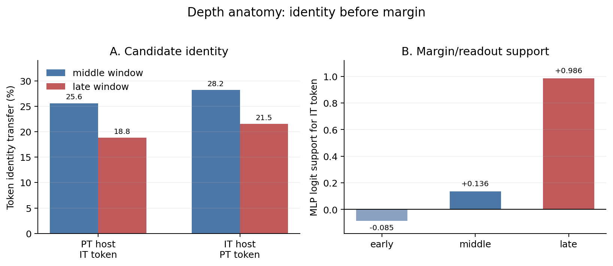

# First-Divergence Model Diffing Reveals Upstream-Conditioned Late Readout in Base-to-Instruct Language Models

**Anonymous authors** | NeurIPS 2026 Submission

---

## Abstract

Late-layer patching is a natural way to localize how an instruction-following checkpoint differs from its pretrained base, but a late patch can conflate two questions: what the late stack writes, and how much of that write is portable across upstream states. We introduce **first-divergence model diffing**. At the first shared-history prefix where a base/instruct pair prefers different next tokens, we cross PT/IT upstream state with PT/IT late stack and score the IT-vs-PT token margin. The estimand measures a late-readout portability gap. Across five dense core families, the IT-minus-PT late-stack effect is `+1.71` logits (`3.3x`) larger from IT-shaped upstream state than from PT-shaped upstream state, with every family positive. Targeted controls show the gap is not explained by broken hybrids, arbitrary token selection, or pre-late commitment. Depth and feature analyses give a candidate-to-margin picture: middle MLP windows are relatively more identity-selective, late/terminal windows are more margin-sensitive, and causally ranked terminal crosscoder features partially mediate, inherit upstream conditioning, and respond to preterminal state patches. The result is not explained by a fully portable late-only instruction module; it is an upstream-conditioned late readout in released dense base/instruct checkpoint contrasts.

---

## 1. Introduction

When an instruction-following checkpoint first chooses a different next token from its pretrained base, where in the forward pass does that difference become a logit? Paired base/instruct checkpoints make this question unusually clean: architecture and tokenizer are shared, but the released descendants differ after instruction tuning, preference optimization, reinforcement-style training, or a mixture of post-training stages. The object of study is therefore a **paired-checkpoint model diff**.

The tempting answer is "late layers." Late transformer computation is close to the unembedding, and prior work already makes late-stage refinement plausible: feed-forward layers promote vocabulary-space concepts (Geva et al., 2022b), late layers sharpen or calibrate predictions (Lad et al., 2025; Joshi et al., 2025), and instruction-tuned models show layer-structured task information (Zhao, Ziser, and Cohen, 2024). But ordinary late-layer patching leaves a crucial ambiguity. A late stack can look causal partly because it is paired with the upstream residual state it was trained to read, not because its effect would transfer unchanged as a late-only update.

We test portability directly with **first-divergence model diffing**. For each prompt, we find the earliest generated position where PT and IT prefer different next tokens under the same generated history. Let those tokens be `t_PT` and `t_IT`. At that prefix, we cross upstream residual state (`U_PT` or `U_IT`) with downstream late stack (`L_PT` or `L_IT`) and measure `logit(t_IT) - logit(t_PT)`. The key estimand is a difference-in-differences: how much larger is the IT-minus-PT late-stack replacement effect when the upstream state is IT-shaped rather than PT-shaped?

The answer is large, positive in every core family, and not a one-cell late-only effect. Across the five-family core set, the same IT late stack has a `3.3x` larger margin effect from IT upstream than from PT upstream, producing a `+1.71` logit interaction. The effect remains positive at generated positions `>=3`, under a common-PT readout, on a 32B family, under label-swap nulls, and under controls for pre-late token commitment, hybrid-state mismatch, and selected-token support.

This matters for model diffing practice. A late patch should not be interpreted as a fully portable late-layer mechanism unless the late effect is tested under both native and foreign upstream states.

The paper has three contributions.

1. **A paired-checkpoint first-divergence factorial.** We introduce a local counterfactual estimand at the exact token where PT and IT first disagree. It asks whether the IT-minus-PT late-stack replacement effect is portable across upstream states or amplified by IT-shaped upstream state.
2. **A validation ladder for the estimand.** We test the practical artifact explanations: broken hybrids, arbitrary selected-token support, pre-late commitment, readout choice, label orientation, position support, and family heterogeneity. The main text gives the decisive checks; the appendices give provenance.
3. **A depth and feature bridge.** Middle-positioned MLP substitutions are relatively more candidate/identity-selective, while late and terminal MLPs dominate margin/readout. Terminal crosscoders then connect the window-level result to sparse features that partially mediate the readout interaction, matter more under IT-shaped upstream state, partially rescue the weak hybrid, and respond to preterminal computation patches.

Scope is intentionally local. We use **IT** as shorthand for instruction-following post-trained descendants, but the recipes are heterogeneous; the empirical claim is about released dense base/instruct checkpoint contrasts, not one training algorithm. Causal language is readout-scoped: replacing an upstream state, late stack, or MLP component changes a specified next-token readout in a constructed forward pass. We do not claim a universal instruction-following circuit or full circuit reconstruction.

---

## 2. Setup

### 2.1 Model Sets and Statistical Reporting

The main factorial uses five dense PT/IT pairs: Llama 3.1 8B, Qwen 3 4B, Mistral 7B, OLMo 2 7B, and Qwen2.5 32B. We call this the **Core-5 set**. Several support analyses were run before the 32B extension and use the four smaller families: Llama, Qwen 3, Mistral, and OLMo. We call this the **Core-small support set**.

Prompt-bootstrap intervals quantify conditional precision on the sampled prompts and released checkpoints. They are not estimates over all possible model families, post-training recipes, or prompt distributions. For headline family-generalization claims, we therefore report the Core-5 mean and family-level range or median where it helps interpretation.

**Table 1: Minimal reproducibility snapshot.** The table below gives the fixed ingredients needed to audit the main factorial. Revision prefixes are unique abbreviations of the pinned Hugging Face revisions; Appendix A lists the full 40-character pins.

| Family | Checkpoint pair (`PT -> IT`) | Prompt set | Prompts -> valid events | First-div. position `0 / >=3 / >=5` | Late stack |
|---|---|---|---:|---:|---|
| Llama 3.1 8B | `Llama-3.1-8B@d04e592 -> Instruct@0e9e39f` | holdout-600 | `600 -> 600` | `59.3% / 28.0% / 17.3%` | layers `19-31` |
| Qwen 3 4B | `Qwen3-4B-Base@906bfd4 -> Qwen3-4B@1cfa9a7` | holdout-600 | `600 -> 600` | `48.7% / 35.2% / 23.5%` | layers `22-35` |
| Mistral 7B | `Mistral-7B-v0.3@caa1feb -> Instruct@c170c70` | holdout-600 | `600 -> 597` | `30.8% / 31.3% / 20.1%` | layers `19-31` |
| OLMo 2 7B | `OLMo-2-1124-7B@7df9a82 -> Instruct@470b1fb` | holdout-600 | `600 -> 586` | `60.1% / 27.1% / 16.0%` | layers `19-31` |
| Qwen2.5 32B | `Qwen2.5-32B@1818d35 -> Instruct@5ede1c9` | full-1400 | `1400 -> 1397` | `38.8% / 45.0% / 30.6%` | layers `38-63` |

All rows use raw-shared prompts, greedy top-1 first-divergence search with a real-token mask, and at most `128` generated tokens. Bootstrap unit is the prompt cluster within family. Appendix A gives prompt mixes and full revision pins; Appendix B gives the main artifact roots.

### 2.2 First-Divergence Factorial

For each prompt, generate with PT and IT until the first shared-history prefix where their top-1 next tokens differ. Let those tokens be `t_PT` and `t_IT`, and define

`Y(U,L) = logit(t_IT) - logit(t_PT)`.

Larger `Y` means the hybrid forward pass favors the IT divergent token. At a pre-specified late boundary, run the four cells below:

| Upstream state | PT late stack `L_PT` | IT late stack `L_IT` |
|---|---:|---:|
| PT upstream `U_PT` | `Y(U_PT,L_PT)` | `Y(U_PT,L_IT)` |
| IT upstream `U_IT` | `Y(U_IT,L_PT)` | `Y(U_IT,L_IT)` |

The primary estimand is:

`[Y(U_IT,L_IT) - Y(U_IT,L_PT)] - [Y(U_PT,L_IT) - Y(U_PT,L_PT)]`.

Equivalently: first measure the IT-minus-PT late-stack replacement effect under each upstream state; then compare those two effects. This subtracts the PT-late-stack baseline within each upstream row, so the result is not merely a native-stack-vs-foreign-stack comparison. Common-IT and common-PT readouts score all four cells with one fixed final norm, `lm_head`, and real-token mask. Unless stated otherwise, main factorial numbers use common-IT readout.

All raw-shared first-divergence and residual-state runs force both PT and IT branches to raw text and validate identical raw prompt token IDs before comparing residual states. Position 0 is therefore the first generated token after the full raw prompt, not a chat-template artifact.

**Figure 1: First-divergence schematic and token examples.** Panel A shows the four hybrid passes used to estimate the upstream x late interaction. Panel B gives illustrative divergent-token pairs; all quantitative claims use the full support in Table 1.

---

## 3. Results

### 3.1 Main First-Divergence Factorial

At the first natural PT/IT disagreement, the IT late stack is only partially portable. In the Core-5 set, replacing the PT late stack with the IT late stack shifts the IT-token margin by `+0.75` logits from PT upstream, but by `+2.46` logits from IT upstream. The `+1.71` logit gap means the matched-context effect is `3.3x` larger.

The sign pattern is consistent across families: every Core-5 interaction is positive, ranging from `+1.25` to `+2.53` logits. The amplification scale is the cleanest magnitude reference because it compares the same late-stack replacement under two upstream states; Appendix B reports native-shift shares and family-level ranges.

The interaction is also not confined to response openings: generated position `>=3` and `>=5` subsets remain positive, though smaller and thinner.

| Scope/readout | Late effect from PT upstream | Late effect from IT upstream | Interaction | Amplification |
|---|---:|---:|---:|---:|
| Core-5, common-IT | `+0.75` `[+0.67, +0.82]` | `+2.46` `[+2.36, +2.55]` | `+1.71` `[+1.64, +1.78]` | `3.3x` |
| Core-5, common-PT | `+0.74` `[+0.67, +0.81]` | `+2.48` `[+2.38, +2.57]` | `+1.74` `[+1.67, +1.81]` | `3.4x` |
| Qwen2.5-32B only | `+0.98` `[+0.88, +1.08]` | `+2.42` `[+2.26, +2.59]` | `+1.45` `[+1.32, +1.57]` | `2.5x` |

On the local token-margin scale, `+1.71` logits is substantial: it multiplies the odds of `t_IT` over `t_PT` by about `5.5x` within the constructed contrast, and it is `34.6%` of the native PT->IT diagonal margin shift on the same support. This is still a token-level mechanistic quantity, not a deployment-level behavior estimate. §3.2 adds a behavioral bridge showing that the same hybrid readout pattern changes immediate token choice and short-continuation preferences.

This is the paper's central claim: at natural base/instruct disagreement points, the stable object is the upstream x late interaction, not the portable component alone. On a factual/reasoning stress test, for example, the late-only effect from PT upstream is negative (`-1.18`), while the interaction remains positive (`+1.81`).

### 3.2 Validation Ladder

The first-divergence factorial intentionally selects a high-signal disagreement point and constructs hybrid forward passes. No patching experiment makes those hybrids literally natural trajectories. The validation question is narrower: do the main artifact explanations make the estimand uninformative? Four checks answer no; Appendix C gives the full audit trail.

| Concern | Main evidence | Takeaway |
|---|---|---|
| The hybrid state is broken or generically off-manifold. | Native diagonals reconstruct exactly; PT->IT boundary interpolation is smooth and positive; signed permutations recover only a minority of the effect. | The effect behaves like a structured PT->IT direction, not a patching cliff or generic hybrid perturbation. |
| First divergence is an arbitrary selected token pair. | Random local disagreements from the same prompts retain only `56%` of the first-divergence interaction; pre-divergence prefixes scored on the future token pair are near zero (`3%`). | First divergence is a meaningful high-signal support, not just any PT/IT token contrast. |
| The upstream state has already decided before the late stack. | The interaction remains positive when the IT boundary readout does not yet favor `t_IT` and in the lowest boundary-margin tercile. | The late stack still contributes after controlling for pre-late commitment. |
| The logit margin does not affect generated behavior. | With the IT late stack fixed, IT-shaped upstream state raises `t_IT` top-1 selection from `24.5%` to `97.6%`; pairwise judging prefers the native IT-upstream continuation in `71.0%` of cases. | The readout interaction is visible in immediate token choice and short hybrid continuations, not only in two-token logit scores. |

The selected-support control is important enough to visualize directly. First divergence is high-signal, but it is not a one-off cherry-picked token pair: random later PT/IT disagreements from the same rollouts show the same positive sign at reduced magnitude (`56%` in the source-balanced comparison), while scoring the future divergent token pair before the models actually diverge is near zero (`3%`). This is the pattern we would expect if first divergence is a principled support-selection device: it concentrates the interaction, but related local disagreements retain a weaker version of it.

Secondary checks agree: common-PT readout gives the same answer, later-position subsets remain positive, the label-swap null passes, and every core family has a positive interaction. Together, these controls make the practical artifact explanations unlikely. The exact logit magnitude remains intervention-scoped, and the short continuations are still constructed hybrid rollouts, but the upstream-conditioned late-readout pattern is robust under the tests that would otherwise explain it away.

### 3.3 Depth Anatomy: Candidate-to-Margin Handoff

The interaction has a consistent depth anatomy. Middle-positioned MLP substitutions transfer divergent-token identity more often than late substitutions, while late windows dominate margin/readout. Terminal-depth audits sharpen the same story: the last few blocks preserve a large readout subcomponent but transfer token identity poorly. The handoff is therefore operational rather than a complete circuit: middle windows are relatively more candidate/identity-selective, while late and terminal windows are more margin/readout-sensitive.

| Evidence | Key result | Interpretation |
|---|---:|---|
| Middle vs late identity transfer | `25.6%` mid vs `18.8%` late in PT host; `28.2%` mid vs `21.5%` late in IT host | Middle windows are relatively more candidate/identity-selective. |
| Native IT MLP margin support | late `+0.986`; middle `+0.136`; early `-0.085` | Native IT-token margin support is late-concentrated. |
| PT-host late insertion | `+0.004` | Late MLP updates alone are near zero from PT upstream state. |
| Terminal-depth audit | final-three blocks retain `52%`; final block retains `23%` | Terminal layers carry a substantial readout subcomponent. |
| Terminal feature mediation, gating, rescue, and handoff | top causal features account for `26-48%`; causal gate beats matched random; direct feature rescue is `+0.49`; mid-to-preterminal patches rescue `+1.71`, with `+0.13` mediated by the same features | Sparse terminal features carry a concentrated, upstream-conditioned bridge. |

Terminal crosscoders make this handoff visible at feature level. We train paired PT/IT BatchTopK crosscoders with a shared latent dictionary and separate PT/IT decoder branches on terminal MLP outputs, rank features by held-out causal effect, and ablate their IT-branch decoder contribution inside the terminal IT stack. The fixed top-200 causal subset accounts for `26-48%` of the terminal readout interaction, while matched-random sets have the wrong sign or near-zero effect. Appendix D gives reconstruction, sparsity, and training details.

The same features inherit the upstream conditioning seen at window level. Ablating the top-200 causal terminal features hurts the `U_IT,L_IT` readout much more than the `U_PT,L_IT` readout, beating matched-random features in all three clean terminal-crosscoder families (family means `+1.25`, `+0.98`, `+0.43` logits). Conversely, patching their native `U_IT,L_IT` activations into the weak `U_PT,L_IT` hybrid rescues `+0.49` logits and beats both matched-random and same-delta random rescue. This rescue is deliberately harder than ablation and is not full reconstruction, but it shows that the upstream-conditioned terminal features recover a measurable slice of the missing IT-token margin.

Finally, a direct handoff test perturbs upstream computation and re-measures the same terminal features. Injecting IT mid-to-preterminal computation into the weak `U_PT,L_IT` hybrid rescues `+1.71` logits of IT-token margin, with `+0.13` logits mediated by the selected terminal features. The reverse intervention, replacing the same preterminal computation in native IT with PT computation, causes a `+3.57` logit drop, with `+0.53` mediated. A terminal-entry patch gives the expected upper bound (`+5.15` total, `+0.71` mediated). Thus the feature bridge is not only terminal: preterminal state changes drive a measurable part of the terminal sparse-feature readout.

Held-out autointerp makes the mediated feature set readable but not load-bearing. Across `225` interpreted features from the clean terminal-crosscoder families, validation reaches mean AUROC `0.886`; we use these labels descriptively while the causal evidence comes from feature edits. As a targeted semantic check, a predeclared `structure_readout` bucket gives a monotone positive edit across clean crosscoder families; Appendix D reports the full dose response and controls.

### 3.4 What the Factorial Separates

The first-divergence event is a distributional fact: the released PT and IT checkpoints prefer different next tokens at that prefix. The factorial asks a different question: once the token contrast is fixed, how much of the IT late-stack effect ports across upstream states? The answer is: some, but not most. The IT late stack can add IT-token margin from PT upstream, but most of its matched-context readout effect appears only when the upstream state is IT-shaped.

This distinction is why the result is more than "PT and IT differ." Random local disagreements, pre-divergence future-token scoring, and pre-late commitment controls all reduce or preserve the interaction in the predicted directions. The feature bridge then shows that part of the window-level interaction is carried by terminal sparse features that are more causally important under IT-shaped upstream state, can partially rescue the weak PT-upstream hybrid, and respond when upstream/preterminal computation is patched.

Two supporting analyses stay in the appendix. Endpoint-matched late-refinement signatures explain why late/terminal windows were a good target: after matching on final entropy, confidence, and margin, IT late predictions remain farther from their own final readout than PT late predictions under both raw and tuned probes (`+0.425` and `+0.762` nats; Appendix E). This is a localization signature, not the mechanism itself. An OLMo-2 Base/SFT/DPO/RLVR lineage shows that the same estimand can be tracked along one released post-training path, without turning that single path into a general stage attribution.

Contemporaneous token-level RLVR work reaches a complementary conclusion from the outside: Sparse but Critical shows that a small set of shifted token decisions can carry large downstream effects under cross-sampling interventions (Meng et al., 2026). Our question is internal and paired-checkpoint: at the selected token where behavior first changes, how does the IT-token preference become a logit inside the model?

---

## 4. Related Work

**Late refinement and FFN readout.** Feed-forward layers promote vocabulary-space concepts and progressively refine predictions (Geva et al., 2022a,b). Layerwise intervention studies describe late residual sharpening (Lad et al., 2025), calibration analyses find an upper-layer confidence-adjustment phase (Joshi et al., 2025), and tuned lenses operationalize layerwise prediction refinement (nostalgebraist, 2020; Belrose et al., 2023). These works establish late refinement as plausible. Our contribution is to measure how it differs across paired PT/IT checkpoints at natural first-divergence tokens.

**Post-training model diffs.** Wu et al. (2024) study behavioral shifts from language modeling to instruction following. Du et al. (2025) compare base and post-trained checkpoints mechanistically across knowledge, truthfulness, refusal, and confidence. Zhao, Ziser, and Cohen (2024) show layer-structured task information in instruction-tuned models. Sparse but Critical analyzes RLVR as sparse token-level distribution shifts whose cross-sampled substitutions affect reasoning trajectories (Meng et al., 2026). We add an internal paired-checkpoint counterfactual: at the first token where PT and IT disagree, how much of the IT-token margin comes from a portable late-stack effect, and how much requires IT-shaped upstream state?

**Activation patching and feature-level model diffing.** Activation patching requires care because metric choice, intervention direction, and off-manifold hybrids affect interpretation (Heimersheim and Nanda, 2024). We therefore report intervention-scoped readout effects and validate them with readout swaps, diagonal reconstruction, interpolation, low-anomaly filtering, label-swap nulls, signed-permutation controls, and random-disagreement baselines. Cross-model activation patching across base and fine-tuned variants is the closest methodological precedent (Prakash et al., 2024): their target is an entity-tracking mechanism and whether fine-tuning enhances it, while ours is the first natural PT/IT next-token disagreement and how much the late readout margin ports across upstream states. Sparse crosscoders provide a complementary route for model diffing (Lindsey et al., 2024), with known sparsity-artifact pitfalls (Minder et al., 2025). We use crosscoders after the factorial rather than as a standalone diff: causally ranked terminal features partially mediate the interaction, matter more under IT-shaped upstream state, and partially rescue the weak PT-upstream hybrid.

**Automated feature interpretation.** LLM-based neuron interpretation commonly follows a generate-and-score pattern: propose a natural-language feature hypothesis, then test it on held-out examples (Bills et al., 2023; Huang et al., 2023). We follow that pattern for terminal crosscoder features. Labels are descriptive evidence; feature ablations provide the causal evidence.

**Novelty.** Several ingredients have precedents: late refinement, FFN vocabulary promotion, activation patching, global base/instruct diffing, and sparse model-diff features. The new object is the paired-checkpoint first-divergence factorial estimand. It measures the portability gap in the IT-minus-PT late-stack replacement effect at the natural token where PT and IT first disagree. The feature-level contribution is the bridge from this window-level interaction to terminal sparse features: the same causally ranked features mediate part of the readout interaction, are selectively necessary under IT-shaped upstream state, partially rescue the missing margin when inserted into the PT-upstream hybrid, and are partly driven by upstream/preterminal computation.

---

## 5. Discussion, Scope, and Next Tests

### 5.1 Interpretation

The interpretation suggested by these results is that released base-to-instruct transitions reshape how existing computation is read out, rather than adding a portable late instruction module. This is compatible with a broader view of post-training as selecting, amplifying, or consolidating reachable behaviors from the pretrained model, but our evidence is narrower: it concerns dense base/instruct checkpoint pairs at first-divergence token readouts. RLVR analyses such as Sparse but Critical are complementary context because they study token-level post-training shifts from outside the model; our factorial asks where the selected token preference becomes a logit inside paired checkpoints.

The OLMo-2 lineage illustrates how the same estimand can be reused along one released post-training path. On fixed Base->RLVR first-divergence support, the measured interaction is already partly present after SFT and close to final after DPO, with the final RLVR/Instruct checkpoint strongest. This is a case study in applying the diagnostic across stages, not a general attribution of which post-training stage causes the effect.

### 5.2 Scope

The scope is narrow by design. First, the estimand is local to first-divergence next-token readouts: it targets the earliest point where a released PT/IT pair changes preference under shared history, not an average over all model behavior. Position-stratified and domain stress tests show that the interaction persists beyond the earliest generated positions, while its magnitude varies with prompt domain and generated position.

Second, the interventions are window-level compatibility tests. Hybrid-state validation makes practical artifact explanations unlikely, and terminal crosscoders provide concentrated feature-level mediation, rescue, and upstream-handoff checks, but we do not recover a full circuit or prove an on-manifold natural-trajectory effect size. The headline logit margins are dimensionalized as odds and native-shift shares in §3.1; they should not be read as direct estimates of completion-level behavior.

Third, the empirical scope is five dense core PT/IT pairs. DeepSeek-V2-Lite stays appendix-only because MoE routing and expert swaps require different controls. Architecture and MoE generalization are therefore next-step questions, not claims made by the core dense-family result. The OLMo-2 result is a fixed-support case study of one released lineage, not a universal stage attribution.

### 5.3 Practical Implications and Next Tests

The immediate practical implication is methodological: late-patching, steering, and model surgery studies on paired checkpoints should test whether late effects are portable across upstream states before treating them as standalone late-layer mechanisms.

The most direct next test is to make the upstream side sparse as well: train or interpret middle/preterminal features directly and test which of them drive the upstream-conditioned terminal features.

---

## 6. Conclusion

First-divergence model diffing turns a vague question -- "do late layers explain the base-to-instruct difference?" -- into a paired-checkpoint counterfactual. At the first token where released PT and IT checkpoints disagree, the IT-minus-PT late-stack replacement effect is much larger from IT-shaped upstream state than from PT-shaped upstream state. The result is positive across the five dense core families and robust to targeted checks for readout choice, selected-token support, pre-late commitment, label orientation, and hybrid-state failure. The depth anatomy is graded: middle windows are relatively more identity-selective, while late and terminal windows are more margin/readout-sensitive. Terminal sparse features carry a concentrated bridge: they are more causally important under IT-shaped upstream state, their native-IT activation pattern partially rescues the weak PT-upstream hybrid, and upstream/preterminal patches drive a measurable part of their mediated effect. The resulting picture is not explained by a fully portable late-only update; it is an upstream-conditioned late readout pattern in released dense base/instruct checkpoint contrasts.

---

## References

Aghajanyan, A., et al. (2021). Intrinsic Dimensionality Explains the Effectiveness of Language Model Fine-Tuning. *ACL 2021*.

Arditi, A., Obeso, O., Syed, A., Paleka, D., Panickssery, N., Gurnee, W., & Nanda, N. (2024). Refusal in Language Models Is Mediated by a Single Direction. *NeurIPS 2024*.

Belrose, N., et al. (2023). Eliciting Latent Predictions from Transformers with the Tuned Lens. arXiv:2303.08112.

Bills, S., Cammarata, N., Mossing, D., Tillman, H., Gao, L., Goh, G., Sutskever, I., Leike, J., Wu, J., & Saunders, W. (2023). Language Models Can Explain Neurons in Language Models. OpenAI.

Chuang, Y., et al. (2024). DoLA: Decoding by Contrasting Layers Improves Factuality. *ICLR 2024*.

Conmy, A., Mavor-Parker, A. N., Lynch, A., Heimersheim, S., & Garriga-Alonso, A. (2023). Towards Automated Circuit Discovery for Mechanistic Interpretability. *NeurIPS 2023*.

Deiseroth, B., Meuer, M., Gritsch, N., Eichenberg, C., Schramowski, P., Assenmacher, M., & Kersting, K. (2024). Divergent Token Metrics: Measuring Degradation to Prune Away LLM Components -- and Optimize Quantization. *NAACL 2024*.

Du, H., Li, W., Cai, M., Saraipour, K., Zhang, Z., Lakkaraju, H., Sun, Y., & Zhang, S. (2025). How Post-Training Reshapes LLMs: A Mechanistic View on Knowledge, Truthfulness, Refusal, and Confidence. *COLM 2025*.

Geva, M., Schuster, R., Berant, J., & Levy, O. (2022a). Transformer Feed-Forward Layers Are Key-Value Memories. *EMNLP 2022*.

Geva, M., Caciularu, A., Wang, K. R., & Goldberg, Y. (2022b). Transformer Feed-Forward Layers Build Predictions by Promoting Concepts in the Vocabulary Space. *EMNLP 2022*.

Heimersheim, S., & Nanda, N. (2024). How to Use and Interpret Activation Patching. arXiv:2404.15255.

Huang, J., Geiger, A., D'Oosterlinck, K., Wu, Z., & Potts, C. (2023). Rigorously Assessing Natural Language Explanations of Neurons. *BlackboxNLP 2023*.

Joshi, A., Ahmad, A., & Modi, A. (2025). Calibration Across Layers: Understanding Calibration Evolution in LLMs. *EMNLP 2025*.

Lad, V., Lee, J. H., Gurnee, W., & Tegmark, M. (2025). The Remarkable Robustness of LLMs: Stages of Inference? *NeurIPS 2025*.

Lambert, N., Morrison, J., Pyatkin, V., Huang, S., Ivison, H., et al. (2025). Tulu 3: Pushing Frontiers in Open Language Model Post-Training. *COLM 2025*.

Lin, B. Y., et al. (2024). The Unlocking Spell on Base LLMs: Rethinking Alignment via In-Context Learning. *ICLR 2024*.

Lindsey, J., Templeton, A., Marcus, J., Conerly, T., Batson, J., & Olah, C. (2024). Sparse Crosscoders for Cross-Layer Features and Model Diffing. *Transformer Circuits Thread*.

Makelov, A., Lange, G., & Nanda, N. (2024). Towards Principled Evaluations of Sparse Autoencoders for Interpretability and Control. arXiv:2405.08366.

Meng, H., Huang, K., Wei, S., Ma, C., Yang, S., Wang, X., Wang, G., & Ding, B. (2026). Sparse but Critical: A Token-Level Analysis of Distributional Shifts in RLVR Fine-Tuning of LLMs. arXiv:2603.22446.

Minder, J., Dumas, C., Juang, C., Chughtai, B., & Nanda, N. (2025). Overcoming Sparsity Artifacts in Crosscoders to Interpret Chat-Tuning. *NeurIPS 2025*.

Panigrahi, A., Saunshi, N., Zhao, H., & Arora, S. (2023). Task-Specific Skill Localization in Fine-tuned Language Models. *ICML 2023*.

Prakash, N., Shaham, T. R., Haklay, T., Belinkov, Y., & Bau, D. (2024). Fine-Tuning Enhances Existing Mechanisms: A Case Study on Entity Tracking. *ICLR 2024*.

Team OLMo, Walsh, P., Soldaini, L., Groeneveld, D., Lo, K., Arora, S., et al. (2025). 2 OLMo 2 Furious. *COLM 2025*.

Wu, X., Yao, W., Chen, J., Pan, X., Wang, X., Liu, N., & Yu, D. (2024). From Language Modeling to Instruction Following: Understanding the Behavior Shift in LLMs after Instruction Tuning. *NAACL 2024*.

Zhao, Z., Ziser, Y., & Cohen, S. B. (2024). Layer by Layer: Uncovering Where Multi-Task Learning Happens in Instruction-Tuned Large Language Models. *EMNLP 2024*.

---

## Appendix Roadmap

The main text is written around stable claim names. For details, start with Appendix B for the main four-cell factorial, Appendix C for validation controls, and Appendix D for depth/feature anatomy. Numeric run IDs appear only in file paths or script names; they are provenance labels, not concepts the reader needs to parse.

| Claim | Main location | Appendix | Primary artifacts/scripts |
|---|---|---|---|
| Minimal reproducibility snapshot | §2.1 | A, B, H | model registry, dataset manifests, raw first-divergence records |
| Core-5 first-divergence interaction and amplification scale | §3.1 | B | `results/paper_synthesis/exp23_core5/`; `scripts/analysis/build_exp23_core5_synthesis.py` |
| Validation ladder | §3.2 | C | hybrid-state validation, random-disagreement baselines, token-support audit, pre-late commitment control |
| Behavioral bridge from margin to output | §3.2 | C | one-step top-1/token-rank audit and short-hybrid-rollout pairwise judging |
| Depth and terminal anatomy | §3.3 | D | identity/margin handoff, terminal-depth audit, terminal MLP audit |
| Terminal feature mediation, upstream-conditioning, rescue, handoff, and structure-bucket validation | §3.3 | D | terminal crosscoder synthesis, hardening runs, upstream-conditioning audit, feature rescue, preterminal handoff, autointerp taxonomy, structure-readout edit |
| Late refinement/readout signatures | §3.4 | E | endpoint-matched KL, late MLP random controls |
| OLMo staged case study | §3.4 | F | fixed-support Base/SFT/DPO/RLVR stage decomposition |
| Architecture and MoE scope | §5 | G | dense/MoE scope note |

Prompt-bootstrap CIs in the main text are conditional precision estimates over sampled prompts and released checkpoints. They are paired with family-level summaries or family ranges where a claim could otherwise be mistaken for a population-level model-family generalization.

---

## Appendix A: Model Scope and Statistical Reporting

**Core-5 set.** Llama 3.1 8B, Qwen 3 4B, Mistral 7B, OLMo 2 7B, and Qwen2.5 32B. Qwen2.5 32B is included as the scale check in the core first-divergence synthesis.

**Core-small support set.** Llama 3.1 8B, Qwen 3 4B, Mistral 7B, and OLMo 2 7B. Supporting identity/margin, terminal MLP, crosscoder, and KL analyses use this smaller-family scope unless explicitly marked otherwise. The Qwen2.5 32B pair is included in the main factorial and omitted from these support analyses for compute.

**Prompt sets.** The holdout-600 prompt mix is `GOV-CONV/GOV-FORMAT/SAFETY = 300/150/150`. The full-1400 mix adds factual, reasoning, register, and baseline-easy prompts: `CONTENT-FACT/CONTENT-REASON/GOV-FORMAT/GOV-CONV/SAFETY/GOV-REGISTER/BASELINE-EASY = 300/200/250/300/150/100/100`.

| Family | PT checkpoint | PT revision | IT checkpoint | IT revision | Notes |
|---|---|---|---|---|---|
| Llama 3.1 8B | `meta-llama/Llama-3.1-8B` | `d04e592bb4f6aa9cfee91e2e20afa771667e1d4b` | `meta-llama/Llama-3.1-8B-Instruct` | `0e9e39f249a16976918f6564b8830bc894c89659` | Dense GQA. |
| Qwen 3 4B | `Qwen/Qwen3-4B-Base` | `906bfd4b4dc7f14ee4320094d8b41684abff8539` | `Qwen/Qwen3-4B` | `1cfa9a7208912126459214e8b04321603b3df60c` | Dense GQA. |
| Mistral 7B | `mistralai/Mistral-7B-v0.3` | `caa1feb0e54d415e2df31207e5f4e273e33509b1` | `mistralai/Mistral-7B-Instruct-v0.3` | `c170c708c41dac9275d15a8fff4eca08d52bab71` | Dense attention in v0.3 config. |
| OLMo 2 7B | `allenai/OLMo-2-1124-7B` | `7df9a82518afdecae4e8c026b27adccc8c1f0032` | `allenai/OLMo-2-1124-7B-Instruct` | `470b1fba1ae01581f270116362ee4aa1b97f4c84` | Released stage lineage available. |
| Qwen2.5 32B | `Qwen/Qwen2.5-32B` | `1818d35814b8319459f4bd55ed1ac8709630f003` | `Qwen/Qwen2.5-32B-Instruct` | `5ede1c97bbab6ce5cda5812749b4c0bdf79b18dd` | Core-5 scale check. |

The Core-5 synthesis combines stored per-family prompt-bootstrap estimates for the five families in §2.1. The amplification ratio reported in §3.1 is:

`late-stack amplification = [Y(U_IT,L_IT) - Y(U_IT,L_PT)] / [Y(U_PT,L_IT) - Y(U_PT,L_PT)]`.

This is the main scale reference because it compares the same IT late-stack replacement under the two upstream states. We also report a secondary native-shift scale, computed inside the same 2x2:

`native PT->IT diagonal margin shift = Y(U_IT,L_IT) - Y(U_PT,L_PT) = late_weight_effect + upstream_context_effect`.

The reported interaction share is `interaction / native diagonal margin shift`. This is a scale reference, not a claim that the interaction linearly decomposes all behavioral difference.

---

## Appendix B: Main First-Divergence Factorial Audit Trail

Primary Core-5 artifacts:

- `results/paper_synthesis/exp23_core5/exp23_core5_core_effects.csv`
- `results/paper_synthesis/exp23_core5/exp23_core5_family_effects.csv`
- `results/paper_synthesis/exp23_core5/exp23_core5_position_sensitivity.csv`
- `results/paper_synthesis/exp23_core5/exp23_core5_interaction.png`

Raw first-divergence record mirrors:

- Core-small support: `gs://pt-vs-it-results/results/exp23_midlate_interaction_suite/exp23_dense5_full_h100x8_20260426_sh4_rw4/`
- Qwen2.5 32B support: `gs://pt-vs-it-results/results/exp24_32b_external_validity/exp24_qwen25_32b_full_eval_v21_20260427_194839/`

Main Core-5 effects:

| Scope/readout | PT-up late effect | IT-up late effect | Interaction | Amplification | Native shift | Share |
|---|---:|---:|---:|---:|---:|---:|
| Core-5, common-IT | `+0.747` `[+0.673, +0.821]` | `+2.456` `[+2.364, +2.547]` | `+1.709` `[+1.637, +1.780]` | `3.3x` | `+4.942` | `34.6%` |
| Core-5, common-PT | `+0.740` `[+0.673, +0.807]` | `+2.477` `[+2.384, +2.570]` | `+1.737` `[+1.667, +1.807]` | `3.4x` | `+4.996` | `34.8%` |

Core-5 family-level common-IT interactions:

| Family | Interaction | Native diagonal shift | Interaction share |
|---|---:|---:|---:|
| Llama 3.1 8B | `+1.253` | `+5.358` | `23.4%` |
| Qwen2.5 32B | `+1.446` | `+3.751` | `38.6%` |
| Qwen 3 4B | `+1.464` | `+3.938` | `37.2%` |
| OLMo 2 7B | `+1.847` | `+5.227` | `35.3%` |
| Mistral 7B | `+2.534` | `+6.437` | `39.4%` |

The Core-5 family interaction range is `+1.253` to `+2.534` logits, with median `+1.464`. Interaction share ranges from `23.4%` to `39.4%`.

The Core-small label-swap null is computed from:

- `results/paper_synthesis/exp23_core_small_compatibility_permutation/`

The content/reasoning stress test is:

- `results/exp23_midlate_interaction_suite/exp23_content_reasoning_residual_20260427_0930_h100x8/analysis/exp23_summary.json`

On that support, the late-only PT-upstream term is `-1.176` and the upstream x late interaction is `+1.812` (`[+1.721, +1.901]`).

Qwen2.5 32B artifacts:

- `results/exp24_32b_external_validity/exp24_qwen25_32b_full_eval_v21_20260427_194839/analysis/`
- `results/paper_synthesis/exp24_32b_external_validity/`

---

## Appendix C: Validation Controls

**Hybrid-state validation.** Primary artifacts:

- `results/exp36_offmanifold_validation/exp36_offmanifold_dense5_full_a100x8_20260502_233904/analysis/summary.json`
- `results/exp36_offmanifold_validation/exp36_offmanifold_dense5_full_a100x8_20260502_233904/analysis/exp36_offmanifold_validation_report.md`
- `results/exp36_offmanifold_validation/exp36_offmanifold_dense5_full_a100x8_20260502_233904/analysis/interpolation_dose_response.png`
- `results/exp36_offmanifold_validation/exp36_offmanifold_dense5_full_a100x8_20260502_233904/analysis/low_anomaly_robustness.png`

Key checks, summarized over the Core-small support families:

| Check | Result |
|---|---:|
| Endpoint interaction, common-IT | `+1.794` |
| PT-to-IT interpolation slope | `+1.831` |
| Signed-permutation random/observed ratio | `0.31x` |

**Random-disagreement and pre-divergence controls.** Primary artifacts:

- `results/exp37_random_prefix_baseline/exp37_full_dense5_auth_xetfast_h100x8_20260503_002609/analysis/summary.json`
- `results/exp37_random_prefix_baseline/exp37_full_dense5_auth_xetfast_h100x8_20260503_002609/analysis/effects.csv`
- `results/exp37_random_prefix_baseline/exp37_full_dense5_auth_xetfast_h100x8_20260503_002609/analysis/exp37_matched_prefix_baselines.png`
- `results/paper_synthesis/exp37_core_small_selection_baseline/selection_baselines_core_small.png`

The main-text figure and table below report Core-small family-balanced means computed from the per-family Exp37 summaries.

| Condition | Interaction | Share of first divergence |
|---|---:|---:|
| True first divergence | `+1.794` | `100%` |
| Random local disagreement, source-balanced | `+1.005` | `56%` |
| Random PT-rollout disagreement | `+0.836` | `47%` |
| Random IT-rollout disagreement | `+1.190` | `66%` |
| Pre-divergence prefix, future token pair | `+0.059` | `3%` |

**Token-support control.** The no-GPU support control compares true first divergence to random local PT/IT disagreements from the same prompts and generated rollouts.

- `scripts/analysis/analyze_exp37_token_support_control.py`
- `results/exp37_random_prefix_baseline/exp37_full_dense5_auth_xetfast_h100x8_20260503_002609/analysis/token_support_control/summary.json`

Random local disagreements are later and more content-token-heavy than first divergences, yet their factorial interaction is smaller. This rules out the simple explanation that the first-divergence interaction is large only because of early-position or format-heavy support.

**Selected-support audit.** Primary artifacts:

- `scripts/analysis/analyze_first_divergence_token_support.py`
- `results/first_divergence_token_support/dense5_llm_gpt55_20260503_121500/summary.json`
- `results/first_divergence_token_support/dense5_llm_gpt55_20260503_121500/token_support_report.md`

The audit supports the main-text scope statement: first divergence is a targeted high-signal disagreement support, and most judged events fall in substantive instruction, safety, formatting, response-shaping, or semantic-content categories rather than pure surface formatting. We keep the full category table in the artifact report rather than in the manuscript because it is a support audit, not part of the evidence spine.

**Pre-late commitment control.** Primary artifacts:

- `results/exp40_prelate_commitment_control/exp40_exp20_layerwise_proxy_20260503_110001/analysis/summary.json`
- `results/exp40_prelate_commitment_control/exp40_exp20_layerwise_proxy_20260503_110001/analysis/effects.csv`
- `results/exp40_prelate_commitment_control/exp40_exp20_layerwise_proxy_20260503_110001/analysis/exp40_prelate_commitment_report.md`
- `results/exp40_prelate_commitment_control/exp40_exp20_layerwise_proxy_20260503_110001/analysis/prelate_commitment_bins.png`

The support-run control restricts to events where the IT boundary readout does not yet favor `t_IT`, bins events by IT boundary margin, and fits boundary-margin controls. In all three views the interaction remains positive. This rules out the simplest "the late stack is irrelevant because the boundary already committed" reading without promoting these support-run magnitudes to Core-5 headline estimates.

**Behavioral bridge.** This support analysis asks whether the logit-margin interaction maps onto generated-token behavior. It uses the Core-small support families and the same first-divergence prefixes as the main factorial.

- `results/exp45_behavioral_bridge/exp45_full_a100x8_20260504_0652/analysis/report.md`
- `results/exp45_behavioral_bridge/exp45_full_a100x8_20260504_0652/analysis/one_step_effects.csv`
- `results/exp45_behavioral_bridge/exp45_full_a100x8_20260504_0652/analysis/behavioral_effects.csv`
- `results/exp45_behavioral_bridge/exp45_full_a100x8_20260504_0652/analysis/llm_judge_summary.json`

One-step readout gives the cleanest bridge. With the IT late stack fixed, changing the upstream state from PT-shaped to IT-shaped raises `t_IT` top-1 selection from `24.5%` to `97.6%`; the corresponding pairwise `logit(t_IT) > logit(t_PT)` rate rises from `31.2%` to `98.7%`.

| Metric | `U_PT,L_IT` | `U_IT,L_IT` | Gap |
|---|---:|---:|---:|
| `t_IT` top-1 rate | `24.5%` | `97.6%` | `+73.1%` |
| `t_IT` top-5 rate | `70.9%` | `100.0%` | `+29.1%` |
| `t_IT > t_PT` pairwise rate | `31.2%` | `98.7%` | `+67.5%` |

Short hybrid rollouts give a complementary completion-level check. A blinded pairwise judge (`gpt-4.1-mini`) prefers `U_IT,L_IT` over `U_PT,L_IT` as more instruction-following / assistant-like in `71.0%` of cases when ties/unclear are counted as `0.5` (`[69.4%, 72.6%]`). The judge also finds a smaller positive late-stack effect under both upstream states: `58.5%` for `U_PT,L_IT` over `U_PT,L_PT`, and `57.8%` for `U_IT,L_IT` over `U_IT,L_PT`.

We use this as a behavioral bridge only. The one-step result is closest to the factorial estimand; the judged continuations are constructed hybrid rollouts, not natural deployment trajectories.

---

## Appendix D: Depth, Terminal, and Crosscoder Details

**Identity/margin handoff artifacts:**

- `results/paper_synthesis/exp20_exp21_handoff_table.csv`
- `results/paper_synthesis/exp20_exp21_handoff_core_small.png`
- `results/exp20_divergence_token_counterfactual/factorial_validation_holdout_fast_20260425_2009_with_early/validation_analysis/summary.json`
- `results/exp21_productive_opposition/exp21_full_productive_opposition_clean_20260426_053736/analysis/summary.json`
- `results/exp21_productive_opposition/exp21_full_productive_opposition_clean_20260426_053736/analysis/effects.csv`

Main depth-anatomy quantities:

| Readout | Early | Middle | Late / terminal | Interpretation |
|---|---:|---:|---:|---|
| PT host: IT-token identity transfer | - | `25.6%` | `18.8%` | Middle substitutions transfer candidate identity more often. |
| IT host: PT-token identity transfer | - | `28.2%` | `21.5%` | Mirror direction gives the same identity pattern. |
| Pure IT MLP support for `t_IT` | `-0.085` | `+0.136` | `+0.986` | Native IT-token support is late-concentrated. |
| PT-host late MLP margin gain | - | - | `+0.004` | Late MLP updates alone are near zero in PT upstream state. |
| Source decomposition interaction | - | - | `+0.360` | MLP-level readout also shows context gating. |

**Terminal-depth and terminal-MLP artifacts:**

- `results/exp31_terminal_depth_factorial/exp31_terminal_depth_full_a100x4_localdisk_fixedsched_20260502_021238/analysis/terminal_depth_summary.json`
- `results/exp31_terminal_depth_factorial/exp31_terminal_depth_full_a100x4_localdisk_fixedsched_20260502_021238/analysis/terminal_depth_effects.csv`
- `results/exp32_terminal_mlp_writeout/exp32_terminal_mlp_full_dense5_a100x8_w2_20260502_043950/analysis/exp32_terminal_mlp_summary.json`
- `results/exp33_terminal_identity_margin/exp33_terminal_identity_margin_full_dense5_a100x8_overlap_20260502_0509/analysis/exp33_terminal_identity_margin_summary.json`

In the Core-small support set, the final-three stack retains `52%` of the same-prompt full-late interaction; the final block alone retains `23%`. Final-three MLP substitutions transfer IT-token identity `8.8%` of the time, with terminal MLP margin interaction `+0.524` (`[+0.491, +0.558]`). The final layer alone gives terminal MLP margin interaction `+0.146` (`[+0.128, +0.165]`).

**Terminal crosscoder mediation.** Artifacts:

- `results/paper_synthesis/exp34_dense5_final_readout_crosscoder/combined_dense5_20260503_0018/exp34_dense5_crosscoder_summary.json`
- `results/paper_synthesis/exp34_core_feature_mediation/terminal_crosscoder_core3_mediation.png`
- `results/exp38_qwen_olmo_final_layer_crosscoder_hardening/exp38_qwen_olmo_final_summary_20260503/analysis/exp38_qwen_olmo_decision_summary.json`
- `results/exp30_final_readout_crosscoder_mediation/exp30_l31_paperfaithful_runpod_20260502_012105_a100x8/selected_d131072_k64/analysis/mediation_curve.png`

| Family | Terminal scope | VE / density status | Top causal feature drop | Share of interaction | Matched random | Paper role |
|---|---|---|---:|---:|---:|---|
| Llama | final 3 layers | VE min `0.774`, L0 `64`, alive max `0.096` | `+0.599` `[+0.469, +0.733]` | `48%` | `-0.209` `[-0.255, -0.165]` | clean |
| Mistral | final 3 layers | VE min `0.786`, L0 `64`, alive max `0.089` | `+0.684` `[+0.600, +0.764]` | `26%` | `-0.100` `[-0.159, -0.044]` | clean |
| Qwen | final 2 layers | layer VE `0.957/0.960` and `0.967/0.970` | `+0.324` | `37%` | `-0.033` | clean |

OLMo terminal crosscoder quality did not pass the predeclared reconstruction gate, so OLMo is excluded from feature-level claims.

The mediation curves sweep the number of ablated causally ranked features. The main table reports top-200 because it is fixed across families and far from the full-dictionary reconstruction setting; the curves show saturation rather than a single hand-picked feature count. The top-200 set is a small causally ranked subset of the crosscoder dictionary, not a full reconstruction. Recovering `26-48%` of the exposed terminal interaction from this subset is therefore a concentration result; matched-random features do not reproduce it.

| Family | top-200 share | top-500 share | Saturation read |
|---|---:|---:|---|
| Llama | `48%` | `52%` | modest additional distributed mass |
| Mistral | `26%` | `29%` | modest additional distributed mass |
| Qwen | `37%` | `38%` | mostly saturated by top-200 |

**Terminal feature upstream-conditioning.** Artifacts:

- `results/exp42_terminal_feature_upstream_conditioning/exp42_full_4fam_h100x8_20260503_155212/analysis/feature_gating_summary.json`
- `results/exp42_terminal_feature_upstream_conditioning/exp42_full_4fam_h100x8_20260503_155212/analysis/feature_gating_report.md`
- `results/exp42_terminal_feature_upstream_conditioning/exp42_full_4fam_h100x8_20260503_155212/analysis/feature_gating_by_family.png`
- `results/exp42_terminal_feature_upstream_conditioning/exp42_full_4fam_h100x8_20260503_155212/analysis/feature_ablation_saturation.png`

For the same causally ranked terminal features, we compare ablation effects in the `U_IT,L_IT` and `U_PT,L_IT` cells. The primary feature causal gate is:

`[drop when ablating features in U_IT,L_IT] - [drop when ablating features in U_PT,L_IT]`.

Positive values mean the feature set matters more when the IT terminal stack receives IT-shaped upstream state. At top-200 features:

| Metric | Estimate |
|---|---:|
| Absolute causal feature gate, clean-family mean | `+0.703` |
| Causal gate minus matched-random features | `+0.887` |
| Causal gate minus top-active noncausal features | `+1.495` |
| Margin-weighted activation gate minus matched-random features | `+0.520` |

Per-family gates:

| Family | Absolute causal gate | Causal minus matched random |
|---|---:|---:|
| Llama | `+0.922` | `+1.254` |
| Mistral | `+0.816` | `+0.982` |
| Qwen | `+0.370` | `+0.426` |

Raw decoder-weighted activation mass is not uniformly higher under IT-shaped upstream state across families. We therefore use the finite-difference causal gate as the primary upstream-conditioning result and the signed margin-weighted activation gate as supporting evidence.

**Terminal feature rescue.** This analysis tests a partial-sufficiency version of the same feature-level story. It runs on the three clean rescue families with quality-gated terminal crosscoders (Llama, Mistral, Qwen). OLMo is excluded because its current terminal crosscoder does not pass the reconstruction-quality gate needed for faithful feature-space rescue edits.

The edit takes the top-200 causal terminal feature activations from the native `U_IT,L_IT` pass and patches them into the `U_PT,L_IT` hybrid, decoded through the IT branch of the paired PT/IT crosscoder. The metric is rescued IT-token margin:

`Y(U_PT,L_IT + rescued features) - Y(U_PT,L_IT)`.

| Rescue metric, Llama/Mistral/Qwen family-balanced | Estimate | 95% CI |
|---|---:|---:|
| Direct top-200 causal feature rescue | `+0.494` | `[+0.451, +0.539]` |
| Direct rescue fraction | `8.1%` | `[5.5%, 10.3%]` |
| Causal minus matched-random rescue | `+0.561` | `[+0.510, +0.613]` |
| Causal minus matched-random rescue fraction | `10.8%` | `[7.6%, 13.7%]` |
| Causal minus same-delta-random rescue | `+0.471` | `[+0.427, +0.517]` |
| Causal minus same-delta-random rescue fraction | `8.3%` | `[5.7%, 10.6%]` |

Per-family direct rescue is Llama `+0.627`, Mistral `+0.755`, and Qwen `+0.101` logits. The alpha-zero no-edit sanity check is exact (`max |rescue_gain| = 0`). This is partial sufficiency rather than circuit recovery: the selected terminal features recover a measurable slice of the missing margin and beat both controls, but most of the `U_IT,L_IT` vs `U_PT,L_IT` gap remains.

Feature-rescue artifacts:

- `results/exp43_feature_rescue_handoff/exp43_full_h100x8_clean_20260503_182947/analysis/exp43_report.md`
- `results/exp43_feature_rescue_handoff/exp43_full_h100x8_clean_20260503_182947/analysis/primary_family_balanced_effects.csv`
- `results/exp43_feature_rescue_handoff/exp43_full_h100x8_clean_20260503_182947/analysis/exp43_family_balanced_rescue_gain.png`

**Middle-to-terminal feature handoff.** This analysis tests whether upstream/preterminal computation drives the selected terminal features, rather than merely co-occurring with them. It uses the three quality-gated feature families (Llama, Mistral, Qwen) and the same top-200 terminal causal features. In the rescue direction, we start from the weak `U_PT,L_IT` hybrid and replace an upstream MLP window with IT computation before running the IT terminal stack. In the degrade direction, we start from native `U_IT,L_IT` and replace the same window with PT computation. The mediated effect is the part of the margin change that disappears when the selected terminal features are ablated in both the base and perturbed passes.

| Handoff window / direction | Total margin effect | Terminal-feature-mediated part | Mediated fraction |
|---|---:|---:|---:|
| mid-to-preterminal rescue into `U_PT,L_IT` | `+1.714` `[+1.634, +1.791]` | `+0.132` `[+0.118, +0.147]` | `6.5%` |
| mid-to-preterminal degradation of `U_IT,L_IT` | `+3.570` `[+3.427, +3.721]` | `+0.527` `[+0.478, +0.576]` | `10.8%` |
| terminal-entry upper-bound rescue | `+5.147` `[+4.936, +5.351]` | `+0.705` `[+0.643, +0.767]` | `12.5%` |
| terminal-entry upper-bound degradation | `+5.147` `[+4.953, +5.358]` | `+0.705` `[+0.644, +0.762]` | `12.5%` |

The mid-to-preterminal mediated effect beats matched-random features (`+0.188` rescue; `+0.655` degradation), same-delta random directions (`+0.115` rescue; `+0.390` degradation), and top-active noncausal features (`+0.496` rescue; `+0.928` degradation). The terminal-entry rows are upper-bound sanity checks: they patch directly at the boundary into the terminal readout, so they should be larger than nonterminal windows. The late-preterminal-only window is weaker, especially in Qwen's event-permutation null, so the paper-facing claim is about mid-to-preterminal/preterminal handoff, not a late-preterminal-only mechanism.

Handoff artifacts:

- `results/exp44_middle_terminal_feature_handoff/exp44_primary_lmq_a100_20260503_combined/analysis/exp44_report.md`
- `results/exp44_middle_terminal_feature_handoff/exp44_primary_lmq_a100_20260503_combined/analysis/primary_family_balanced_effects.csv`
- `results/exp44_middle_terminal_feature_handoff/exp44_primary_lmq_a100_20260503_combined/analysis/handoff_control_differences.csv`
- `results/exp44_middle_terminal_feature_handoff/exp44_primary_lmq_a100_20260503_combined/analysis/exp44_primary_handoff_effects.png`

**Autointerp protocol.** Artifacts:

- `results/exp39_causal_feature_interpretation/exp39_reinterp_specific_labels_ctrl_h100x8_20260503_110345/autointerp/label_validation.json`
- `results/exp39_causal_feature_interpretation/exp39_reinterp_specific_labels_ctrl_h100x8_20260503_110345/autointerp/llm_feature_labels.jsonl`
- `results/exp39_causal_feature_interpretation/exp39_reinterp_specific_labels_ctrl_h100x8_20260503_110345/dashboards/feature_dashboards.jsonl`

Across `225` interpreted features from the clean terminal-crosscoder families, mean validation AUROC is `0.886`. We use these labels descriptively, not as causal evidence: the causal claim remains the mediation, upstream-conditioning, and rescue results above. The paper-facing semantic check is the narrower `structure_readout` bucket below, where a predeclared readable subset is edited and tested against controls.

**Structure-readout bucket validation.** The structure-readout edit tests one readable subset from the taxonomy rather than every label bucket. The predeclared `structure_readout` bucket contains `10` causal features across the three clean crosscoder families, with labels such as paragraph breaks, list openings, answer boundaries, and field separators. This is not an `N=10` statistical generalization claim: the features are the predeclared edit set, while the test is whether the edited terminal readout changes monotonically over prompts and families and beats matched controls. Editing this bucket inside the same terminal crosscoder windows gives a monotone dose response in interaction drop; matched-random and same-delta random controls are much smaller.

| Edit strength `alpha` | Structure bucket | Matched random | Same-delta random |
|---|---:|---:|---:|
| `0.0` | `0.000` | `0.000` | `0.000` |
| `0.5` | `+0.039` | `-0.015` | `+0.001` |
| `1.0` | `+0.078` | `-0.028` | `+0.012` |
| `1.5` | `+0.125` | `-0.041` | `+0.020` |
| `2.0` | `+0.180` | `-0.048` | `+0.039` |

At `alpha=2.0`, per-family structure-bucket interaction drops are Llama `+0.091`, Mistral `+0.339`, and Qwen `+0.110`. Magnitudes are heterogeneous, but all three signs are positive. We use only this selective structure/readout result in the paper-facing feature-label validation. Other bucket edits were run as diagnostics but are not part of the evidence spine because their feature support is smaller or more domain-specific.

Structure-readout artifacts:

- `results/exp41_causal_feature_bucket_steering/exp41_terminal_bucket_logit_full_h100x8_20260503_1520/analysis/exp41_logit_replay_summary.json`
- `results/exp41_causal_feature_bucket_steering/exp41_terminal_bucket_logit_full_h100x8_20260503_1520/analysis/bucket_effects_by_model.csv`
- `results/exp41_causal_feature_bucket_steering/exp41_terminal_bucket_logit_full_h100x8_20260503_1520/bucket_manifest/strict_primary/bucket_features.csv`

---

## Appendix E: Late-Refinement Signatures

**Layerwise stabilization.** Primary artifacts:

- `results/exp09_cross_model_observational_replication/data/exp9_summary.json`
- `results/exp09_cross_model_observational_replication/data/convergence_gap_values.json`
- `results/paper_synthesis/exp22_endpoint_deconfounded_table.csv`

Endpoint-matched late KL estimates:

| Metric | Estimate |
|---|---:|
| Raw late `KL(layer || own final)`, IT - PT | `+0.425` `[+0.356, +0.493]` nats |
| Tuned late `KL(layer || own final)`, IT - PT | `+0.762` `[+0.709, +0.814]` nats |
| Remaining adjacent JS, IT - PT | `+0.052` `[+0.048, +0.057]` |
| Future top-1 flips, IT - PT | `+0.203` `[+0.190, +0.215]` |

**Late MLP localization.** Primary artifacts:

- `results/exp11_matched_prefix_mlp_graft/plots/exp11_exp3_600rand_v11_depthablation_full/depth_ablation_metrics.json`
- `results/exp14_symmetric_matched_prefix_causality/exp13exp14_full_20260416/exp13_full_summary.json`
- `results/exp19_late_mlp_specificity_controls/exp19B_core120_h100x8_20260424_050421_analysis/exp19B_summary_light.json`

The dense-family true late random-control comparison is `+0.327` (`[+0.298, +0.359]`) for the learned late graft versus `+0.003` (`[-0.002, +0.008]`) for matched random residual projections.

---

## Appendix F: OLMo-2 Stage Case Study

Primary artifacts:

- `results/exp35_olmo_base_anchored_stage_decomposition/exp35_full_olmo_stage_8a100_20260502_2300/analysis/summary.json`
- `results/exp35_olmo_base_anchored_stage_decomposition/exp35_full_olmo_stage_8a100_20260502_2300/analysis/effects.csv`
- `results/exp35_olmo_base_anchored_stage_decomposition/exp35_full_olmo_stage_8a100_20260502_2300/analysis/stage_ratio_bootstrap.csv`
- `results/exp35_olmo_base_anchored_stage_decomposition/exp35_full_olmo_stage_8a100_20260502_2300/analysis/exp35_stage_decomposition.png`

The primary stage analysis fixes the support to Base->RLVR first-divergence prefixes and scores every intermediate checkpoint against the same `t_Base`/`t_RLVR` contrast. This makes SFT, DPO, and RLVR cumulative estimates comparable on the same local support. The older adjacent-pair analysis is retained only as historical motivation because each adjacent contrast uses its own first-divergence support and token labels; those adjacent estimates are useful local contrasts, but they are not additive attributions to the final Base->RLVR contrast.

| Stage on fixed Base->RLVR support | Upstream x late interaction | Relative to final contrast | Native top-1 picks `t_RLVR` |
|---|---:|---:|---:|
| Base | `0` by definition | `0%` | `0.0%` |
| SFT | `+0.773` `[+0.674, +0.873]` | `40.2%` `[37.6%, 42.8%]` | `61.0%` |
| DPO | `+1.629` `[+1.473, +1.793]` | `84.7%` `[83.3%, 86.0%]` | `93.0%` |
| RLVR/Instruct | `+1.924` `[+1.747, +2.104]` | `100%` | `99.7%` |

The fixed-support label-swap null passes the same orientation test as the main factorial: the observed RLVR interaction is `+1.924`, while the null 99.9th percentile is `+0.382` (`p=5e-5`). Position `>=3` remains positive for all stages (`+0.283`, `+0.677`, `+0.813`). The result is a local lineage case study: in this released OLMo-2 path, the measured upstream-conditioned interaction is partly present in the SFT checkpoint, largely present in the DPO checkpoint, and strongest in the final RLVR/Instruct checkpoint.

---

## Appendix G: Architecture and MoE Scope

**Architecture heterogeneity and MoE.** The Core-5 set covers dense transformer families only. It includes one Mistral family with an attention variant and one 32B Qwen scale check, but it is not a controlled architecture sweep. MoE generalization remains open: DeepSeek-V2-Lite is artifact-only because expert routing, expert swaps, and sparse activation patterns require additional controls beyond the dense-stack factorial used here. The clean follow-up is to run the same first-divergence factorial across multiple MoE base/instruct pairs with expert-routing controls and to separate attention-pattern effects from post-training recipe effects.

---

## Appendix H: Reproducibility and Artifact Map

| Claim | Command/script family | Primary artifact |
|---|---|---|
| Core-5 upstream x late interaction | `scripts/analysis/build_exp23_core5_synthesis.py`; Core-5 figure generated from `exp23_core5_family_effects.csv` | `results/paper_synthesis/exp23_core5/` |
| Position sensitivity | same plus `scripts/analysis/analyze_first_divergence_position_sensitivity.py` | `results/paper_synthesis/exp23_core5/exp23_core5_position_sensitivity.csv` |
| Label-swap null | `scripts/analysis/analyze_exp23_compatibility_permutation.py` | `results/paper_synthesis/exp23_core_small_compatibility_permutation/` |
| Off-manifold sanity audit | `scripts/analysis/analyze_exp23_offmanifold_sanity.py` | `results/paper_synthesis/exp23_offmanifold_sanity/` |
| Hybrid-state validation | `scripts/run/run_exp36_offmanifold_validation_runpod.sh`; `scripts/analysis/analyze_exp36_offmanifold_validation.py` | `results/exp36_offmanifold_validation/exp36_offmanifold_dense5_full_a100x8_20260502_233904/analysis/` |
| Selection baselines and token-support control | `scripts/run/run_exp37_random_prefix_baseline_runpod.sh`; `scripts/analysis/analyze_exp37_random_prefix_baseline.py`; `scripts/analysis/analyze_exp37_token_support_control.py`; `scripts/plot/plot_exp37_selection_baselines_paper.py` | `results/exp37_random_prefix_baseline/exp37_full_dense5_auth_xetfast_h100x8_20260503_002609/analysis/`; `results/paper_synthesis/exp37_core_small_selection_baseline/` |
| Selected-support audit | `scripts/analysis/analyze_first_divergence_token_support.py` | `results/first_divergence_token_support/dense5_llm_gpt55_20260503_121500/` |
| Pre-late commitment control | `scripts/analysis/analyze_exp40_prelate_commitment_control.py`; exact collector in `src/poc/exp40_prelate_commitment_control/collect.py` | `results/exp40_prelate_commitment_control/exp40_exp20_layerwise_proxy_20260503_110001/analysis/` |
| Behavioral bridge from margin to output | `src/poc/exp45_behavioral_bridge/`; `scripts/analysis/analyze_exp45_behavioral_bridge.py`; `scripts/scoring/score_exp45_llm_judge.py` | `results/exp45_behavioral_bridge/exp45_full_a100x8_20260504_0652/analysis/` |
| Endpoint-matched convergence gap | `scripts/analysis/build_exp22_endpoint_deconfounded_synthesis.py` | `results/paper_synthesis/exp22_endpoint_deconfounded_table.csv` |
| Late MLP random control | late-random-control analysis scripts | `results/exp19_late_mlp_specificity_controls/exp19B_core120_h100x8_20260424_050421_analysis/` |
| Identity/margin handoff | `scripts/analysis/build_exp20_exp21_handoff_synthesis.py` | `results/paper_synthesis/exp20_exp21_handoff_table.csv` |
| Terminal-depth audit | `scripts/analysis/analyze_exp31_terminal_depth_factorial.py` | `results/exp31_terminal_depth_factorial/exp31_terminal_depth_full_a100x4_localdisk_fixedsched_20260502_021238/analysis/` |
| Middle-to-terminal feature handoff | `scripts/run/run_exp44_middle_terminal_feature_handoff_runpod.sh`; `src/poc/exp44_middle_terminal_feature_handoff/analyze.py` | `results/exp44_middle_terminal_feature_handoff/exp44_primary_lmq_a100_20260503_combined/analysis/` |
| Terminal MLP audit | `scripts/analysis/analyze_exp33_terminal_identity_margin.py` | `results/exp33_terminal_identity_margin/exp33_terminal_identity_margin_full_dense5_a100x8_overlap_20260502_0509/analysis/` |
| Terminal crosscoder mediation | `scripts/analysis/analyze_exp34_dense5_final_readout_crosscoder.py`; crosscoder hardening analysis | `results/paper_synthesis/exp34_dense5_final_readout_crosscoder/combined_dense5_20260503_0018/`; `results/exp38_qwen_olmo_final_layer_crosscoder_hardening/exp38_qwen_olmo_final_summary_20260503/analysis/` |
| Terminal feature upstream-conditioning | `src/poc/exp42_terminal_feature_upstream_conditioning/`; `scripts/analysis/analyze_exp42_terminal_feature_upstream_conditioning.py` | `results/exp42_terminal_feature_upstream_conditioning/exp42_full_4fam_h100x8_20260503_155212/analysis/` |
| Terminal feature rescue | `src/poc/exp43_feature_rescue_handoff/`; `scripts/plot/plot_exp43_feature_rescue_handoff.py` | `results/exp43_feature_rescue_handoff/exp43_full_h100x8_clean_20260503_182947/analysis/` |
| Feature autointerp and taxonomy | `src/poc/exp39_causal_feature_interpretation/`; `scripts/analysis/exp39_causal_paper_taxonomy_llm.py` | `results/exp39_causal_feature_interpretation/exp39_reinterp_specific_labels_ctrl_h100x8_20260503_110345/analysis/` |
| Structure-readout bucket validation | `src/poc/exp41_causal_feature_bucket_steering/`; structure-readout analysis outputs | `results/exp41_causal_feature_bucket_steering/exp41_terminal_bucket_logit_full_h100x8_20260503_1520/analysis/` |
| OLMo fixed-support stage case study | `scripts/analysis/analyze_exp35_olmo_base_anchored_stage_decomposition.py`; `scripts/analysis/build_exp35_stage_ratio_bootstrap.py` | `results/exp35_olmo_base_anchored_stage_decomposition/exp35_full_olmo_stage_8a100_20260502_2300/analysis/` |

All full reruns use bf16 inference and deterministic greedy decoding unless a script states otherwise. The summary audit is CPU-only and reads committed JSON/CSV artifacts. Reproducing raw 4B-8B intervention records requires multiple 80GB A100/H100 jobs; reproducing Qwen2.5 32B additionally requires the multi-GPU run or the committed paper-facing synthesis artifacts.
