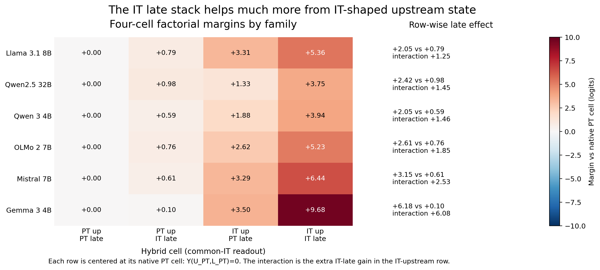
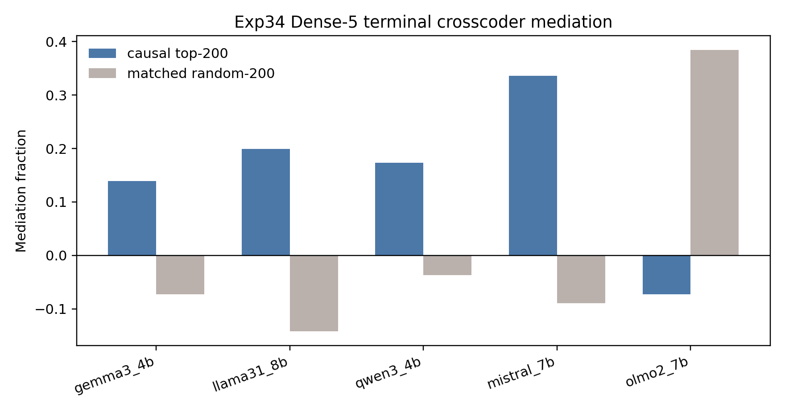

# First-Divergence Model Diffing Reveals Upstream-Conditioned Late Readout in Base-to-Instruct Language Models

**Anonymous authors** | NeurIPS 2026 Submission

---

## Abstract

Instruction-following descendants often choose different next tokens than their pretrained bases, but a late-layer patch alone can conflate the late computation with the upstream residual state it expects. We introduce **first-divergence model diffing**: for a paired base/instruct checkpoint, find the first shared-history prefix where the checkpoints prefer different next tokens, cross PT/IT upstream state with PT/IT late stack, and score the IT-vs-PT token margin. Across six dense base/instruct pairs, the IT-minus-PT late-stack effect is much larger from IT-shaped upstream state than from PT-shaped upstream state: `+3.08` vs `+0.64` logits, a `4.8x` amplification and `+2.44` logit interaction. With Gemma removed, the interaction remains `+1.71` logits (`3.3x`). The effect is not explained by arbitrary token-pair selection: random local disagreements retain only `63%` of the interaction, while pre-divergence prefixes scored on the future divergent token pair are near zero. Depth and feature analyses show the anatomy of the effect: middle MLP windows are more identity-selective, late/terminal windows are more margin-sensitive, and causally ranked terminal crosscoder features mediate `26-48%` of the terminal readout interaction. The same terminal features are upstream-conditioned: ablating them hurts the IT-upstream terminal readout more than the PT-upstream readout, beating matched-random features by `+1.27` logits in four quality-gated families.

---

## 1. Introduction

When an instruction-following checkpoint first chooses a different next token from its pretrained base, where in the forward pass does that difference become a logit? Paired base/instruct checkpoints make this question unusually clean: architecture and tokenizer are shared, but the released descendants differ after instruction tuning, preference optimization, reinforcement-style training, or a mixture of post-training stages. The object of study is therefore a **paired-checkpoint model diff**, not a generic statement about what late layers do in one checkpoint.

The tempting answer is "late layers." Late transformer computation is close to the unembedding, and prior work already makes late-stage refinement plausible: feed-forward layers promote vocabulary-space concepts (Geva et al., 2022b), late layers sharpen or calibrate predictions (Lad et al., 2025; Joshi et al., 2025), and instruction-tuned models show layer-structured task information (Zhao, Ziser, and Cohen, 2024). But ordinary late-layer patching can be misleading. A late stack can look causal because it is paired with the upstream residual state it was trained to read, not because it carries a portable late-only update.

We test this directly with **first-divergence model diffing**. For each prompt, we find the earliest generated position where PT and IT prefer different next tokens under the same generated history. Let those tokens be `t_PT` and `t_IT`. At that prefix, we cross upstream residual state (`U_PT` or `U_IT`) with downstream late stack (`L_PT` or `L_IT`) and measure `logit(t_IT) - logit(t_PT)`. The key estimand is a difference-in-differences: how much larger is the IT-minus-PT late-stack replacement effect when the upstream state is IT-shaped rather than PT-shaped?

The answer is large, positive in every dense family, and not a one-cell late-only effect. Across six dense PT/IT pairs, the same IT late stack has a `4.8x` larger margin effect from IT upstream than from PT upstream, producing a `+2.44` logit interaction. With Gemma removed, the amplification remains `3.3x` and the interaction remains `+1.71` logits. The effect remains positive beyond response-opening positions, under a common-PT readout, on a 32B family, under label-swap nulls, and under controls for pre-late token commitment, hybrid-state mismatch, and selected-token support.

The paper has three contributions.

1. **A paired-checkpoint first-divergence factorial.** We introduce a local counterfactual estimand at the exact token where PT and IT first disagree. It asks whether the IT-minus-PT late-stack replacement effect is portable across upstream states or amplified by IT-shaped upstream state. This is the central contribution and the first result in the paper.
2. **A validation ladder for the estimand.** The result is robust to readout choice, label orientation, first-token support, pre-late commitment, off-manifold hybrid diagnostics, random local disagreement controls, and family heterogeneity. The main text gives the ladder; the appendix gives the audit trail.
3. **A depth and feature anatomy.** Middle-positioned MLP substitutions transfer divergent-token identity more often, while late and terminal MLPs dominate margin/readout. Terminal crosscoders add a feature-level bridge: causally ranked sparse features mediate a substantial but partial share of the terminal readout interaction, and the same feature sets matter more causally under IT-shaped upstream state than PT-shaped upstream state. A selective edit of response-structure/readout features gives a monotone dose response across all four clean crosscoder families, validating one readable subset of the mediated features.

We use **IT** as shorthand for instruction-following post-trained descendants. The recipes are heterogeneous, so the empirical claim is about released dense base/instruct checkpoint contrasts, not one training algorithm. All causal language is readout-scoped: replacing an upstream state, late stack, or MLP component changes a specified next-token readout in a constructed forward pass. We do not claim a universal instruction-following circuit or full circuit reconstruction.

---

## 2. Setup

### 2.1 Model Sets and Statistical Reporting

The main factorial uses six dense PT/IT pairs: Gemma 3 4B, Llama 3.1 8B, Qwen 3 4B, Mistral 7B, OLMo 2 7B, and Qwen2.5 32B. We call this the **Dense-6 core set**. Several support analyses were run before the 32B extension and use the five 4B-8B dense families; we call this the **Dense-5 support set**. **Gemma-removed Dense-5** means Dense-6 excluding Gemma, so it includes Qwen2.5 32B.

Prompt-bootstrap intervals quantify conditional precision on the sampled prompts and released checkpoints. They are not estimates over all possible model families, post-training recipes, or prompt distributions. For headline family-generalization claims, we therefore report the Dense-6 mean, the Gemma-removed mean, and family-level range or median where it helps interpretation.

### 2.2 First-Divergence Factorial

For each prompt, generate with PT and IT until the first shared-history prefix where their top-1 next tokens differ. Let those tokens be `t_PT` and `t_IT`, and define

`Y(U,L) = logit(t_IT) - logit(t_PT)`.

Larger `Y` means the hybrid forward pass favors the IT divergent token. At a pre-specified late boundary, run the four cells below:

| Upstream state | PT late stack `L_PT` | IT late stack `L_IT` |
|---|---:|---:|
| PT upstream `U_PT` | `Y(U_PT,L_PT)` | `Y(U_PT,L_IT)` |
| IT upstream `U_IT` | `Y(U_IT,L_PT)` | `Y(U_IT,L_IT)` |

The primary estimand is:

`[Y(U_IT,L_IT) - Y(U_IT,L_PT)] - [Y(U_PT,L_IT) - Y(U_PT,L_PT)]`.

Equivalently: first measure the IT-minus-PT late-stack replacement effect under each upstream state; then compare those two effects. This subtracts the PT-late-stack baseline within each upstream row, so the result is not merely a native-stack-vs-foreign-stack comparison. Common-IT and common-PT readouts score all four cells with one fixed final norm, `lm_head`, and real-token mask. Unless stated otherwise, main factorial numbers use common-IT readout.

All raw-shared first-divergence and residual-state runs force both PT and IT branches to raw text and validate identical raw prompt token IDs before comparing residual states. Position 0 is therefore the first generated token after the full raw prompt, not a chat-template artifact.

---

## 3. Results

### 3.1 Main First-Divergence Factorial

At the first natural PT/IT disagreement, the IT late stack is not a portable late-only update. It has a small-to-moderate IT-token margin effect from PT upstream state, but a much larger effect from IT upstream state. In the Dense-6 core set, replacing the PT late stack with the IT late stack shifts the IT-vs-PT margin by `+0.64` logits from PT upstream, but by `+3.08` logits from IT upstream. This is a `4.8x` amplification, yielding an upstream x late interaction of `+2.44` logits.

The amplification is the cleanest magnitude reference because it compares the same late-stack replacement under the two upstream states. For additional scale, the native diagonal PT->IT margin shift, `Y(U_IT,L_IT) - Y(U_PT,L_PT)`, is `+5.73` logits in Dense-6, so the interaction is large on the native margin scale as well. Appendix B reports share-style scale separately. Family heterogeneity is real but not a one-family sign artifact: all six dense families are positive, with family interactions from `+1.25` to `+6.08` logits and median `+1.66`.

| Scope/readout | Late effect from PT upstream | Late effect from IT upstream | Interaction | Amplification |
|---|---:|---:|---:|---:|
| Dense-6, common-IT | `+0.64` `[+0.57, +0.71]` | `+3.08` `[+2.98, +3.17]` | `+2.44` `[+2.35, +2.52]` | `4.8x` |
| Gemma-removed Dense-5, common-IT | `+0.75` `[+0.67, +0.82]` | `+2.46` `[+2.36, +2.55]` | `+1.71` `[+1.64, +1.78]` | `3.3x` |
| Dense-6, common-PT | `+0.66` `[+0.60, +0.72]` | `+3.08` `[+2.99, +3.18]` | `+2.42` `[+2.34, +2.51]` | `4.7x` |
| Qwen2.5-32B only | `+0.98` `[+0.88, +1.08]` | `+2.42` `[+2.26, +2.59]` | `+1.45` `[+1.32, +1.57]` | `2.5x` |

This result is the paper's central claim. It says that the released base/instruct contrast changes next-token formation through an upstream-conditioned late readout. A simple late-only term is not stable enough to summarize the contrast: on a factual/reasoning stress test, the late-only effect from PT upstream is negative (`-1.18`), while the upstream x late interaction remains positive (`+1.81`). The stable object is the interaction, not the portable late-stack effect.

### 3.2 Validation Ladder

The first-divergence factorial intentionally selects a high-signal disagreement point. The validation question is whether the interaction is explained by an artifact of that selection, by readout choice, by hybrid-state failure, or by the upstream state already having committed to `t_IT` before the late stack. The answer is no: each alternative explanation has a targeted control, and the detailed audit trail is in Appendices B and C.

| Alternative explanation | Main check | Result |
|---|---|---|
| Readout-head artifact | Score all cells with common-PT readout. | Interaction remains `+2.42`, matching common-IT. |
| Pre-late token commitment | Restrict to events where the IT boundary readout does not yet favor `t_IT`; regress out boundary margin. | No/low-commitment subsets remain large (`+2.43`, `+2.41`); adjusted interaction remains positive. |
| Hybrid-state failure | Reconstruct diagonal cells, interpolate PT->IT boundary states, and filter low-anomaly hybrids. | Diagonals reconstruct exactly; interpolation is smooth; low-anomaly half remains `+2.78`; signed-permutation control is `0.25x`. |
| Arbitrary selected token pair | Compare to random local PT/IT disagreement prefixes and pre-divergence prefixes scored on the future token pair. | Random local disagreements retain `63%`; future-pair pre-divergence control is near zero (`3%`). |
| First-token or style-only support | Stratify by generated position and audit token categories. | Position `>=3` remains `+1.43`; position `>=5` remains `+1.48`; pure surface-format pairs are `2.3%`. |
| Label orientation | Randomly swap PT/IT token labels within prompt/family. | Label-swap null gives `p=5e-5`. |
| One-family dominance | Report Gemma-removed and per-family results. | Every dense family is positive; Gemma-removed interaction is `+1.71`. |

Two controls are especially important for interpretation. First, the pre-late commitment control shows that the interaction is not merely "the IT residual stream has already decided." Among events where the IT boundary readout does not yet favor `t_IT`, the interaction remains `+2.43`; in the lowest IT-boundary-margin tercile it remains `+2.41`. Second, the random-disagreement baseline shows that first divergence is high-signal rather than arbitrary: random local disagreements from the same prompts and rollouts are later and more content-token-heavy, but their interaction is smaller.

The validation ladder does not prove that hybrid forwards are natural model trajectories. It rules out the practical artifact explanations that would make the factorial uninformative: wrong readout head, broken patching, degenerate hybrids, selected-token tautology, label orientation, and format-only support. We therefore interpret the factorial as an intervention-scoped compatibility counterfactual.

### 3.3 Depth and Feature Anatomy

The interaction has a consistent depth anatomy. Middle-positioned MLP substitutions are more tied to divergent-token identity; late and terminal MLPs are more tied to margin/readout. This is an operational handoff pattern, not a claim that a complete feature-level circuit has been recovered.

In a PT host, middle IT MLP substitutions transfer the IT divergent token more often than late substitutions (`26.0%` vs `17.6%`). In the mirror direction, middle PT substitutions transfer the PT divergent token more often than late substitutions (`31.2%` vs `20.8%`). These values are far below 50%, so middle windows are not independent token selectors; they are relatively more identity-selective than late windows.

Late windows dominate margin. In native IT trajectories, late MLPs support the IT divergent token much more than early or middle MLPs (`+0.789` late vs `+0.021` middle and `-0.041` early). But inserting late IT MLP updates into a PT host gives a near-zero fixed-prefix margin gain (`+0.004`, CI crosses zero). This is the MLP-level version of the main factorial: late write-out is strong in IT-shaped context and near zero as a portable insertion.

Terminal-depth audits sharpen the late side. The final three transformer blocks preserve `57%` of the full-late interaction, and the final block alone preserves `33%`. Terminal MLP substitutions transfer IT-token identity only `8.4%` of the time, but their margin interaction is large (`+1.07` for final-three MLPs; `+0.58` for the final layer). Thus terminal layers carry real readout, but not standalone token identity selection.

| Evidence | Key result | Interpretation |
|---|---:|---|
| Middle vs late identity transfer | `26.0%` mid vs `17.6%` late in PT host; `31.2%` mid vs `20.8%` late in IT host | Middle windows are relatively more candidate/identity-selective. |
| Native IT MLP margin support | late `+0.789`; middle `+0.021`; early `-0.041` | Native IT-token margin support is late-concentrated. |
| PT-host late insertion | `+0.004` `[-0.001, +0.009]` | Late MLP updates alone are near zero from PT upstream state. |
| Terminal-depth audit | final-three blocks retain `57%`; final block retains `33%` | Terminal layers carry a substantial readout subcomponent. |
| Terminal feature mediation and gating | top causal features mediate `26-48%`; causal gate beats matched random by `+1.27` | Sparse terminal features carry a partial, upstream-conditioned bridge. |

The feature-level bridge uses paired PT/IT BatchTopK crosscoders trained on terminal MLP outputs. Features are ranked by held-out causal effect, then their IT-branch decoder contribution is ablated inside the terminal IT stack. In four quality-gated families, causally ranked terminal features reduce the interaction while matched-random feature sets do not. The mediation is partial, not exhaustive: top-ranked features account for roughly `26-48%` of the terminal readout interaction, and saturation curves show family-dependent concentration.

The mediated features also inherit the upstream conditioning seen at window level. For the same top-200 causal terminal features, ablation hurts the `U_IT,L_IT` readout much more than the `U_PT,L_IT` readout; this causal gate is positive in all four quality-gated families and exceeds matched-random features by `+1.27` logits (`[+1.20, +1.35]`). It also exceeds top-active noncausal terminal features by `+2.06` logits (`[+1.95, +2.18]`). Raw activation mass is not uniformly higher across families, so the paper-facing claim is causal: these terminal features matter more when the terminal IT stack receives IT-shaped upstream state.

Held-out autointerp makes the mediated feature set readable but not load-bearing. Across `300` interpreted features, validation reaches mean AUROC `0.878`; the causal feature taxonomy includes instruction/format and answer-readout roles, surface/tokenization-adjacent roles, and artifact/unclear features. The causal claim comes from the ablation; labels describe what many mediated terminal features appear to track.

As a targeted semantic validation, we edit only the predeclared `structure_readout` bucket: `12` causally selected features labeled as response structure or answer-readout features across Gemma, Llama, Mistral, and Qwen. The edit is applied only inside each model's terminal crosscoder window. As the edit strength increases from `0` to `2`, the clean-family mean interaction drop increases monotonically (`0.000 -> 0.032 -> 0.066 -> 0.103 -> 0.149`). At the strongest paper-facing edit, all four families are positive (`+0.056`, `+0.091`, `+0.339`, `+0.110`), while matched-random and same-delta random controls are much smaller on average (`-0.050` and `+0.030`). We use this selectively: it supports the interpretation that response-structure/readout labels correspond to functional terminal readout handles; broader bucket steering remains exploratory.

### 3.4 Supporting Context: Late Signatures and OLMo Case Study

The main factorial says that late readout is upstream-conditioned at the disagreement token. Two supporting analyses explain why late readout was the right place to test.

First, released instruct checkpoints show stronger late refinement/readout signatures than their paired bases. Endpoint-matched late `KL(layer || own final)` remains higher in IT under raw and tuned probes. Learned late MLP substitutions localize this delayed stabilization, while matched random late residual projections do not. The same late windows become more residual-opposing on the IT side in every Dense-5 family, with heterogeneous magnitude. In natural rollouts, removing late residual-opposing components drops the IT true-token logit far more than the PT true-token logit (`+7.37` vs `+0.83`). These signatures motivate late-window testing; they are not used as a mediation proof for the first-divergence interaction.

Second, OLMo-2 provides one released staged lineage: Base, SFT, DPO, and RLVR/Instruct. On fixed Base->RLVR first-divergence support, the measured upstream x late interaction grows monotonically across checkpoints: SFT already shows about `40%` of the final measured interaction, DPO about `85%`, and RLVR/Instruct the final value. This is a fixed-final-contrast case study, not a universal attribution of fractions to training stages. It shows that the same estimand can be tracked along a released post-training path.

---

## 4. Related Work

**Late refinement and FFN readout.** Feed-forward layers promote vocabulary-space concepts and progressively refine predictions (Geva et al., 2022a,b). Layerwise intervention studies describe late residual sharpening (Lad et al., 2025), calibration analyses find an upper-layer confidence-adjustment phase (Joshi et al., 2025), and tuned lenses operationalize layerwise prediction refinement (nostalgebraist, 2020; Belrose et al., 2023). These works establish late refinement as plausible. Our contribution is to measure how it differs across paired PT/IT checkpoints at natural first-divergence tokens.

**Post-training model diffs.** Wu et al. (2024) study behavioral shifts from language modeling to instruction following. Du et al. (2025) compare base and post-trained checkpoints mechanistically across knowledge, truthfulness, refusal, and confidence. Zhao, Ziser, and Cohen (2024) show layer-structured task information in instruction-tuned models. We add a local paired-checkpoint counterfactual: at the first token where PT and IT disagree, does the IT late stack carry the margin portably, or only with IT-shaped upstream state?

**Activation patching and feature-level model diffing.** Activation patching requires care because metric choice, intervention direction, and off-manifold hybrids affect interpretation (Heimersheim and Nanda, 2024). We therefore report intervention-scoped readout effects and validate them with readout swaps, diagonal reconstruction, interpolation, low-anomaly filtering, label-swap nulls, signed-permutation controls, and random-disagreement baselines. Cross-model activation patching across base and fine-tuned variants is the closest methodological precedent (Prakash et al., 2024); their target is entity tracking, while ours is natural PT/IT next-token disagreement. Sparse crosscoders provide a complementary route for model diffing (Lindsey et al., 2024), with known sparsity-artifact pitfalls (Minder et al., 2025). Our crosscoder result is a partial mediation test after the window-level interaction, not a replacement for it.

**Automated feature interpretation.** LLM-based neuron interpretation commonly follows a generate-and-score pattern: propose a natural-language feature hypothesis, then test it on held-out examples (Bills et al., 2023; Huang et al., 2023). We follow that pattern for terminal crosscoder features. Labels are descriptive evidence; feature ablations provide the causal evidence.

**Novelty.** Several ingredients have precedents: late refinement, FFN vocabulary promotion, activation patching, global base/instruct diffing, and sparse model-diff features. The new object is the paired-checkpoint first-divergence factorial estimand. It measures whether the IT-minus-PT late-stack replacement effect is portable across upstream states at the natural token where PT and IT first disagree. The other analyses triangulate this estimand: reference-scale reporting, targeted validation controls, identity/margin depth anatomy, terminal feature mediation and upstream-conditioning, and one staged OLMo lineage.

---

## 5. Scope and Next Tests

The main claim is local to first-divergence next-token readouts. This is deliberate: the estimand measures the earliest token where a released PT/IT pair changes preference under shared history. The selected support is enriched for instruction, safety, formatting, and response-shaping decisions; it is not a representative sample of all factual or reasoning behavior. Position-stratified and factual/reasoning stress tests show that the interaction persists outside response-opening regimes, but its magnitude varies with prompt domain and generated position.

The main interventions are window-level compatibility tests. Hybrid-state validation makes practical artifact explanations unlikely, and terminal crosscoders provide partial feature-level mediation plus an upstream-conditioning check, but the paper does not recover a full circuit. The core empirical scope is six dense PT/IT pairs. Supporting analyses remain Dense-5 where they were not rerun at 32B scale; DeepSeek-V2-Lite stays appendix-only because MoE routing and expert swaps require different controls. The OLMo-2 result is a fixed-support case study of one released lineage, not a universal stage attribution.

The natural next test is feature-level sufficiency: patch or steer the terminal feature activations from the IT-upstream cell into the PT-upstream late pass and measure how much IT-token margin is rescued. A second step is middle-to-terminal mediation: perturb middle-state features and measure whether the upstream-conditioned terminal features change. Those tests would move from partial readout mediation toward a fuller feature-level account of the handoff.

---

## 6. Conclusion

First-divergence model diffing turns a vague question -- "do late layers explain the base-to-instruct difference?" -- into a paired-checkpoint counterfactual. At the first token where released PT and IT checkpoints disagree, the IT-minus-PT late-stack replacement effect is much larger from IT-shaped upstream state than from PT-shaped upstream state. The interaction is positive in every dense family, large on the direct late-effect scale, and robust to targeted checks for readout choice, selected-token support, pre-late commitment, label orientation, and hybrid-state failure. The depth anatomy is graded: middle windows are relatively more identity-selective, while late and terminal windows are more margin/readout-sensitive. Terminal sparse features carry a partial feature-level bridge and are themselves more causally important under IT-shaped upstream state. The resulting picture is not a portable late-only update; it is an upstream-conditioned late readout pattern in released dense base/instruct checkpoint contrasts.

---

## References

Aghajanyan, A., et al. (2021). Intrinsic Dimensionality Explains the Effectiveness of Language Model Fine-Tuning. *ACL 2021*.

Arditi, A., Obeso, O., Syed, A., Paleka, D., Panickssery, N., Gurnee, W., & Nanda, N. (2024). Refusal in Language Models Is Mediated by a Single Direction. *NeurIPS 2024*.

Belrose, N., et al. (2023). Eliciting Latent Predictions from Transformers with the Tuned Lens. arXiv:2303.08112.

Bills, S., Cammarata, N., Mossing, D., Tillman, H., Gao, L., Goh, G., Sutskever, I., Leike, J., Wu, J., & Saunders, W. (2023). Language Models Can Explain Neurons in Language Models. OpenAI.

Chuang, Y., et al. (2024). DoLA: Decoding by Contrasting Layers Improves Factuality. *ICLR 2024*.

Conmy, A., Mavor-Parker, A. N., Lynch, A., Heimersheim, S., & Garriga-Alonso, A. (2023). Towards Automated Circuit Discovery for Mechanistic Interpretability. *NeurIPS 2023*.

Deiseroth, B., Meuer, M., Gritsch, N., Eichenberg, C., Schramowski, P., Assenmacher, M., & Kersting, K. (2024). Divergent Token Metrics: Measuring Degradation to Prune Away LLM Components -- and Optimize Quantization. *NAACL 2024*.

Du, H., Li, W., Cai, M., Saraipour, K., Zhang, Z., Lakkaraju, H., Sun, Y., & Zhang, S. (2025). How Post-Training Reshapes LLMs: A Mechanistic View on Knowledge, Truthfulness, Refusal, and Confidence. *COLM 2025*.

Geva, M., Schuster, R., Berant, J., & Levy, O. (2022a). Transformer Feed-Forward Layers Are Key-Value Memories. *EMNLP 2022*.

Geva, M., Caciularu, A., Wang, K. R., & Goldberg, Y. (2022b). Transformer Feed-Forward Layers Build Predictions by Promoting Concepts in the Vocabulary Space. *EMNLP 2022*.

Heimersheim, S., & Nanda, N. (2024). How to Use and Interpret Activation Patching. arXiv:2404.15255.

Huang, J., Geiger, A., D'Oosterlinck, K., Wu, Z., & Potts, C. (2023). Rigorously Assessing Natural Language Explanations of Neurons. *BlackboxNLP 2023*.

Joshi, A., Ahmad, A., & Modi, A. (2025). Calibration Across Layers: Understanding Calibration Evolution in LLMs. *EMNLP 2025*.

Lad, V., Lee, J. H., Gurnee, W., & Tegmark, M. (2025). The Remarkable Robustness of LLMs: Stages of Inference? *NeurIPS 2025*.

Lambert, N., Morrison, J., Pyatkin, V., Huang, S., Ivison, H., et al. (2025). Tulu 3: Pushing Frontiers in Open Language Model Post-Training. *COLM 2025*.

Lin, B. Y., et al. (2024). The Unlocking Spell on Base LLMs: Rethinking Alignment via In-Context Learning. *ICLR 2024*.

Lindsey, J., Templeton, A., Marcus, J., Conerly, T., Batson, J., & Olah, C. (2024). Sparse Crosscoders for Cross-Layer Features and Model Diffing. *Transformer Circuits Thread*.

Makelov, A., Lange, G., & Nanda, N. (2024). Towards Principled Evaluations of Sparse Autoencoders for Interpretability and Control. arXiv:2405.08366.

Minder, J., Dumas, C., Juang, C., Chughtai, B., & Nanda, N. (2025). Overcoming Sparsity Artifacts in Crosscoders to Interpret Chat-Tuning. *NeurIPS 2025*.

Panigrahi, A., Saunshi, N., Zhao, H., & Arora, S. (2023). Task-Specific Skill Localization in Fine-tuned Language Models. *ICML 2023*.

Prakash, N., Shaham, T. R., Haklay, T., Belinkov, Y., & Bau, D. (2024). Fine-Tuning Enhances Existing Mechanisms: A Case Study on Entity Tracking. *ICLR 2024*.

Team OLMo, Walsh, P., Soldaini, L., Groeneveld, D., Lo, K., Arora, S., et al. (2025). 2 OLMo 2 Furious. *COLM 2025*.

Wu, X., Yao, W., Chen, J., Pan, X., Wang, X., Liu, N., & Yu, D. (2024). From Language Modeling to Instruction Following: Understanding the Behavior Shift in LLMs after Instruction Tuning. *NAACL 2024*.

Zhao, Z., Ziser, Y., & Cohen, S. B. (2024). Layer by Layer: Uncovering Where Multi-Task Learning Happens in Instruction-Tuned Large Language Models. *EMNLP 2024*.

---

## Audit Guide

The main text is written around stable claim names. To audit quickly, start with Appendix B for the main four-cell factorial, Appendix C for validity controls, and Appendix D for depth/feature anatomy. Experiment IDs appear only in file paths or script names and are not needed to follow the argument.

| Claim | Main location | Appendix | Primary artifacts/scripts |
|---|---|---|---|
| Dense-6 first-divergence interaction and amplification scale | §3.1 | B | `results/paper_synthesis/exp23_dense6_core/`; `scripts/analysis/build_exp23_dense6_core_synthesis.py` |
| Validation ladder | §3.2 | C | hybrid-state validation, random-disagreement baselines, token-support audit, pre-late commitment control |
| Depth and terminal anatomy | §3.3 | D | identity/margin handoff, terminal-depth audit, terminal MLP audit |
| Terminal feature mediation, upstream-conditioning, and structure-bucket validation | §3.3 | D | terminal crosscoder synthesis, hardening runs, upstream-conditioning audit, autointerp taxonomy, structure-readout edit |
| Late refinement/readout signatures | §3.4 | E | endpoint-matched KL, late MLP random controls, residual-opposition natural-rollout ablation |
| OLMo staged case study | §3.4 | F | fixed-support Base/SFT/DPO/RLVR stage decomposition |
| Auxiliary evidence and omitted threads | Scope only | G | JS replay, behavior audit, residual-opposition mediation, older pilots, steering |

Prompt-bootstrap CIs in the main text are conditional precision estimates over sampled prompts and released checkpoints. They are paired with family-level summaries, Gemma-removed estimates, or family ranges where a claim could otherwise be mistaken for a population-level model-family generalization.

---

## Appendix A: Model Scope and Statistical Reporting

**Dense-6 core set.** Gemma 3 4B, Llama 3.1 8B, Qwen 3 4B, Mistral 7B, OLMo 2 7B, and Qwen2.5 32B. The first five families are 4B-8B scale; Qwen2.5 32B is included as the sixth dense family in the core first-divergence synthesis.

**Dense-5 support set.** Gemma 3 4B, Llama 3.1 8B, Qwen 3 4B, Mistral 7B, and OLMo 2 7B. Supporting identity/margin, residual-opposition, terminal MLP, behavior, and KL analyses use this scope unless explicitly marked Dense-6.

**Gemma-removed Dense-5.** Dense-6 excluding Gemma: Llama 3.1 8B, Qwen 3 4B, Mistral 7B, OLMo 2 7B, and Qwen2.5 32B.

| Family | PT checkpoint | IT checkpoint | Notes |
|---|---|---|---|
| Gemma 3 4B | `google/gemma-3-4b-pt` | `google/gemma-3-4b-it` | Hybrid local/global attention. |
| Llama 3.1 8B | `meta-llama/Llama-3.1-8B` | `meta-llama/Llama-3.1-8B-Instruct` | Dense GQA. |
| Qwen 3 4B | `Qwen/Qwen3-4B-Base` | `Qwen/Qwen3-4B` | Dense GQA. |
| Mistral 7B | `mistralai/Mistral-7B-v0.3` | `mistralai/Mistral-7B-Instruct-v0.3` | Sliding-window attention. |
| OLMo 2 7B | `allenai/OLMo-2-1124-7B` | `allenai/OLMo-2-1124-7B-Instruct` | Released stage lineage available. |
| Qwen2.5 32B | `Qwen/Qwen2.5-32B` | `Qwen/Qwen2.5-32B-Instruct` | Sixth dense core family. |

The Dense-6 synthesis combines stored per-family prompt-bootstrap estimates. The amplification ratio reported in §3.1 is:

`late-stack amplification = [Y(U_IT,L_IT) - Y(U_IT,L_PT)] / [Y(U_PT,L_IT) - Y(U_PT,L_PT)]`.

This is the main scale reference because it compares the same IT late-stack replacement under the two upstream states. We also report a secondary native-shift scale, computed inside the same 2x2:

`native PT->IT diagonal margin shift = Y(U_IT,L_IT) - Y(U_PT,L_PT) = late_weight_effect + upstream_context_effect`.

The reported interaction share is `interaction / native diagonal margin shift`. This is a scale reference, not a claim that the interaction linearly decomposes all behavioral difference.

---

## Appendix B: Main First-Divergence Factorial Audit Trail

Primary Dense-6 artifacts:

- `results/paper_synthesis/exp23_dense6_core/exp23_dense6_core_effects.csv`
- `results/paper_synthesis/exp23_dense6_core/exp23_dense6_family_effects.csv`
- `results/paper_synthesis/exp23_dense6_core/exp23_dense6_position_sensitivity.csv`
- `results/paper_synthesis/exp23_dense6_core/exp23_dense6_four_cell_heatmap.png`
- `results/paper_synthesis/exp23_dense6_core/exp23_dense6_interaction.png`

Main Dense-6 effects:

| Scope/readout | PT-up late effect | IT-up late effect | Interaction | Amplification | Native shift | Share |
|---|---:|---:|---:|---:|---:|---:|
| Dense-6, common-IT | `+0.639` `[+0.570, +0.709]` | `+3.076` `[+2.978, +3.174]` | `+2.437` `[+2.353, +2.521]` | `4.8x` | `+5.732` | `42.5%` |
| Gemma-removed Dense-5, common-IT | `+0.747` `[+0.673, +0.821]` | `+2.456` `[+2.364, +2.547]` | `+1.709` `[+1.637, +1.780]` | `3.3x` | `+4.942` | `34.6%` |
| Dense-6, common-PT | `+0.662` `[+0.600, +0.724]` | `+3.083` `[+2.986, +3.180]` | `+2.421` `[+2.337, +2.506]` | `4.7x` | `+5.723` | `42.3%` |
| Gemma-removed Dense-5, common-PT | `+0.740` `[+0.673, +0.807]` | `+2.477` `[+2.384, +2.570]` | `+1.737` `[+1.667, +1.807]` | `3.4x` | `+4.996` | `34.8%` |

Family-level common-IT interactions:

| Family | Interaction | Native diagonal shift | Interaction share |
|---|---:|---:|---:|
| Llama 3.1 8B | `+1.253` | `+5.358` | `23.4%` |
| Qwen2.5 32B | `+1.446` | `+3.751` | `38.6%` |
| Qwen 3 4B | `+1.464` | `+3.938` | `37.2%` |
| OLMo 2 7B | `+1.847` | `+5.227` | `35.3%` |
| Mistral 7B | `+2.534` | `+6.437` | `39.4%` |
| Gemma 3 4B | `+6.078` | `+9.683` | `62.8%` |

The family interaction range is `+1.253` to `+6.078` logits, with median `+1.655`. The family share range is `23.4%` to `62.8%`, with median `37.9%`; with Gemma removed, share ranges from `23.4%` to `39.4%`.

The five-family label-swap null is computed from:

- `results/exp23_midlate_interaction_suite/exp23_dense5_full_h100x8_20260426_sh4_rw4/analysis/compatibility_permutation/`

The content/reasoning stress test is:

- `results/exp23_midlate_interaction_suite/exp23_content_reasoning_residual_20260427_0930_h100x8/analysis/exp23_summary.json`

On that support, the late-only PT-upstream term is `-1.176` and the upstream x late interaction is `+1.812` (`[+1.721, +1.901]`).

Qwen2.5 32B artifacts:

- `results/exp24_32b_external_validity/exp24_qwen25_32b_full_eval_v21_20260427_194839/analysis/`
- `results/paper_synthesis/exp24_32b_external_validity/`

---

## Appendix C: Validation Controls

**Hybrid-state validation.** Primary artifacts:

- `results/exp36_offmanifold_validation/exp36_offmanifold_dense5_full_a100x8_20260502_233904/analysis/summary.json`
- `results/exp36_offmanifold_validation/exp36_offmanifold_dense5_full_a100x8_20260502_233904/analysis/exp36_offmanifold_validation_report.md`
- `results/exp36_offmanifold_validation/exp36_offmanifold_dense5_full_a100x8_20260502_233904/analysis/interpolation_dose_response.png`
- `results/exp36_offmanifold_validation/exp36_offmanifold_dense5_full_a100x8_20260502_233904/analysis/low_anomaly_robustness.png`

Key checks:

| Check | Result |
|---|---:|
| Endpoint interaction, common-IT | `+2.649` `[+2.548, +2.751]` |
| Difference from stored endpoint | `+0.013` logits |
| PT-to-IT interpolation slope | `+2.702` `[+2.601, +2.799]` |
| Low-anomaly half interaction | `+2.784` `[+2.642, +2.932]` |
| Signed-permutation random/observed ratio | `0.253x` |
| Position `>=3` interaction | `+1.538` `[+1.379, +1.700]` |

**Random-disagreement and pre-divergence controls.** Primary artifacts:

- `results/exp37_random_prefix_baseline/exp37_full_dense5_auth_xetfast_h100x8_20260503_002609/analysis/summary.json`
- `results/exp37_random_prefix_baseline/exp37_full_dense5_auth_xetfast_h100x8_20260503_002609/analysis/effects.csv`
- `results/exp37_random_prefix_baseline/exp37_full_dense5_auth_xetfast_h100x8_20260503_002609/analysis/exp37_matched_prefix_baselines.png`

| Condition | Interaction | Share of first divergence |
|---|---:|---:|
| True first divergence | `+2.649` `[+2.552, +2.749]` | `100%` |
| Random local disagreement, source-balanced | `+1.672` `[+1.592, +1.751]` | `63%` |
| Random PT-rollout disagreement | `+1.346` `[+1.231, +1.464]` | `51%` |
| Random IT-rollout disagreement | `+1.962` `[+1.870, +2.057]` | `74%` |
| Pre-divergence prefix, future token pair | `+0.082` `[-0.058, +0.215]` | `3%` |

**Token-support control.** The no-GPU support control compares true first divergence to random local PT/IT disagreements from the same prompts and generated rollouts.

- `scripts/analysis/analyze_exp37_token_support_control.py`
- `results/exp37_random_prefix_baseline/exp37_full_dense5_auth_xetfast_h100x8_20260503_002609/analysis/token_support_control/summary.json`

| Deterministic support metric | True first divergence | Random local disagreement, source-balanced |
|---|---:|---:|
| Generated position 0 | `50.3%` `[48.5%, 51.9%]` | `0.0%` `[0.0%, 0.0%]` |
| Generated position `>=3` | `26.8%` `[25.3%, 28.3%]` | `94.9%` `[94.2%, 95.5%]` |
| Generated position `>=5` | `16.6%` `[15.4%, 17.9%]` | `91.2%` `[90.4%, 92.1%]` |
| Any deterministic content token | `59.7%` `[57.9%, 61.4%]` | `68.6%` `[67.2%, 69.9%]` |
| Any deterministic format token | `35.5%` `[33.7%, 37.1%]` | `26.3%` `[25.0%, 27.6%]` |

Random local disagreements are later and more content-token-heavy than first divergences, yet their factorial interaction is smaller. This rules out the simple explanation that the first-divergence interaction is large only because the support is response-opening or format-heavy.

**Selected-support audit.** Primary artifacts:

- `scripts/analysis/analyze_first_divergence_token_support.py`
- `results/first_divergence_token_support/dense5_llm_gpt55_20260503_121500/summary.json`
- `results/first_divergence_token_support/dense5_llm_gpt55_20260503_121500/token_support_report.md`

Deterministic full-support token audit:

| Support property | Fraction | Count |
|---|---:|---:|
| Generated position 0 | `50.3%` `[48.5%, 52.0%]` | `1,499 / 2,983` |
| Generated position `>=3` | `26.8%` `[25.3%, 28.4%]` | `800 / 2,983` |
| Generated position `>=5` | `16.6%` `[15.3%, 18.0%]` | `495 / 2,983` |
| Both tokens pure surface format | `2.3%` `[1.8%, 2.9%]` | `68 / 2,983` |
| Any token content-classified | `59.7%` `[57.9%, 61.4%]` | `1,780 / 2,983` |
| Any token format-classified | `35.5%` `[33.8%, 37.2%]` | `1,059 / 2,983` |

Population-weighted LLM audit of the stratified sample (`749` judged records; `gpt-5.5` primary with `gpt-5.4` fallback):

| LLM category | Population-weighted fraction |
|---|---:|
| Semantic content | `30.2%` `[28.1%, 32.2%]` |
| Structural instruction format | `22.0%` `[19.8%, 24.3%]` |
| Discourse/style opening | `16.7%` `[14.6%, 19.0%]` |
| Safety/refusal/helpfulness | `14.5%` `[12.9%, 16.2%]` |
| Surface format, low significance | `8.4%` `[6.9%, 10.0%]` |
| Mixed/uncertain | `6.1%` `[4.5%, 7.8%]` |
| Reasoning/answer token | `2.1%` `[1.1%, 3.1%]` |

The audit supports the main-text scope statement: the selected support is mostly substantive within instruction, safety, formatting, and response-shaping regimes, but it is not a representative factual/reasoning sample.

**Pre-late commitment control.** Primary artifacts:

- `results/exp40_prelate_commitment_control/exp40_exp20_layerwise_proxy_20260503_110001/analysis/summary.json`
- `results/exp40_prelate_commitment_control/exp40_exp20_layerwise_proxy_20260503_110001/analysis/effects.csv`
- `results/exp40_prelate_commitment_control/exp40_exp20_layerwise_proxy_20260503_110001/analysis/exp40_prelate_commitment_report.md`
- `results/exp40_prelate_commitment_control/exp40_exp20_layerwise_proxy_20260503_110001/analysis/prelate_commitment_bins.png`

| Scope/statistic | Result |
|---|---:|
| All joined events, common-IT interaction | `+2.635` `[+2.538, +2.735]` |
| IT boundary margin `<= 0`, common-IT interaction | `+2.434` `[+2.285, +2.583]` |
| Lowest IT-boundary-margin tercile, common-IT interaction | `+2.412` `[+2.263, +2.560]` |
| State-level IT-upstream coefficient controlling boundary margin | `+2.598` `[+2.488, +2.705]` |
| Pair-level interaction at zero boundary-margin delta | `+1.837` `[+1.725, +1.943]` |

---

## Appendix D: Depth, Terminal, and Crosscoder Details

**Identity/margin handoff artifacts:**

- `results/paper_synthesis/exp20_exp21_handoff_table.csv`
- `results/paper_synthesis/exp20_exp21_handoff_synthesis.png`
- `results/exp20_divergence_token_counterfactual/factorial_validation_holdout_fast_20260425_2009_with_early/validation_analysis/summary.json`
- `results/exp21_productive_opposition/exp21_full_productive_opposition_clean_20260426_053736/analysis/summary.json`
- `results/exp21_productive_opposition/exp21_full_productive_opposition_clean_20260426_053736/analysis/effects.csv`

Main depth-anatomy quantities:

| Readout | Early | Middle | Late / terminal | Interpretation |
|---|---:|---:|---:|---|
| PT host: IT-token identity transfer | - | `26.0%` `[24.5%, 27.7%]` | `17.6%` `[16.2%, 18.9%]` | Middle substitutions transfer candidate identity more often. |
| IT host: PT-token identity transfer | - | `31.2%` `[29.6%, 32.9%]` | `20.8%` `[19.4%, 22.3%]` | Mirror direction gives the same identity pattern. |
| Pure IT MLP support for `t_IT` | `-0.041` `[-0.049, -0.032]` | `+0.021` `[+0.011, +0.032]` | `+0.789` `[+0.754, +0.825]` | Native IT-token support is late-concentrated. |
| PT-host late MLP margin gain | - | - | `+0.004` `[-0.001, +0.009]` | Late MLP updates alone are near zero in PT upstream state. |
| Source decomposition interaction | - | - | `+0.288` `[+0.277, +0.301]` | MLP-level readout also shows context gating. |

**Terminal-depth and terminal-MLP artifacts:**

- `results/exp31_terminal_depth_factorial/exp31_terminal_depth_full_a100x4_localdisk_fixedsched_20260502_021238/analysis/terminal_depth_summary.json`
- `results/exp31_terminal_depth_factorial/exp31_terminal_depth_full_a100x4_localdisk_fixedsched_20260502_021238/analysis/terminal_depth_effects.csv`
- `results/exp32_terminal_mlp_writeout/exp32_terminal_mlp_full_dense5_a100x8_w2_20260502_043950/analysis/exp32_terminal_mlp_summary.json`
- `results/exp33_terminal_identity_margin/exp33_terminal_identity_margin_full_dense5_a100x8_overlap_20260502_0509/analysis/exp33_terminal_identity_margin_summary.json`

The final-three stack retains `57%` (`[56%, 58%]`) of the same-prompt full-late Dense-5 interaction; the final block alone retains `33%` (`[32%, 34%]`). Final-three MLP substitutions transfer IT-token identity `8.4%` of the time, with terminal MLP margin interaction `+1.068` (`[+1.009, +1.127]`). The final layer alone gives terminal MLP margin interaction `+0.584` (`[+0.541, +0.630]`).

**Terminal crosscoder mediation.** Artifacts:

- `results/paper_synthesis/exp34_dense5_final_readout_crosscoder/combined_dense5_20260503_0018/exp34_dense5_crosscoder_summary.json`
- `results/paper_synthesis/exp34_dense5_final_readout_crosscoder/combined_dense5_20260503_0018/exp34_dense5_crosscoder_mediation_curve.png`
- `results/exp38_qwen_olmo_final_layer_crosscoder_hardening/exp38_qwen_olmo_final_summary_20260503/analysis/exp38_qwen_olmo_decision_summary.json`
- `results/exp30_final_readout_crosscoder_mediation/exp30_l31_paperfaithful_runpod_20260502_012105_a100x8/selected_d131072_k64/analysis/mediation_curve.png`

| Family | Terminal scope | VE / density status | Top causal feature drop | Share of interaction | Matched random | Paper role |
|---|---|---|---:|---:|---:|---|
| Gemma | final 3 layers | VE min `0.785`, L0 `64`, alive max `0.100` | `+1.695` `[+1.477, +1.912]` | `28%` | `-0.310` `[-0.368, -0.255]` | clean |
| Llama | final 3 layers | VE min `0.774`, L0 `64`, alive max `0.096` | `+0.599` `[+0.469, +0.733]` | `48%` | `-0.209` `[-0.255, -0.165]` | clean |
| Mistral | final 3 layers | VE min `0.786`, L0 `64`, alive max `0.089` | `+0.684` `[+0.600, +0.764]` | `26%` | `-0.100` `[-0.159, -0.044]` | clean |
| Qwen | final 2 layers | layer VE `0.957/0.960` and `0.967/0.970` | `+0.324` | `37%` | `-0.033` | clean |
| OLMo | final 2/3 diagnostic | layer-30 IT VE `0.616`; repair did not clear gate | `+0.598` | not counted | `-0.068` | diagnostic |

Additional single-layer hardening grids explain two boundary cases rather than changing the headline. For Qwen, layer 33 was close on reconstruction but causally weak: the best grid had IT VE `0.743` and max top-200 drop `+0.098`, so the clean Qwen feature result remains final-two. For OLMo, layer 30 stayed reconstruction-limited but causally separated from random: the selected grid had IT VE `0.635`, top-200 drop `+0.452`, and matched-random drop `-0.083`. We therefore keep OLMo as diagnostic support and exclude it from the four-family quality-gated crosscoder claim.

The mediation curves sweep the number of ablated causally ranked features. The main table reports top-200 because it is fixed across families and far from the full-dictionary reconstruction setting; the curves show saturation rather than a single hand-picked feature count.

| Family | top-200 share | top-500 share | Saturation read |
|---|---:|---:|---|
| Gemma | `28%` | `28%` | compact; saturated early |
| Llama | `48%` | `52%` | modest additional distributed mass |
| Mistral | `26%` | `29%` | modest additional distributed mass |
| Qwen | `37%` | `38%` | mostly saturated by top-200 |

**Terminal feature upstream-conditioning.** Artifacts:

- `results/exp42_terminal_feature_upstream_conditioning/exp42_full_4fam_h100x8_20260503_155212/analysis/feature_gating_summary.json`
- `results/exp42_terminal_feature_upstream_conditioning/exp42_full_4fam_h100x8_20260503_155212/analysis/feature_gating_report.md`
- `results/exp42_terminal_feature_upstream_conditioning/exp42_full_4fam_h100x8_20260503_155212/analysis/feature_gating_by_family.png`
- `results/exp42_terminal_feature_upstream_conditioning/exp42_full_4fam_h100x8_20260503_155212/analysis/feature_ablation_saturation.png`

For the same causally ranked terminal features, we compare ablation effects in the `U_IT,L_IT` and `U_PT,L_IT` cells. The primary feature causal gate is:

`[drop when ablating features in U_IT,L_IT] - [drop when ablating features in U_PT,L_IT]`.

Positive values mean the feature set matters more when the IT terminal stack receives IT-shaped upstream state. At top-200 features:

| Metric | Estimate |
|---|---:|
| Absolute causal feature gate, clean-family mean | `+1.023` |
| Causal gate minus matched-random features | `+1.274` `[+1.198, +1.351]` |
| Causal gate minus top-active noncausal features | `+2.061` `[+1.953, +2.175]` |
| Margin-weighted activation gate minus matched-random features | `+0.423` `[+0.365, +0.481]` |
| Absolute causal feature gate, position `>=3` mean | `+0.736` |

Per-family gates:

| Family | Absolute causal gate | Causal minus matched random |
|---|---:|---:|
| Gemma | `+1.983` | `+2.432` |
| Llama | `+0.922` | `+1.254` |
| Mistral | `+0.816` | `+0.982` |
| Qwen | `+0.370` | `+0.426` |

Raw decoder-weighted activation mass is not uniformly higher under IT-shaped upstream state across families. We therefore use the finite-difference causal gate as the primary upstream-conditioning result and the signed margin-weighted activation gate as supporting evidence.

**Autointerp protocol.** Artifacts:

- `results/exp39_causal_feature_interpretation/exp39_reinterp_specific_labels_ctrl_h100x8_20260503_110345/autointerp/label_validation.json`
- `results/exp39_causal_feature_interpretation/exp39_reinterp_specific_labels_ctrl_h100x8_20260503_110345/autointerp/llm_feature_labels.jsonl`
- `results/exp39_causal_feature_interpretation/exp39_reinterp_specific_labels_ctrl_h100x8_20260503_110345/dashboards/feature_dashboards.jsonl`

Across `300` features, mean validation AUROC is `0.878`. Among the `100` causally selected features from Gemma, Llama, Mistral, and Qwen, the paper-facing taxonomy finds:

| Taxonomy group | Count |
|---|---:|
| instruction-tuned behavior/readout categories | `42/100` |
| surface/tokenization-adjacent readout | `17/100` |
| artifact or unclear | `41/100` |

The fine-grained behavior/readout categories include instruction/format control (`10/100`), response structure/answer readout (`15/100`), evaluation/MCQ scaffold (`5/100`), code/tool syntax (`3/100`), assistant register (`1/100`), and safety/advice-adjacent examples (`8/100`). The feature-level causal claim remains the mediation result above; autointerp provides readable evidence about the content of the mediated feature set.

**Structure-readout bucket validation.** The structure-readout edit tests one readable subset from the taxonomy rather than every label bucket. The predeclared `structure_readout` bucket contains `12` causal features across the four clean crosscoder families, with labels such as paragraph breaks, list openings, answer boundaries, and field separators. Editing this bucket inside the same terminal crosscoder windows gives a monotone dose response in interaction drop; matched-random and same-delta random controls are much smaller.

| Edit strength `alpha` | Structure bucket | Matched random | Same-delta random |
|---|---:|---:|---:|
| `0.0` | `0.000` | `0.000` | `0.000` |
| `0.5` | `+0.032` | `-0.014` | `+0.005` |
| `1.0` | `+0.066` | `-0.027` | `+0.012` |
| `1.5` | `+0.103` | `-0.041` | `+0.022` |
| `2.0` | `+0.149` | `-0.050` | `+0.030` |

At `alpha=2.0`, per-family structure-bucket interaction drops are Gemma `+0.056`, Llama `+0.091`, Mistral `+0.339`, and Qwen `+0.110`. We use only this selective structure/readout result in the paper-facing feature-label validation. Other bucket edits were run as diagnostics but are not part of the evidence spine because their feature support is smaller or more domain-specific.

Structure-readout artifacts:

- `results/exp41_causal_feature_bucket_steering/exp41_terminal_bucket_logit_full_h100x8_20260503_1520/analysis/exp41_logit_replay_summary.json`
- `results/exp41_causal_feature_bucket_steering/exp41_terminal_bucket_logit_full_h100x8_20260503_1520/analysis/bucket_effects_by_model.csv`
- `results/exp41_causal_feature_bucket_steering/exp41_terminal_bucket_logit_full_h100x8_20260503_1520/bucket_manifest/strict_primary/bucket_features.csv`

---

## Appendix E: Late-Refinement Signatures and Residual-Opposition Ablation

**Layerwise stabilization.** Primary artifacts:

- `results/exp09_cross_model_observational_replication/data/exp9_summary.json`
- `results/exp09_cross_model_observational_replication/data/convergence_gap_values.json`
- `results/paper_synthesis/exp22_endpoint_deconfounded_table.csv`

Endpoint-matched late KL estimates:

| Metric | Estimate |
|---|---:|
| Raw late `KL(layer || own final)`, IT - PT | `+0.425` `[+0.356, +0.493]` nats |
| Tuned late `KL(layer || own final)`, IT - PT | `+0.762` `[+0.709, +0.814]` nats |
| Remaining adjacent JS, IT - PT | `+0.052` `[+0.048, +0.057]` |
| Future top-1 flips, IT - PT | `+0.203` `[+0.190, +0.215]` |

**Late MLP localization.** Primary artifacts:

- `results/exp11_matched_prefix_mlp_graft/plots/exp11_exp3_600rand_v11_depthablation_full/depth_ablation_metrics.json`
- `results/exp14_symmetric_matched_prefix_causality/exp13exp14_full_20260416/exp13_full_summary.json`
- `results/exp19_late_mlp_specificity_controls/exp19B_core120_h100x8_20260424_050421_analysis/exp19B_summary_light.json`

The dense-family true late random-control comparison is `+0.327` (`[+0.298, +0.359]`) for the learned late graft versus `+0.003` (`[-0.002, +0.008]`) for matched random residual projections.

**Residual-opposing geometry and natural-rollout ablation.** Primary artifacts:

- `results/exp09_cross_model_observational_replication/plots/L1_delta_cosine_6panel.png`
- `results/exp27_natural_rollout_residual_opposition_ntp/exp27_full_dense5_combined_20260430_2050/analysis/exp27_summary.json`
- `results/exp27_natural_rollout_residual_opposition_ntp/exp27_full_dense5_combined_20260430_2050/analysis/exp27_effects.csv`

The natural-rollout ablation is an own-token prediction test. It is not a same-prefix PT/IT factorial and is not used as a mediation test for the main interaction.

| Natural-rollout intervention | PT NLL hurt | IT NLL hurt | IT-PT NLL hurt | IT-PT true-logit drop |
|---|---:|---:|---:|---:|
| Remove residual-opposing component | `+0.0004` `[-0.0016, +0.0027]` | `+0.0432` `[+0.0418, +0.0448]` | `+0.0428` `[+0.0403, +0.0453]` | `+6.542` `[+6.403, +6.684]` |
| Norm-preserving removal | `+0.0007` `[-0.0012, +0.0027]` | `+0.0342` `[+0.0329, +0.0356]` | `+0.0336` `[+0.0312, +0.0357]` | `+5.836` `[+5.699, +5.974]` |
| Flip residual-opposing component | `+0.0269` `[+0.0237, +0.0304]` | `+0.1013` `[+0.0983, +0.1043]` | `+0.0744` `[+0.0699, +0.0786]` | `+9.186` `[+9.011, +9.362]` |

---

## Appendix F: OLMo-2 Stage Case Study

Primary artifacts:

- `results/exp35_olmo_base_anchored_stage_decomposition/exp35_full_olmo_stage_8a100_20260502_2300/analysis/summary.json`
- `results/exp35_olmo_base_anchored_stage_decomposition/exp35_full_olmo_stage_8a100_20260502_2300/analysis/effects.csv`
- `results/exp35_olmo_base_anchored_stage_decomposition/exp35_full_olmo_stage_8a100_20260502_2300/analysis/stage_ratio_bootstrap.csv`
- `results/exp35_olmo_base_anchored_stage_decomposition/exp35_full_olmo_stage_8a100_20260502_2300/analysis/exp35_stage_decomposition.png`

The primary stage analysis fixes the support to Base->RLVR first-divergence prefixes and scores every intermediate checkpoint against the same `t_Base`/`t_RLVR` contrast. This makes SFT, DPO, and RLVR cumulative estimates comparable on the same local support. The older adjacent-pair analysis is retained only as historical motivation because each adjacent contrast uses its own first-divergence support and token labels; those adjacent estimates are useful local contrasts, but they are not additive attributions to the final Base->RLVR contrast.

| Stage on fixed Base->RLVR support | Upstream x late interaction | Relative to final contrast | Native top-1 picks `t_RLVR` | Late MLP `delta_cosine` |
|---|---:|---:|---:|---:|
| Base | `0` by definition | `0%` | `0.0%` | `+0.064` |
| SFT | `+0.773` `[+0.674, +0.873]` | `40.2%` `[37.6%, 42.8%]` | `61.0%` | `+0.032` |
| DPO | `+1.629` `[+1.473, +1.793]` | `84.7%` `[83.3%, 86.0%]` | `93.0%` | `+0.017` |
| RLVR/Instruct | `+1.924` `[+1.747, +2.104]` | `100%` | `99.7%` | `+0.014` |

The fixed-support label-swap null passes the same orientation test as the main factorial: the observed RLVR interaction is `+1.924`, while the null 99.9th percentile is `+0.382` (`p=5e-5`). Position `>=3` remains positive for all stages (`+0.283`, `+0.677`, `+0.813`). The result is a local lineage case study: in this released OLMo-2 path, the measured upstream-conditioned interaction is partly present in the SFT checkpoint, largely present in the DPO checkpoint, and strongest in the final RLVR/Instruct checkpoint.

---

## Appendix G: Auxiliary Evidence and Omitted Threads

**Residual-opposition mediation.** Useful but not main-text load-bearing because it is partial and family-heterogeneous. IT-target no-opposition drops the interaction by `+0.258` (`[+0.225, +0.293]`), about `9.8%`; flipping the component drops `+0.481`, about `18.3%`. Artifact: `results/exp26_residual_opposition_mediation/exp26_dense5_full_a100x8_20260429_111420/analysis/`.

**Same-history JS.** Shows PT/IT output distributions differ under identical histories without relying on free-running endpoint comparisons. It is support for separation, not the main convergence-gap proof. Artifact: `results/exp16_matched_prefix_js_gap/exp16_js_replay_runpod_20260422_075307/js_summary.json`.

**LLM-judge behavior.** Directionally useful but secondary. Free-running outputs move in the expected direction on aggregate under the automated judge, but this is not load-bearing for the internal mechanism. Artifact: `results/exp15_symmetric_behavioral_causality/plots/exp15_eval_core_600_t512_dense5/`.

**Chronology and older Gemma features.** These are explanatory and historical, not inference spine. They help build intuition for candidate flow and late feature redistribution but do not replace the architecture-agnostic Dense-6 factorial.

**Older crosscoder pilots.** Early Llama-only pilots are superseded by the quality-gated terminal crosscoder analysis in Appendix D. They remain useful provenance for the final-layer design but are not used as separate evidence.

**Rank-1 steering.** We do not use multi-model rank-1 steering as evidence for this draft. Cross-model steering was mixed and PC1 explained only a modest share of IT-PT variance in earlier analyses.

---

## Appendix H: Reproducibility and Artifact Map

| Claim | Command/script family | Primary artifact |
|---|---|---|
| Dense-6 upstream x late interaction | `scripts/analysis/build_exp23_dense6_core_synthesis.py` | `results/paper_synthesis/exp23_dense6_core/` |
| Position sensitivity | same plus `scripts/analysis/analyze_first_divergence_position_sensitivity.py` | `results/paper_synthesis/exp23_dense6_core/exp23_dense6_position_sensitivity.csv` |
| Label-swap null | `scripts/analysis/analyze_exp23_compatibility_permutation.py` | `results/exp23_midlate_interaction_suite/exp23_dense5_full_h100x8_20260426_sh4_rw4/analysis/compatibility_permutation/` |
| Off-manifold sanity audit | `scripts/analysis/analyze_exp23_offmanifold_sanity.py` | `results/paper_synthesis/exp23_offmanifold_sanity/` |
| Hybrid-state validation | `scripts/run/run_exp36_offmanifold_validation_runpod.sh`; `scripts/analysis/analyze_exp36_offmanifold_validation.py` | `results/exp36_offmanifold_validation/exp36_offmanifold_dense5_full_a100x8_20260502_233904/analysis/` |
| Selection baselines and token-support control | `scripts/run/run_exp37_random_prefix_baseline_runpod.sh`; `scripts/analysis/analyze_exp37_random_prefix_baseline.py`; `scripts/analysis/analyze_exp37_token_support_control.py` | `results/exp37_random_prefix_baseline/exp37_full_dense5_auth_xetfast_h100x8_20260503_002609/analysis/` |
| Selected-support audit | `scripts/analysis/analyze_first_divergence_token_support.py` | `results/first_divergence_token_support/dense5_llm_gpt55_20260503_121500/` |
| Pre-late commitment control | `scripts/analysis/analyze_exp40_prelate_commitment_control.py`; exact collector in `src/poc/exp40_prelate_commitment_control/collect.py` | `results/exp40_prelate_commitment_control/exp40_exp20_layerwise_proxy_20260503_110001/analysis/` |
| Endpoint-matched convergence gap | `scripts/analysis/build_exp22_endpoint_deconfounded_synthesis.py` | `results/paper_synthesis/exp22_endpoint_deconfounded_table.csv` |
| Late MLP random control | late-random-control analysis scripts | `results/exp19_late_mlp_specificity_controls/exp19B_core120_h100x8_20260424_050421_analysis/` |
| Residual-opposition natural rollout | `scripts/analysis/analyze_exp27_natural_rollout_residual_opposition_ntp.py` | `results/exp27_natural_rollout_residual_opposition_ntp/exp27_full_dense5_combined_20260430_2050/analysis/` |
| Identity/margin handoff | `scripts/analysis/build_exp20_exp21_handoff_synthesis.py` | `results/paper_synthesis/exp20_exp21_handoff_table.csv` |
| Terminal-depth audit | `scripts/analysis/analyze_exp31_terminal_depth_factorial.py` | `results/exp31_terminal_depth_factorial/exp31_terminal_depth_full_a100x4_localdisk_fixedsched_20260502_021238/analysis/` |
| Terminal MLP audit | `scripts/analysis/analyze_exp33_terminal_identity_margin.py` | `results/exp33_terminal_identity_margin/exp33_terminal_identity_margin_full_dense5_a100x8_overlap_20260502_0509/analysis/` |
| Terminal crosscoder mediation | `scripts/analysis/analyze_exp34_dense5_final_readout_crosscoder.py`; crosscoder hardening analysis | `results/paper_synthesis/exp34_dense5_final_readout_crosscoder/combined_dense5_20260503_0018/`; `results/exp38_qwen_olmo_final_layer_crosscoder_hardening/exp38_qwen_olmo_final_summary_20260503/analysis/` |
| Additional crosscoder hardening grids | terminal single-layer hardening grids | `results/exp40_terminal_crosscoder_hardening/exp40_qwen3_4b_layer33_grid_20260503_1115_a100x4_localtmp_compact/`; `results/exp40_terminal_crosscoder_hardening/exp40_olmo2_7b_layer30_grid_20260503_1210_a100x4_localshm_compact/` |
| Terminal feature upstream-conditioning | `src/poc/exp42_terminal_feature_upstream_conditioning/`; `scripts/analysis/analyze_exp42_terminal_feature_upstream_conditioning.py` | `results/exp42_terminal_feature_upstream_conditioning/exp42_full_4fam_h100x8_20260503_155212/analysis/` |
| Feature autointerp and taxonomy | `src/poc/exp39_causal_feature_interpretation/`; `scripts/analysis/exp39_causal_paper_taxonomy_llm.py` | `results/exp39_causal_feature_interpretation/exp39_reinterp_specific_labels_ctrl_h100x8_20260503_110345/analysis/` |
| Structure-readout bucket validation | `src/poc/exp41_causal_feature_bucket_steering/`; structure-readout analysis outputs | `results/exp41_causal_feature_bucket_steering/exp41_terminal_bucket_logit_full_h100x8_20260503_1520/analysis/` |
| OLMo fixed-support stage case study | `scripts/analysis/analyze_exp35_olmo_base_anchored_stage_decomposition.py`; `scripts/analysis/build_exp35_stage_ratio_bootstrap.py` | `results/exp35_olmo_base_anchored_stage_decomposition/exp35_full_olmo_stage_8a100_20260502_2300/analysis/` |

All full reruns use bf16 inference and deterministic greedy decoding unless a script states otherwise. The summary audit is CPU-only and reads committed JSON/CSV artifacts. Reproducing raw 4B-8B intervention records requires multiple 80GB A100/H100 jobs; reproducing Qwen2.5 32B additionally requires the multi-GPU run or the committed paper-facing synthesis artifacts.
