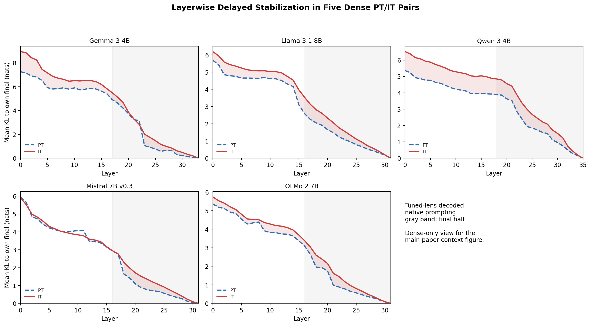
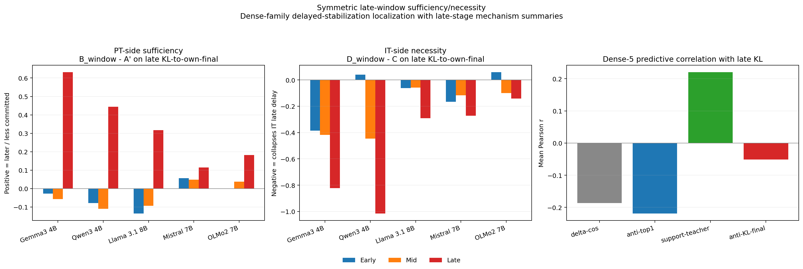
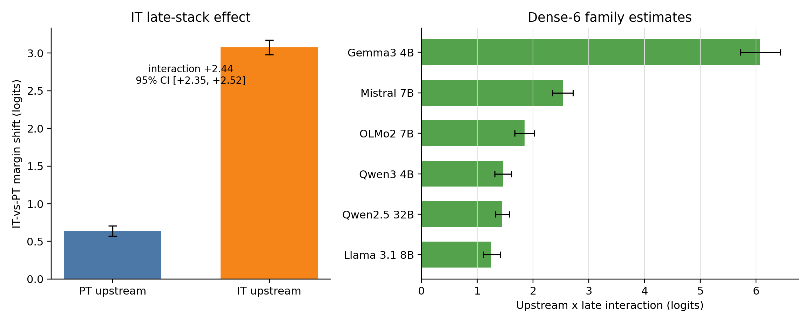
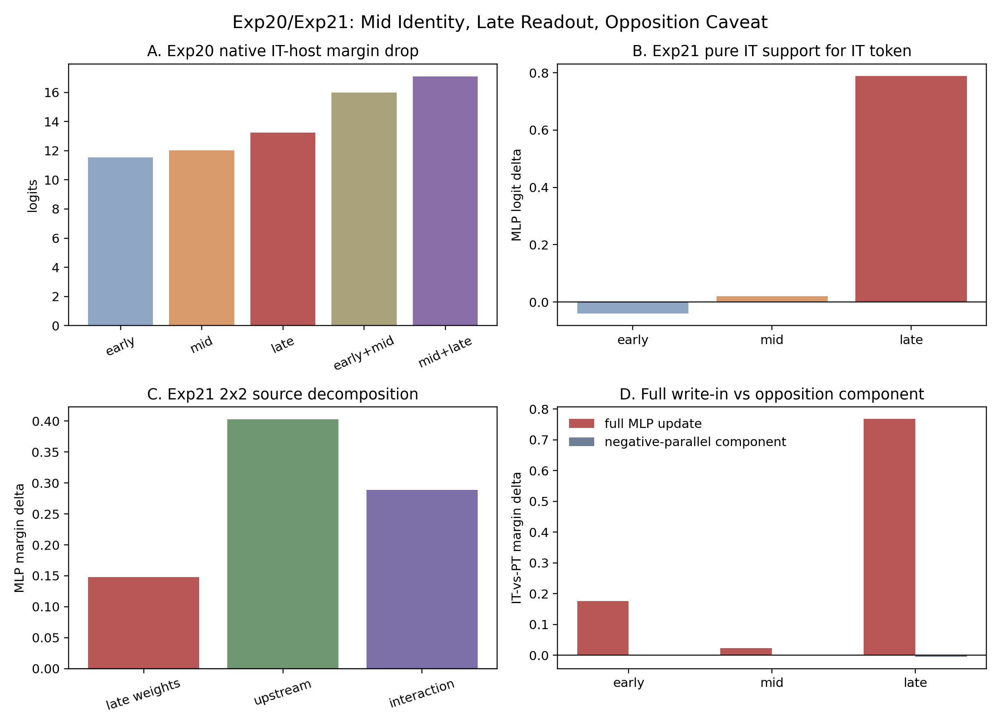

# First-Divergence Model Diffing Reveals Upstream-Conditioned Late Readout in Base-to-Instruct Language Models

**Anonymous authors** | NeurIPS 2026 Submission

---

## Abstract

Released instruction-following descendants differ from their pretrained bases in how they form next-token predictions, but ordinary late-layer patching can confuse a late update with the upstream state that makes that update work. We introduce **first-divergence model diffing**: for a paired base/instruct checkpoint, find the first prefix where PT and IT prefer different next tokens before either has generated a different previous token, then cross PT/IT upstream residual state with PT/IT late stack and score the IT-vs-PT token margin. Across six dense base/instruct pairs, the same IT late stack contributes far more IT-token margin from an IT-shaped upstream state than from a PT-shaped one; the upstream × late interaction is positive in every family but heterogeneous in magnitude (Gemma-removed `+1.71`, Dense-6 `+2.44`, with Gemma largest) and persists beyond response-opening positions. The simple late-only estimate is therefore incomplete: on a factual/reasoning stress test it moves against the IT token, while the factorial interaction remains positive (`+1.81`). Supporting depth tests show an operational middle-to-late handoff: middle MLP windows are more candidate-selective, while late and terminal MLPs are more readout-sensitive; natural-rollout ablations show late residual-opposing components matter far more for IT own-token prediction than for PT. The claim is local and paired-checkpoint scoped: released base/instruct contrasts reveal an upstream-conditioned late refinement/readout pattern, rather than a portable late-only effect.

---

## 1. Introduction

When a released instruction-following descendant changes the next token relative to its pretrained base, where in the forward pass does that difference become a next-token logit? A pretrained checkpoint (PT) and its post-trained descendant (IT) give a rare controlled setting for this question: the architecture and tokenizer are shared, but the released checkpoints differ after instruction tuning, preference optimization, reinforcement-style training, or a mixture of post-training stages. The natural unit of analysis is a *paired-checkpoint model diff*: not "what do late layers do?" — that question is well studied — but "what differs between the base and instruct checkpoints in how late layers do it?"

The tempting one-cell answer is "late layers." Late transformer computation is close to the unembedding, and prior work already makes late-stage refinement plausible: feed-forward layers promote vocabulary-space concepts (Geva et al., 2022b), late layers sharpen or calibrate predictions (Lad et al., 2025; Joshi et al., 2025), and instruction-tuned models show layer-structured task information (Zhao, Ziser, and Cohen, 2024). But "late layers matter" is not enough for a model-diff claim. A late patch can look explanatory while actually measuring compatibility between a late stack and the upstream residual state it expects, and the late-refinement vocabulary established for individual checkpoints has not been measured as a paired base-to-instruct difference, with cross-family controls, at the natural token where two paired checkpoints first disagree.

We give three convergent measurements that, taken together, show the instruct checkpoint exhibits stronger late refinement/readout than its paired base checkpoint. We use *refinement/readout* descriptively, to denote the joint signature of delayed stabilization, stronger residual-opposing late-MLP geometry, and IT-specific sensitivity to ablating that geometry; we do not claim a direct mediation chain from geometry to the first-divergence interaction (feature-level mediation is the natural follow-up; §5). The three signatures are: (i) IT checkpoints remain farther from their own final next-token distribution late in the stack, even after endpoint matching; (ii) late IT MLP updates become more residual-opposing than PT updates in 5/5 dense families, and ablating the late residual-opposing component causes a much larger true-token logit drop in IT than PT; and (iii) at natural PT/IT first disagreements, the same IT late stack contributes far more IT-token margin from an IT-shaped upstream state than from a PT-shaped upstream state.

The third signature is the central paired-checkpoint intervention test. We define the **first-divergence prefix** as the earliest shared-history prefix where PT and IT prefer different next tokens. At that prefix we cross the upstream residual state (`U_PT` or `U_IT`) with the downstream late stack (`L_PT` or `L_IT`) and score the margin `logit(t_IT) - logit(t_PT)`. If the base/instruct contrast were well summarized by a portable late-only effect, the IT late stack should add similar IT-token margin from either upstream state. It does not: across six dense PT/IT pairs the upstream x late interaction is positive in every family, although the magnitude is family-dependent and largest in Gemma.

The contribution is therefore not a new claim that late computation reads upstream state. It is a paired-checkpoint model-diffing result: released base/instruct contrasts differ in next-token formation through a window-level middle-to-late handoff. We use *handoff* operationally: middle-positioned MLP substitutions are more tied to divergent-token identity, while late and terminal MLPs shape the final margin. The evidence is intervention-scoped: it estimates effects on specified next-token readouts in constructed forward passes, not feature-level circuit recovery.

**Contributions.** The named object of this paper is the **paired-checkpoint first-divergence factorial**: a local counterfactual estimand for how a released base/instruct contrast differs in next-token formation at the exact token where PT and IT first disagree. The other analyses triangulate why that estimand behaves as it does.

1. **Late refinement/readout is stronger on the IT side of the released pair.** Lad et al. (2025) document late residual sharpening as a general stage of inference; Joshi et al. (2025) document late confidence calibration. Neither compares paired PT/IT checkpoints at the same natural disagreement token. We show that this late-stage configuration is stronger in the IT side of 5/5 dense pairs: IT delayed stabilization is positive under endpoint-matched controls, late MLP `δ-cosine` is more residual-opposing in IT than PT in every family with family-dependent magnitude, and learned late MLP substitutions localize the delay where matched random projections do not (`+0.327` vs `+0.003` nats).
2. **IT-specific ablation sensitivity of the late residual-opposing component.** Removing late residual-opposing MLP components causes a much larger true-token logit drop in IT than PT (`+7.37` vs `+0.83` logits; IT-PT difference `+6.54`) and hurts IT NLL while PT NLL remains compatible with zero (`+0.0432` vs `+0.0004`). Norm-preserving and same-magnitude random-removal controls preserve the asymmetry. This intervention asymmetry across paired checkpoints, with cross-family controls, has not previously been reported.
3. **First-divergence factorial estimand.** First-divergence factorial diffing crosses upstream residual state with downstream late stack at the natural token where PT and IT first prefer different next tokens. Across six dense PT/IT pairs the upstream × late interaction is positive in every family, with heterogeneous magnitude (Gemma-removed `+1.71`, Dense-6 `+2.44`); it is label-aligned (`p=5×10⁻⁵`), persists at generated positions `≥3`, and is not explained by arbitrary token-pair selection: random local disagreements retain only `63%` of the first-divergence value, while pre-divergence prefixes scored on the future divergent token pair are near zero. The interaction also dissociates from the simple late-only term, which flips negative on a factual/reasoning stress test while the interaction stays positive (`+1.81`). Middle-positioned MLP substitutions transfer divergent-token identity more often than late (`26%` vs `18%`); late and terminal MLPs dominate margin/readout. To our knowledge no prior paired-checkpoint diffing work measures this estimand.

The first-divergence factorial is the new object; the supporting analyses separate its interpretation from a generic late-layer fact or simple patching artifact. Together they show a recurring PT-to-IT model-diff pattern across representative dense instruction-following descendants: released base/instruct contrasts differ through an upstream-conditioned, window-level handoff, not by adding a portable late-only effect. We use **IT** as shorthand for instruction-following post-trained descendants; the recipes are heterogeneous, so the main claim is about paired PT-versus-post-trained model diffs, not one training algorithm.

**Reader map.** The paper has one central intervention: the first-divergence upstream x late factorial (§3.2). Section 3.1 explains why late refinement/readout is the right place to look; §3.2 tests the paired-checkpoint effect and validates it against the main artifacts; §3.3 explains the depth anatomy behind the effect; §3.4 shows the same estimand along one released OLMo-2 lineage. The appendices keep the full audit trail so the main text can focus on the evidence chain.

---

## 2. Setup

### 2.1 Model Sets

The main first-divergence factorial uses six dense PT/IT pairs: Gemma 3 4B, Llama 3.1 8B, Qwen 3 4B, Mistral 7B, OLMo 2 7B, and Qwen2.5 32B. We call this the **Dense-6 core set**. Several supporting analyses were run before the 32B extension and use the five 4B-8B dense families; we call this the **4B-8B Dense-5 support set**. When reporting a conservative first-divergence magnitude, **Gemma-removed Dense-5** means the Dense-6 core set excluding Gemma, so it includes Qwen2.5 32B.

The DeepSeek-V2-Lite MoE pair remains appendix-only because dense MLP grafts and MoE routing interventions are not the same intervention.

### 2.2 First-Divergence Factorial

For each prompt, we generate under PT and IT until the first prefix where their top-1 next tokens differ. Let those tokens be `t_PT` and `t_IT`. The readout is

`Y(U,L) = logit(t_IT) - logit(t_PT)`.

Larger `Y` means the forward pass favors the IT divergent token over the PT divergent token. At a pre-specified late boundary we run four hybrid passes:

| Upstream state | PT late stack `L_PT` | IT late stack `L_IT` |
|---|---:|---:|
| PT upstream `U_PT` | `Y(U_PT,L_PT)` | `Y(U_PT,L_IT)` |
| IT upstream `U_IT` | `Y(U_IT,L_PT)` | `Y(U_IT,L_IT)` |

The primary estimand is the upstream x late interaction:

`[Y(U_IT,L_IT) - Y(U_IT,L_PT)] - [Y(U_PT,L_IT) - Y(U_PT,L_PT)]`.

Equivalently, first compare the two columns within each row: how much does replacing the PT late stack with the IT late stack change the IT-vs-PT token margin? Then compare those two row-wise effects. The interaction asks how much larger the IT-late-stack replacement effect is when the upstream state is IT-shaped rather than PT-shaped. This is a difference-in-differences: it subtracts the PT-late-stack baseline under each upstream state, so it does not merely ask whether a native late stack works better on its native upstream distribution. Common-IT and common-PT readouts score all four cells with one fixed final norm, `lm_head`, and real-token mask; native readouts use each host checkpoint's own readout. Unless stated otherwise, the main factorial numbers use common-IT.

All raw-shared first-divergence and residual-state runs force both PT and IT branches to raw text and validate identical raw prompt token IDs before comparing residual states. Position 0 is therefore the first generated token after the full raw prompt, not a chat-template artifact.

### 2.3 Intervals and Scope

First-divergence intervals are 95% percentile bootstraps over prompt clusters within family, then averaged across families. Dense-6 paper-facing intervals combine stored per-family prompt-bootstrap estimates with the 32B family contribution from the paper-facing synthesis. Supporting KL/graft intervals are family-bootstrap or prompt-bootstrap as stated in the relevant section.

All intervention language below is readout-scoped: replacing an upstream state, late stack, or MLP component changes a specified next-token readout in a constructed forward pass.

---

## 3. Results

The results are ordered as a short evidence chain. Section 3.1 shows that late refinement/readout is stronger on the instruct side of released pairs. Section 3.2 is the central test: at the first PT/IT divergent token, it measures whether the IT late-stack effect is portable or upstream-conditioned. Section 3.3 explains the depth anatomy of that effect. Section 3.4 uses one released OLMo-2 lineage as a case study of how the same estimand appears during staged post-training.

### 3.1 Late Refinement/Readout Is Stronger in Base-to-Instruct Diffs

**Claim.** Prior work already identifies late residual sharpening (Lad et al., 2025) and late confidence calibration (Joshi et al., 2025) in general LLM forward passes, without paired-checkpoint comparison at PT/IT disagreement tokens. We measure three convergent signatures showing this late refinement/readout pattern is stronger on the IT side of released base/instruct pairs: IT checkpoints stabilize later toward their final distribution, learned late MLP substitutions localize this delay (matched random late projections do not), late MLP updates become more residual-opposing in 5/5 dense families, and the residual-opposing component is much more important for IT own-token prediction than for PT.

**Delayed stabilization.** Under native free-running decoding, IT models remain farther from their own final next-token distribution than PT models do through much of the stack. This is not only an endpoint artifact. After matching token steps on final entropy, final top-1 confidence, and final top-1/top-2 margin, the late IT-minus-PT `KL(layer || own final)` gap remains positive under raw probes (`+0.425` nats, 95% CI `[+0.356, +0.493]`) and tuned probes (`+0.762`, `[+0.709, +0.814]`). Endpoint-free path checks are also positive: remaining adjacent JS is `+0.052` (`[+0.048, +0.057]`), and future top-1 flips are `+0.203` (`[+0.190, +0.215]`).

**Late MLP localization.** Under identical token histories, late MLP substitutions have the largest tested effect on this delayed-stabilization metric. In a PT host, grafting IT MLPs into the late window increases final-20% KL by `+0.338` nats on the dense-family mean, while early and middle windows are near zero. In the mirror direction, replacing late IT MLPs with PT MLPs reduces the IT delay by `-0.509` nats, again the largest tested window effect. A matched random-control follow-up rules out generic late-window fragility: the true learned late graft gives `+0.327` nats (`[+0.298, +0.359]`), while a matched random residual-projection control gives `+0.003` (`[-0.002, +0.008]`).

**Residual-opposing geometry.** The same late stage has a geometric signature. In the 4B-8B Dense-5 support set, the late-window IT-minus-PT shift in MLP `delta_cosine` is negative in every family: Gemma `-0.189`, Llama `-0.029`, Qwen `-0.016`, Mistral `-0.081`, and OLMo `-0.021`. The terminal-layer shifts are also negative in every family. The direction is cross-family but the magnitude is not: the late-window shift spans a roughly 9x range from OLMo to Gemma, so we treat `delta_cosine` as a directional signature rather than a uniform-strength mechanism. This means late MLP updates on the IT side are more opposed to the current residual stream direction; the geometry is also present in PT (not zero), but the IT side is more residual-opposing in every family. We use this as a signature of late refinement/readout, not as a claim that one geometric scalar explains all of the effect.

**Natural-rollout importance.** Exp27 tests whether this residual-opposing component matters while each model predicts its own generated continuation. Removing the late residual-opposing component drops the true-token logit by `+7.370` logits in IT but only `+0.827` in PT, for an IT-minus-PT difference of `+6.542` (`[+6.403, +6.684]`). The NLL effect shows the same direction without relying on a ratio to a near-zero PT denominator: PT own-token NLL is essentially unchanged (`+0.0004`, 95% CI `[-0.0016, +0.0027]`), while IT NLL increases (`+0.0432`, `[+0.0418, +0.0448]`), for an IT-minus-PT difference of `+0.0428` (`[+0.0403, +0.0453]`). A norm-preserving version preserves the IT-specific NLL hurt (`+0.0336` IT-minus-PT), while same-magnitude random removals do not reproduce the pattern. Thus residual-opposing late MLP geometry is not merely descriptive: it is an ablation-sensitive component of IT next-token prediction in natural rollouts.

| Exp27 natural-rollout intervention | PT NLL hurt | IT NLL hurt | IT-PT NLL hurt | IT-PT true-logit drop |
|---|---:|---:|---:|---:|
| Remove residual-opposing component | `+0.0004` `[-0.0016, +0.0027]` | `+0.0432` `[+0.0418, +0.0448]` | `+0.0428` `[+0.0403, +0.0453]` | `+6.542` `[+6.403, +6.684]` |
| Norm-preserving removal | `+0.0007` `[-0.0012, +0.0027]` | `+0.0342` `[+0.0329, +0.0356]` | `+0.0336` `[+0.0312, +0.0357]` | `+5.836` `[+5.699, +5.974]` |
| Flip residual-opposing component | `+0.0269` `[+0.0237, +0.0304]` | `+0.1013` `[+0.0983, +0.1043]` | `+0.0744` `[+0.0699, +0.0786]` | `+9.186` `[+9.011, +9.362]` |

This section supports the existence and base-to-instruct strengthening of late refinement/readout. It does not by itself prove that residual opposition fully mediates the convergence gap or the first-divergence interaction; Section 3.2 supplies the paired-checkpoint intervention test.

### 3.2 First-Divergence Factorial: Late Computation Is Upstream-Conditioned

**Main estimand.** At the first natural PT/IT next-token disagreement, IT late computation is not a portable late-only effect. It contributes much more IT-token margin when the upstream residual state is already IT-shaped.

Under common-IT readout, swapping in the IT late stack shifts the IT-vs-PT divergent-token margin by `+0.639` logits (`[+0.570, +0.709]`) from a PT upstream state, but by `+3.076` (`[+2.978, +3.174]`) from an IT upstream state. The Dense-6 upstream x late interaction is therefore `+2.437` logits (`[+2.353, +2.521]`). Because Gemma is the largest family-specific effect, we report the Gemma-removed Dense-5 estimate as the conservative magnitude headline: `+1.709` (`[+1.637, +1.780]`). The common-PT readout cross-check gives the same conclusion: interaction `+2.421` (`[+2.337, +2.506]`).

The estimand is not just native-stack compatibility. Because both upstream rows include both late stacks, the interaction isolates how the *IT-minus-PT late-stack replacement effect* changes with upstream state. The remaining controls test whether that replacement effect is an artifact of readout choice, label orientation, hybrid mismatch, pre-late token commitment, first-token/style support, or arbitrary token-pair scoring.

| Scope/readout | Late effect from PT upstream | Late effect from IT upstream | Upstream x late interaction |
|---|---:|---:|---:|
| Dense-6, common-IT | `+0.639` `[+0.570, +0.709]` | `+3.076` `[+2.978, +3.174]` | `+2.437` `[+2.353, +2.521]` |
| Gemma-removed Dense-5, common-IT | `+0.747` `[+0.673, +0.821]` | `+2.456` `[+2.364, +2.547]` | `+1.709` `[+1.637, +1.780]` |
| Dense-6, common-PT | `+0.662` `[+0.600, +0.724]` | `+3.083` `[+2.986, +3.180]` | `+2.421` `[+2.337, +2.506]` |

The 32B family is part of the Dense-6 core, not a separate pooled claim: Qwen2.5-32B alone gives a positive interaction of `+1.446` (`[+1.321, +1.569]`), with `+0.977` late effect from PT upstream and `+2.423` from IT upstream. The effect is therefore not restricted to 4B-8B models.

**Pre-late commitment validation.** The factorial is not just asking whether the IT late stack reads out an already-decided IT token. Exp40 joins the Exp23 interaction to a pre-late commitment proxy from stored Exp20 layerwise readouts: the native `logit(t_IT)-logit(t_PT)` margin at the start of the late window. In `1,148` joined events, the IT boundary state does not yet favor `t_IT` by this proxy (`B_IT <= 0`), but the common-IT upstream x late interaction remains `+2.434` (`[+2.285, +2.583]`). The lowest within-family IT-boundary-margin tercile gives the same conclusion (`+2.412`, `[+2.263, +2.560]`). Commitment-adjusted regressions also stay positive: a state-level IT-upstream coefficient of `+2.598` (`[+2.488, +2.705]`) and a pair-level interaction of `+1.837` (`[+1.725, +1.943]`) at zero PT->IT boundary-margin delta. Pre-late token commitment modulates the effect, but it does not explain it away.

**Interpretation checks for the first-divergence factorial.** The controls below show that the signal is stable under changes of readout, support, position, domain, and hybrid-state diagnostics.

| Check | Validation result |
|---|---|
| Readout robustness | Common-PT readout gives the same interaction: `+2.421` `[+2.337, +2.506]`. |
| 2x2 compatibility contrast | The interaction isolates the IT-minus-PT late-stack replacement effect under both upstream states. |
| Pre-late commitment | Exp40 no/low pre-late commitment subsets remain large: `+2.434` and `+2.412`. |
| Hybrid-state diagnostics | Exp36 diagonal reconstruction is exact; PT->IT interpolation slope is `+2.702`; low-anomaly half is `+2.784`; signed-permutation control is `0.253x`. |
| Selection enrichment | Exp37 source-balanced random local disagreements retain only `63%`; pre-divergence future-token control is near zero (`3%`). |
| Support significance | Position `>=3` remains `+1.434`, position `>=5` remains `+1.480`; selected-support audit finds `73.4%` substantive events and only `2.3%` pure surface-format pairs. |
| Label alignment | Label-swap null gives `p=5e-5` over 20,000 permutations. |
| Domain stress test | On factual/reasoning prompts, the late-only PT-upstream term is `-1.18`, but the interaction remains `+1.81`. |
| Family heterogeneity | Every dense family is positive; the conservative Gemma-removed Dense-5 headline is `+1.709` `[+1.637, +1.780]`. |

**Hybrid/readout validation.** Exp36 directly probes the practical off-manifold concern. Diagonal no-op reconstruction is exact over `5,966` checks, common-IT and common-PT endpoint interactions agree, and rerunning the endpoint gives `+2.649` (`[+2.548, +2.751]`), within `+0.013` logits of the stored Exp23 estimate. More importantly, interpolating the boundary state from PT-shaped to IT-shaped gives a smooth dose response in late-stack advantage (`+0.575` to `+3.223`; slope `+2.702`, `[+2.601, +2.799]`), the low-anomaly half retains the effect (`+2.784`, `[+2.642, +2.932]`), and a same-norm signed-permutation control is much smaller (`0.253x`). These checks validate the intervention as an intervention-scoped compatibility estimate, not as feature-level circuit recovery.

**Selection/support validation.** First divergence is intentionally selected: it is the earliest token where the released PT/IT pair changes preference under shared generated history. Exp37 shows that selection is not what explains the effect. Source-balanced random local PT/IT disagreement prefixes retain only `63%` of the first-divergence interaction (`+1.672`, `[+1.592, +1.751]`, versus `+2.649`, `[+2.552, +2.749]`), while scoring the future first-divergence token pair on earlier shared prefixes where PT and IT have not yet diverged gives a near-zero interaction (`+0.082`, `[-0.058, +0.215]`, about `3%`). The selected support is therefore a high-signal disagreement regime rather than an arbitrary token-pair artifact. It is also not mostly whitespace or punctuation: pure surface-format pairs are `2.3%`, and a stratified LLM audit estimates `73.4%` substantive events. Position changes the regime mix and magnitude, but not the sign: generated positions `>=3` and `>=5` remain positive. Finally, the factual/reasoning stress test shows why the interaction, rather than the simple late-only term, is the stable estimand: late-only from PT upstream is negative (`-1.18`), while the upstream x late interaction remains positive (`+1.81`).

### 3.3 Depth Anatomy: Identity, Margin, and Terminal Blocks

**Claim.** The late refinement/readout signature is organized as an operational middle-to-late handoff. By this we mean a window-level pattern, not a recovered feature-level circuit: middle-positioned MLP substitutions are more tied to divergent-token identity, while late and terminal MLPs are more tied to final margin/readout.

Exp20 asks whether substituting a depth window transfers the opposite checkpoint's divergent-token identity at the first-divergence prefix. In a PT host, middle-positioned IT MLP substitutions transfer the IT token more often than late substitutions (`26.0%` vs `17.6%`). The mirror direction gives the same pattern: in an IT host, middle PT substitutions transfer the PT token more often than late substitutions (`31.2%` vs `20.8%`). These percentages are well below 50%, so neither window is an independent token selector; the comparison is a relative localization signal.

Exp21 asks what the MLP updates write into the next-token margin. In native IT trajectories, late MLPs provide much stronger support for the IT divergent token than early or middle MLPs (`+0.789` late vs `+0.021` middle and `-0.041` early). But transplanting late IT MLP updates into a PT host has a near-zero fixed-prefix margin effect (`+0.004`, `[-0.001, +0.009]`). This is the MLP-level version of the Section 3.2 result: late MLP write-out is strong in IT context and weak as a portable PT-upstream insertion.

| Readout | Early | Middle | Late / terminal | Interpretation |
|---|---:|---:|---:|---|
| PT host: IT-token identity transfer | - | `26.0%` `[24.5%, 27.7%]` | `17.6%` `[16.2%, 18.9%]` | Middle substitutions transfer candidate identity more often. |
| IT host: PT-token identity transfer | - | `31.2%` `[29.6%, 32.9%]` | `20.8%` `[19.4%, 22.3%]` | Mirror direction gives the same identity pattern. |
| Pure IT MLP support for `t_IT` | `-0.041` `[-0.049, -0.032]` | `+0.021` `[+0.011, +0.032]` | `+0.789` `[+0.754, +0.825]` | Native IT-token support is late-concentrated. |
| PT host late MLP margin gain | - | - | `+0.004` `[-0.001, +0.009]` | Late MLP updates alone are weak in PT upstream state. |
| Source decomposition interaction | - | - | `+0.288` `[+0.277, +0.301]` | MLP-level readout also shows context gating. |

Terminal-depth audits sharpen the "late" side. Moving the factorial boundary to the final three transformer blocks preserves `57%` (`[56%, 58%]`) of the same-prompt full-late Dense-5 interaction; the final block alone preserves `33%` (`[32%, 34%]`). A terminal-only MLP follow-up shows weak identity transfer but strong margin effects: final-three MLP substitutions transfer IT-token identity only `8.4%` of the time, yet their terminal MLP margin interaction is `+1.068` (`[+1.009, +1.127]`); the final layer alone gives `+0.584` (`[+0.541, +0.630]`). Thus terminal layers carry a real readout component, but the full late stack remains stronger and terminal layers are not standalone identity selectors.

### 3.4 OLMo-2 Case Study: The Handoff Appears Along the Lineage

OLMo-2 is useful because Ai2 releases a staged post-training path: Base, SFT, DPO, and RLVR/Instruct (Team OLMo et al., 2025; Lambert et al., 2025). We use it as a case study, not as a universal stage decomposition. Exp35 fixes the support to the same `587/600` valid Base->RLVR first-divergence prefixes and the same `t_Base`/`t_RLVR` token contrast, then asks whether the final Base->RLVR upstream x late interaction is already visible in intermediate checkpoints. The percentages below are fixed-final-contrast ratios: `40%` at SFT means that, on the final Base->RLVR support and token pair, the SFT checkpoint already shows `40%` of the final measured interaction. It does not mean that SFT causally contributed `40%` of all post-training change. Adjacent per-stage first-divergence supports answer a different question, because both the selected prompts and token labels change from Base->SFT to SFT->DPO to DPO->RLVR; they are therefore not additive stage attributions to the final contrast either.

On this fixed support, the measured upstream x late interaction grows monotonically across released checkpoints. Relative to the final Base->RLVR contrast, the SFT checkpoint already shows `40.2%` of the final measured interaction (`[37.6%, 42.8%]`), the DPO checkpoint shows `84.7%` (`[83.3%, 86.0%]`), and the RLVR/Instruct checkpoint gives the final value. The same support also shows monotone native adoption of the final RLVR token and a monotone shift toward more residual-opposing late MLP geometry.

| Stage on fixed Base->RLVR support | Upstream x late interaction | Relative to final contrast | Native top-1 picks `t_RLVR` | Late MLP `delta_cosine` |
|---|---:|---:|---:|---:|
| Base | `0` by definition | `0%` | `0.0%` | `+0.064` |
| SFT | `+0.773` `[+0.674, +0.873]` | `40.2%` `[37.6%, 42.8%]` | `61.0%` | `+0.032` |
| DPO | `+1.629` `[+1.473, +1.793]` | `84.7%` `[83.3%, 86.0%]` | `93.0%` | `+0.017` |
| RLVR/Instruct | `+1.924` `[+1.747, +2.104]` | `100%` | `99.7%` | `+0.014` |

The fixed-support label-swap null passes the same orientation test as the main factorial: the observed RLVR interaction is `+1.924`, while the null 99.9th percentile is `+0.382` (`p=5e-5`). Position `>=3` remains positive for all stages (`+0.283`, `+0.677`, `+0.813`). Thus, within this one released lineage, the paired-checkpoint estimand gives a local staged timeline: the final upstream-conditioned interaction is partly present in the SFT checkpoint, largely present in the DPO checkpoint, and strongest in the final RLVR/Instruct checkpoint. This does not imply that SFT, DPO, and RLVR always contribute these fractions in other model families or prompt regimes.

---

## 4. Related Work

**Late refinement and FFN readout.** A vocabulary for late-stage prediction refinement is well-established. Feed-forward layers promote vocabulary-space concepts and progressively refine predictions (Geva et al., 2022a,b). Layerwise intervention studies describe a late residual-sharpening stage (Lad et al., 2025); calibration analyses find an upper-layer confidence-adjustment phase with a low-dimensional residual-stream direction (Joshi et al., 2025). The tuned-lens framework operationalizes layerwise prediction refinement (nostalgebraist 2020; Belrose et al., 2023). These works study late-stage computation in individual checkpoints or general LLM forward passes; **none compares paired PT/IT checkpoints on the same first-divergence factorial axis**. Our contribution to this thread is to show that the same late-stage configuration is stronger on the IT-vs-PT axis, with cross-family controls, IT-specific ablation sensitivity, and a paired-checkpoint counterfactual at the natural disagreement token.

**Post-training model diffs.** Wu et al. (2024) study behavioral shifts from language modeling to instruction following. Du et al. (2025) compare base and post-trained checkpoints mechanistically across knowledge, truthfulness, refusal, and confidence — globally, not at the natural first-divergence prefix and not via a 2×2 upstream × late factorial. Zhao, Ziser, and Cohen (2024) show layer-structured task information in instruction-tuned models. We extend this paired-checkpoint thread by adding a local counterfactual: at the first PT/IT divergent token, does the IT late stack carry the margin by itself, or only with IT-shaped upstream state? This estimand is not in prior paired-checkpoint work to our knowledge.

**Activation patching and feature-level model diffing.** Activation patching requires care: metric choice, intervention direction, and off-manifold hybrids affect interpretation (Heimersheim and Nanda, 2024). We therefore report intervention-scoped readout effects, include common-IT and common-PT readout variants, assert numerical reconstruction at the diagonal cells, and add interpolation, low-anomaly filtering, label-swap, signed-permutation, and matched-random controls. Cross-model activation patching across base and fine-tuned variants (Prakash et al., 2024) is the closest methodological precedent; their target is entity tracking and ours is the natural PT/IT next-token disagreement. Sparse crosscoders provide a complementary feature-level route for model diffing (Lindsey et al., 2024), while recent work shows that crosscoder sparsity artifacts can misidentify model-specific features (Minder et al., 2025). We treat crosscoder/transcoder feature mediation as the natural next step after the window-level compatibility interaction and identity/margin handoff established here.

**Novelty.** Several ingredients have precedents: residual sharpening (Lad), late calibration (Joshi), FFN promotion (Geva), cross-model patching (Prakash), and global PT/IT diffing (Du). The new object is the paired-checkpoint first-divergence factorial estimand: at the natural token where PT and IT first disagree, we test whether the IT-minus-PT late-stack replacement effect is portable across upstream states or amplified by IT-shaped upstream state. The other analyses triangulate this estimand's interpretation: cross-family delayed-stabilization localization with matched random controls, IT-specific ablation sensitivity of the late residual-opposing component (Exp27, with two controls), depth-graded identity/margin decomposition, terminal-depth audit, and the OLMo-2 stage-progression case study. Together they characterize a recurring dense PT-to-IT model-diff pattern: the instruct checkpoint exhibits stronger late refinement/readout computation, but that computation works through an upstream-conditioned handoff rather than a standalone late effect.

---

## 5. Scope and Next Tests

The main claim is local to first-divergence next-token readouts. This is deliberate: the estimand measures the first token where a released PT/IT pair changes preference under shared history. The selected-support audit shows these events are mostly substantive within instruction, safety, and formatting regimes, but not a representative sample of all factual or reasoning behavior. Position-stratified and factual/reasoning results show the upstream x late interaction persists outside response-opening regimes, while its magnitude varies with position and prompt domain.

The interventions are window-level compatibility tests, not feature-level circuit recovery. Exp36 makes a practical off-manifold artifact explanation unlikely: the endpoint reconstructs Exp23, common-IT and common-PT readouts agree, PT-to-IT interpolation is smooth, the effect survives low-anomaly filtering, and signed-permutation controls are much smaller. The natural next test is feature-level mediation with crosscoders or transcoder-style adapters at the late boundary.

The core empirical scope is six dense PT/IT pairs. Supporting analyses remain 4B-8B Dense-5 where they were not rerun or pooled with Qwen2.5-32B; DeepSeek-V2-Lite stays appendix-only because MoE routing and expert swaps require different controls. The OLMo-2 stage result is a fixed-support case study of one released lineage, not a universal attribution of fractions to SFT, DPO, or RLVR.

---

## 6. Conclusion

Released base/instruct checkpoint contrasts reveal stronger late refinement/readout on the instruct side, relative to computation already nascent in pretrained transformers. The difference is measurable on three convergent axes: delayed stabilization (IT layers stay farther from their own final prediction), stronger residual-opposing late MLP geometry (5/5 dense families), and IT-specific ablation sensitivity of the residual-opposing component (`+7.37` vs `+0.83` true-token logit drop). The central contribution is the paired-checkpoint first-divergence factorial: a per-prompt counterfactual that measures the base/instruct contrast at the exact token where PT and IT first disagree. Across representative dense PT/IT pairs, this difference-in-differences shows that the IT-minus-PT late-stack replacement effect is much larger from IT-shaped upstream state than from PT-shaped upstream state. The depth anatomy is graded: middle-positioned MLP substitutions transfer divergent-token identity more often, while late and terminal MLPs dominate margin and readout. The supporting analyses triangulate the interpretation, but the new insight is the window-level handoff itself: in released base/instruct pairs, late readout is strongest on upstream state already shaped by the post-trained model.

---

## References

Aghajanyan, A., et al. (2021). Intrinsic Dimensionality Explains the Effectiveness of Language Model Fine-Tuning. *ACL 2021*.

Arditi, A., Obeso, O., Syed, A., Paleka, D., Panickssery, N., Gurnee, W., & Nanda, N. (2024). Refusal in Language Models Is Mediated by a Single Direction. *NeurIPS 2024*.

Belrose, N., et al. (2023). Eliciting Latent Predictions from Transformers with the Tuned Lens. arXiv:2303.08112.

Chuang, Y., et al. (2024). DoLA: Decoding by Contrasting Layers Improves Factuality. *ICLR 2024*.

Conmy, A., Mavor-Parker, A. N., Lynch, A., Heimersheim, S., & Garriga-Alonso, A. (2023). Towards Automated Circuit Discovery for Mechanistic Interpretability. *NeurIPS 2023*.

Deiseroth, B., Meuer, M., Gritsch, N., Eichenberg, C., Schramowski, P., Assenmacher, M., & Kersting, K. (2024). Divergent Token Metrics: Measuring Degradation to Prune Away LLM Components -- and Optimize Quantization. *NAACL 2024*.

Du, H., Li, W., Cai, M., Saraipour, K., Zhang, Z., Lakkaraju, H., Sun, Y., & Zhang, S. (2025). How Post-Training Reshapes LLMs: A Mechanistic View on Knowledge, Truthfulness, Refusal, and Confidence. *COLM 2025*.

Geva, M., Schuster, R., Berant, J., & Levy, O. (2022a). Transformer Feed-Forward Layers Are Key-Value Memories. *EMNLP 2022*.

Geva, M., Caciularu, A., Wang, K. R., & Goldberg, Y. (2022b). Transformer Feed-Forward Layers Build Predictions by Promoting Concepts in the Vocabulary Space. *EMNLP 2022*.

Heimersheim, S., & Nanda, N. (2024). How to Use and Interpret Activation Patching. arXiv:2404.15255.

Joshi, A., Ahmad, A., & Modi, A. (2025). Calibration Across Layers: Understanding Calibration Evolution in LLMs. *EMNLP 2025*.

Lad, V., Lee, J. H., Gurnee, W., & Tegmark, M. (2025). The Remarkable Robustness of LLMs: Stages of Inference? *NeurIPS 2025*.

Lambert, N., Morrison, J., Pyatkin, V., Huang, S., Ivison, H., et al. (2025). Tulu 3: Pushing Frontiers in Open Language Model Post-Training. *COLM 2025*.

Lin, B. Y., et al. (2024). The Unlocking Spell on Base LLMs: Rethinking Alignment via In-Context Learning. *ICLR 2024*.

Lindsey, J., Templeton, A., Marcus, J., Conerly, T., Batson, J., & Olah, C. (2024). Sparse Crosscoders for Cross-Layer Features and Model Diffing. *Transformer Circuits Thread*.

Minder, J., Dumas, C., Juang, C., Chughtai, B., & Nanda, N. (2025). Overcoming Sparsity Artifacts in Crosscoders to Interpret Chat-Tuning. *NeurIPS 2025*.

Panigrahi, A., Saunshi, N., Zhao, H., & Arora, S. (2023). Task-Specific Skill Localization in Fine-tuned Language Models. *ICML 2023*.

Prakash, N., Shaham, T. R., Haklay, T., Belinkov, Y., & Bau, D. (2024). Fine-Tuning Enhances Existing Mechanisms: A Case Study on Entity Tracking. *ICLR 2024*.

Team OLMo, Walsh, P., Soldaini, L., Groeneveld, D., Lo, K., Arora, S., et al. (2025). 2 OLMo 2 Furious. *COLM 2025*.

Wu, X., Yao, W., Chen, J., Pan, X., Wang, X., Liu, N., & Yu, D. (2024). From Language Modeling to Instruction Following: Understanding the Behavior Shift in LLMs after Instruction Tuning. *NAACL 2024*.

Zhao, Z., Ziser, Y., & Cohen, S. B. (2024). Layer by Layer: Uncovering Where Multi-Task Learning Happens in Instruction-Tuned Large Language Models. *EMNLP 2024*.

---

## Appendix Guide

The appendices are organized by claim rather than experiment number.

| Need to check | Appendix | Contents |
|---|---|---|
| Model scope and checkpoints | A | Dense-6 core set, Dense-5 support set, checkpoint IDs, prompt modes. |
| Late refinement/readout signature | B | Exp9, Exp11/14, Exp19, Exp22, and Exp27 artifacts. |
| First-divergence factorial | C | Exp23/24 Dense-6 synthesis, Exp36 hybrid validation, Exp37 selection baselines, selected-support audit, label-swap null, position sensitivity, stress test. |
| Depth anatomy | D | Exp20/21 identity and write-out, Exp31/32/33 terminal-depth audits. |
| Stage progression | E | Fixed-support OLMo-2 Base/SFT/DPO/RLVR case study. |
| Auxiliary evidence | F | Exp16 JS, Exp15 LLM-judge behavior, Exp18 chronology, DeepSeek MoE, Exp26, Exp28/30. |
| Reproducibility | G | Artifact map, commands, bootstrap details, hardware notes. |

## Appendix A: Model Scope and Definitions

**Dense-6 core set.** Gemma 3 4B, Llama 3.1 8B, Qwen 3 4B, Mistral 7B, OLMo 2 7B, and Qwen2.5 32B. The first five families are 4B-8B scale; Qwen2.5 32B is included as the sixth dense family in the core first-divergence synthesis.

**4B-8B Dense-5 support set.** Gemma 3 4B, Llama 3.1 8B, Qwen 3 4B, Mistral 7B, and OLMo 2 7B. Supporting identity/margin, residual-opposition, terminal MLP, behavior, and KL analyses use this scope unless explicitly marked Dense-6.

**Gemma-removed Dense-5.** Dense-6 excluding Gemma: Llama 3.1 8B, Qwen 3 4B, Mistral 7B, OLMo 2 7B, and Qwen2.5 32B.

| Family | PT checkpoint | IT checkpoint | Notes |
|---|---|---|---|
| Gemma 3 4B | `google/gemma-3-4b-pt` | `google/gemma-3-4b-it` | Hybrid local/global attention. |
| Llama 3.1 8B | `meta-llama/Llama-3.1-8B` | `meta-llama/Llama-3.1-8B-Instruct` | Dense GQA. |
| Qwen 3 4B | `Qwen/Qwen3-4B-Base` | `Qwen/Qwen3-4B` | Dense GQA. |
| Mistral 7B | `mistralai/Mistral-7B-v0.3` | `mistralai/Mistral-7B-Instruct-v0.3` | Sliding-window attention. |
| OLMo 2 7B | `allenai/OLMo-2-1124-7B` | `allenai/OLMo-2-1124-7B-Instruct` | Released stage lineage available. |
| Qwen2.5 32B | `Qwen/Qwen2.5-32B` | `Qwen/Qwen2.5-32B-Instruct` | Sixth dense core family. |

## Appendix B: Late Refinement/Readout Signature Artifacts

**Layerwise stabilization.** Primary artifacts:

- `results/exp09_cross_model_observational_replication/data/exp9_summary.json`
- `results/exp09_cross_model_observational_replication/data/convergence_gap_values.json`
- `results/paper_synthesis/exp22_endpoint_deconfounded_table.csv`

Endpoint-matched late KL estimates:

| Metric | Estimate |
|---|---:|
| Raw late `KL(layer || own final)`, IT - PT | `+0.425` `[+0.356, +0.493]` nats |
| Tuned late `KL(layer || own final)`, IT - PT | `+0.762` `[+0.709, +0.814]` nats |
| Remaining adjacent JS, IT - PT | `+0.052` `[+0.048, +0.057]` |
| Future top-1 flips, IT - PT | `+0.203` `[+0.190, +0.215]` |

**Late MLP localization.** Primary artifacts:

- `results/exp11_matched_prefix_mlp_graft/plots/exp11_exp3_600rand_v11_depthablation_full/depth_ablation_metrics.json`
- `results/exp14_symmetric_matched_prefix_causality/exp13exp14_full_20260416/exp13_full_summary.json`
- `results/exp19_late_mlp_specificity_controls/exp19B_core120_h100x8_20260424_050421_analysis/exp19B_summary_light.json`

The dense-family true late random-control comparison is `+0.327` (`[+0.298, +0.359]`) for the learned late graft versus `+0.003` (`[-0.002, +0.008]`) for matched random residual projections.

**Residual-opposing geometry and Exp27.** Primary artifacts:

- `results/exp09_cross_model_observational_replication/plots/L1_delta_cosine_6panel.png`
- `results/exp27_natural_rollout_residual_opposition_ntp/exp27_full_dense5_combined_20260430_2050/analysis/exp27_summary.json`
- `results/exp27_natural_rollout_residual_opposition_ntp/exp27_full_dense5_combined_20260430_2050/analysis/exp27_effects.csv`

Exp27 is a natural-rollout own-token prediction test. It is not a same-prefix PT/IT factorial and is not used as a mediation test for Section 3.2.

## Appendix C: First-Divergence Factorial Details

Primary Dense-6 artifacts:

- `results/paper_synthesis/exp23_dense6_core/exp23_dense6_core_effects.csv`
- `results/paper_synthesis/exp23_dense6_core/exp23_dense6_family_effects.csv`
- `results/paper_synthesis/exp23_dense6_core/exp23_dense6_position_sensitivity.csv`
- `results/paper_synthesis/exp23_dense6_core/exp23_dense6_interaction.png`

The five-family raw-record label-swap null is computed from:

- `results/exp23_midlate_interaction_suite/exp23_dense5_full_h100x8_20260426_sh4_rw4/analysis/compatibility_permutation/`

The CPU-only off-manifold sanity audit is:

- `results/paper_synthesis/exp23_offmanifold_sanity/offmanifold_sanity_report.md`

The GPU Exp36 hybrid-state validation is:

- `results/exp36_offmanifold_validation/exp36_offmanifold_dense5_full_a100x8_20260502_233904/analysis/summary.json`
- `results/exp36_offmanifold_validation/exp36_offmanifold_dense5_full_a100x8_20260502_233904/analysis/exp36_offmanifold_validation_report.md`
- `results/exp36_offmanifold_validation/exp36_offmanifold_dense5_full_a100x8_20260502_233904/analysis/interpolation_dose_response.png`
- `results/exp36_offmanifold_validation/exp36_offmanifold_dense5_full_a100x8_20260502_233904/analysis/low_anomaly_robustness.png`

Key Exp36 checks:

| Check | Result |
|---|---:|
| Endpoint interaction, common-IT | `+2.649` `[+2.548, +2.751]` |
| Difference from stored Exp23 endpoint | `+0.013` logits |
| PT-to-IT interpolation slope | `+2.702` `[+2.601, +2.799]` |
| Low-anomaly half interaction | `+2.784` `[+2.642, +2.932]` |
| Signed-permutation random/observed ratio | `0.253x` |
| Position `>=3` interaction | `+1.538` `[+1.379, +1.700]` |

The Exp37 first-divergence selection baselines test whether the main result is an arbitrary-token-pair artifact caused by conditioning on a selected event. The answer is no: random local disagreement prefixes retain a substantial but smaller interaction, while the future first-divergence token pair scored on pre-divergence prefixes is near zero.

- `results/exp37_random_prefix_baseline/exp37_full_dense5_auth_xetfast_h100x8_20260503_002609/analysis/summary.json`
- `results/exp37_random_prefix_baseline/exp37_full_dense5_auth_xetfast_h100x8_20260503_002609/analysis/effects.csv`
- `results/exp37_random_prefix_baseline/exp37_full_dense5_auth_xetfast_h100x8_20260503_002609/analysis/exp37_matched_prefix_baselines.png`

| Exp37 condition | Interaction | Share of first divergence |
|---|---:|---:|
| True first divergence | `+2.649` `[+2.552, +2.749]` | `100%` |
| Random local disagreement, source-balanced | `+1.672` `[+1.592, +1.751]` | `63%` |
| Random PT-rollout disagreement | `+1.346` `[+1.231, +1.464]` | `51%` |
| Random IT-rollout disagreement | `+1.962` `[+1.870, +2.057]` | `74%` |
| Pre-divergence prefix, future token pair | `+0.082` `[-0.058, +0.215]` | `3%` |

The selected-support audit asks what kinds of token pairs define the Dense-5 first-divergence support:

- `scripts/analysis/analyze_first_divergence_token_support.py`
- `results/first_divergence_token_support/dense5_llm_gpt55_20260503_121500/summary.json`
- `results/first_divergence_token_support/dense5_llm_gpt55_20260503_121500/token_support_report.md`

Deterministic full-support token audit:

| Support property | Fraction | Count |
|---|---:|---:|
| Generated position 0 | `50.3%` `[48.5%, 52.0%]` | `1,499 / 2,983` |
| Generated position `>=3` | `26.8%` `[25.3%, 28.4%]` | `800 / 2,983` |
| Generated position `>=5` | `16.6%` `[15.3%, 18.0%]` | `495 / 2,983` |
| Both tokens pure surface format | `2.3%` `[1.8%, 2.9%]` | `68 / 2,983` |
| Any token content-classified | `59.7%` `[57.9%, 61.4%]` | `1,780 / 2,983` |
| Any token format-classified | `35.5%` `[33.8%, 37.2%]` | `1,059 / 2,983` |

Population-weighted LLM audit of the stratified sample (`749` judged records; `gpt-5.5` primary with `gpt-5.4` fallback):

| LLM category | Population-weighted fraction |
|---|---:|
| Semantic content | `30.2%` `[28.1%, 32.2%]` |
| Structural instruction format | `22.0%` `[19.8%, 24.3%]` |
| Discourse/style opening | `16.7%` `[14.6%, 19.0%]` |
| Safety/refusal/helpfulness | `14.5%` `[12.9%, 16.2%]` |
| Surface format, low significance | `8.4%` `[6.9%, 10.0%]` |
| Mixed/uncertain | `6.1%` `[4.5%, 7.8%]` |
| Reasoning/answer token | `2.1%` `[1.1%, 3.1%]` |

The audit supports the main-text scope statement: the selected support is mostly substantive within governance, safety, and formatting regimes, but it is not a representative factual/reasoning sample.

The Exp40 pre-late commitment control uses the stored Exp20 native layerwise margin at the start of the late window as a CPU-only boundary-commitment proxy, then joins it to the Exp23 Dense-5 residual-state factorial:

- `results/exp40_prelate_commitment_control/exp40_exp20_layerwise_proxy_20260503_110001/analysis/summary.json`
- `results/exp40_prelate_commitment_control/exp40_exp20_layerwise_proxy_20260503_110001/analysis/effects.csv`
- `results/exp40_prelate_commitment_control/exp40_exp20_layerwise_proxy_20260503_110001/analysis/exp40_prelate_commitment_report.md`
- `results/exp40_prelate_commitment_control/exp40_exp20_layerwise_proxy_20260503_110001/analysis/prelate_commitment_bins.png`

| Exp40 scope/statistic | Result |
|---|---:|
| All joined events, common-IT interaction | `+2.635` `[+2.538, +2.735]` |
| IT boundary margin `<= 0`, common-IT interaction | `+2.434` `[+2.285, +2.583]` |
| Lowest IT-boundary-margin tercile, common-IT interaction | `+2.412` `[+2.263, +2.560]` |
| State-level IT-upstream coefficient controlling boundary margin | `+2.598` `[+2.488, +2.705]` |
| Pair-level interaction at zero boundary-margin delta | `+1.837` `[+1.725, +1.943]` |

The content/reasoning stress test is:

- `results/exp23_midlate_interaction_suite/exp23_content_reasoning_residual_20260427_0930_h100x8/analysis/exp23_summary.json`

Qwen2.5 32B artifacts:

- `results/exp24_32b_external_validity/exp24_qwen25_32b_full_eval_v21_20260427_194839/analysis/`
- `results/paper_synthesis/exp24_32b_external_validity/`

## Appendix D: Depth Anatomy Artifacts

Primary identity/margin synthesis:

- `results/paper_synthesis/exp20_exp21_handoff_table.csv`
- `results/paper_synthesis/exp20_exp21_handoff_synthesis.png`
- `results/exp20_divergence_token_counterfactual/factorial_validation_holdout_fast_20260425_2009_with_early/validation_analysis/summary.json`
- `results/exp21_productive_opposition/exp21_full_productive_opposition_clean_20260426_053736/analysis/summary.json`
- `results/exp21_productive_opposition/exp21_full_productive_opposition_clean_20260426_053736/analysis/effects.csv`

Terminal-depth and terminal-MLP artifacts:

- `results/exp31_terminal_depth_factorial/exp31_terminal_depth_full_a100x4_localdisk_fixedsched_20260502_021238/analysis/terminal_depth_summary.json`
- `results/exp31_terminal_depth_factorial/exp31_terminal_depth_full_a100x4_localdisk_fixedsched_20260502_021238/analysis/terminal_depth_effects.csv`
- `results/exp32_terminal_mlp_writeout/exp32_terminal_mlp_full_dense5_a100x8_w2_20260502_043950/analysis/exp32_terminal_mlp_summary.json`
- `results/exp33_terminal_identity_margin/exp33_terminal_identity_margin_full_dense5_a100x8_overlap_20260502_0509/analysis/exp33_terminal_identity_margin_summary.json`

Exp32's local terminal MLP write-out proxy has the same sign as the terminal MLP margin interaction but much smaller magnitude (`+0.0867` last-three and `+0.1099` last-one). We keep it as a proxy rather than a load-bearing mediation claim.

## Appendix E: OLMo-2 Stage Progression

Primary artifacts:

- `results/exp35_olmo_base_anchored_stage_decomposition/exp35_full_olmo_stage_8a100_20260502_2300/analysis/summary.json`
- `results/exp35_olmo_base_anchored_stage_decomposition/exp35_full_olmo_stage_8a100_20260502_2300/analysis/effects.csv`
- `results/exp35_olmo_base_anchored_stage_decomposition/exp35_full_olmo_stage_8a100_20260502_2300/analysis/stage_ratio_bootstrap.csv`
- `results/exp35_olmo_base_anchored_stage_decomposition/exp35_full_olmo_stage_8a100_20260502_2300/analysis/exp35_stage_decomposition.png`

The primary stage analysis fixes the support to Base->RLVR first-divergence prefixes and scores every intermediate checkpoint against the same `t_Base`/`t_RLVR` contrast. This makes SFT, DPO, and RLVR cumulative estimates comparable on the same local support. The older adjacent-pair Exp25 analysis is retained only as historical motivation because each adjacent contrast uses its own first-divergence support and token labels; those adjacent estimates are useful local contrasts, but they are not additive attributions to the final Base->RLVR contrast.

The result is a local lineage case study: in this released OLMo-2 path, the measured upstream-conditioned interaction is partly present in the SFT checkpoint, largely present in the DPO checkpoint, and strongest in the final RLVR/Instruct checkpoint. It should not be read as a universal additive decomposition of SFT, DPO, and RLVR contributions across model families or prompt distributions.

## Appendix F: Auxiliary Evidence and Omitted Threads

**Exp26 residual-opposition mediation.** Useful but not main-text load-bearing because it is partial and family-heterogeneous. IT-target no-opposition drops the interaction by `+0.258` (`[+0.225, +0.293]`), about `9.8%`; flipping the component drops `+0.481`, about `18.3%`. Artifact: `results/exp26_residual_opposition_mediation/exp26_dense5_full_a100x8_20260429_111420/analysis/`.

**Exp16 same-history JS.** Shows PT/IT output distributions differ under identical histories without relying on free-running endpoint comparisons. It is support for separation, not the main convergence-gap proof. Artifact: `results/exp16_matched_prefix_js_gap/exp16_js_replay_runpod_20260422_075307/js_summary.json`.

**Exp15 LLM-judge behavior.** Directionally useful but secondary. Free-running outputs move in the expected direction on aggregate under the automated judge, but this is not load-bearing for the internal mechanism. Artifact: `results/exp15_symmetric_behavioral_causality/plots/exp15_eval_core_600_t512_dense5/`.

**Exp18 chronology and older Gemma features.** These are explanatory and historical, not inference spine. They help build intuition for candidate flow and late feature redistribution but do not replace the architecture-agnostic Dense-6 factorial.

**Exp28/30 crosscoder pilots.** Interesting future-work evidence only. Single-model Llama crosscoder runs show intervened feature sets can mediate part of the interaction, but the results are not cross-family and must be interpreted with recent crosscoder-artifact cautions.

**Rank-1 steering.** We do not use multi-model rank-1 steering as evidence for this draft. Cross-model steering was mixed and PC1 explained only a modest share of IT-PT variance in earlier analyses.

## Appendix G: Reproducibility and Artifact Map

| Claim | Command/script family | Primary artifact |
|---|---|---|
| Dense-6 upstream x late interaction | `scripts/analysis/build_exp23_dense6_core_synthesis.py` | `results/paper_synthesis/exp23_dense6_core/` |
| Position sensitivity | same plus `scripts/analysis/analyze_first_divergence_position_sensitivity.py` | `results/paper_synthesis/exp23_dense6_core/exp23_dense6_position_sensitivity.csv` |
| Label-swap null | `scripts/analysis/analyze_exp23_compatibility_permutation.py` | `results/exp23_midlate_interaction_suite/exp23_dense5_full_h100x8_20260426_sh4_rw4/analysis/compatibility_permutation/` |
| Off-manifold sanity audit | `scripts/analysis/analyze_exp23_offmanifold_sanity.py` | `results/paper_synthesis/exp23_offmanifold_sanity/` |
| Exp36 hybrid-state validation | `scripts/run/run_exp36_offmanifold_validation_runpod.sh`; `scripts/analysis/analyze_exp36_offmanifold_validation.py` | `results/exp36_offmanifold_validation/exp36_offmanifold_dense5_full_a100x8_20260502_233904/analysis/` |
| Exp37 selection baselines | `scripts/run/run_exp37_random_prefix_baseline_runpod.sh`; `scripts/analysis/analyze_exp37_random_prefix_baseline.py` | `results/exp37_random_prefix_baseline/exp37_full_dense5_auth_xetfast_h100x8_20260503_002609/analysis/` |
| First-divergence selected-support audit | `scripts/analysis/analyze_first_divergence_token_support.py` | `results/first_divergence_token_support/dense5_llm_gpt55_20260503_121500/` |
| Exp40 pre-late commitment control | `scripts/analysis/analyze_exp40_prelate_commitment_control.py`; exact collector in `src/poc/exp40_prelate_commitment_control/collect.py` | `results/exp40_prelate_commitment_control/exp40_exp20_layerwise_proxy_20260503_110001/analysis/` |
| Endpoint-matched convergence gap | `scripts/analysis/build_exp22_endpoint_deconfounded_synthesis.py` | `results/paper_synthesis/exp22_endpoint_deconfounded_table.csv` |
| Late MLP random control | Exp19 analysis scripts | `results/exp19_late_mlp_specificity_controls/exp19B_core120_h100x8_20260424_050421_analysis/` |
| Residual-opposition natural rollout | `scripts/analysis/analyze_exp27_natural_rollout_residual_opposition_ntp.py` | `results/exp27_natural_rollout_residual_opposition_ntp/exp27_full_dense5_combined_20260430_2050/analysis/` |
| Identity/margin handoff | `scripts/analysis/build_exp20_exp21_handoff_synthesis.py` | `results/paper_synthesis/exp20_exp21_handoff_table.csv` |
| Terminal-depth audit | `scripts/analysis/analyze_exp31_terminal_depth_factorial.py` | `results/exp31_terminal_depth_factorial/exp31_terminal_depth_full_a100x4_localdisk_fixedsched_20260502_021238/analysis/` |
| Terminal MLP audit | `scripts/analysis/analyze_exp33_terminal_identity_margin.py` | `results/exp33_terminal_identity_margin/exp33_terminal_identity_margin_full_dense5_a100x8_overlap_20260502_0509/analysis/` |
| OLMo fixed-support stage case study | `scripts/analysis/analyze_exp35_olmo_base_anchored_stage_decomposition.py`; `scripts/analysis/build_exp35_stage_ratio_bootstrap.py` | `results/exp35_olmo_base_anchored_stage_decomposition/exp35_full_olmo_stage_8a100_20260502_2300/analysis/` |

All full reruns use bf16 inference and deterministic greedy decoding unless a script states otherwise. The summary audit is CPU-only and reads committed JSON/CSV artifacts. Reproducing raw 4B-8B intervention records requires multiple 80GB A100/H100 jobs; reproducing Qwen2.5 32B additionally requires the Exp24 multi-GPU run or the committed paper-facing synthesis artifacts.
